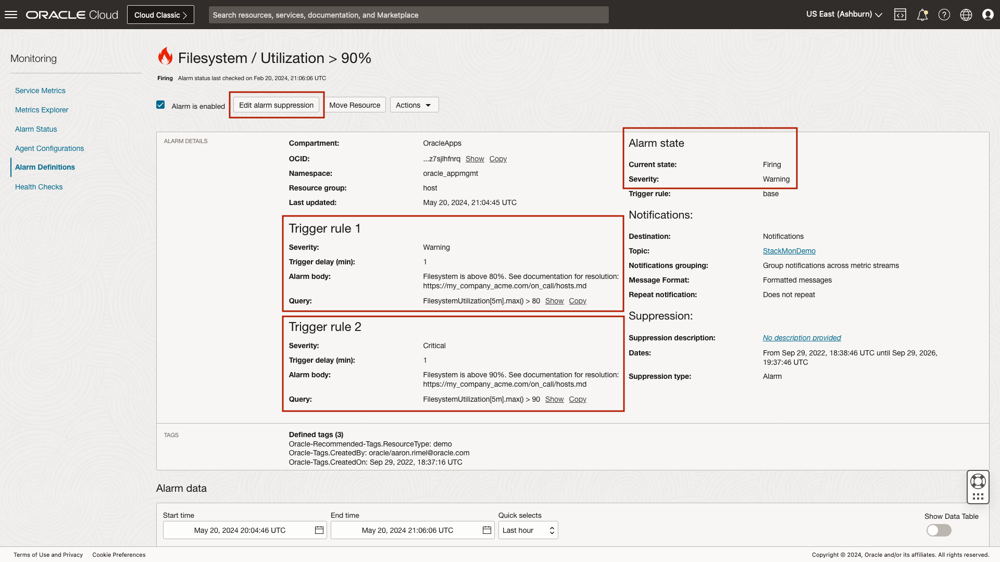
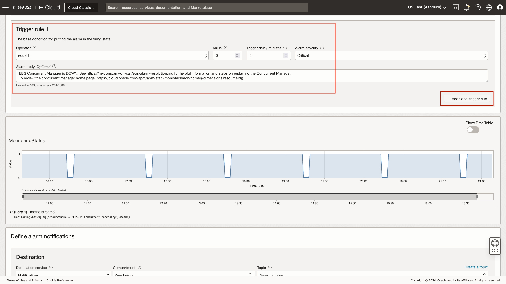
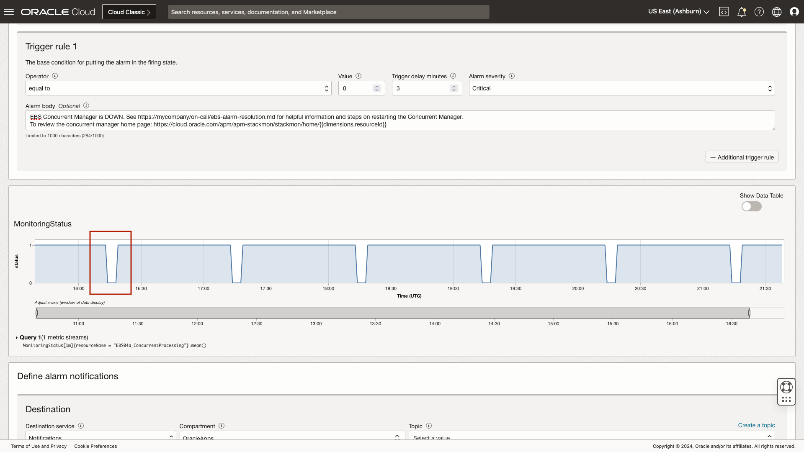

# How to View and Create Alarms

## Introduction

In this workshop, you will review an open filesystem utilization alarm. You will also review the process to create a new alarm. 

Estimated time: 10 minutes

### Objectives

* Review open alarms by severity
* Review an open filesystem alarm
* Review the alarm creation process

### Prerequisites

* Access to the environment as covered in the prior lab.

## Task 1: Review open alarms by severity

1. Navigate to Stack Monitoring

	Open the navigation menu in the Oracle Cloud console, and select **Observability & Management** > **Stack Monitoring** under Application Performance Monitoring.

	

	Once you arrive at the Enterprise Summary, select the compartment OracleApps under eStore.

		

2. Locate the **Alarms** region at the top right of the Enterprise Summary. 

	Stack Monitoring provides quick access to all open alarms on your monitored resources. The **Alarms** region provides a total count of open alarms, as well as a count of alarms by severity. Clicking on a count of alarms invokes a slide-out. The slide-out provides greater details of the open alarms and is filtered by the severity count selected. 

	Let's review the open alarms. Begin by clicking the **Total** count of open alarms, in the **Alarms** region. 

 	

	The alarm slide-out provides details of open alarms. These details include Alarm name, Severity, and Triggered time. The results can be ordered by selecting the column title.

 	

3. Refine a list of open alarms

 	Next, filter the list to focus on only the **Warning** alarms. Using the **Severity filter**, change the severity from **All** to **Warning**. The table now displays only the open alarms with a severity of **Warning**. 

 	Select the alarm **Filesystem / Utilization > 70%**. Clicking the alarm name opens a new tab in your browser to further investigate and work the alarm within Oracle Cloud Infrastructure's Monitoring Service.

 	

## Task 2: Review an open filesystem alarm

With the new browser tab open, let's review this example alarm. The OCI Monitoring Service provides critical details into the firing state for this specific metric. 
 	
1. Review an open alarm
	
	At the top of the page, we can see the name of the alarm, **Filesystem / Utilization > 70%**, you can identify the severity as **warning**. The alarm body is brief and contains information on where to begin the alarm investigation and a link to source controlled troubleshooting steps. The OCI Monitoring Service provides the ability to suppress the alarm, allowing you to stop sending notifications for a period of time. When working an issue, it may be necessary to suppress the alarm to reduce notification noise while resolving or during a known maintenance period.
 	
 	

 	Moving down the page, we can identify the compartment where the alarming resource resides, **OracleApps**. The OCID of the resource is provided to help identify the offending resource. Next we see the Namespace **oracle\_appmgmt**. Stack Monitoring places all metric data into the **oracle\_appmgmt** namespace. This is true for all resource types except Oracle Database. Oracle Database metrics are stored in the **oracle\_oci\_database** namespace. Stack Monitoring utilizes **Resource groups** to organize the large number of metrics provided out-of-the-box. Examples of Resource groups include: host, apache\_tomcat, weblogic\_j2eeserver, and elastic_search to name a few. In this alarm, the Resource group is **host**. 
 	
 	
 	
	The OCI Monitoring Service provides a variety of ways to notify users an alarm is firing. In this example, we can see this alarm is defined to notify using the Topic, **StackMonDemo**. A topic is a reusable grouping of notifications. A Topic can include a mix of subscription protocols that include Slack, PagerDuty, email addresses, or a custom function. 

	This particular alarm is configured to **Group notifications across metric streams**. Grouping notifications within a metric stream reduces the number of alarms a user would receive. Using this alarm as an example, root filesystem utilization > 70%, was configured to fire if any host's root filesystem within this compartment, OracleApps, goes above 70%. The members of the Topic StackMonDemo notification group will be notified via email. Should more than one host's root filesystem utilization go above 70%, a single email will be sent to each member of the group, and the notification and alarm status page will denote multiple hosts in a firing state.

	

	By default when the **Alarm Definition** browser tab opens, the last hour of firing history will be displayed. The time period can easily be adjusted using the drop-down. Using the **Quick selects** drop-down, choose **Last 90 days**. The status timeline now shows the historical violations over the last 90 days. Additionally, the table view provides details of the metric moving between states, such as Firing, Reset and OK, as well as the date and time the metric transitioned between states.
 	
 	

 	Once you are done reviewing the alarm details, close the OCI Monitoring Service tab to return to Stack Monitoring. Once you have returned to Stack Monitoring, close the Alarms slide-out.

 	
 	
 	Now let's understand how an alarm is created.

## Task 3: Review the alarm creation process

1. Navigate to the OCI Monitoring Service page

	In this task you will walk through the process of creating an alarm. While your user does not have the necessary privileges to create an alarm, the overall process remains the same. Information covered in this lab is based off of Stack Monitoring's comprehensive list of recommended alarms provided within the [documentation](https://docs.oracle.com/en-us/iaas/stack-monitoring/doc/setting-alarms.html). Let's begin by selecting the navigation menu from the top left of the Enterprise Summary.

	

	From within the navigation menu, select **Observability & Management**, then select **Alarm Definitions** located under the **Monitoring** menu.

	

	The Alarm Definitions page provides a list of all created alarms in a compartment. From this page you can see the Alarm name, the status of the alarm, severity for which the alarm is configured, the namespace related to the alarm, the destination (such as email notification), and suppression details. When creating an alarm rule, it is important you verify the compartment you wish to create the alarm in. Here we want to ensure we are in the compartment **OracleApps**. Having verified the compartment, now select **Create Alarm** to walk through the alarm creation process.

 	

2. Review the alarm creation process

	Creating an alarm rule is simple. Alarms should be actionable and contain a meaningful name. Let's create an availability alarm rule to notify on E-Business Suite Concurrent Manager down. The alarm name will be used in the alarm summary, such as an email summary, when the alarm fires. Enter the alarm name **EBS Concurrent Manager Down**. The alarm severity should match the criticality and state of the resource. This alarm will notify if the concurrent manager is down, select the severity of **Critical** from the drop-down. The alarm body should contain details of the alarm or possibly a link to your source controlled alarm documentation and resolution. An example alarm body message is: EBS Concurrent Manager is DOWN. See https://an-example-company/on-call/ebs-alarm-resolution.md for helpful information and steps on restarting the Concurrent Manager.

	

	The **Metric description** section provides easy to use drop-down menu items. You will first begin by ensuring the compartment listed is the compartment where the resource resides that you wish to be monitored. Here we will verify the compartment is **OracleApps**. Next select the Stack Monitoring namespace. As we reviewed earlier, Stack Monitoring places all metric data in the **oracle\_appmgmt** namespace. This is true except for Oracle Database metric data, as this data is stored in the **oracle\_oci\_database** metric namespace. Here you will select **oracle\_appmgmt**. Stack Monitoring uses resource groups to help organize the large amount of out-of-the-box metrics provided. Here we will select **oracle\_ebs\_conc\_mgmt_service**. Once a resource group is chosen, the drop-down for **Metric name**, well filter to only show metrics related to the Concurrent Manager. To alert on availability status choose **MonitoringStatus**. Monitoring Status is collected every minute, we will leave the interval set to 1m, and the statistic as mean. 

	In order for the concurrent manager availability to roll up to the EBS application, we must choose an appropriate **Dimension name**. Choose **resource name**, then select **PROD\_EBS\_04\_ConcurrentProcessing**.

	In OCI monitoring, the equivalent of a resource state of up is 1. To alarm when the concurrent manager is down, choose the operator **equal to**, the value **0**, and trigger delay minutes to **1**. The trigger delay can help protect from false alarms by setting to a higher value. However in doing so will postpone the notification. You must choose a period that will not cause false alarms, while also generating timely alarms that allow your organization to meet your defined SLAs.

	

	Using the chart, you can see valleys, when the monitoring status value drops from 1, available, to 0, down. If you were to create an alarm with an interval of 1, the valleys shown on the chart represent a period when the alarm would have fired. Using the information in the graph, we know this alarm would be noisy as this demo environment resource is expected to go down once an hour. The chart shows the Concurrent Manager is generally down for 10 minutes. Update the interval from **1 minute** to **15 minutes** to provide a buffer.

	With the interval set to 15 minutes, the valleys no longer reach 0, and as a result will not generate an alarm.

	

	Defining an alarm notifications is easy. First begin by selecting how you would like to be notified, notifications or streaming. Here we will choose **Notifications**. Next select the compartment where your topic resides. For this example, select **OracleApps**, and select **StackMonDemo** as the topic.
	
	Group notifications allow multiple firing alarms, for example, if many hosts go down, only a single notification for all hosts down will be sent. If notifications are split per metric stream, a notification will be sent for every host that is down. Select **Group notifications across metric streams**.

	Since this is an email notification for human consumption, select **Send formatted messages**. Click the check-box for **Repeat notifications**, and select a frequency of **10 minutes**. If you wish to immediately begin monitoring for the concurrent manager down, ensure the box is checked **Enable this alarm**. 

	

	Once again, your access within this environment does not have sufficient privileges to create an alarm. As such, once you are done reviewing the alarm creation process, click **Cancel**.

	You have learned about using Stack Monitoring's Enterprise Summary, reviewed a resource's homepage, and understanding alarms. In the next lab we will apply all that you have learned, in **Putting it all together**.

	You may now **proceed to the next lab**.

## Acknowledgements

* **Author** - Aaron Rimel, Principal Product Manager, Enterprise and Cloud Manageability
* **Contributors:** 
	* Ana McCollum, Senior Director of Product Management, Enterprise and Cloud Manageability,  
	* Steven Lemme, Senior Principal Product Manager,  
	* Anand Prabhu, Sr. Member of Technical Staff
* **Last Updated By/Date** - Aaron Rimel, June 2023
