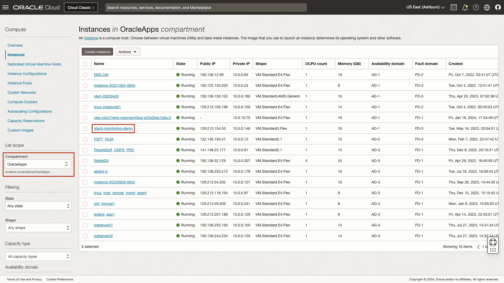
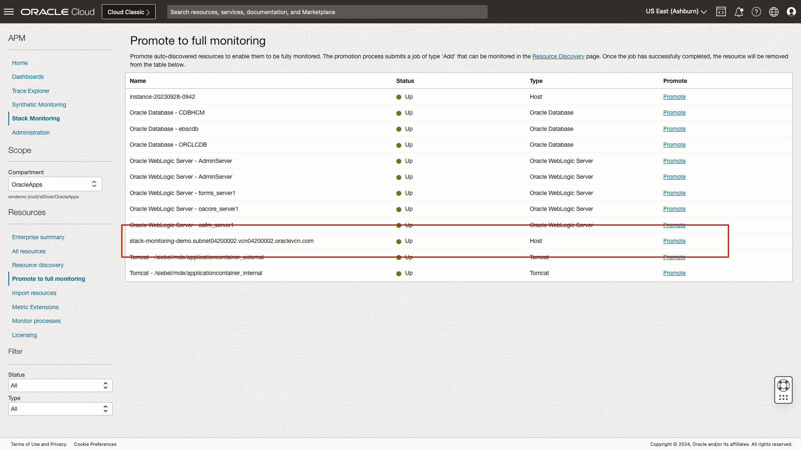
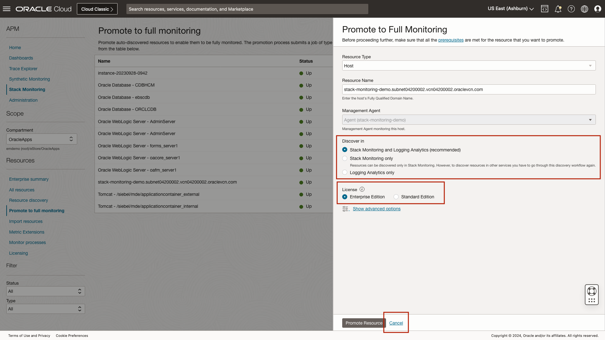
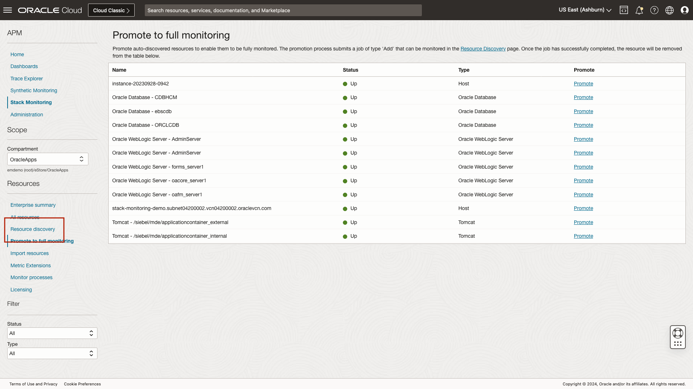
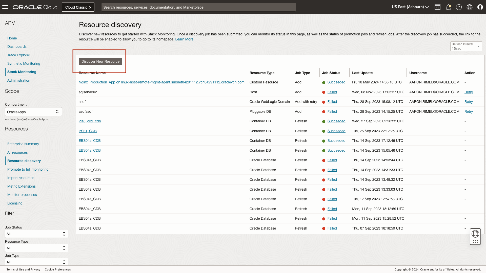
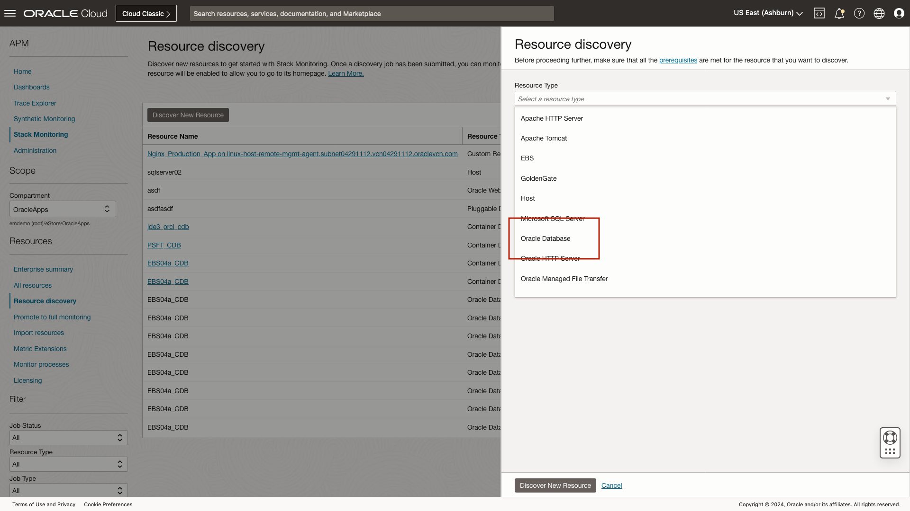
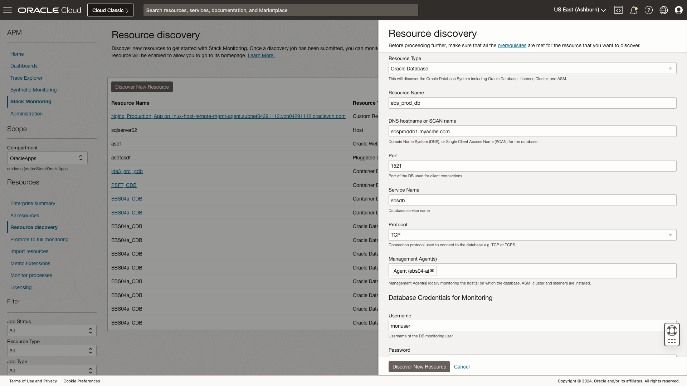
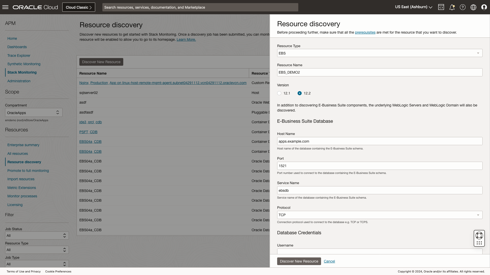

# Discovery and Promotion in Stack Monitoring

## Introduction

Stack Monitoring provides both a CLI and UI driven discovery. In this lab we will review the discovery process for a complete E-Business Suite application (EBS). While your user will not have the necessary access to perform a discovery, the steps completed here will match the steps you would complete within your own environment when performing a resource discovery or promotion of a host. As a result in these exercises you will click **cancel** in-lieu of clicking Submit, Promote Resource, etc.

You will begin by reviewing the host promotion process. Next, review the discovery process of an Oracle Database used by the EBS application. Finish by reviewing the discovery process of an EBS application. When discovering an application such as EBS or PeopleSoft, the job discovers the entire application stack and its components. This includes resources such as Concurrent Manager and Notification Mailer, as well as the underlying WebLogic Domain and WebLogic Servers will be discovered. Let's begin by walking through the promotion of a host. 

Estimated time: 15 minutes

### Objectives

* Enable the Management Agent
* Review the promotion process of an OCI Compute
* Review the discovery process of an Oracle Database
* Review the discovery process of an E-Business Suite application

### Prerequisites

* Access to the environment as covered in the first lab.

## Task 1: Verify the Management Agent is enabled.

1. Verify the Management Agent is Enabled

	The process to promote a host is simple. For OCI compute instances, simply enable the Management Agent Plugin of the Oracle Cloud Agent running locally on the compute instance. For on-premises hosts, install the Management Agent. Once the agent has been enabled or installed, a promotion job will automatically be created within Stack Monitoring to enable full monitoring of the underlying host, i.e., the on-premises host or OCI compute instance. 

	Let's navigate to the OCI Compute homepage. Open the navigation menu in the Oracle Cloud console, and select **Compute** then select **Instances**.

	

	Begin by ensuring you are in the compartment **OracleApps**. Next, locate the OCI Compute Instance **stack-monitoring-demo**, and click the host's name to load the compute home instance page.

	

	Within the compute instance homepage, click the **Oracle Cloud Agent** tab. From the Oracle Cloud Agent tab, ensure the **Management Agent** plug-in is enabled. In your own environment, to enable the Management Agent, click the **Enable plugin** button. Having verified the Management Agent is enabled, it is time to promote the host to full monitoring.

	

## Task 2: Review the promotion process of an OCI Compute

1. Navigate to Stack Monitoring Promotion Page
	
	Open the navigation menu in the Oracle Cloud console, and select **Observability & Management** > **Stack Monitoring** under **Application Performance Monitoring**.

	

	Once you arrive at the Enterprise Summary, select the compartment OracleApps under eStore.

		

	From the Stack Monitoring Enterprise Summary, select **Promote to full monitoring** in the left lower menu.

	

2. Locate the host **stack-monitoring-demo**

	From the **Promote to full monitoring** page, locate the host **stack-monitoring-demo**, and select **Promote**.

	

	Clicking promote invokes a slide-out. From within the slide-out panel, validate that the **Resource Name** is the host's fully qualified domain name (FQDN) (i.e., hostname). **Management Agent**, Stack Monitoring automatically identifies the local Management Agent running on the host, no action is required. Once the Resource Name has been validated, and the monitoring agent has been selected, in your own environment you would click Promote Resource. However, in this lab you will click **Cancel**. Clicking **Promote Resource** will submit the promotion job, and within minutes Stack Monitoring would begin collecting a richer set of metrics than is available out-of-the-box.

	

	Once you submit the promotion job, the status and results of the promotion job can be found by navigating to the **Resource discovery** page. 

	Let's review the process of discovering an Oracle Database. We'll begin by navigating to **Resource Discovery**.

	

## Task 3: Discover an Oracle Database

1. Discover the database that contains the EBS application schema

	Once the promotion of all hosts your EBS application, including the Oracle Database hosts have been promoted, the next step is to discover the database where the EBS schema resides.

	
	
2. Complete the Oracle Database discovery

	Let's begin by invoking the discovery slide-out, select **Discover New Resource**.

	To discover either a CDB or single instance database, select **Oracle Database** from the drop-down. If your application is running in a PDB, you should first discover the CDB prior to discovering the a **Pluggable DB**. In this lab we will review the discovery process of an Oracle Database. 

	From the the **Resource discovery** slide-out , select **Oracle Database**.

	

	We begin by assigning the database a name. When discovering a resource within Stack Monitoring that is not ephemeral, it is important to provide the resource a meaningful name. Here we will enter **ebs\_prod\_db**. Next provide the DNS hostname or SCAN name depending on your listener configuration, we will enter **ebsproddb1.myacme.com**. Now provide a port, here we will use **1521** and the service name of **ebscdb**. From the drop-down, you can select an agent that will be responsible for monitoring this database. For Oracle Databases, the agent can be local (installed on the host) or remote (installed anywhere with network access to the host). Select any agent from the drop-down list. Finally provide the monitoring user's credentials. First the username, **monuser**. Next, since this is a demo enter any value for the password. 

	Stack Monitoring provides a script to create a least privileges user for monitoring an Oracle Database. For more information see **MOS Doc ID 2857604.1**. 

	

Once all of the fields are completed, once again click **Cancel**. 

## Task 4: Discover an E-Business Suite Application

1. Complete an EBS discovery

	From the the **Resource discovery** page, click **Discover New Resource**. Select **EBS** from the drop-down list of resource types provided. After selecting EBS from the drop-down, a curated list of fields are provided to help drive the discovery process. As you can see this list is unique to each resource type.

	

	* Lets begin by providing the resource a name. Once again, when assigning a name ensure the resource name is meaningful to the user, enter **EBS\_DEMO2**. 
	* The EBS discovery process is dependent on the version version of EBS being ran, here we will select **12.2**. 
	* Enter the host name, **apps.example.com**, and port of the database that EBS is running on, **1521**. 
	* Next, enter your database service name, we will enter the service name **ebscdb**. 
	* Prior to discovering EBS, it is imperative EBS specific database user grants are applied to the monitoring user prior to discovery. Always remember to follow the prerequisites outlined in Stack Monitoring's [documentation](https://docs.oracle.com/en-us/iaas/stack-monitoring/doc/promotion-and-discovery.html) prior to discovery. When discovering EBS, the database user should have limited access to perform only functions related to monitoring. 
	* Enter the username **monuser**. Once again, since this is a demonstration, enter any value for the password. 
		- If your monitoring user requires sysdba privileges, select that radio button here.

	

	* Now lets enter details of the application layer. 
	* Enter the host in which the EBS application is running on, once again enter **apps.oracle.com**. 
	* Now enter the port of your WebLogic admin server, enter **7001**. 
	* Our demo EBS environment is running http, or t3. 
		- If your application is encrypted, you would select t3s. In this example choose **t3** (http). 
	* Next enter your WebLogic username, here you will enter **wlsadmin**, then enter the any value for the user's password. 
	* When selecting the Management Agent field, a drop-down list of all known agents within your compartment are shown. EBS can be monitored either by a locally installed agent, or an agent installed on another host. Here you can select any agent in the list.

	Once all fields are complete, we would typically click Discover. However, we will again select **Cancel**.

	

To review a list of resources Stack Monitoring supports, see **[Oracle Stack Monitoring Primary Note (Doc ID 2925632.1)](https://mosemp.us.oracle.com/epmos/faces/DocumentDisplay?_afrLoop=399959770386069&id=2925632.1&_afrWindowMode=0&_adf.ctrl-state=5jd9c5nir_4)**

Having reviewed the resource promotion and discovery process, lets now review alarms.

You may now **proceed to the next lab**.

## Acknowledgements

* **Author** - Aaron Rimel, Principal Product Manager, Enterprise and Cloud Manageability
* **Contributors:** 
	* Ana McCollum, Senior Director of Product Management, Enterprise and Cloud Manageability,  
	* Steven Lemme, Senior Principal Product Manager,  
	* Anand Prabhu, Sr. Member of Technical Staff
* **Last Updated By/Date** - Aaron Rimel, June 2023
