# Stack Monitoring's Enterprise Summary

## Introduction

In this workshop, you will learn how the Enterprise Summary can be used to monitor the status and performance of an application and its underlying tech stack. You will review the overall availability status of all resources, identify the resources that are down and list the Oracle Databases in a Not Reporting state. Next, review open alarms across an enterprise. You will also review performance metrics of the various tiers (e.g. E-Business Suite, PeopleSoft, WebLogic Server, Oracle Database, and Host). Finally, because you are monitoring each tier, you will see how to interact with the Enterprise Summary UI to dynamically view other metrics. 

Estimated time: 20 minutes

### Objectives

* Identify resources that are down across an enterprise
* Identify application outages and resources that are down
* Review open alarms by severity
* Review the performance of resources across an enterprise
* Investigate other key performance metrics on the fly

### Prerequisites

* Access to the environment as covered in the prior lab.

## Task 1: Identify resources that are down across the enterprise

1. Open the navigation menu in the Oracle Cloud console, and select **Observability & Management** > **Stack Monitoring** under Application Performance Monitoring.

	

	Once you arrive at the Enterprise Summary, select the compartment OracleApps under eStore.

		

2. Identify resources in a **Down** state

	The Stack Monitoring Enterprise Summary page provides an overall health and performance of your entire enterprise. The top tier enables you to quickly see, identify, and triage resources that are **Down** to help remediate outages. Locate the **Status Summary** doughnut chart on the upper left side of the page. You can see a count of resources by each status across the enterprise. This chart provides a quick visualization of how many resources are in a **Down** or **Not Reporting** state across your enterprise. Let's investigate any resources that are **Down**. 

	Find the **Down** label in the Status summary chart. Clicking **Down** opens a slide-out reporting all of the resources in a down state. 

	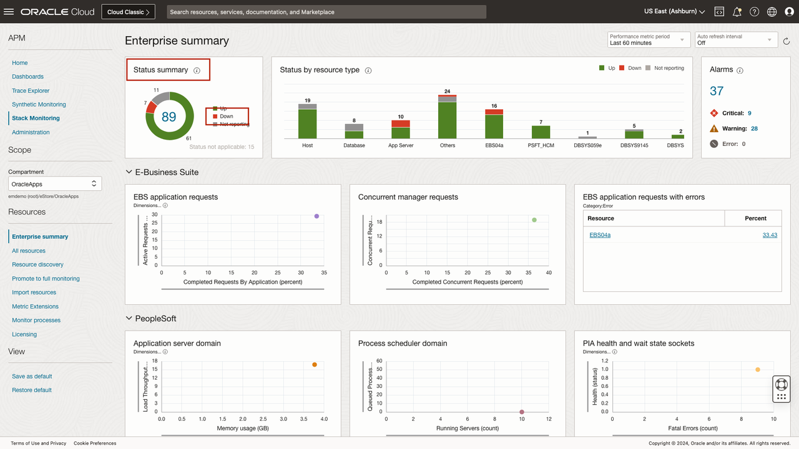

	The slide-out filter can be changed to quickly view all resources in any given state. This list can be sorted by name, status, and type. You can search by name to quickly view the status of any given resource. Clicking a resource name will navigate you to that resource's homepage to continue an investigation. We will cover resource homepages and navigation later in this workshop.

	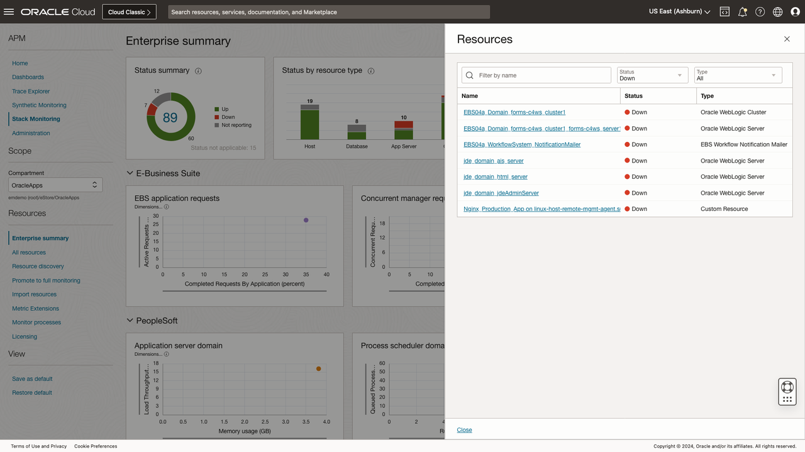

3. Review all resources that are **Not Reporting**

	Now that we have identified resources in a down state, let's identify those that are **Not Reporting**. Not Reporting generally indicates the agent is no longer uploading data. Stack Monitoring updates the status of monitored resources to Not Reporting to inform you there is an issue obtaining the resource's status. A single availability alarms can be configured to notify you when the resource is either Down or Not Reporting. An alarm such as this and others are outlined in the [Setting Up Alarm](https://docs.oracle.com/en-us/iaas/stack-monitoring/doc/setting-alarms.html) section of the documentation.

	Using the Status filter located in the center of the slide-out, update the Status filter from **Down** to **Not reporting**. The table now displays all the resources in a Not Reporting state. Clicking a resource name will navigate you to that resource's homepage, where you can leverage the Stack Monitoring resource associations to identify the agent monitoring the resource and navigate to the agent's homepage to troubleshoot. We'll cover navigating to related resources in a later lab. For now, let's return to the Enterprise Summary. Click the **Close** button in the lower-left corner of the slide-out.

 	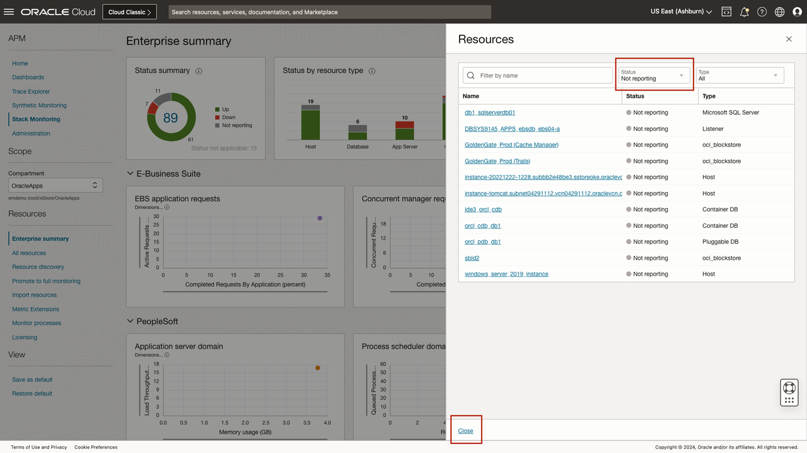

## Task 2: Identify and review resources by type that are down or not reporting

1. Locate the **Status by resource type** chart at the top center of the page. 

 	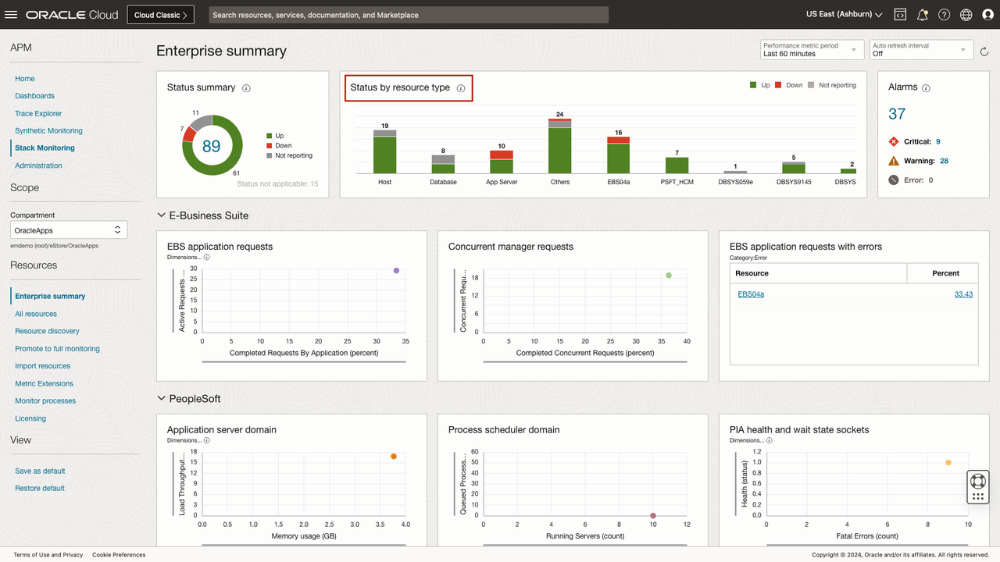

	The **Status by resource type** chart enables you to easily identify what tier of your application has availability issues. Each bar represents each tier of the application stack, (e.g., host, database, application server). Using the status colors, you can quickly assess if all resources within that tier are up or identify the tier that has a resource outage. Reporting of an application stack, such as E-Business Suite and PeopleSoft, is unique. Each bar represents an application and its components, this allows you to identify if any individual component of an application is down or not reporting. Should you identify an area of concern with an application, clicking the bar will navigate you to that resource's homepage. We'll review homepages in the next lab activity.

2. Identify resources by resource type that are **Not Reporting**

 	Identifying which resources are down or not reporting by type across an enterprise is easy using Stack Monitoring. Simply locate the chart legend at the top right of the **Status by resource type** chart and select **Not Reporting**. This will filter the chart to only show the count of resources by type in a **Not Reporting** state.

 	If we wish to see a more detailed list of hosts that are not reporting, click the **host** bar on the left side of the chart. 

 	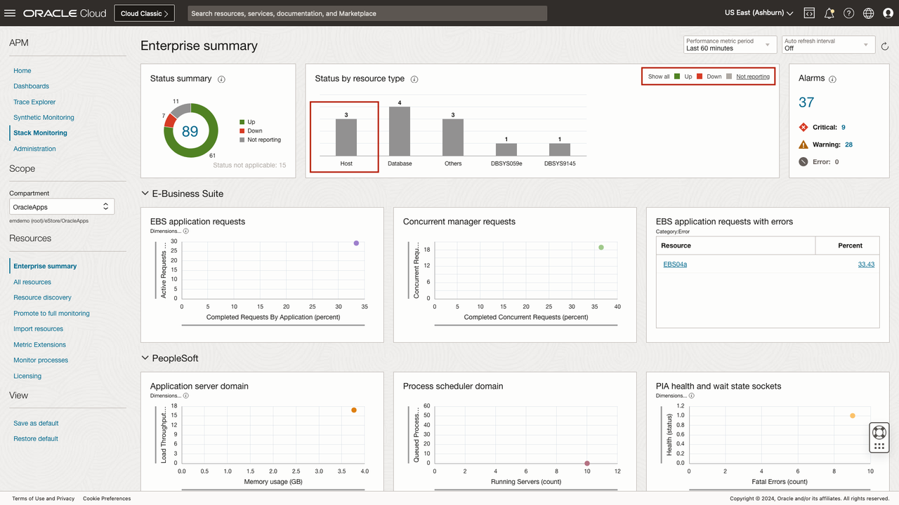

 	This will invoke a slide-out and display a list of host names, status, and type. From this slide-out, it is simple to update the filter to see other states, and resource types, or simply search for a resource by name. Clicking any resource name within the slide-out will navigate you to that resource's homepage for further troubleshooting. To return to the Enterprise Summary click the **Close** button in the lower-left corner of the slide-out.

 	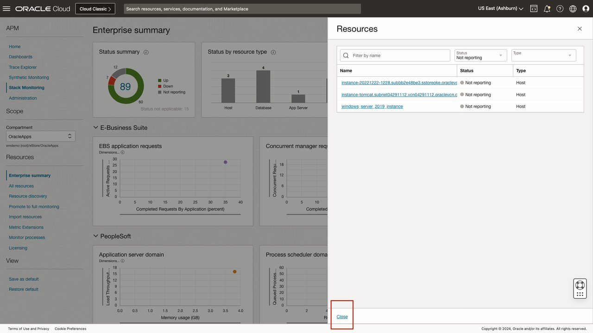

3. Reset Status by resource type chart
	
	With the slide-out closed, locate the **Show all** filter located within the **Status by resource type** chart's legend. Clicking **Show all** will reset the chart to the default state of showing all resources and states.

 	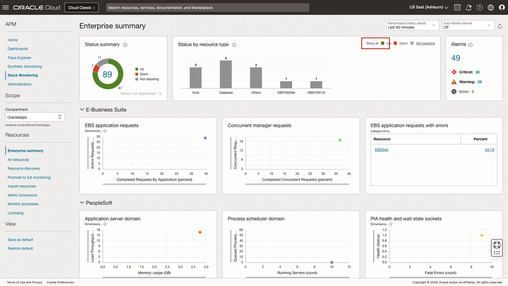

## Task 3: Review open alarms

1. Locate the **Alarms** region at the top right of the Enterprise Summary. 

	Stack Monitoring provides quick access to all open alarms on your monitored resources. The **Alarms** region provides a total count of open alarms, as well as a count of alarms by severity. Clicking on a count of alarms invokes a slide-out. The slide-out provides greater details of the open alarms and is filtered by the severity count selected. Select the **total** count of open alarms.

 	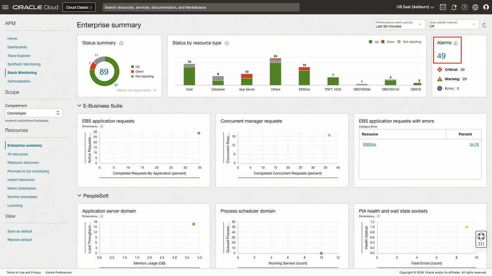

	The alarm slide-out provides details of open alarms. These details include Alarm name, Severity and Triggered time. The results can be ordered by selecting the column title. 

 	Let's return to the Enterprise Summary by clicking **Close**.

 	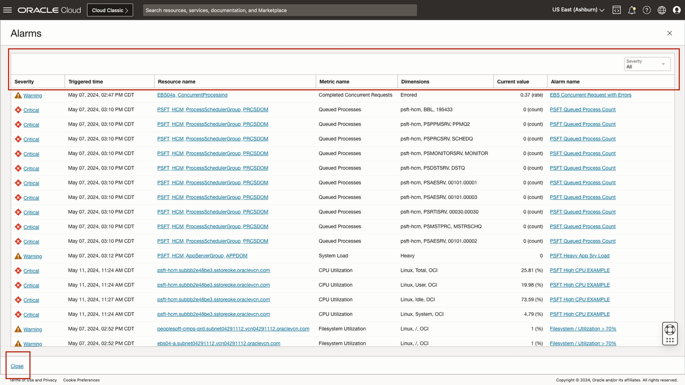

## Task 4: Review the performance of resources across an enterprise

1. Enterprise Summary tiers

	The **Enterprise Summary** makes it easy to see the performance of every resource within your enterprise. Stack Monitoring performance charts are organized by tier. Each tier enables you to quickly access the overall load, response, utilization and errors across all resources in that tier. Scatter plot charts enable correlation between any two metrics, such as load and response metrics, for all resources in that tier. You can easily determine if a resource with the slowest response shows a corresponding high load. Resources with the highest load and response metric values can easily be spotted in the upper right corner of the chart and clicking on their data points in the chart will allow you to further investigate metric trends. Out-of-the-box tables provide visibility into errors or show the resources with the highest space utilization.

 	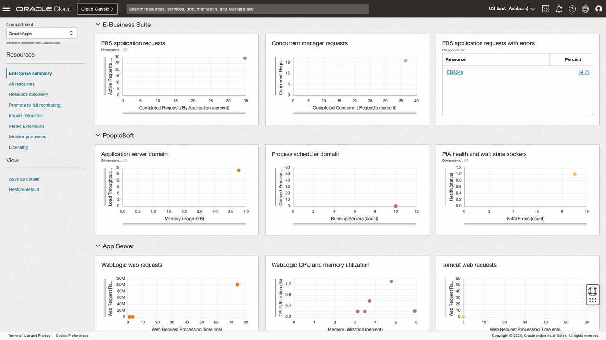

	Stack Monitoring makes it easy to troubleshoot any resource type and any metric at any time. All performance charts and tables can be modified or replaced to help identify problems or troubleshoot a specific performance problem. The Enterprise Summary allows you to update a chart to display any two metrics. If you have concerns regarding network storage latency you can update a scatter plot to Disk Activity and Network Activity to correlate the performance of network read and writes. The changes to any scatter-plot or table can be saved as your default when viewing the Enterprise Summary, by clicking **Save as default**. 

 	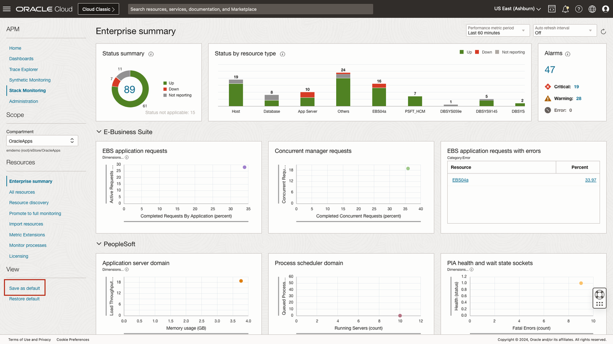

2. Scatter plots charts

	The scatter plots provide a visual representation of the performance of every resource in your enterprise. Using the scatter plots you can correlate any two metrics at the same time. For example, you can correlate the IOPS and CPU of an Oracle Database to understand how heavily utilized the database is. This makes it easy to identify if one or more resources are performing differently than the others. For instance, an Oracle Database with a data point at the top right corner represents a busy database, while a data point at the bottom left is less utilized. If you identify a performance anomaly, clicking on the data point will allow you to review the trend of that metric.

 	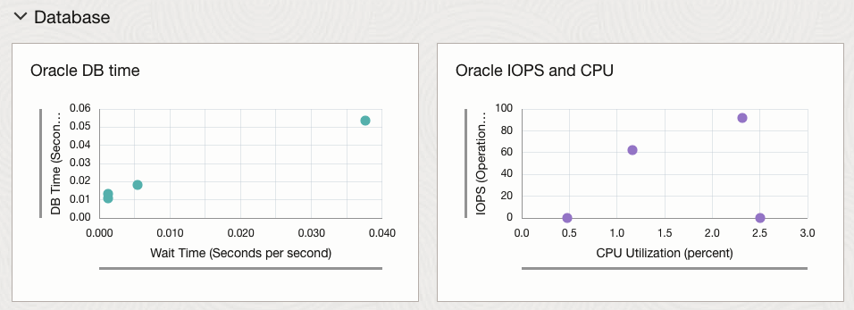

	Let's review memory and swap utilization of all hosts within this enterprise. Navigate to the **Memory and Swap** chart located under the **Host** tier at the bottom center of the Enterprise Summary. Every monitored host within Stack Monitoring is represented in this chart. You can assess the overall usage of memory and swap across all hosts. You can identify which host is utilizing the most memory and swap and see the majority of hosts are using very little to no swap. If troubleshooting an issue, you can **hover over** a plot point and see the value of the metrics.

 	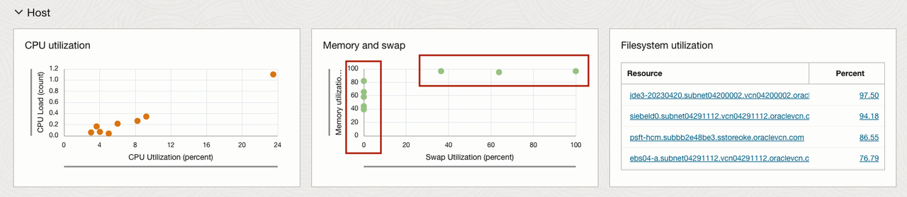

	Clicking a plot point will activate a slide-out allowing you to see the performance over time. Using the drop-down update the time selector from **Last 60 minutes** to **Last 90 Days**. Extending the time period allows you to easily identify if the increase in memory load is recent and a contributing factor to a new performance problem that may be occurring. Having reviewed the memory over the last 90 days, lets return to the Enterprise Summary by clicking **Close** in the bottom left.

 	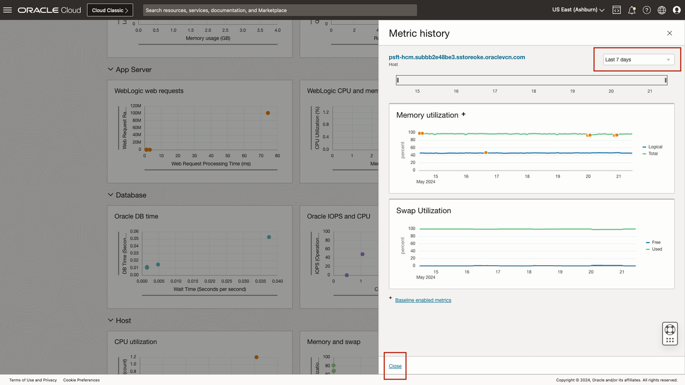

2. Tables

 	Located on the right-hand side of the page, **Tables** enable you to quickly identify which hosts or databases have the highest filesystem utilization or tablespace utilization. By default, Tables provide up to the **four** highest utilized or consumed resources of a given metric. The number of rows displayed can be updated from **4 to 10, 20, or all**. Let's review the top **20** most heavily utilized filesystems within the enterprise. Locate the **Filesystem Utilization** chart on the right side under the **Hosts** tier. Click the pencil icon in the top right of the chart. After clicking the pencil, enable the **Advanced** menu items by updating the **Advanced** flag. Enabling the Advanced menu provides access to optional features of a table or chart. Click **Display records** to change the value of rows displayed from 4 to **20**. With the value updated to 20, click **Apply** in the lower left of the slide-out to return to the Enterprise Summary. 

 	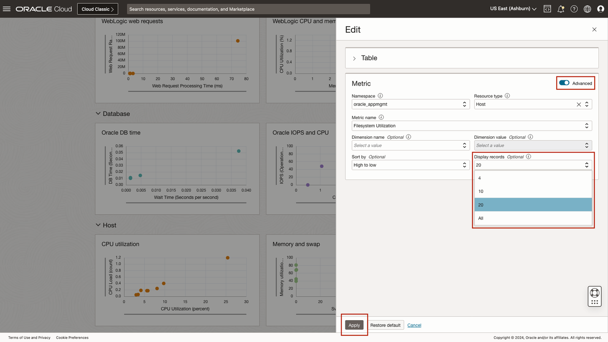

 	You can now view a list of up to the top **20 hosts** with the most heavily utilized filesystems. Should one of the hosts filesystems cause concern, clicking any of the resource names will navigate you to that resource's homepage for further investigation. For example, when investigating filesystem utilization, it is good to review the growth over time to understand if more space should be added, and if so how much. From a Stack Monitoring host homepage, you can chart the growth of the filesystem over time using the **Filesystem Utilization** chart.

 	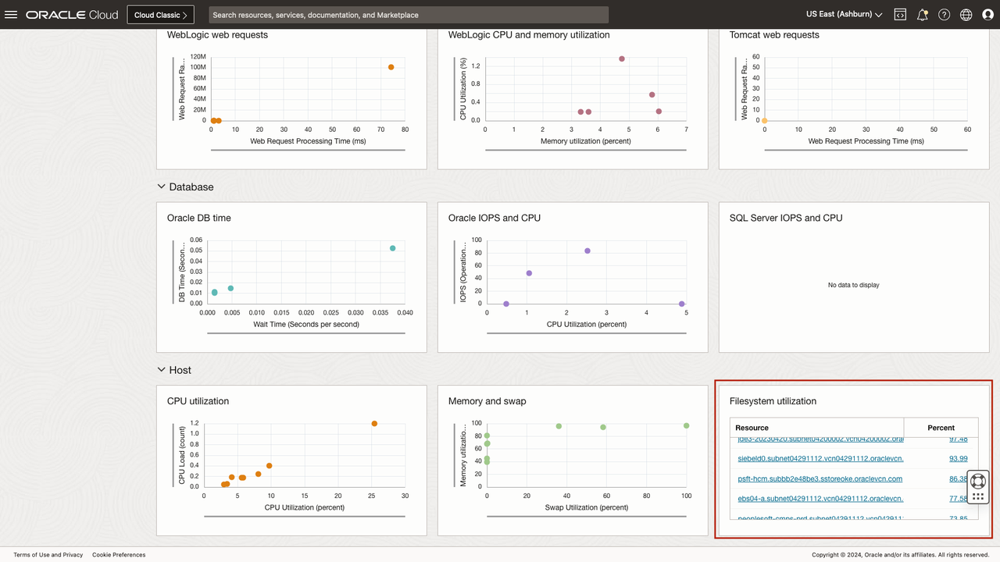

## Task 5: Investigate other key performance metrics on the fly

1. Review WebLogic JVM Memory Utilization

	Stack Monitoring has leveraged Oracle's years of experience to provide a curated set of out-of-the-box charts and tables to highlight helpful metrics that include load, response, utilization, and errors within each respective tier of an application stack. 

	Understanding that each organization and user is unique, and monitoring is a dynamic activity, Enterprise Summary charts, tables, and tier names are customizable to meet the individual needs of the user at any given time. 

	Investigating health and performance issues are easy using the interactive features of the Enterprise Summary. You can easily swap out any performance charts or tables with another. This enables you the capability to quickly and easily view necessary metrics when troubleshooting issues. Using the Enterprise Summary, you can review and correlate the performance of the JVM's heap utilization with any other WebLogic metric. From within the **WebLogic Server** tier, locate the chart **CPU and Memory Utilization**. Begin by clicking the pencil icon in the top right of the chart to invoke the slide-out. With the slide-out loaded, enable the **Advanced** features. Under the **X-Axis** replace Memory Utilization with **JVM Memory Utilization** and add a dimension name of **Type**, and dimension value of **Heap**. Finally, select **Apply** in the lower left of the slide-out. 

 	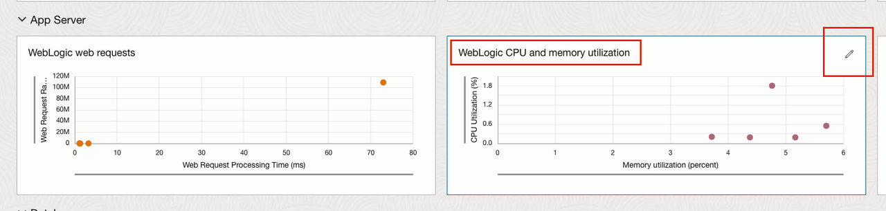

	You can now see all the JVM Heap Memory utilization values across all monitored resources. Using the data provided in the chart we can now correlate the performance of the WebLogic server's heap utilization with the WebLogic server's CPU performance.

 	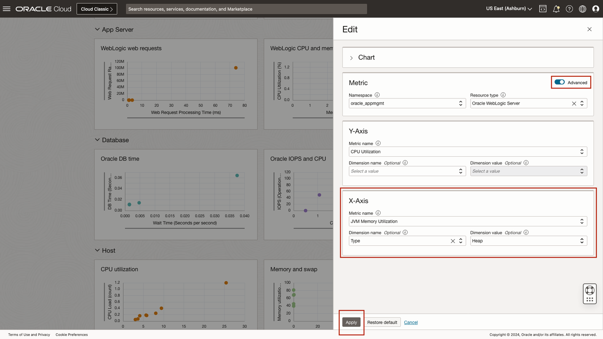

	If you update or replace what chart or table is displayed on the Enterprise Summary, you can save your changes permanently as your default. This can be especially helpful if you need to troubleshoot several different resource types and metrics while investigating an incident.

	Saving the configuration allows you to leave the Enterprise Summary and return later to the page with your updated view intact. Once you complete your investigation, simply click **Restore default** to return the Enterprise Summary to the out-of-the-box configuration.

	Once you are done reviewing JVM heap utilization, let's reset the Enterprise Summary to the default configuration. To reset the page, locate the **Restore default** link within the menu on the left side of the page. Once clicked, the page will reset to the out-of-the-box configuration. 

 	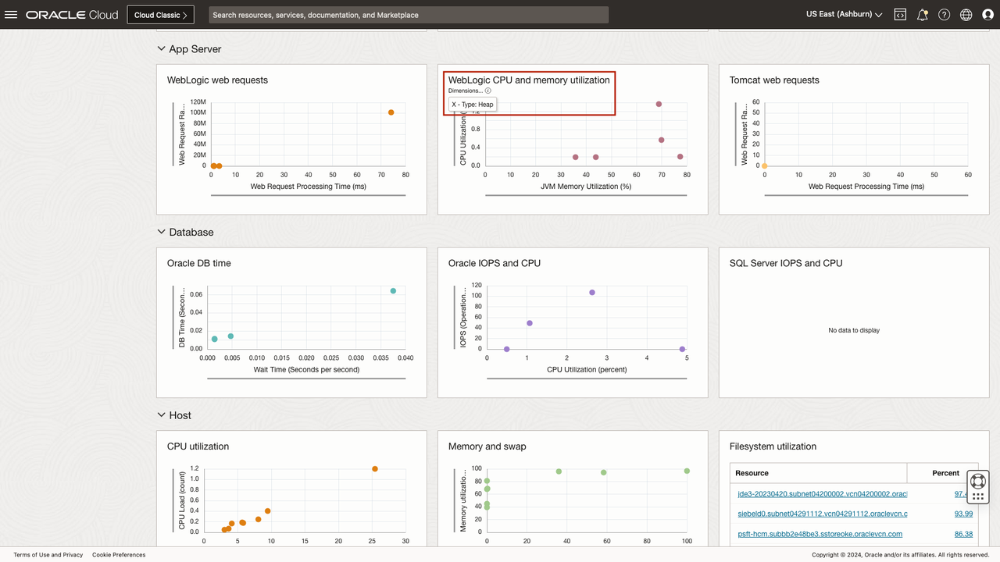

	You may now **proceed to the next lab**.

## Acknowledgements

* **Author** - Aaron Rimel, Principal Product Manager, Enterprise and Cloud Manageability
* **Contributors:** 
	* Ana McCollum, Senior Director of Product Management, Enterprise and Cloud Manageability,  
	* Steven Lemme, Senior Principal Product Manager,  
	* Anand Prabhu, Sr. Member of Technical Staff
* **Last Updated By/Date** - Aaron Rimel, June 2023
