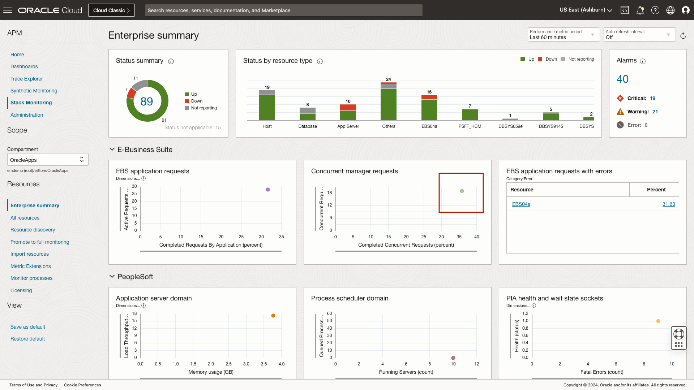

# Stack Monitoring's Resource Homepages

## Introduction

In this lab, you will become familiar with using Stack Monitoring resource homepages. 

Estimated time: 10 minutes

### Objectives

* Using the resource homepage
* Learn the Performance menu including, alarms, charts and tables
* Understand the configuration details of a resource
* View application topology

### Prerequisites

* Completion of the labs before this one

## Task 1: Become familiar with the layout of a resource homepage

1. Open the navigation menu in the Oracle Cloud console, and select **Observability & Management** > **Stack Monitoring** under **Application Performance Monitoring**.

	

	Once you arrive at the Enterprise Summary, select the compartment OracleApps under eStore.

		

2. Navigate to a **Concurrent Manager** resource.

	The Enterprise Summary page opens. The concurrent manager is one of the key resources you should monitor to help maintain the service level of an E-Business Suite (EBS) application. In the last lab we discussed that when you are troubleshooting, the Enterprise Summary provides quick insight into the performance of your resources at a glance. The Enterprise Summary also provide easy navigation to all of your monitored resources. For instance, when reviewing the EBS tier of the Enterprise Summary, should you see any concern, click the plot point of the Concurrent Manager and a slide-out window will appear providing historical metric details.

	

	With the slide-out open, you can review the percentage of successful completed requests over time. Now lets take a closer look at this concurrent manager by clicking its name **PROD\_EBS\_04\_ConcurrentProcessing** at the top of the page. This will navigate you to that concurrent manager's homepage.

	

3. Application specific key resource homepages

	On the Concurrent Manager homepage, you can easily review the health and performance of this resource. Each resource in Stack Monitoring has a homepage that provides a central place to review status, performance alarms, configuration and topology. At the top of the page, Stack Monitoring reports the current status, (Up, Down, Not Reporting). The color and shape of the status indicator will update depending on the resource status and type. Should you find a resource in a down state, the homepage will display a large **red** box with the status of **Down**. Stack Monitoring also provides a **Current Status** date and time. For example, if this Concurrent Manager goes down, Stack Monitoring will provide a timestamp of when the status switched from **Up** to **Down**.

	We can see a count of open alarms by severity. Clicking an alarm count will open the Alarms tab below. We'll cover the **Alarms** tab in more detail later.

	

## Task 2: Review the Performance menu including, alarms, charts and tables

1. Review performance charts

	A Concurrent Manager homepage provides a list of charts curated for the EBS Concurrent Manger. Stack Monitoring provides a large set of metrics out-of-the-box and are collected immediately after the discovery completes. The performance charts by default display the **Last 60 Minutes**. When investigating issues, it helps to review the performance change over a longer period of time. To extend the time frame click the drop-down and choose **Last 24 Hours**. All charts will now display data from the last 24 hours.

	Imagine that you have identified a spike in the number of concurrent requests that have been completed with errors. Using the **Completed Concurrent Requests**, hover over a point in time within that chart. Stack Monitoring will display the metric, dimension, timestamp, and value. Stack Monitoring will also show metric details of every other chart on the page during that timestamp. Should you identify another area of concern, highlighting the metric will display the value of all other metrics on the page at the same time. For example, when you need to troubleshoot and correlate two metrics like a spike in errors using **Completed Concurrent Requests** and **Capacity Utilization of Concurrent Managers** to determine if the concurrent manager has reached 100% capacity and related to the errors observed.

	

2. Review metric tables

	Stack Monitoring uses **Tables** to report all dimensions of a metric. Let's navigate to tables to view all of the data points. Select the **Tables** tab. Charts provide a metrics highest utilized metric dimension. **Tables** provide the latest collection value for every dimension of a metric. In this example let's review the **Concurrent Requests By Status**. Click the **triangle** to display the metrics table. Here we see the count all dimension of the metric Concurrent Requests by Status. The dimensions include: Scheduled, Running, PendingStandBy, PendingNormal, InactiveOnHold, and InactiveNoManager. 

	

3. Review open alarms

	Select the **Alarms** tab. Using the **Alarms** view we can see a detailed list of open alarms that includes the alarm Name, Severity, and Last Triggered date/time. In the previous lab you learned that clicking an alarm **Name** will open a new tab within OCI's Monitoring Service. Now let's review the configuration details of a resource.

	

## Task 3: Review configuration details of the resource

1. Locate **Configuration** in the left menu of the homepage.

	Using data provided within **Configuration** you can easily identify a resource's installation location. This can be helpful to quickly identify where to find log files. Stack Monitoring **Configuration** provides quick access to both general OCI properties and resource-specific properties. Using this Concurrent Manager as an example, the **Resource-specific** properties such as database service_name and the application schema name can help you quickly identify the database and schema that contains the EBS data.

	

## Task 4: Review application topology

1. Locate **Related Resources** under the Resources menu on the left side of the homepage.

	Now let's learn about the application topology capability within Stack Monitoring. From the left side menu, locate **Related Resources**. **Related Resource** provides quick access to all resources associated with this Concurrent Manager. This capability makes it easy to identify which EBS Application the Concurrent Manager belongs to. Additionally, you can identify which management agent monitors this concurrent manager. Identifying the monitoring agent is useful if the status of the resource is Not Reporting. Typically, if a resource has a status of Not reporting, the Management Agent is not uploading data.

	

	You may now **proceed to the next lab**.

## Acknowledgements

* **Author** - Aaron Rimel, Principal Product Manager, Enterprise and Cloud Manageability
* **Contributors:** 
	* Ana McCollum, Senior Director of Product Management, Enterprise and Cloud Manageability,  
	* Steven Lemme, Senior Principal Product Manager,  
	* Anand Prabhu, Sr. Member of Technical Staff
* **Last Updated By/Date** - Aaron Rimel, June 2023
