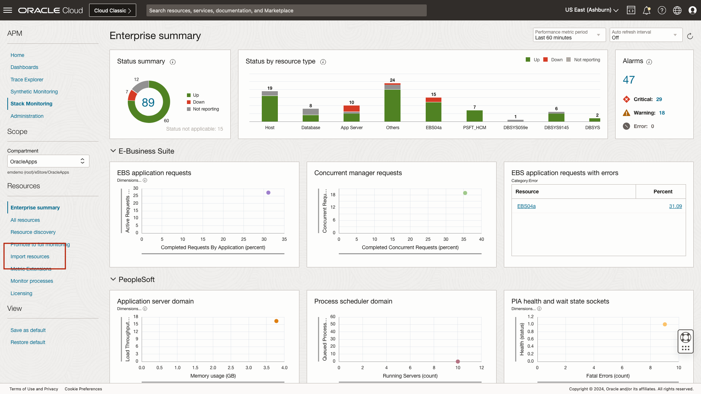
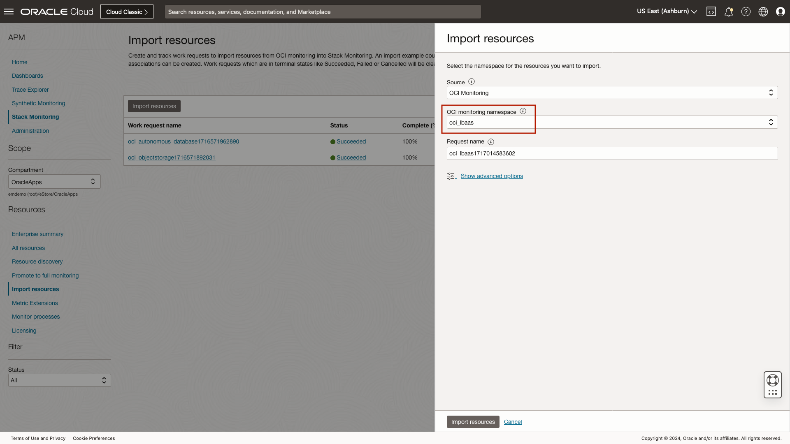
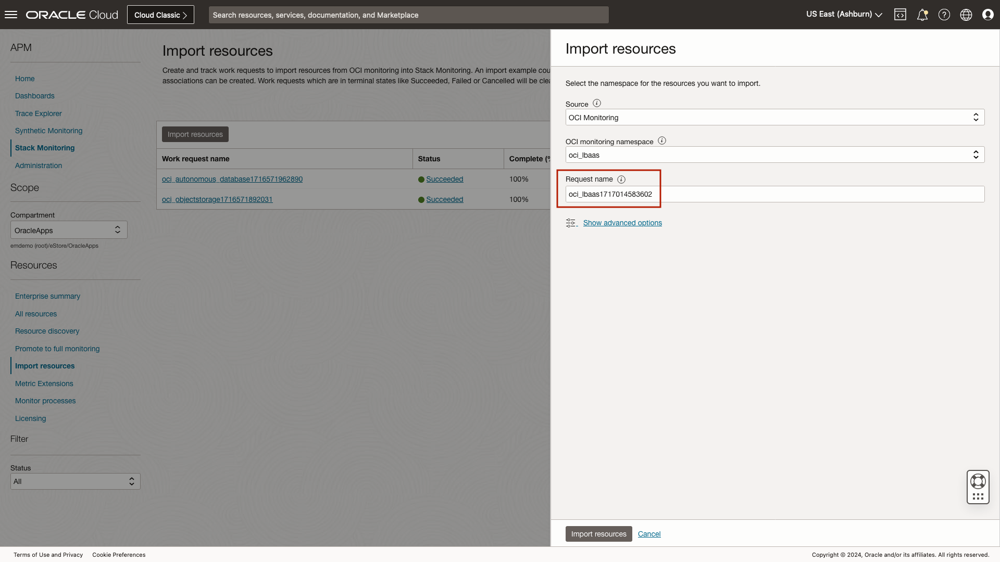
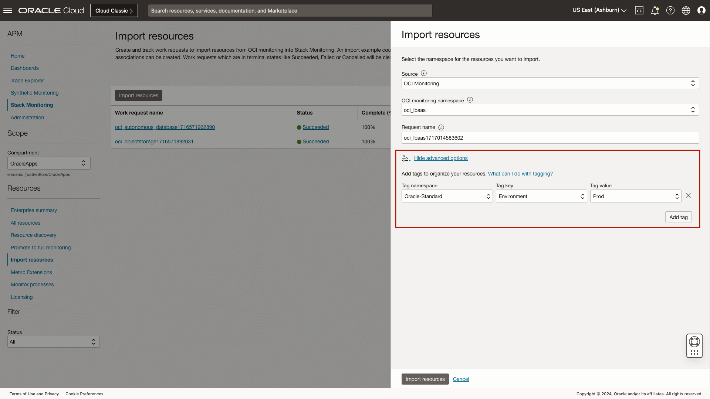
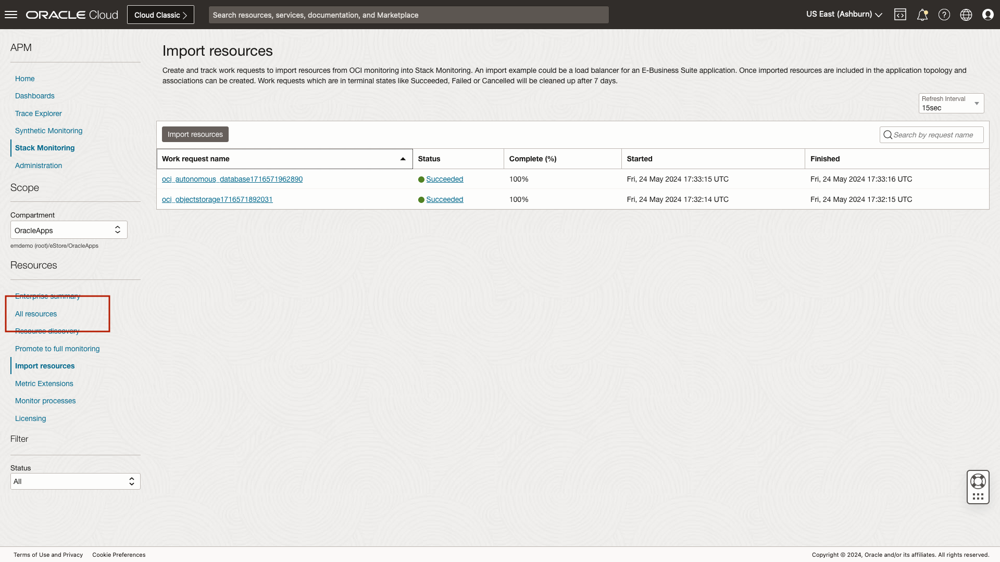
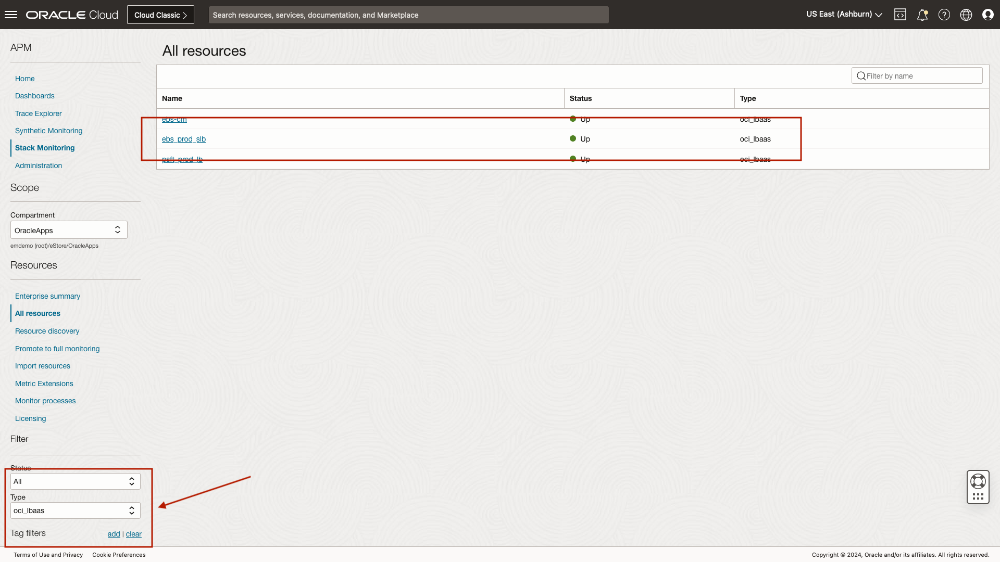
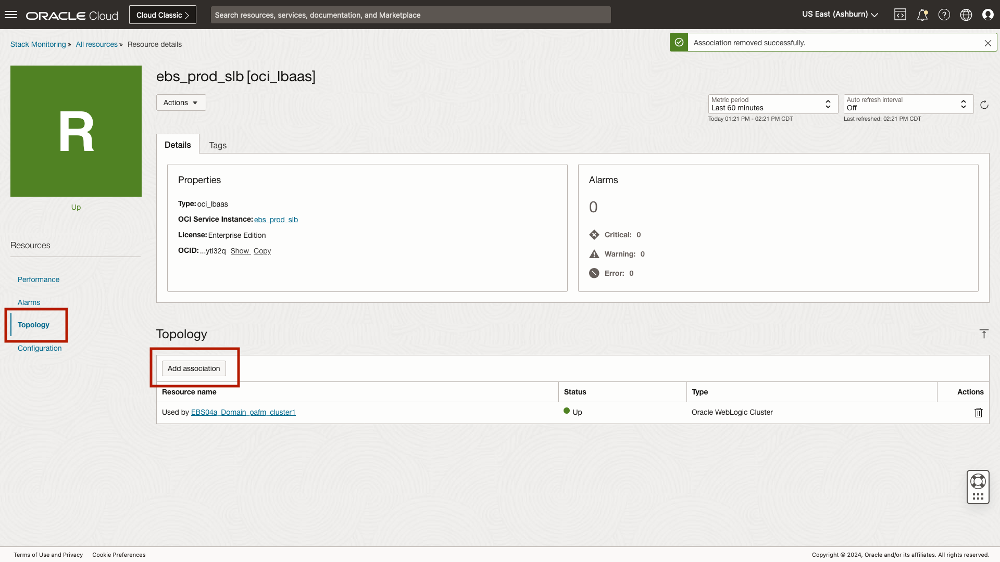
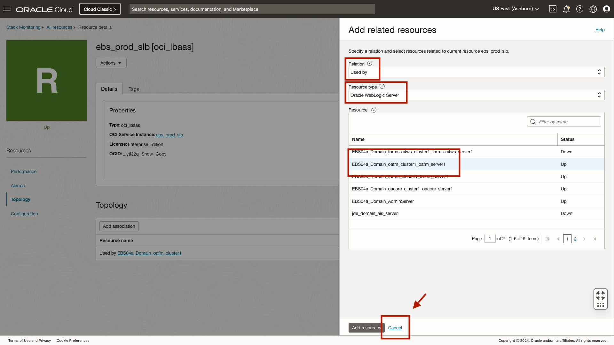
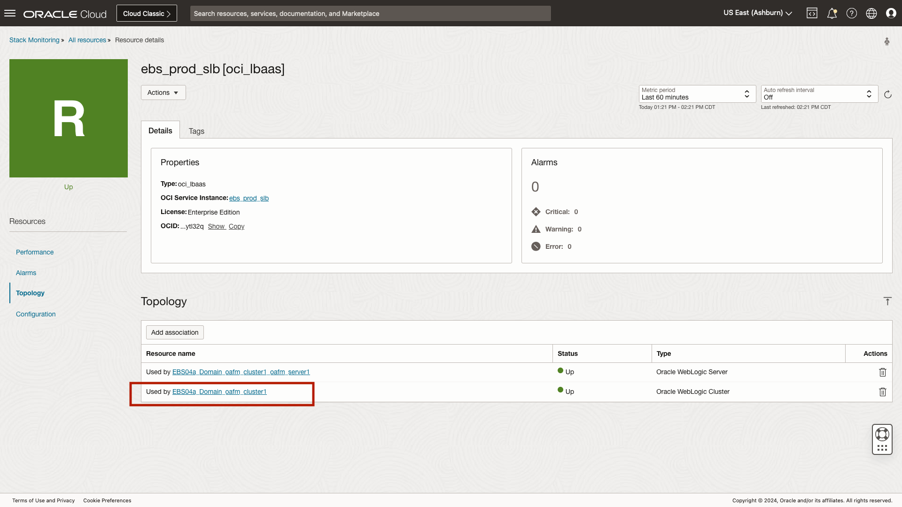

# Importing OCI Services in to Stack Monitoring

## Introduction

Stack Monitoring’s Extensibility feature allows for monitoring from other OCI services to be consolidated by importing resources in to Stack Monitoring. Importing resources into Stack Monitoring allows for the application’s topology to be completed by creating associations between the imported resource and existing Stack Monitoring resources. This reduces troubleshooting time by providing access to all resources and their availability and performance metrics of an entire application stack, including the load balancer, applications servers, databases, and even storage in a single place. Once a resource has been imported, Stack Monitoring will create a home page with availability and performance metrics, and configuration details, and report any open alarms.

In this lab we will review the process of importing an OCI Load balancer to complete an E-Business Suite application's topology by relating the load balancer to the WebLogic cluster the load balancers services.

Estimated time: 10 minutes

### Objectives

* Review the process of importing a load balancer in to Stack Monitoring
* Review a load balancer home page in Stack Monitoring
* Review the process of relating a load balancer to a WebLogic cluster to complete the topology

### Prerequisites

* Access to the environment as covered in the first lab.

## Task 1: Navigate to Stack Monitoring

1. Open the navigation menu in the Oracle Cloud console, and select **Observability & Management** > **Stack Monitoring** under **Application Performance Monitoring**.

	

	Once you arrive at the Enterprise Summary, select the compartment OracleApps under eStore.

	

## Task 2: Review the process of importing a load balancer in to Stack Monitoring.

1. From the Enterprise Summary, select **Import resource**.

	

	The process to import an OCI Service is simple. To get started select the **Import resources** button.

	

	This slide-out will help guide us through the process of importing resources into Stack Monitoring. Importing resources is easy, simply select the OCI monitoring namespace that contains the resource you wish to import.

	

	To import an OCI load balancer, from this list we'll select oci_lbaas.

	

	Once the namespace has been chosen, **oci\_lbaas**, Stack Monitoring will populate the **Request name**. However, if you prefer to rename the work request simply replace the pre-populated text. The request name can be used to help track the job progress and provide details of past import jobs.

	

	Clicking the **advanced options** link, provides access to assign tags to the resources that will be imported. For example in the image below, if we know the load balancers we are importing are production, we can assign the Oracle standard tag of **Prod**.

	

	Once an import job completes, Stack Monitoring will create a homepage, that provides details into the health and performance of the load balancer. Let's take a look at the load balancer home page. For this exercise, your lab account does not have sufficient privileges to import resources. Instead of clicking **Import resources**, we will select **Cancel**. 

	

## Task 3: Review a load balancer home page in Stack Monitoring.

1. To navigate to the load balancer Stack Monitoring home page, begin by selecting **All resources**.

	

	Using the **Type** filter, select **oci\_lbaas**, then select **ebs\_prod\_slb**.

	

	The **ebs\_prod\_slb** resource home page provides access to health and performance of the load balancer including any open alarms, as we reviewed in **Lab 3 Resource Home pages**. Scrolling down the page we see the Key metrics for this load balancer.
	
	
	
	A helpful feature when triaging issues is the link to the **OCI service** resource home page. This link allows you to quickly navigate back to the load balancer's OCI page where you can alter the resource pool or restart the load balancer. In this example using Stack Monitoring's topology, if we witness no activity on our EBS, we could quickly identify the WebLogic cluster that services EBS, then identify the load balancer in front of the cluster. Using the topology, simply click to navigate to the load balancer OCI service resource page and update the route configuration. All of this can be done without every typing or searching for a resource, simply follow the troubleshooting workflow.

	

## Task 4: Review the process of relating a load balancer to a WebLogic cluster to complete the topology.

1. To complete the E-Business Suite application's topology, select **Topology**, then select **Add association**. Note: These relationships already exist, click Cancel in lieu of **Add resources** in the slide-out.

	

	This slide-out will help guide us through the process of relating this load balancer to the WebLogic OAFM cluster that uses it. Let's begin by updating the **Relation** field from **Uses** to **Used by**. Next we will select the **Resource type** of **weblogic\_cluster**. And finally we will select **EBS04a\_Domain\_oafm\_cluster1**.

	With the fields completed, we would at this point select **Add resources**. However, the account provisioned for this lab does not have sufficient privileges to perform this action. In lieu of Add resources, we will select **Cancel**.

	

	We can now see this load balancer is used by the WebLogic OAFM cluster. Additionally, we can see the WebLogic cluster is up, and the resource type. If the topology changes, or the relationship type was created incorrectly, simply click the trash can icon to delete the association.

	As with any page within Stack Monitoring, clicking the resource name will navigate you to that resource's home page. 

	

	If you so choose, using what you have learned on navigating within Stack Monitoring, navigate to the EBS Application **EBS04a** and review the topology. From the EBS home page, you can see the load balancer that the WebLogic OAFM cluster uses within the overall topology.

	

We have successfully imported an OCI load balancer and enhanced our EBS application topology by then relating the load balancer to OAFM cluster and EBS application.

For more information on importing OCI Services, see **[Importing OCI Services](https://docs.oracle.com/en-us/iaas/stack-monitoring/doc/expand-monitoring-capability-custom-resources.html#GUID-0BEC3A9A-8CF9-4CBB-BAD8-0493C21D2F19__GUID-0ECEF541-E635-4DB4-9CE9-852D4A581179)**

## Acknowledgements

* **Author** - Aaron Rimel, Principal Product Manager, Enterprise and Cloud Manageability
* **Contributors:** 
	* Ana McCollum, Senior Director of Product Management, Enterprise and Cloud Manageability,  
	* Steven Lemme, Senior Principal Product Manager,  
	* Anand Prabhu, Sr. Member of Technical Staff
* **Last Updated By/Date** - Aaron Rimel, Aug 2024
