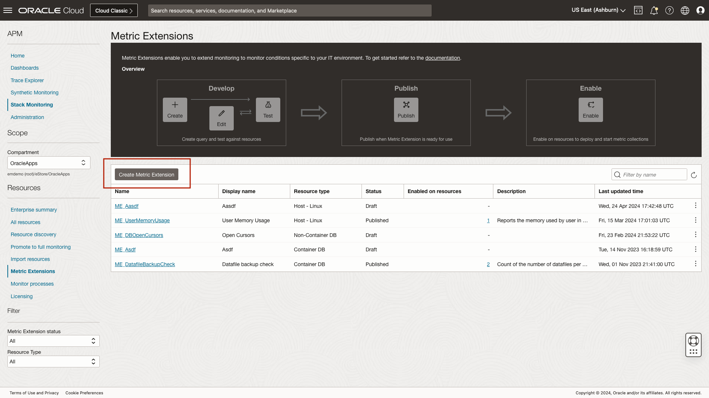

http://127.0.0.1:5500/workshops/livelabs/index.html?lab=together
# Creating Metric Extensions

## Introduction

Stack Monitoring Metric Extensions extend the out-of-the-box metric set provided by Stack Monitoring to meet the use cases required when monitoring unique IT environments. Metric Extensions provide the ability to create, test, publish, and enable a Metric Extension on a single resource or all the resources of a given type, such as hots, within a compartment. In this lab we will review the process of creating a Metric Extension that monitors the memory usage of all users on a host. This can be useful to identify the user on the host who is consuming the most memory. 

Estimated time: 5 minutes

### Objectives

* Review the process of creating a Metric Extension
* Review the process of testing a Metric Extension
* Review the process of publishing a Metric Extension
* Navigate to a host home page to review the memory usage by user on a host

### Prerequisites

* Access to the environment as covered in the first lab.

## Task 1: Navigate to the Metric Extension page within Stack Monitoring

1. Open the navigation menu in the Oracle Cloud console, and select **Observability & Management** > **Stack Monitoring** under **Application Performance Monitoring**.

	

	Once you arrive at the Enterprise Summary, select the compartment OracleApps under eStore.

	

## Task 2: Create a Metric Extension

1. Navigate to Stack Monitoring Metric Extension Page

	Once you have arrived at the Enterprise Summary, select **Metric Extensions** in the left lower menu.

	

	From the **Metric Extension** page, click **Create Metric Extension**.

	

	From the the **Metric Extension** slide-out , begin by entering the Metric Extension name, **MemoryUsageByUser** and display name, **Memory Usage by User**. A description of the Metric Extension is optional. In the image below we have provided a breif explanation of the our metric.

	Next we will provide the collection method properies. By default, Stack Monitoring has already selected the resource type of **host** and the collection method of **OS Command**. Now let's update the collection frequency from **15 minutes** to **5 minutes**.

	You may either enter an OS command or upload a script. Here we will enter the following command to gather memory usage by user, **ps hax -o rss,user | awk '{a[$2]+=$1;}END{for(i in a)print i";"int(a[i]/1024+0.5);}' | sort -rnk2**. The delimiter for output is **;**

	

	We begin by assigning the database a name. When discovering a resource within Stack Monitoring that is not ephemeral, it is important to provide the resource a meaningful name. Here we will enter **ebs\_prod\_db**. Next provide the DNS hostname or SCAN name depending on your listener configuration, we will enter **ebsproddb1.myacme.com**. Now provide a port, here we will use **1521** and the service name of **ebscdb**. From the drop-down, you can select all agents that monitor your database system that are responsible for monitoring your database. In this example select the agent ebs04a. 
	
	
	
	From this slide-out In the example below the Oracle DBA would begin by defining the Metric Extension name, display name, and description. Next, the DBA would complete the collection method properties which include the resource type of Container DB, the collection method of SQL, and the collection frequency of once per day. Next, enter the custom SQL query, or upload the file containing the SQL.

	The Metric Extension in Figure 1 queries a container database (CDB) and determines the number of PDB data files that have not been backed up in the last three days. The query results in two columns, the name of the PDB and the count of its data files not backed up. The Metric Extension contains a dimension column for the name of the PDB and a metric column for the count of data files that have not been backed up.

	The DBA can test the Metric Extension against CDB resources and review the output. Based on the output, if the metric needs to be revised, the DBA can update the query and re-test the metric. Once the testing is complete, the Metric Extension is ready to be published. A published Metric Extension can be enabled on one or many resources at a time. When a Metric Extension is enabled on a resource, metric collection will begin, and DBAs will be able to monitor the backup status of their data files.

Stack Monitoring provides both a CLI and UI driven discovery. In this lab we will review the discovery process for a complete E-Business Suite application (EBS). While your user will not have the necessary access to perform a discovery, the steps completed here will match the steps you would complete within your own environment when performing a resource discovery or promotion of a host. As a result in these exercises you will click **cancel** in-lieu of clicking Submit, Promote Resource, etc.

You will begin by reviewing the host promotion process. Next, review the discovery process of an Oracle Database used by the EBS application. Finish by reviewing the discovery process of an EBS application. When discovering an application such as EBS or PeopleSoft, the job discovers the entire application stack and its components. This includes resources such as Concurrent Manager and Notification Mailer, as well as the underlying WebLogic Domain and WebLogic Servers will be discovered. Let's begin by walking through the promotion of a host. 

## Task 2: Review the manual promotion process of an OCI Compute

Stack Monitoring can automatically monitor all hosts using **host auto-promotion**. Host auto-promotion will automatically promote a host to full monitoring once a Management Agent is installed. This includes an OCI Compute, or a host running on-premises or another cloud provider. For more information on host auto-promotion see **[host auto-promotion.](https://docs.oracle.com/en-us/iaas/stack-monitoring/doc/promotion-and-discovery.html#GUID-B98A3300-97AE-4029-9D05-1CCE4E922B25__P_DQB_VBB_YYB)**

1. Navigate to Stack Monitoring Promotion Page
	
	Open the navigation menu in the Oracle Cloud console, and select **Observability & Management** > **Stack Monitoring** under **Application Performance Monitoring**.

	

	Once you arrive at the Enterprise Summary, select the compartment OracleApps under eStore.

		

	From the Stack Monitoring Enterprise Summary, select **Promote to full monitoring** in the left lower menu.

	

2. Locate the host **stack-monitoring-demo**

	Clicking promote invokes a slide-out. From within the slide-out panel, validate that the **Resource Name** is the host's fully qualified domain name (FQDN) (i.e., hostname). **Management Agent**, Stack Monitoring automatically identifies the local Management Agent running on the host, no action is required. Once the Resource Name has been validated, and the monitoring agent has been selected, in your own environment you would click Promote Resource. However, in this lab you will click **Cancel**. Clicking **Promote Resource** will submit the promotion job, and within minutes Stack Monitoring would begin collecting a richer set of metrics than is available out-of-the-box.

	

	Once you submit the promotion job, the status and results of the promotion job can be found by navigating to the **Resource discovery** page. 

	Let's review the process of discovering an Oracle Database. We'll begin by navigating to **Resource Discovery**.

	

## Task 3: Discover an Oracle Database

1. Discover the database that contains the EBS application schema

	With all of the hosts promoted that your EBS application runs has completed, including the Oracle Database hosts, the next step is to discover the database where the EBS schema resides.

	Let's begin by invoking the discovery slide-out, by selecting **Discover New Resource**.

	
	
2. Complete the Oracle Database discovery

	To discover either a Container DB (CDB) or single instance database, select **Oracle Database** from the drop-down. If your application is running in a **Pluggable DB** (PDB), you should first discover the CDB prior to discovering the PDB. In this lab we will review the discovery process of an Oracle Database System. An Oracle Database system includes the Oracle Database system, CDB, listeners, cluster, and ASM.

	From the the **Resource discovery** slide-out , select **Oracle Database**.

	

	We begin by assigning the database a name. When discovering a resource within Stack Monitoring that is not ephemeral, it is important to provide the resource a meaningful name. Here we will enter **ebs\_prod\_db**. Next provide the DNS hostname or SCAN name depending on your listener configuration, we will enter **ebsproddb1.myacme.com**. Now provide a port, here we will use **1521** and the service name of **ebscdb**. From the drop-down, you can select all agents that monitor your database system that are responsible for monitoring your database. In this example select the agent ebs04a. 
	
	
		
	Next, provide the database monitoring user's credentials enter the username **monuser**. Next, since this is a demo enter any value for the password. In this example the EBS application uses ASM. Enter the DNS of your ASM host, we will enter **ebsproddb1.myacme.com**. Next we will enter the port of **1521**, and finally the service name, **ebsasm**.

	

	The next step is to provide the monitoring credentials for ASM, enter the username **sysasm**. ASM secrets are stored in OCI Vault. Select the ASM the secret from the drop-down list.

	When discovering a resource, you have the ability to discover in both Stack Monitoring and Logging Analytics at the same time. When performing a dual discovery, the results are sent to both Observability services that streamlines the onboard steps. Alternatively discovery can be performed only for Stack Monitoring or Logging Analytics. 

	Stack Monitoring has the option of Enterprise or Standard license. Standard Edition includes essential monitoring. This includes, discovery, home pages, Enterprise Summary, metric collection, and the creation of alarms to name a few. Enterprise Edition includes advanced monitoring features that includes baselines and anomaly detection, Metric Extensions, Process Set monitoring, Prometheus support and others. 

	

Once all of the fields are completed, once again click **Cancel**. 

For more information on licensing see **[Configuring Licensing.](https://docs.oracle.com/en-us/iaas/stack-monitoring/doc/configure-licensing.html)**

Stack Monitoring provides a script to create a least privileges user for monitoring an Oracle Database. For more information see **[MOS Doc ID 2857604.1.](https://support.oracle.com/epmos/faces/DocumentDisplay?_afrLoop=205057312345893&id=2857604.1&_adf.ctrl-state=12dl4mzuds_52)**

## Task 4: Discover an E-Business Suite Application

1. Complete an EBS discovery

	From the the **Resource discovery** page, click **Discover New Resource**. Select **EBS** from the drop-down list of resource types provided. After selecting EBS from the drop-down, a curated list of fields are provided to help drive the discovery process. As you can see this list is unique to each resource type.

	

	* Lets begin by providing the resource a name. Once again, when assigning a name ensure the resource name is meaningful to the user, enter **EBS\_DEMO2**. 
	* The EBS discovery process is dependent on the version version of EBS being ran, here we will select **12.2**. 
	* Enter the host name, **apps.example.com**, and port of the database that EBS is running on, **1521**. 
	* Next, enter your database service name, we will enter the service name **ebsdb**. 
	* The ebsdb is not using encrypted traffic, so we will keep the protocol of **TCP**.

	

	* Prior to discovery, it is imperative EBS specific database user grants are applied to the monitoring user prior to discovery. Always remember to follow the prerequisites outlined in Stack Monitoring's [documentation](https://docs.oracle.com/en-us/iaas/stack-monitoring/doc/promotion-and-discovery.html) prior to discovery. When discovering EBS, the database user should have limited access to perform only functions related to monitoring. 
	* Enter the username **monuser**. Once again, since this is a demonstration, enter any value for the password. 
		- If your monitoring user requires sysdba privileges, select that radio button here.
	
	Now lets enter details of the application layer. 
	* Enter the host in which the EBS application is running on, once again enter **apps.example.com**. 
	* Now enter the port of your WebLogic admin server port, **7001**. 
	* Our demo EBS environment is running http, or t3. 
		- If your application is encrypted, you would select t3s. In this example choose **t3** (http). 

	

	* Next enter your WebLogic admin server credentils beginning with the username, here you will enter **wlsadmin**, then enter the any value for the user's password. 
	* When selecting the Management Agent field, a drop-down list of all known agents within your compartment are shown. EBS can be monitored either by a locally installed agent, or an agent installed on another host. Here you can select any agent in the list.
	* Ensure the radio button is selected to discovery in both Stack Monitoring and Logging Analytics. 
	* To gain access to advanced monitoring features, we will select Enterprise Edition.

	Once all fields are complete, we would typically click Discover. However, we will again select **Cancel**.

	

To review a list of resources Stack Monitoring supports, see **[Oracle Stack Monitoring Primary Note (Doc ID 2925632.1)](https://mosemp.us.oracle.com/epmos/faces/DocumentDisplay?_afrLoop=399959770386069&id=2925632.1&_afrWindowMode=0&_adf.ctrl-state=5jd9c5nir_4)**

Having reviewed the resource promotion and discovery process, lets now review alarms.

You may now **proceed to the next lab**.

## Acknowledgements

* **Author** - Aaron Rimel, Principal Product Manager, Enterprise and Cloud Manageability
* **Contributors:** 
	* Ana McCollum, Senior Director of Product Management, Enterprise and Cloud Manageability,  
	* Steven Lemme, Senior Principal Product Manager,  
	* Anand Prabhu, Sr. Member of Technical Staff
* **Last Updated By/Date** - Aaron Rimel, May 2024
