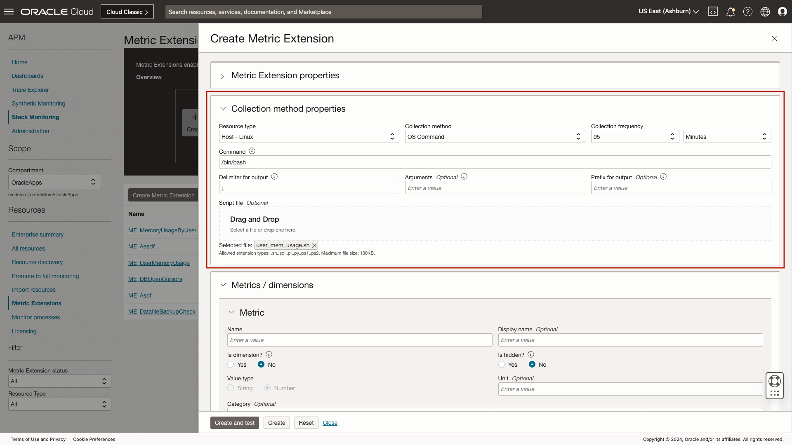
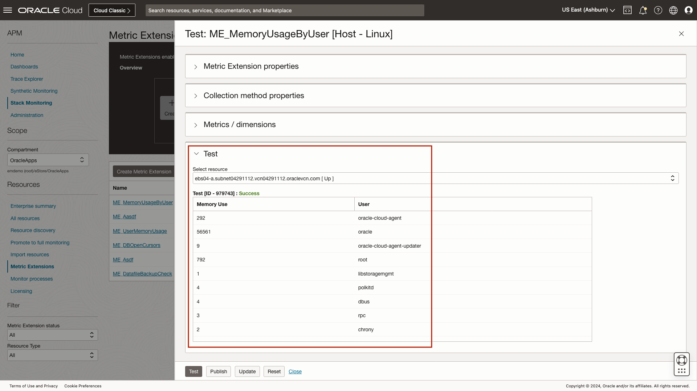
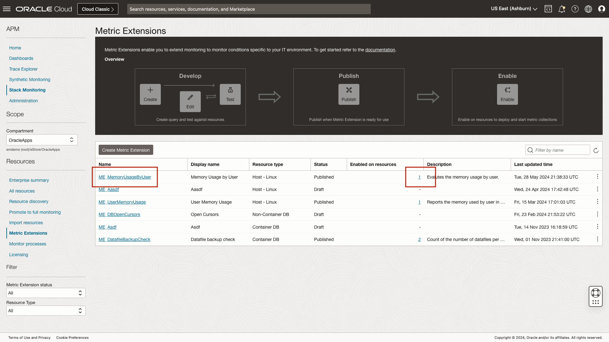
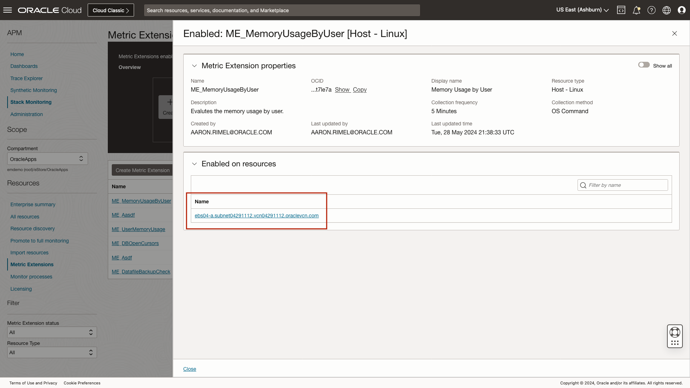
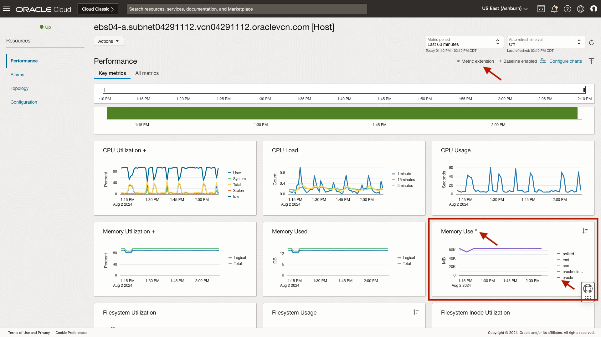

# Creating Metric Extensions

## Introduction

Metric Extensions extend the out-of-the-box metric set provided by Stack Monitoring to meet the use cases required when monitoring unique IT environments. Metric Extensions leverage the collection methods by resource type, for example SQL for Oracle Database or JMX for WebLogic. Metric Extensions provide the ability to create, test, publish, and enable a Metric Extension on a single resource or all the resources of a given type, such as hosts, within a compartment. 

In this lab we will review the process of creating a Metric Extension that monitors the memory usage of all users on a host. This can be useful to identify the user on the host who is consuming the most memory. 

Estimated time: 10 minutes

### Objectives

* Review the process of creating a Metric Extension
* Review the memory usage of all users on a host

### Prerequisites

* Access to the environment as covered in the first lab.

## Task 1: Navigate to the Metric Extension page within Stack Monitoring

1. Open the navigation menu in the Oracle Cloud console, and select **Observability & Management** > **Stack Monitoring** under **Application Performance Monitoring**.

	

	Once you arrive at the Enterprise Summary, select the compartment OracleApps under eStore.

	

## Task 2: Review the process of creating a Metric Extension.

1. Navigate to Stack Monitoring Metric Extension Page

	Once you have arrived at the Enterprise Summary, select **Metric Extensions** in the left lower menu.

	

2. Review the process of creating a Metric Extension

	From the **Metric Extension** page, click **Create Metric Extension**.

	

	From the the **Metric Extension** slide-out , begin by entering the Metric Extension name, **MemoryUsageByUser** and display name, **Memory Usage by User**. A description of the Metric Extension is optional. In the image below we have provided a brief explanation of the our metric.

	Next we will provide the collection method properties. By default, Stack Monitoring has already selected the resource type of **host** and the collection method of **OS Command**. Now let's update the collection frequency from **15 minutes** to **5 minutes**.

	In the image below, we have uploaded a script **user_mem_usage.sh**. The script contains the following command:

		ps hax -o rss,user | awk '{a[$2]+=$1;}END{for(i in a)print i";"int(a[i]/1024+0.5);}' | sort -rnk2

	

	The next step is to define the **Dimensions** and **Metrics**.
	
	The output of a Metric Extension is organized into Dimensions and Metrics, a dimension is a qualifier of a metric. Let’s use File System Utilization to describe Dimensions and Metrics. The **dimension** is the filesystem name, such as **/u01**, and the **metric** is the **utilization**, such as **90% utilized**. A metric must be numeric. Metric extensions leverage the monitoring credentials that were provided when the resource was first discovered. For example, when discovering an Oracle Container DB, if the DBNSMP user was provided, then DBSNMP will be used when collecting the Metric Extension. The metric data collected is stored in OCI Monitoring, this allows Alarms to be created against these metrics. Metric Extension charts will automatically be added to any resource home page once it is enabled. Metric Extensions can also be added to the Enterprise Summary and Dashboards.

	The script above, **user_mem_usage.sh**, returns two dimensions, **Memory Use** and **User**. The dimensions and metrics must be defined in Stack MOnitoring in the same order they return when executing the script or sql provided.

	Let's begin by defining the first column, **User**. User is a dimension with the value type of **String**. 

	Now let's define the second column that is returned, **Memory Use**. Memory use is **not** a dimension. The memory usage returned in the script is MB, so we will enter **MB**** under **Unit**. Additionally, you can include the Category, from the drop-down, select **Load**.
	
	
	
	With the Metrics and Dimensions defined, now it time to **Create and test** the Metric Extension. The account created for this lab does not have sufficient privileges to test create and test this Metric Extension. See the example below to view the output of our Metric Extension test.
	
	

	Reviewing the metric output, if the metric needs to be revised, simply update the script and re-test the metric. Once the testing is complete, the Metric Extension is ready to be **published**. Once a Metric Extension has been published it **cannot** be edited. A published Metric Extension can be enabled on one or many resources at a time. When a Metric Extension is enabled on a resource, metric collection will begin, and DevOps teams will be able to create alarms on user memory usage and review the usage on the host home page.

	In this example, if you had clicked **Publish**, you would be returned to the Metric Extension page.

	

	The Metric Extension page can be used to **enable** and **disable** the collection of a Metric Extension on one or many resources at a time using the action button.

	

## Task 3: Review the memory usage of all users on a host.

1. Identify the host where the Metric Extension has been enabled.

	The Metric Extension page can also be used to identify what resources a Metric Extension has been enabled on. Here we can see that the Metric Extension we created **ME_MemoryUsageByUser** has been enabled on **1** resource. Click the count, **1**, to identify the list of resource where this metric has been enabled. 
	
	

2. Review memory usage by user.

	Here we can see this Metric Extension has been enabled on the host **ebs04-a**. 

	Let's navigate to EBS04-a, click the host's name to navigate to the host home page to review the memory usage of each user on this host. 

	

	Once you have navigated to the ebs04-a home page, click **Charts** to view the Metric Extension. With the charts tab loaded, navigate to page 2 by clicking **2**.

	

	With the second page of charts loaded, scroll to the bottom of the page. Here we can the newly created Metric Extension **Memory Use**. Metric Extension charts are identified by an **'*'**. Reviewing the chart in the image below, we can see that root is consuming the most memory indicated by a purple line.

	

	Alarms can be configured on Metric Extensions using what you have learned in **Lab 5: View and Create Alarms**.
	
	For example, DevOps teams can configure alarms on Metric Extensions to notify users if a threshold has been breached. In this example, an alarm could be created to notify DevOps teams, that a user such as **oracle** is consuming more memory than expected. 

For more information on Metric Extensions, see **[Metric Extensions](https://docs.oracle.com/en-us/iaas/stack-monitoring/doc/metric-extensions.html)**

## Acknowledgements

* **Author** - Aaron Rimel, Principal Product Manager, Enterprise and Cloud Manageability
* **Contributors:** 
	* Ana McCollum, Senior Director of Product Management, Enterprise and Cloud Manageability,  
	* Steven Lemme, Senior Principal Product Manager,  
	* Anand Prabhu, Sr. Member of Technical Staff
* **Last Updated By/Date** - Aaron Rimel, June 2024
