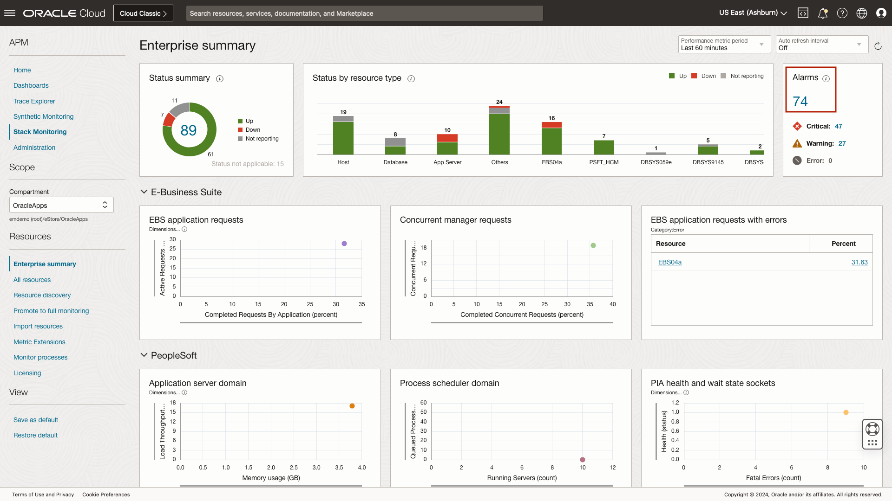
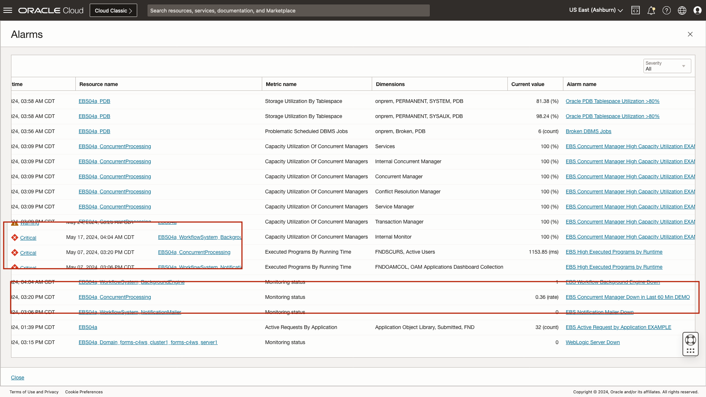
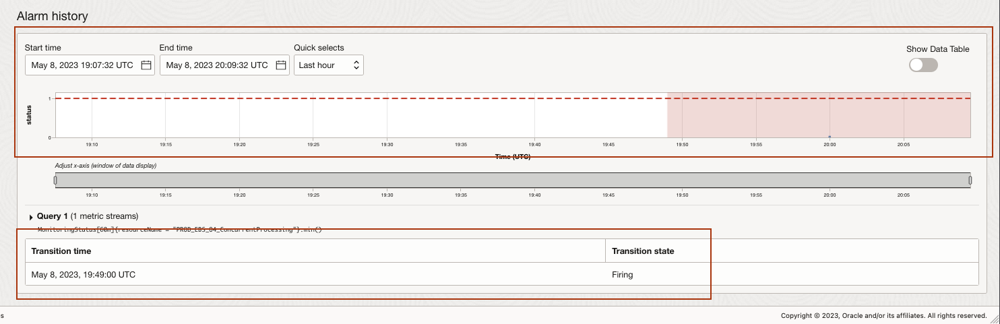
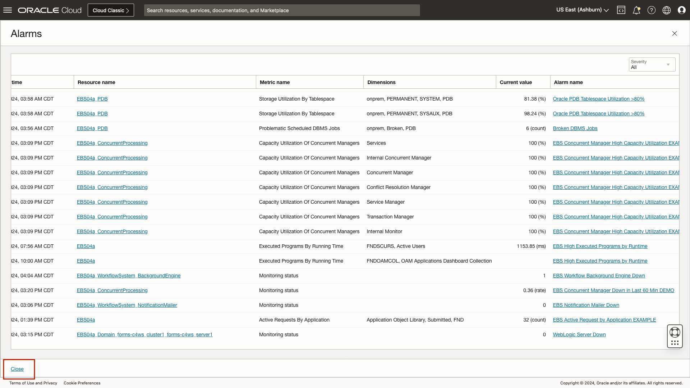
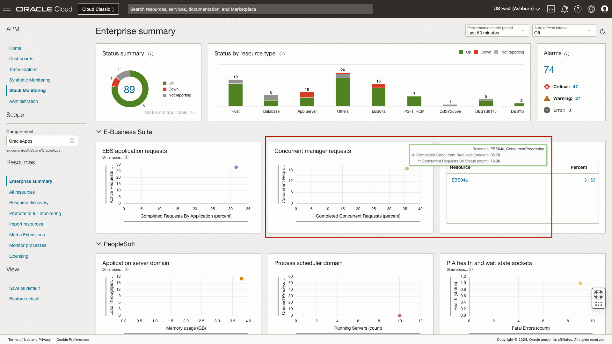
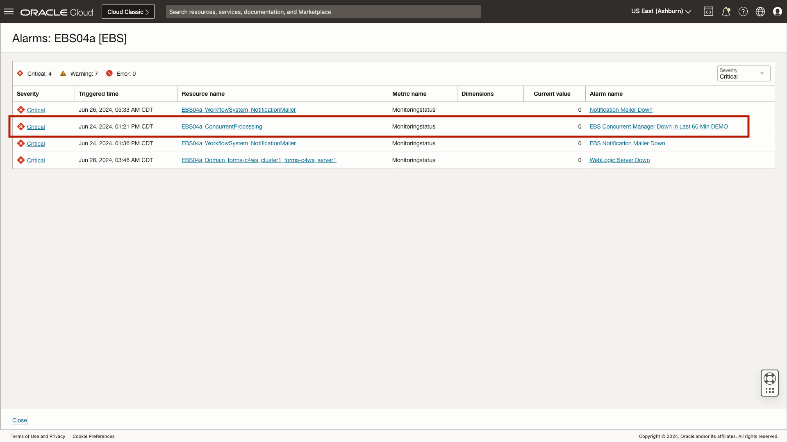
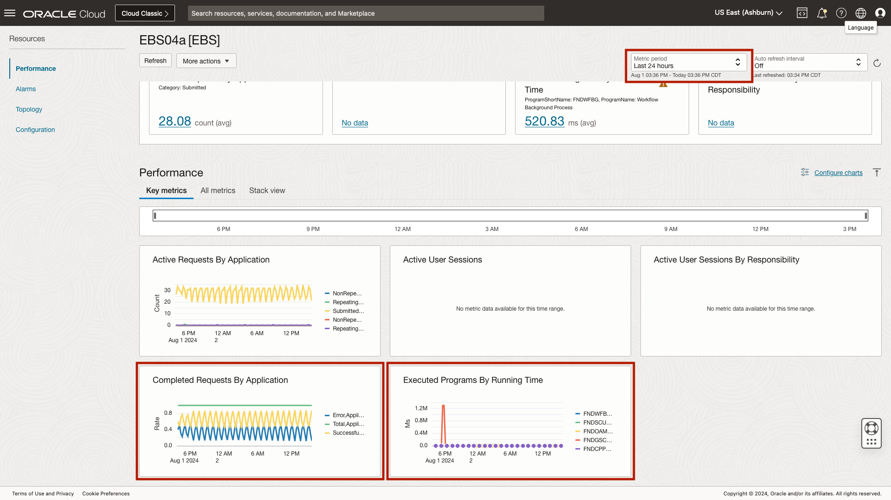
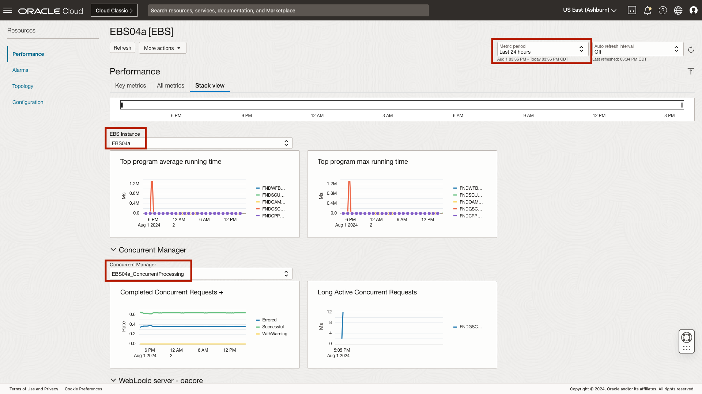
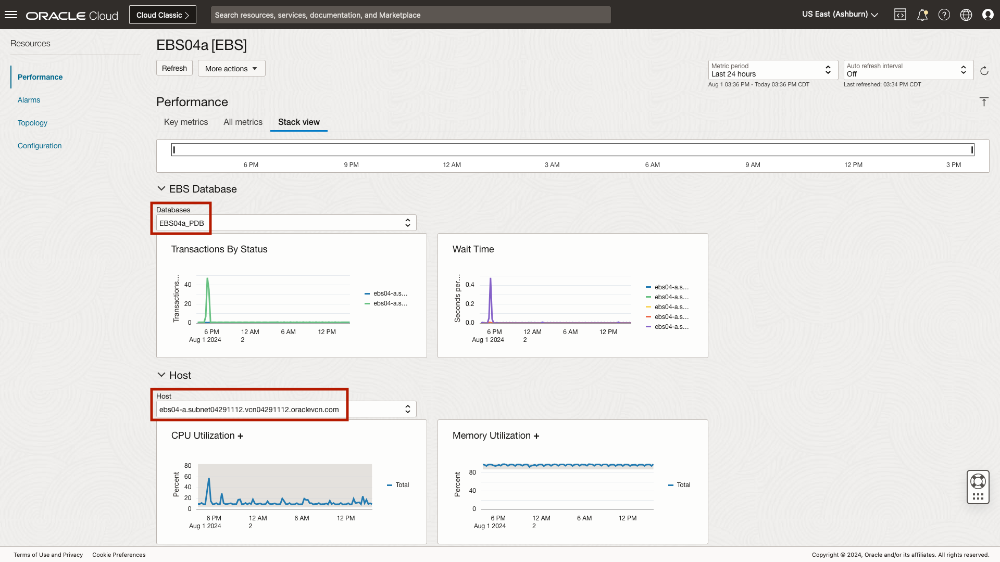

# Apply what you have learned

## Introduction

In this lab, you will triage an E-Business Suite Concurrent Manager. This includes reviewing an open alarm, reviewing the Concurrent Managers home page, navigating an E-Business Suite (EBS) application stack, and finally reviewing an EBS Stack View.

Estimated time: 10 minutes

### Objectives

* Identify an alarm in a firing state
* Review the performance a Concurrent Manager using homepages
* Navigate an applications topology
* Review an E-Business Suite application's homepage
* Review an E-Business Suite application Stack View

### Prerequisites

* Completion of the prior labs.

## Task 1: Navigate to Stack Monitoring's Enterprise Summary

1. Open the navigation menu in the Oracle Cloud console, and select **Observability & Management** > **Stack Monitoring** under **Application Performance Monitoring**.

	

	Once you arrive at the Enterprise Summary, select the compartment OracleApps under eStore.

		

## Task 2: Identify an alarm

1. Identify an alarm in a firing state

	Let's begin by clicking the count of open alarms at the top right of the Enterprise Summary. 

	

	Within the alarms slide-out, you can see the open alarm, **EBS Concurrent Manager Down in Last 60 Min DEMO**. This is a demonstration alarm that represents a Concurrent Manager that has been down in the last 60 minutes. From within this slide-out we can see the alarm severity is **Critical**, as well as the latest trigger time. In the screenshot, the alarm triggered on May 8th 2023, at 14:49 UTC. Lets click the alarm name, **EBS Concurrent Manager Down in Last 60 Min DEMO**, this will open a new browser tab for you to review more details regarding the alarm in the OCI Monitoring Service.

	

	The OCI Monitoring Service provides details of the alarm. From this page, you can identify the severity as critical. The alarm body is brief and contains information on where to begin the alarm investigation and a link to source controlled troubleshooting steps. The dimensions of this alarm, provide context to which Concurrent Manager is alarming, **PROD\_EBS04\_ConcurrentProcessing**.

	

	The alarm history provides context to the alarm state. From here you can see if the alarm recently began to fire or if the alarm is flapping. The table provides the exact time the alarm moved between states. Once you are done reviewing the alarm details, close the tab to return to Stack Monitoring.

	

	Lets review this Concurrent Manager's homepage. Close the slide-out and return to Stack Monitoring. 

	

## Task 3: Review a Concurrent Manager homepage

1. Review performance charts of a Concurrent Manager

	Remembering back to an earlier lab, the **Enterprise Summary** makes it easy to see the performance of every resource within your enterprise. Stack Monitoring performance charts are organized by tier. Each tier enables you to quickly access the overall load, response, utilization and errors across all resources in that tier. Clicking on a resources data point in the chart will allow you to further investigate metric trends. Using the scatter plot chart **Concurrent Manager requests**, click the plot point of the only Concurrent Manager in this enterprise.

		

	Clicking the plot point invokes a slide-out showing more details of the performance over the last hour for this Concurrent Manager. Update the charts to show the **Last 24 hours**. In the screenshot below, we can see a small spike in the number of pending requests. We can also see 100% of the completed requests were successful. Now let's click the resource name to continue our investigation by navigating to the resources homepage.

		

	Reviewing the Concurrent Manager homepage, you can see the **Availability** of the Concurrent Manager has been down for about 10 minutes in the last hour. Using the **Concurrent Requests by Status** chart, you can see the count of requests in a **Scheduled** state is not climbing. Reviewing the chart **Completed Concurrent Requests**, denotes all jobs are completing successfully, without warning or errors. Hovering over the legend within the chart **Capacity Utilization of Concurrent Managers**, you can see each of the Concurrent Managers appear to be at 100% capacity. That indicates a possible issue with Concurrent Manager capacity and needs to be further investigated. Now lets review the overall health and performance of the entire EBS application stack.

	

2. Navigate an application's topology

	It's easy to identify and navigate to the EBS application associated with this Concurrent Manager. Begin by selecting **Related Resources** on the left side of the page. Locate the resource **PROD\_EBS\_O4** with the type **EBS**. Click the name of the resource **PROD\_EBS\_O4** to navigate to the application's homepage.

	

## Task 4: Review a application homepage

1. Review an E-Business Suite application's homepage

	We can see that an application homepage, such as EBS, is similar to a standard resource homepage with a few additions. You see the overall availability of resources related to this EBS application, which includes Concurrent Manager, notification mailer, and workflow manager, etc. Stack Monitoring also provides a summary of alarms for the EBS application and its members by severity. 

	

	In a previous lab you reviewed the **Alarms** tab. The alarms shown on the EBS homepage are a roll-up of all alarms for EBS and its components, including the Concurrent Manager, notification mailer, etc. This allows you to view all open alarms related to this EBS application without having to navigate to multiple homepages. Here we can see the same alarm you investigated related to the Concurrent Manager, **EBS Concurrent Manager Down in Last 60 Min DEMO**, as this alarm is rolled up to the application level. 

	

	Clicking **Charts** provides quick visibility into the health of the EBS application. Let's begin by expanding the chart time displayed from the **Last 60 Minutes** to **Last 24 Hours**.

	Using the chart **Executed Programs by Running Time** you can easily gain insight into the five longest-running programs. In the screenshot below, we can see the job execution times have remained steady. Should you see any spikes, an admin can use their domain knowledge to pinpoint a job that is running longer than expected. Again using the screenshot below, the **Completed Requests by Application** chart denotes all jobs are completing successfully without error. The chart **Active User Sessions By Responsibility** in the screenshot below, shows a spike in active user **NULL_KEY** and should be investigated.

	

2.	Review an E-Business Suite application Stack View

	Having reviewed EBS application specific metrics, let's investigate the entire EBS application stack using the **Stack View**. Click the **Stack View** tab. 

	* The Stack View provides a holistic perspective of key performance metrics across an entire application and application stack technologies, a differentiated capability of Stack Monitoring. Within Stack View, you can observe an application including its key underlying components and technology stack all together in one place.
	* Stack View provides specially curated key performance metrics for the health and performance of the entire application. Let's begin by adjusting the time frame from the **Last 60 Minutes** to **Last 24 Hours**. Now expand each tier. With each tier expanded, you get a complete view of the performance of your EBS application.
	* EBS admins typically have an idea of the time it takes for a request to complete, and which requests run long. You can hover over a data point and perform correlation across the charts on the page. Reviewing the **EBS tier** you can review the five worst programs by average running time and max running time. 
	* Within the **Concurrent Manager tier**, you can see once again 100% of the Completed Concurrent Requests finished successfully. From the Concurrent Manager tier you can also identify if there are any long active concurrent requests.

	

	As EBS is a Java application, Stack Monitoring provides visibility into the performance of the WebLogic (WLS) cluster, specifically OACORE, the heart of EBS. Using the chart **JVM Memory Utilization** you can identify if WLS is starved for memory. In the screenshot below, we can see a drop in heap utilization. During that same time using the chart **Thread Pool Threads** we can see a spike in the number of idle connections. Reviewing **JDBC Connections** we can see there is no significant change in the number of threads waiting.

	

	Reviewing the **EBS Database tier**, you can review the number of transactions committed and rolled back. You can see a spike in application wait times indicated in green.
	
	Finally, you can review the health of the underlying **hosts**. In this screenshot you can see both **CPU an Memory Utilization** have remained steady.

	
	
	In this lab, you used a previously created alarm, **EBS Concurrent Manager Down in Last 60 Min DEMO** to determine if the Concurrent Manager had any impact to an EBS application completing jobs and if the Concurrent Manager down was attributed to any resource constraints. During the lab, you reviewed key performance metrics across an applications stack. You utilized Stack Monitoring's topology capability to navigate between resources to help triage the alert. Finally, you leveraged Stack View to review the performance of an entire application stack (EBS).

## Conclusion

Overall, you have learned how: 
* Stack Monitoring enables you to monitor the overall health of your applications and their underlying stack including servers, databases, and hosts. 
* Enterprise Summary can be used to immediately assess status and performance across each application stack tier, and its interactive design enables dynamic changes to any performance charts. 
* Resource homepages provide you with a curated view of the health and performance of resources through charts, tables, and Stack View. 
* Stack Monitoring can automatically provide an application topology automatically when discovering applications. 
	- The associations between resources further enables easy navigation up and down the application stack to ease and speed up the triaging and remediation of application performance issues. 
* And finally, the Stack View provides the ability to research the health and performance of the entire application stack from a single page to reduced incident times. 

For more information and full range of capabilities of the Stack Monitoring solution, view the **[Stack Monitoring](https://docs.oracle.com/en-us/iaas/stack-monitoring/index.html)** Documentation.

## Acknowledgements

* **Author** - Aaron Rimel, Principal Product Manager, Enterprise and Cloud Manageability
* **Contributors:** 
	* Ana McCollum, Senior Director of Product Management, Enterprise and Cloud Manageability,  
	* Steven Lemme, Senior Principal Product Manager,  
	* Anand Prabhu, Sr. Member of Technical Staff
* **Last Updated By/Date** - Aaron Rimel, June 2023
