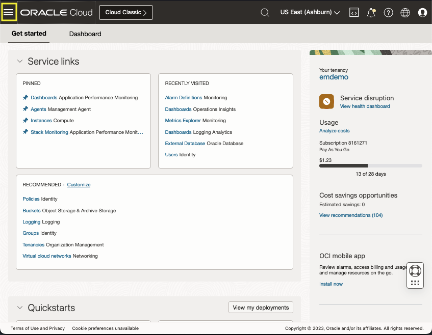
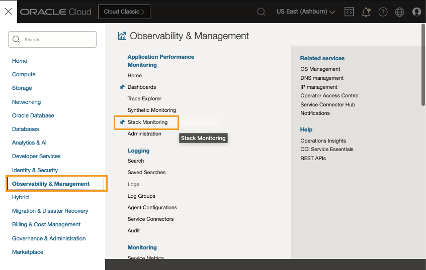
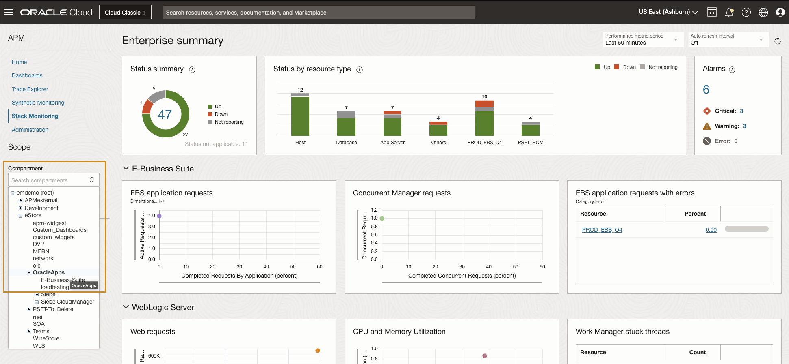
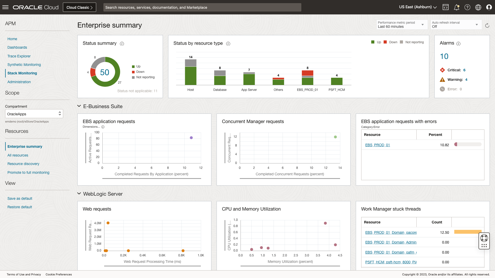

# Access Stack Monitoring Workshop environment

## Introduction

In this lab, you will use a username provided and log in to the workshop, then access the Stack Monitoring Enterprise Summary page in the Oracle Cloud console, under Application Performance Monitoring.

Estimated time: 5 minutes

### Objectives

* Access the workshop environment

### Prerequisites

* An Oracle event account, which you can use to sign in to the workshop tenancy.

## Task 1: Log in to the workshop tenancy

1. Click **View Login info** on **Get Started with Oracle Cloud Stack Monitoring** landing page to log in to the workshop tenancy in the Oracle Cloud.

   

2. Reservation Information pane opens. Click the **Launch OCI** button.

   

3. A new browser tab opens and loads the Oracle Cloud Infrastructure Sign-In page. Copy the Password from the Reservation Information pane on the LiveLab screen.

  
  >***Note:*** In the example image, two browser screens are opened side by side.

4. Paste the copied password onto the OCI Sign-In screen. Note that your user name is already pre-set in the **Direct Sign-In** section.

   

5. **Change Password** screen opens. Enter the new password that you can use to re-sign-in to the workshop tenancy, in case you closed your browser during the workshop reservation time.

   

6. **Oracle Cloud Get started** page opens. You can proceed to the next task to begin the workshop.

   

## Task 2: Access Enterprise Summary page

1. Navigate to Stack Monitoring
   
   Open the navigation menu from the top left corner (aka. hamburger menu) in the Oracle Cloud console.

   

   Now, select **Observability & Management** > **Stack Monitoring** under **Application Performance Monitoring**.

   

   	 Stack Monitoring Enterprise Summary page opens.

2. Connect to the correct **Region** and **Compartment**

   On the Stack Monitoring Enterprise Summary page, select the following from the pulldown menus:
    - Region: **US East (Ashburn)**
    - Compartment : **root/eStore/OracleApps**
    - Performance metric period : Last **Last 60 minutes**

   

When the correct region and compartment is chosen, the Enterprise Summary page will be populated. If you find the Enterprise Summary is empty double check the region and compartment.

   

You may now **proceed to the next lab**.

## Acknowledgements

* **Author** - Aaron Rimel, Principal Product Manager, Enterprise and Cloud Manageability
- **Contributors** - Ana McCollum, Senior Director of Product Management, Enterprise and Cloud Manageability
* **Last Updated By/Date** - Aaron Rimel, February 2023
