# Stack Monitoring's Enterprise Summary

## Introduction

In this lab, you will review the status and performance of an application and its underlying tech stack. You will leverage the Stack Monitoring Enterprise Summary page to identify the resources that are down, and review the open alarms. Additionally, you will identify the list of Oracle Databases in a Not Reporting state. Learn how to review performance metrics of the various tiers (e.g. E-Business Suite, PeopleSoft, WebLogic Server, Oracle Database, and Host). Finally, you will review Flash Recovery Area (FRA) utilization by replacing the Tablespace Utilization table. 

Estimated time: 10 minutes

### Objectives

* Identify resources that are down across the enterprise
* Identify application outages and resources that are down
* Review open alarms by severity
* Review the performance of resources across an enterprise
* Replace a metric table to dynamically troubleshoot FRA utilization

### Prerequisites

* Obtain access to the environment covered in preceding lab in this workshop.

## Task 1: Identify resources that are down across the enterprise

1. Open the navigation menu in the Oracle Cloud console, select **Observability & Management** > **Stack Monitoring** under **Application Performance Monitoring**.

	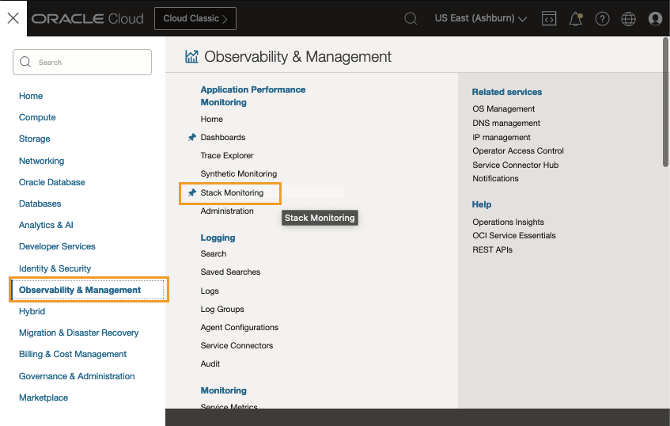

2. Identify resources in a **Down** state

	Stack Monitoring Enterprise Summary page opens. The Enterprise Summary page provides an overall health and performance of your entire enterprise. The upper tier allows you to quickly identify resources that are **Down** and triage to help reduce outage minutes. Locate the **Status Summary** doughnut chart on the upper left side of the page. You can see a count of resources by each status across the enterprise. This chart provides a quick visualization of how many resources are in a **Down** or **Not Reporting** state across your enterprise. Let's investigate which resources are **Down**. 

	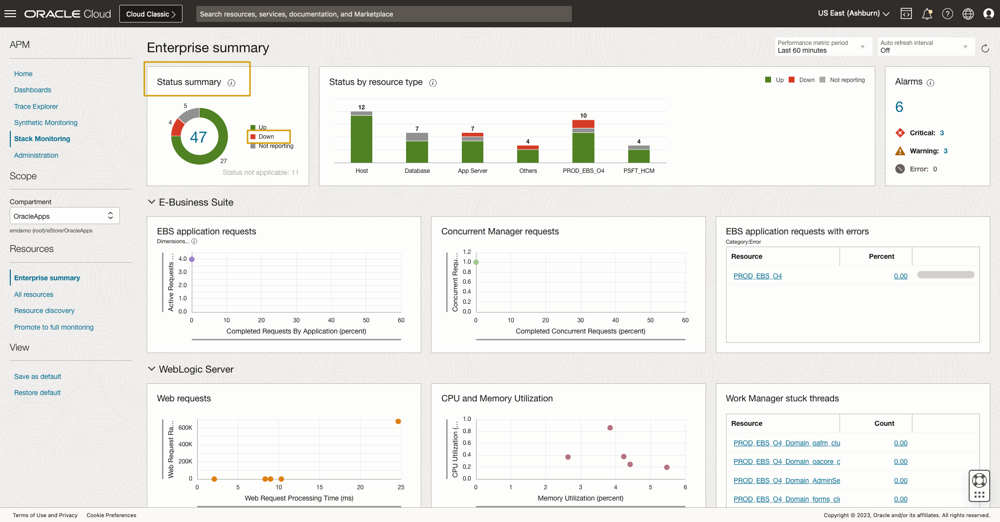

	Find the **Down** label in the Status summary chart. Clicking **Down**, opens a slide-out reporting all of the resources in a down state. The slide-out filter can be changed to quickly view all resources in any given state. This list can be sorted by name, status, and type. You can also search by name to quickly view the status of any given resource you may be concerned about. Clicking a resource name, will navigate you to that resource's homepage to continue an investigation. We will cover resource homepages and navigation later in this lab.

	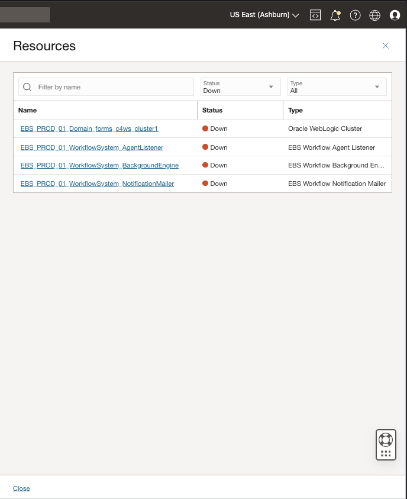

3. Review all resources that are **Not Reporting**

	Now that we have identified resources in a down state, let's identify those that are **Not Reporting**. Not Reporting generally indicates the agent is no longer uploading data. Stack Monitoring updates the status of monitored resources to **Not Reporting** to inform you there is an issue obtaining the resource's status. Alarms can be configured to notify you when the resource is Down or Not Reporting. 

	Using the Status filter located in the center of the fly-out, update the **Status** filter from **Down** to **Not reporting**. The table now displays all of the resources in a **Not Reporting** state. Clicking a resource name will navigate you that resource's homepage, where you can leverage the Stack Monitoring resource associations to identify the agent monitoring the resource and navigate to the agent's homepage to troubleshoot. We'll cover navigating a resources relationships in a later lesson. For now, let's return to the Enterprise Summary. Click the **Close** button in the lower left corner of the fly-out.

 	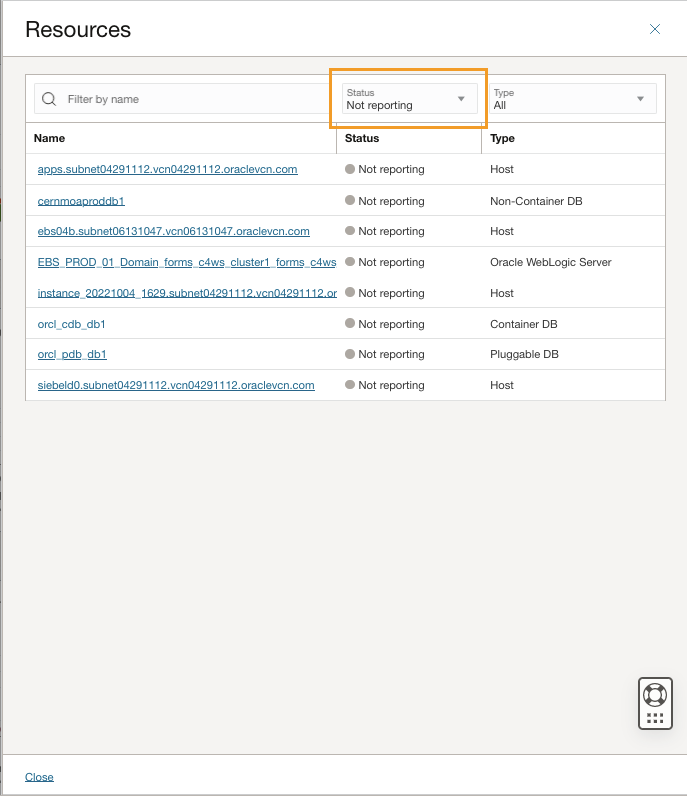

## Task 2: Identify and review resources by type that are down or not reporting

1. Locate the **Status by resource type** chart at the top center of the page. 

 	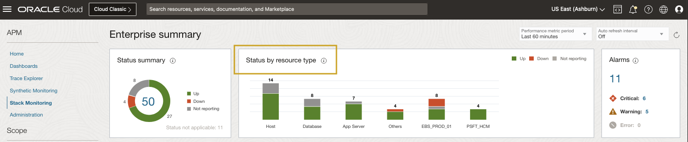

	The **Status by resource type** chart allows you to easily identify which tiers of your application has availability issues. Each bar represents each tier of the application stack, (e.g. host, database, application server). Using the status colors you can quickly assess if all resources within that tier are up, or identify the tier that has resources outages. The reporting of an application stack, such as E-Business Suite and PeopleSoft, is unique. Each bar represents an application and its components, this allows you to identify if any individual components of an application is down or not reporting. Should you identify an area of concern with an application, clicking the bar will navigate you to that resource's homepage. We'll review homepages in the next lesson.

2. Identify resources by resource type that are **Not Reporting**

 	Identifying which resources are down or not reporting by type across an enterprise is easy. Simply locate the chart legend at the top right of the **Status by resource type** chart, select **Not Reporting**. This will filter the chart to only show the count of resources by type in a **Not Reporting** state. 

 	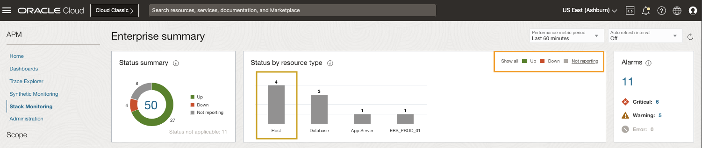

 	If we wish to see a more detailed list of hosts that are not reporting, click the host bar on the left side of the chart. This will invoke a slide-out and display a list of host names, status, and type. From this slide-out it is simple to update the filter to see other states, resource types, or simply search for a resource by name. Clicking any resource name within the slide-out will navigate you to that resource's homepage for further troubleshooting. 

 	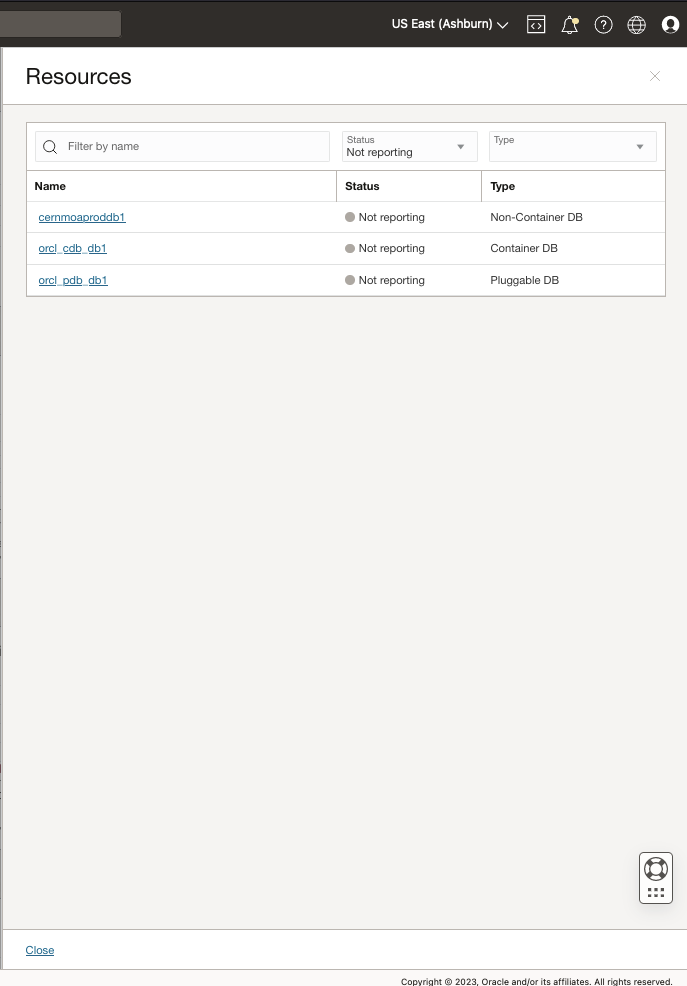

	To return to the Enterprise Summary click the **Close** button in the lower left corner of the fly-out.

3. Reset Status by resource type chart
	
	With the slide-out closed, locate the **Show all** filter located within the **Status by resource type** chart's legend. Clicking **Show all** will reset the chart to the default state of showing all resources and states.

 	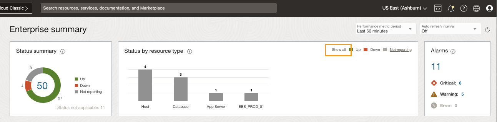

## Task 3: Review open alarms by severity

1. Locate the **Alarms** region at the top right of the Enterprise Summary. 

	Stack Monitoring provides quick access to all open alarms on your monitored resources. The **Alarms** region provides a total count of open alarms, as well as a count of alarms by severity. Clicking on a count of alarms invokes a slide-out. The slide-out provides greater details of the open alarms and is filtered by the severity count selected. 

	Let's review the open alarms. Begin by clicking the **Total** count of open alarms, in the **Alarms** region. 

 	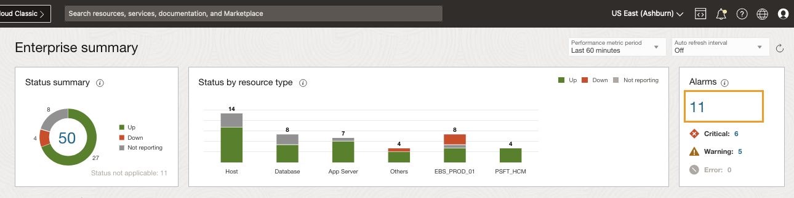

	The alarm slide-out provides details of open alarms. These details include Alarm name, Severity, and Triggered time. The results can be ordered by selecting the column title.

 	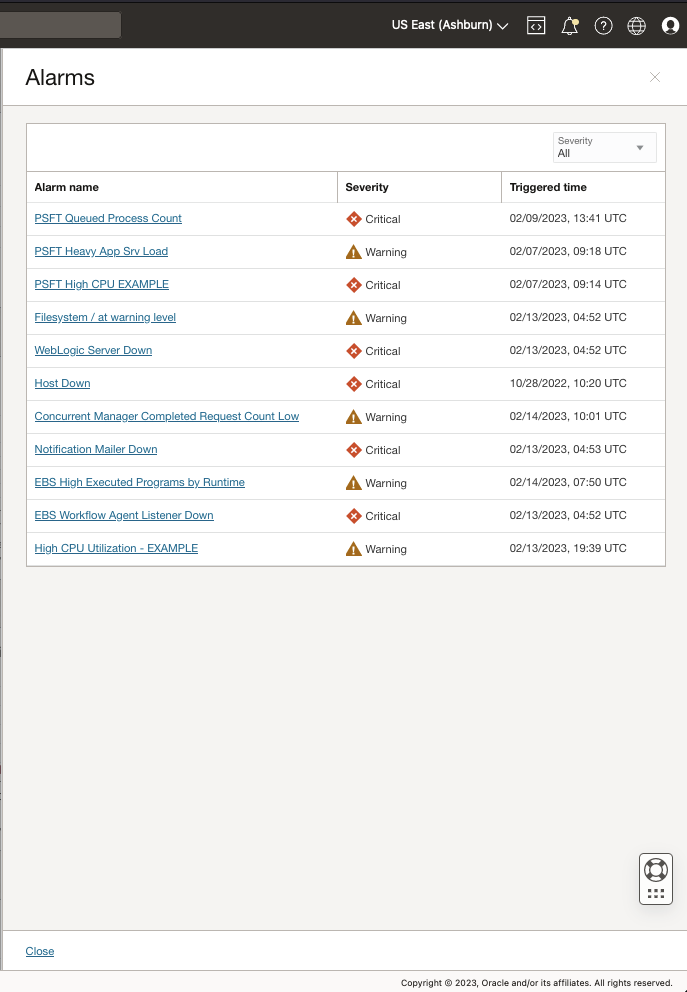

2. Refine the list of open alarms

 	Lets filter the list to focus on only the **Critical** alarms. Using the **Severity filter**, change the severity from **All** to **Critical**. The table now displays only the open alarms with a severity of **Critical**. 

 	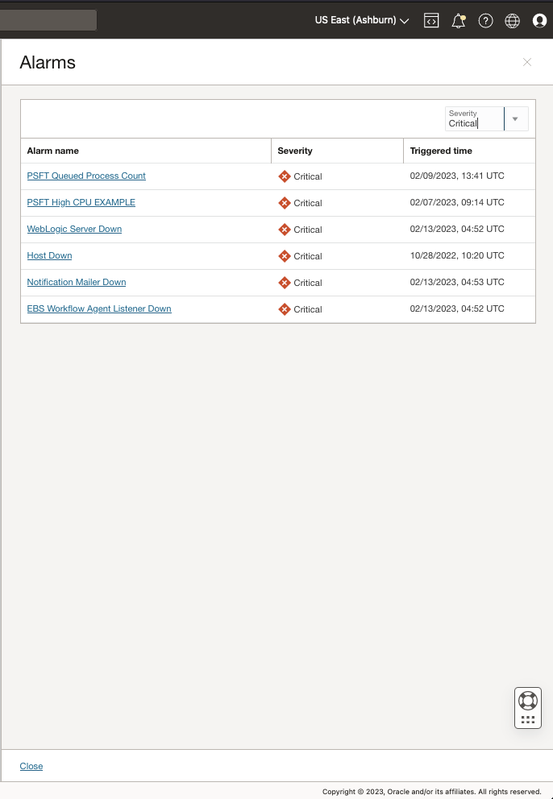

 	Clicking an alarm name will open a new tab in your browser to investigate and work the alarm within Oracle Cloud Infrastructure's Monitoring Service.

 	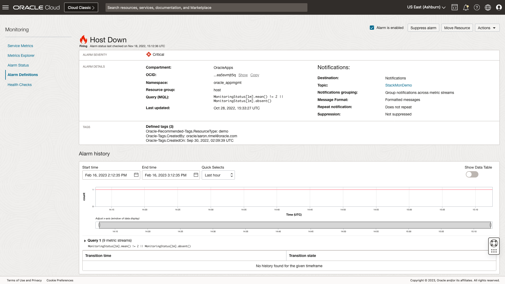

 	Once you have reviewed the alarm, close the browser tab to return to Stack Monitoring. Once again click **Close** at the bottom left of the slide-out to return to the Enterprise Summary.

## Task 4: Review the performance of resources across an enterprise

1. Enterprise Summary tiers

	The **Enterprise Summary** makes it easy to see the performance of every resource within your enterprise. Stack Monitoring performance charts are organized by tier. Each tier allows you to quickly access the overall load, response, utilization and errors across all resources in that tier. Scatter plot charts enable correlation between any two metrics, such as load and response metrics, for all resources in that tier. You can easily determine if a resource with the slowest response shows a corresponding high load. Resources with the highest load and response metric values can easily be spotted in the upper right corner of the chart, and clicking on their data points in the chart will allow you to further investigate metric trends. Out-of-the-box tables provide visibility into errors or show the resources with the highest space utilization.

 	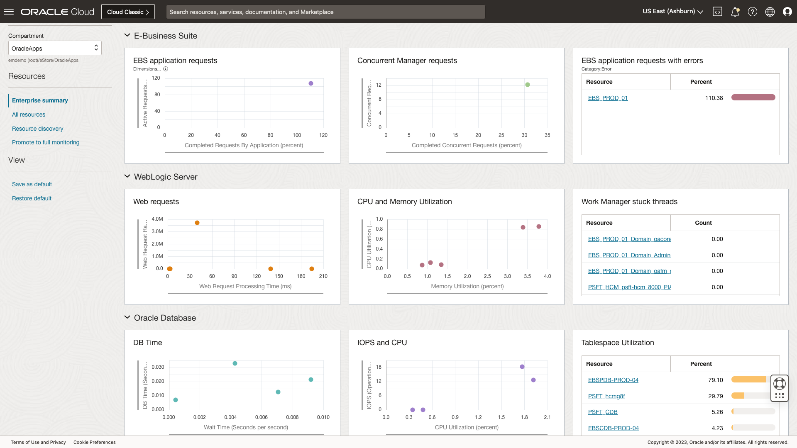

	Stack Monitoring makes it easy to troubleshoot any resource type and any metric at any time. All performance charts and tables can be modified or replaced to help identify problems or troubleshooting a specific performance problem. For example host metrics such as Disk Activity and Network Activity to correlate performance of network read and writes. 

 	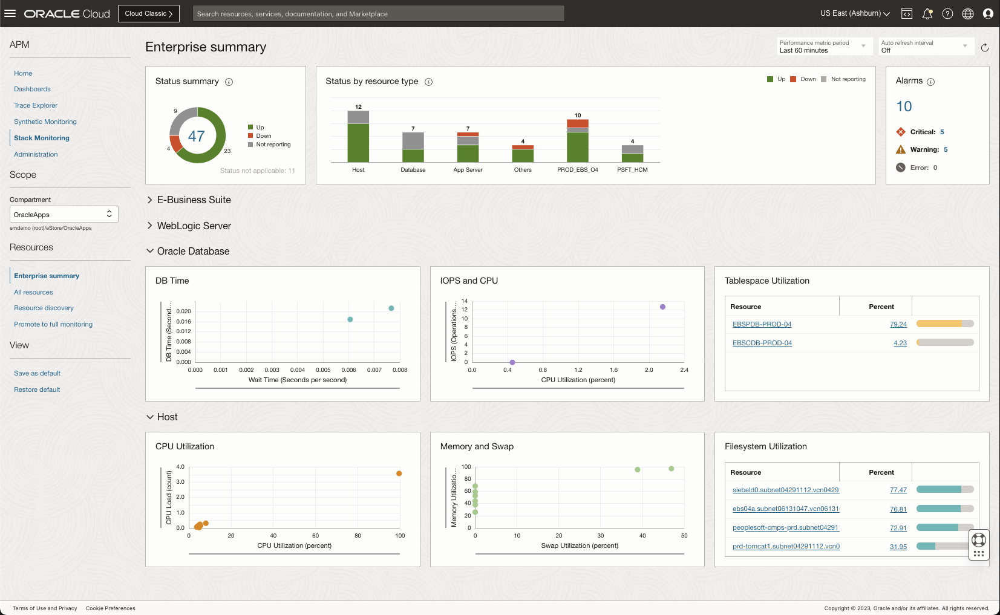

	Alternatively any scatter-plot or table change can be saved as your default when viewing the Enterprise Summary, by clicking **Save as default**. 

2. Scatter-plots charts

	Scatter-plot charts provide a visual representation of the performance every resource in your enterprise. Using the scatter-plot charts we can correlate any two metrics at the same time. For example we can correlate IOPS and CPU of an Oracle Database to understand how heavily utilized the database is. This makes it easy to identify if one or more resources are performing differently than the others. For instance, an Oracle Database with a plot point at the top right corner represents a busy database, while a plot point at the bottom left is idle. If you identify a performance anomaly, clicking on the plot point opens that resource's homepage to begin your investigation. We'll review this workflow in the next lesson.

 	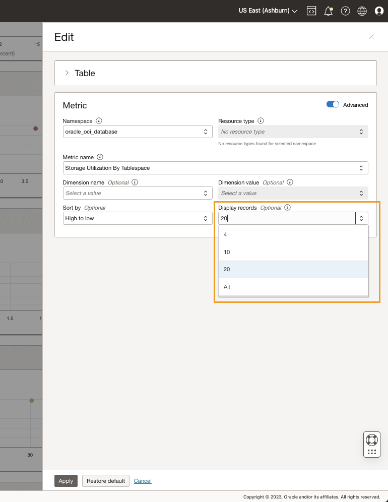

	Let's review memory and swap utilization of all hosts within this enterprise. Navigate to the **Memory and Swap** chart located under the **Host** tier at the bottom center of the Enterprise Summary. Every monitored host within Stack Monitoring is represented in this chart. You can assess the overall usage of memory and swap across all hosts. You can identify which host is utilizing the most memory and swap. We can also see the majority of hosts are using very little to no swap. If we were troubleshooting a an issue, this would allow us to easily rule out memory load as a contributing factor to any performance problems that may be occurring.

 	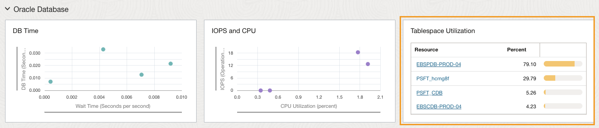

2. Tables

 	Tables on the right hand side of the page allow you to quickly identify which hosts or databases have the highest filesystem usage or tablespace usage. By default **Tables** provide up to the four highest utilized or consumed resources of a given metric. The number of rows displayed can be updated from 4 to 10, 20, or all. Let's review the top 20 most heavily utilized filesystems within the enterprise. Locate **Filesystem Utilization** chart on the right side under the **Hosts** tier. Click the pencil icon in the top right of chart. After clicking the pencil, enable the **Advanced** menu items by updating the **Advanced** flag. Enabling the Advanced menu, provides access to optional features of a table or chart. Click **Display records** to change the value of rows displayed from 4 to **20**. With the value updated to 20, click **Apply** in the lower left of the slide-out to return to the Enterprise Summary. 

 	

 	We can now see a list of the top 20 most heavily utilized filesystems within the enterprise. Should one of the filesystems cause concern, clicking any of the resource names will navigate you to that resource's homepage for further investigation. For example, when investigating filesystem utilization it is good to review the growth over time to understand if more space should be added, and if so how much. From a Stack Monitoring host homepage you can chart the growth of the filesystem over time using the **Filesystem Utilization** chart. We'll review resource homepages in a later lesson.

 	

## Task 5: Replace a metric table to Dynamic troubleshoot a storage issue using the Enterprise Summary

1. Review WebLogic JVM utilization by replacing a chart

	The Enterprise Summary provides an overall perspective of the health and performance of your enterprise. Knowing that each organization and user is unique, the Enterprise Summary charts, tables, and tier names are customizable to meet the individual needs of the user at any given time. If you choose to update or replace what is displayed on the Enterprise Summary, you can save your changes permanently as your default. This can be especially helpful if you need to troubleshoot several different resource types and metrics while investigating an incident. Saving the configuration allows you to leave the Enterprise Summary and return later to the page with your updated view intact. Once you complete your investigation, simply click **Restore default** to return the Enterprise Summary to out-of-the-box configuration. Let's see how this is done.

	Investigating health and performance issues are easy using dynamic troubleshooting. The Enterprise Summary allows you to easily swap out any performance charts or tables with another. This allows you the ability to see the necessary metrics when troubleshooting issue quickly and easily. Let's imagine we have heard a a JVM is performing poorly. Using the Enterprise Summary we can review and correlate the performance of any two WebLogic metrics. From within the WebLogic tier, find the chart **CPU and Memory Utilization**. Let's review JVM heap utilization. Begin by clicking the pencil icon in the top right of the chart to invoke the slide-out. With the slide-out loaded, enable the **Advanced** features. Under the **X-Axis** replace Memory Utilization with **JVM Memory Utilization** and add a dimension name of **Type**, and dimension value of **Heap**. Finally, select **Apply** in the lower left of the slide-out. 

 	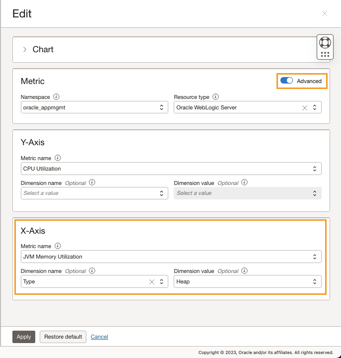

	We can now see the JVM Heap Memory utilization as well as the CPU performance of the WebLogic Servers. Using the results of the chart we can now correlation the performance of WebLogic servers with high JVM heap utilization with the same WebLogic server CPU performance.

 	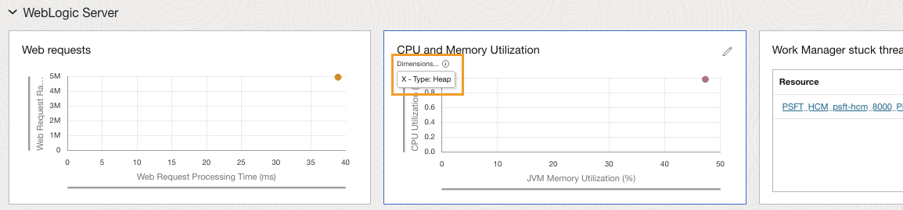

	With our troubleshooting over, let's reset the Enterprise Summary to the default configuration. To reset the page locate the **Restore default** link in the left menu bar under **View**. Once clicked, the page will reset to the out-of-the-box configuration. 

 	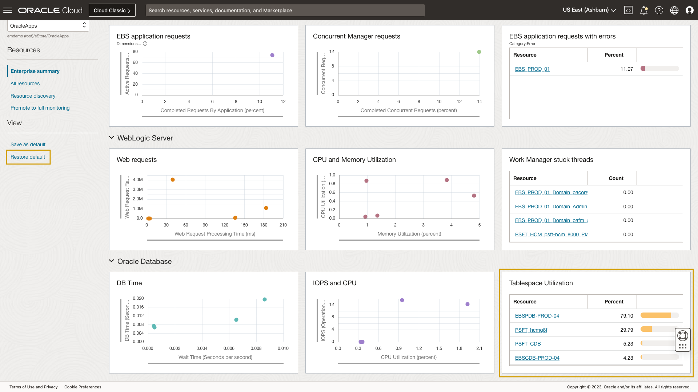

Congratulations! Let's **proceed to the next lab**.

## Acknowledgements

* **Author** - Aaron Rimel, Principal Product Manager, Enterprise and Cloud Manageability
- **Contributors** - Ana McCollum, Senior Director of Product Management, Enterprise and Cloud Manageability
* **Last Updated By/Date** - Aaron Rimel, February 2023
