# Stack Monitoring's Resource Homepages

## Introduction

In this lab, you will become familiar with using Stack Monitoring's resource homepages. 

Estimated time: 15 minutes

### Objectives

* Using the resource homepage
* Learn the Performance menu including, alarms, charts, tables, and Stack View
* Understand the configuration details of a resource
* View application topology
* Putting it all together

### Prerequisites

* Completion of the labs before this one

## Task 1: Become familiar with the layout of a resource homepage

1. Open the navigation menu in the Oracle Cloud console, and select **Observability & Management** > **Stack Monitoring** under **Application Performance Monitoring**.

	

2. Navigate to a **Concurrent Manager** resource.

	The Enterprise Summary page opens. The concurrent manager is one of those key resources you want to monitor to help maintain the service level of an E-Business Suite (EBS) application. In the last lab we discussed that when you are troubleshooting, the Enterprise Summary provides quick insight into the performance of your resources at a glance. Located on the E-Business Suite tier, the **Concurrent Manager requests** chart is displayed and provides visibility into all concurrent managers across your enterprise. A concurrent manager starts other concurrent programs running. Should a concurrent manager be unavailable or show or suffer a performance degradation and need to be investigated further, such as viewing if the percentage of successfully completed concurrent requests is low, click the dot within the **Concurrent Manager requests** chart to activate the slide-out.

	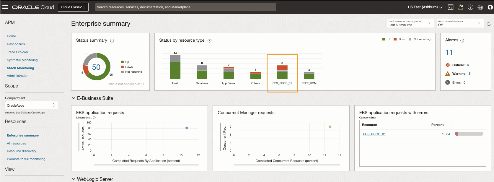

	With the slide-out open, you can again review the percentage of successful completed requests over time. Now lets take a closer look at this concurrent manager by clicking the name of the concurrent manager at the top of the page. This will navigate you to the concurrent manager's homepage.

	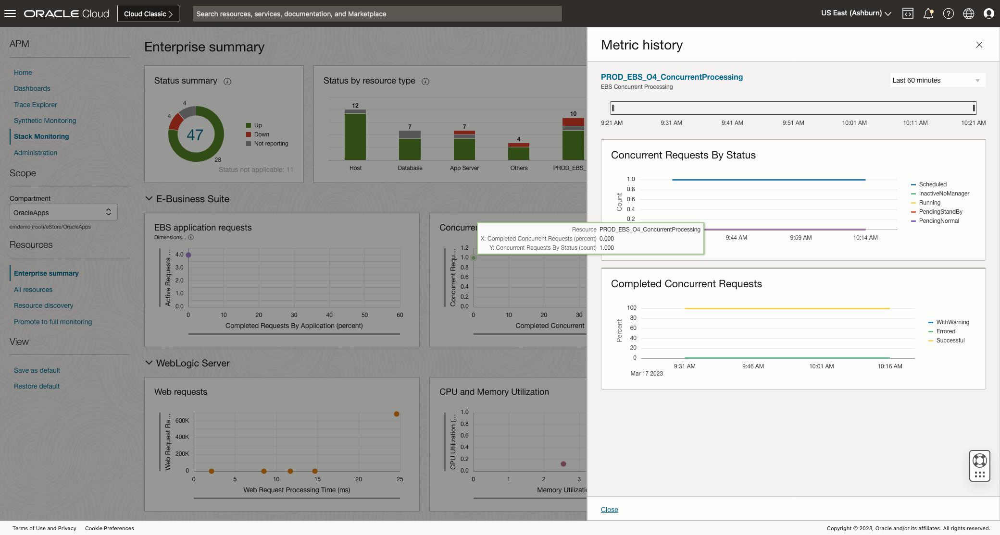

3. Application specific key resource homepages

	On the Concurrent Manager homepage, you can easily review the health and performance of this resource. Each resource in Stack Monitoring has a homepage that provides a central place to review status, performance, and alarms. At the top of the page, Stack Monitoring reports the current status, (Up, Down, Not Reporting). The color and shape of the status indicator will update depending on the resource status and type. Should you find a resource in a down state, the homepage will display a large **red** box with the status of **Down**. Stack Monitoring also provides a **Current Status** date and time. For example, if this Concurrent Manager goes down, Stack Monitoring will provide a timestamp of when the status switched from **Up** to **Down**.

	We can see a count of open alarms by severity. Clicking an alarm count will open the Alarms tab below. We'll cover the **Alarms** tab in more detail later.

	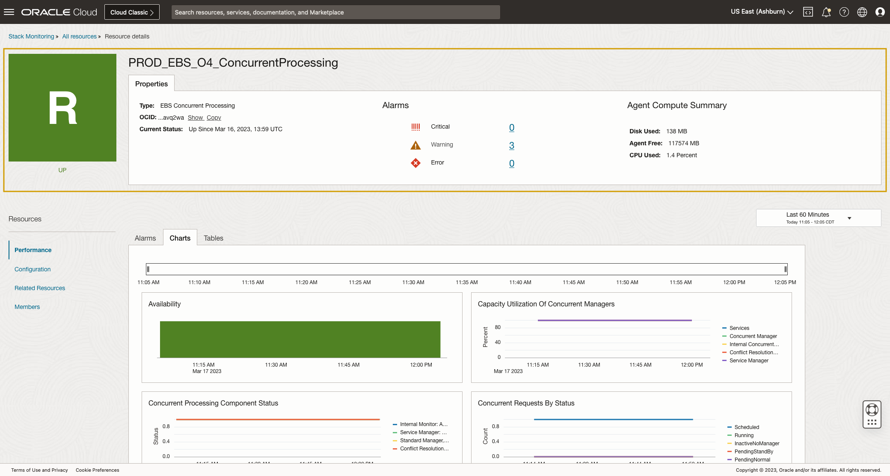

## Task 2: Review the Performance menu including, alarms, charts, tables, and the Stack View

1. Reviewing performance charts, in this lesson we will review EBS.

	A Concurrent Manager homepage provides a list of charts curated for the EBS Concurrent Manger. So when you navigate to a resource from the Enterprise Summary charts and tables, the homepage loads the **Charts** tab by default. Metrics are collected out-of-the-box and immediately begin collecting after the discovery. By default, the **Last 60 Minutes** is displayed. When investigating issues, it helps to review the performance change over a longer period of time. To extend the time frame click the drop-down and choose **Last 24 Hours**. All charts will now display data from the last 24 hours.

	Imagine that you have identified a spike in the number of concurrent requests that have been completed with errors. Using the **Completed Concurrent Requests**, hover over a point in time within that chart. Stack Monitoring will display the metric, dimension, timestamp, and value. Stack Monitoring will also show metric details of every other chart on the page during that timestamp. Should you identify another area of concern, highlighting the metric will display the value of all other metrics on the page at the same time. For example, when you need to troubleshoot and correlate two metrics like a spike in errors using **Completed Concurrent Requests** and **Capacity Utilization of Concurrent Managers** to determine if the concurrent manager has reached 100% capacity and related to the errors observed.

	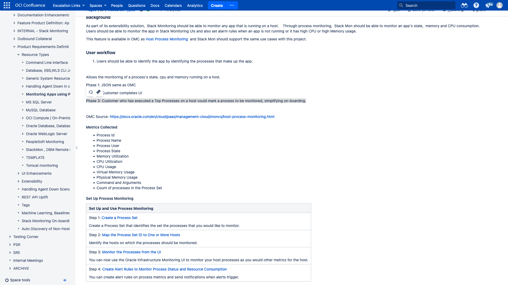

	Stack Monitoring uses **Tables** to report all dimensions of a metric. Let's navigate to tables to view all of the data points.

2. Review metric tables

	Select the **Tables** tab. Tables provide the latest collection value of every metric across all dimensions. Let's review the **Concurrent Requests By Status**. Click the **triangle** to expand the table. Here we see the count of the concurrent requests by different status (i.e. Scheduled, Running, PendingStandBy, PendingNormal, InactiveOnHold, and InactiveNoManager). 

	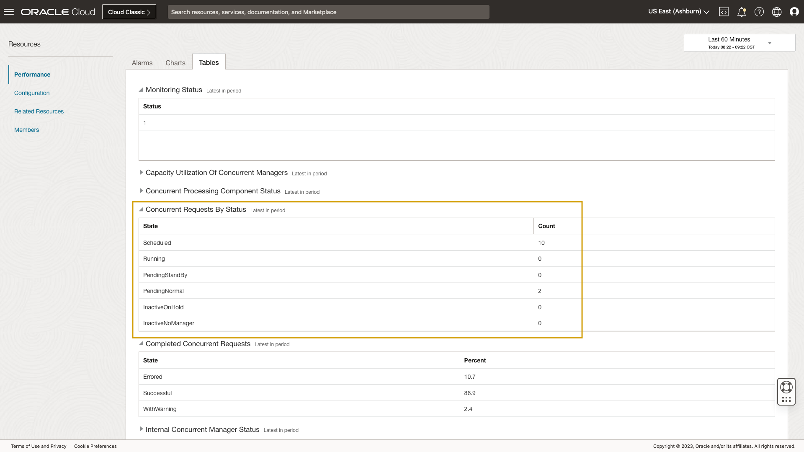

3. Review open alarms

	Select the **Alarms** tab. Using the **Alarms** view we can see a detailed list of open alarms that includes the alarm Name, Severity, and Last Triggered date/time. In the previous lab you learned that clicking an alarm **Name** will open a new tab in your browser to investigate and work the alarm within OCI's Monitoring Service. Now let's review the configuration details of a resource.

	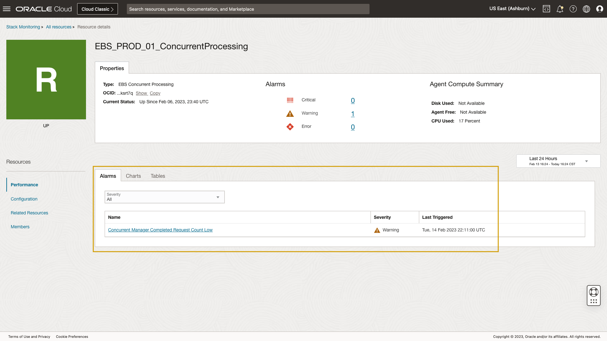

## Task 3: Review configuration details of the resource

1. Locate **Configuration** in the left menu of the homepage.

	Using data provided within **Configuration** you can easily identify the resource's installation location to locate its log files. Stack Monitoring **Configuration** provides quick access to both general OCI properties and resource-specific properties. Other examples of resource properties include database service_name and the application schema name. In this case of an EBS application, that helps you identify the database and schema that contains the EBS data.

	Now let's learn about the application topology capability within Stack Monitoring.

	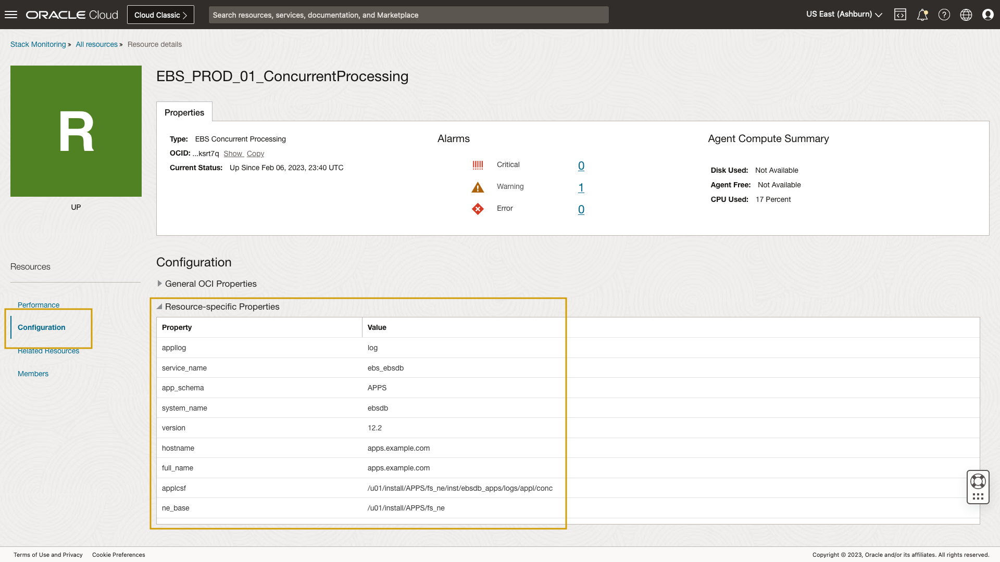

## Task 4: Review application topology

1. Reviewing application topology using **Related Resources**.

	This capability is useful if the status of the EBS Concurrent Processing instance is Not Reporting, which can be caused by problems in an agent's upload of data.

	When discovering an application its resources and the application topology, i.e., the associations between components of its technology stack, are also discovered. You can use this application topology to navigate, view, and to troubleshoot different components of an application.

	From the left side, locate **Related Resources** in the left menu. Clicking **Related Resource** provides quick access to all resources associated with this resource. Using Related Resources, you can also identify which EBS Application the concurrent manager belongs to. Additionally, you can identify which management agent monitors this concurrent manager. 

	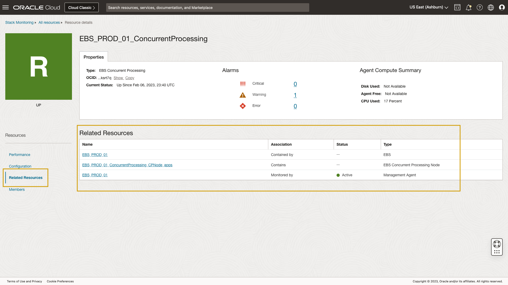

## Task 5: Putting it all together

1. Identify an alarm

	Let's begin by clicking the count of open alarms in a **Warning** state at the top of the homepage. 

	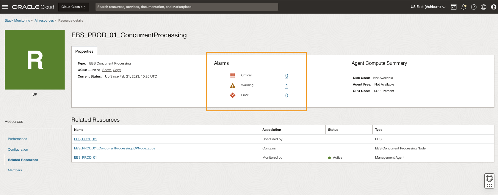

	With the alarms tab opened, you can see an open alarm **EBS Concurrent Request with Errors**. Clicking the alarm name opens a new tab in the OCI Monitoring Service.

	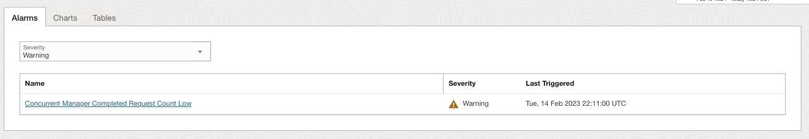

	The OCI Monitoring Service provides critical details of the alarm. From this page, you can understand when the Concurrent Manager requests began to error and how long the errors have been occurring. Additionally, you can see the rate at which the errors have occurred over time. By default, you see the alarm details for the last hour. 

	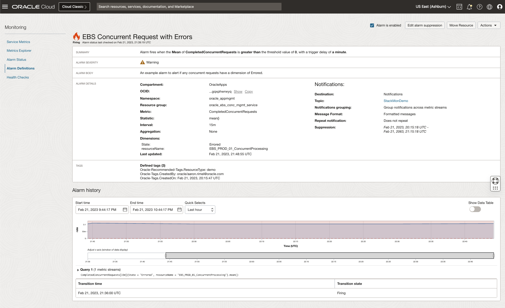

	Close the tab and return to Stack Monitoring. 

	Next review the charts associated with this Concurrent Manager by clicking the **Performance** menu on the left side of the page. Then select the **Charts** tab. Now let's expand the chart time frame to show the **Last 24 Hours**. When you review the chart, **Completed Concurrent Requests**, there does not appear to be a spike in completed concurrent requests with errors. Hovering over the legend within the chart **Capacity Utilization of Concurrent Managers**, you can see each of the concurrent managers appear to be at 100% capacity. That indicates a possible issue with concurrent manager capacity needs to be further investigated. Now review the overall health and performance of the entire EBS application stack.

	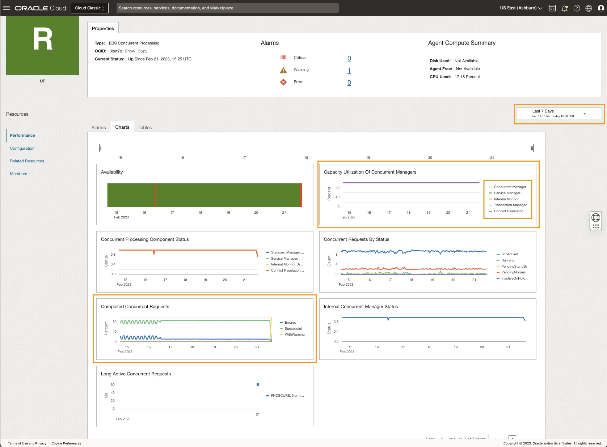

	It's easy to identify and navigate to the EBS application associated with this Concurrent Manager by clicking **Related Resources** on the left side of the page. Locate the resource **PROD_EBS_O4** with the type **EBS**. Click the name of the resource **PROD_EBS_O4** to navigate to the application's homepage.

	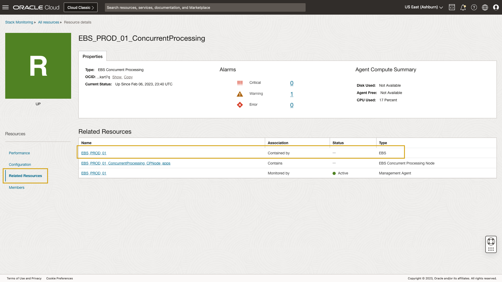

2. Reviewing an application's homepage

	We can see that an EBS homepage is very similar to a standard resource homepage with a few additions. You see the overall availability of resources related to this EBS application, which includes resources such as the concurrent manager, notification mailer, and workflow manager, etc. Stack Monitoring also provides a summary of alarms for the EBS application and its members by severity. 

	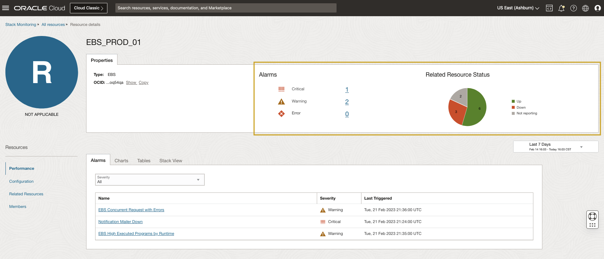

	In the previous activity, you reviewed the **Alarms** tab. The alarms shown on the EBS homepage include both the open alarms for the EBS application itself, as well as open alarms for its components. On the EBS homepage, you can view a roll-up of all alarms for EBS and its components, without navigating to navigate to multiple homepages or using different tools. Here we can see the same alarm you investigated within the Concurrent Manager homepage, **EBS Concurrent Request with Errors**, as this alarm is rolled up to the application level. 

	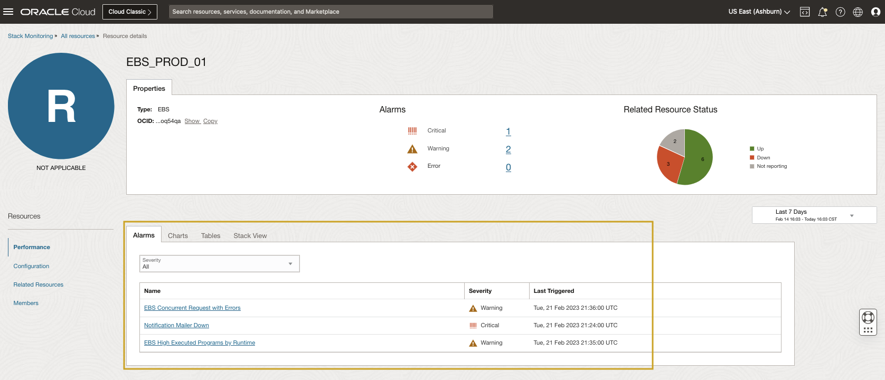

	Clicking **Charts** provides quick visibility into the health of the EBS application. Let's begin by expanding the chart time displayed from the **Last 60 Minutes** to **Last 24 Hours**.

	Assuming you are the EBS Admin, by using the chart **Executed Programs by Running Time** you can easily gain insight into the five longest-running programs by running time. Then using your domain knowledge, you pinpoint a job that is running longer than expected. Reviewing **Completed Requests by Application** you can see the relative percentage of requests that are erroring out. An EBS admin familiar with the environment can confirm if it is erroring more than typical for this EBS application being the count of active users has remained constant.

	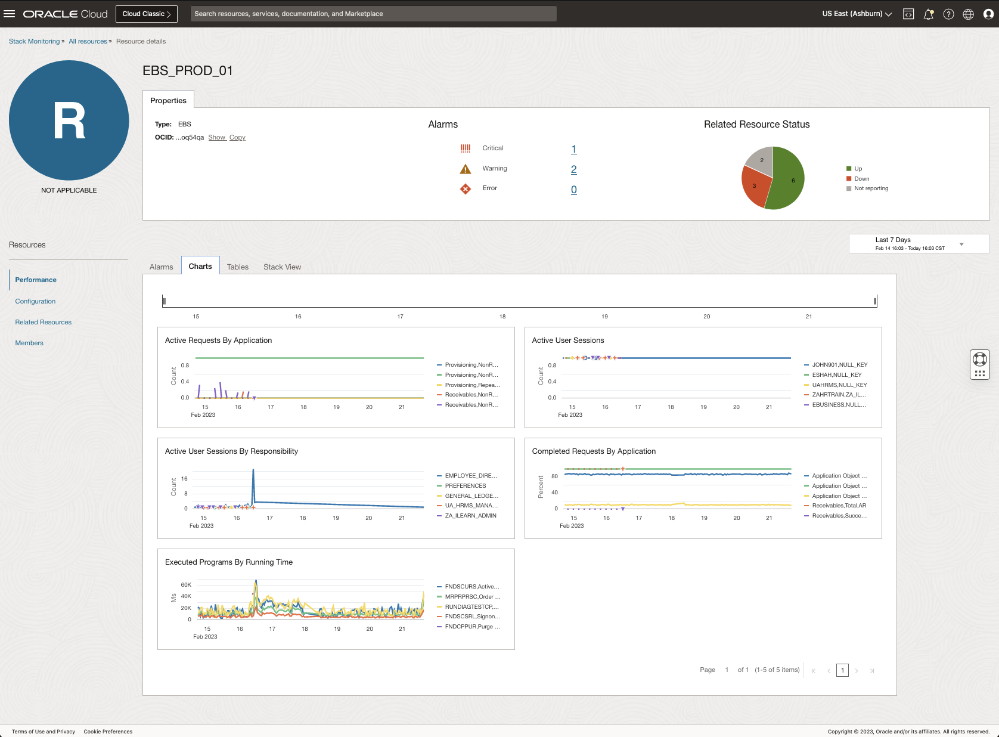

3.	The **Stack View**

	Having reviewed EBS application specific metrics, let's investigate the entire EBS application stack using the **Stack View**. Click the **Stack View** tab. 

	The Stack View provides a holistic perspective of key performance metrics across an entire application and application stack technologies, a differentiated capability of Stack Monitoring. Within Stack View, you can observe an application including its key underlying components and technology stack all together in one place.

	Stack View provides specially curated key performance metrics for the health and performance of the entire application - in this example EBS. Locate the tab **Stack View** from the menu. Begin by again adjusting the time frame from the **Last 60 Minutes** to **Last 24 Hours**. Now expand each tier. With each tier expanded, you get a complete view of the performance of your EBS application.

	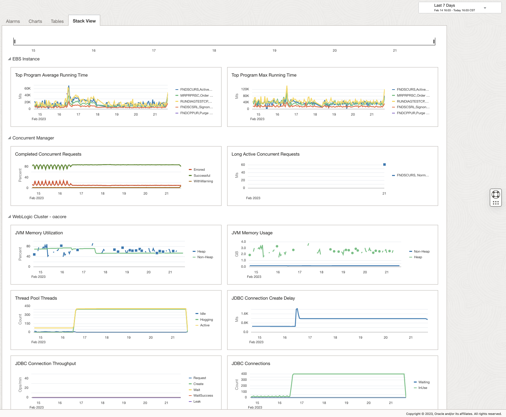

	EBS admins typically have an idea of the time it takes for a request to complete, and which requests run long. You can hover over a data point and perform correlation across the charts on the page. Reviewing the **EBS tier** you can review the five worst programs by average running time and max running time. Within the **Concurrent Manager tier**, you can review the percentage of requests that have errored, as well as review long active concurrent requests.

	As EBS is a Java application, Stack Monitoring provides greater detail into the performance of the WebLogic (WLS) cluster, specifically OACORE, the heart of EBS. Using the chart **JVM Memory Utilization** you can identify if WLS is starved for memory. Or quickly identify if there are a large number of hogging threads using **Thread Pool Threads** or review the number of threads waiting using the **JDBC Connections** chart.

	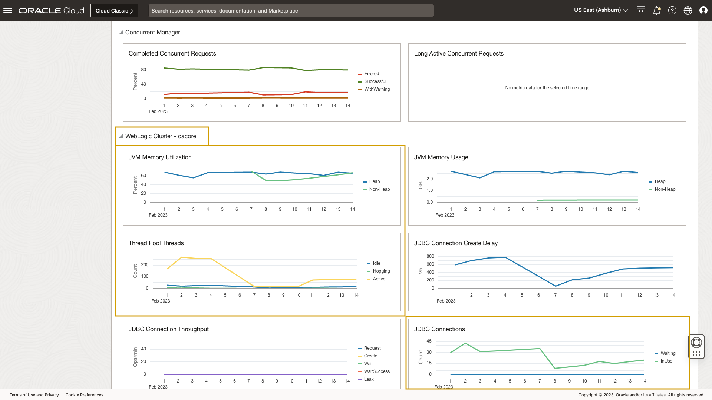

	Reviewing the **EBS Database tier**, you can review the number of transactions committed and rolled back. You can see the count of rolled back sessions is quite low and that transaction wait times across dimensions remains low as well.
	
	Finally, you can review the health of the EBS hosts. In this screenshot you can see the **CPU Utilization** spiked around 9am.

	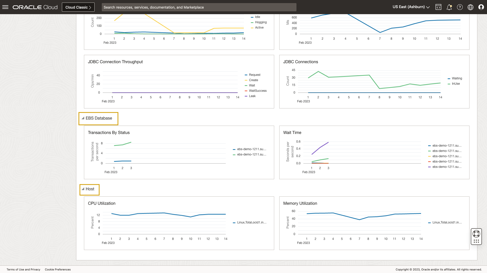
	
	In this lab, you used a previously created alarm to alert if any concurrent manager jobs completed with errors. During it, you reviewed key performance metrics across an applications stack. You utilized Stack Monitoring's topology capability to navigate between resources to help triage the alert. Finally, you leveraged Stack View to review the performance of an entire application stack (EBS).

## Conclusion

Overall, you have learned how Stack Monitoring enables you to monitor the overall health of your applications and their underlying stack including servers, databases, and hosts. You reviewed how the Enterprise Summary can be used to immediately assess status and performance across each application stack tier, and its interactive design enables dynamic changes to any performance charts. Resource homepages provide you with a curated view of the health and performance of resources through charts, tables, and Stack View. You learned how Stack Monitoring can automatically provide an application topology automatically when discovering applications. The associations between resources further enables easy navigation up and down the application stack to ease and speed up the triaging and remediation of application performance issues. And finally, you learned how the Stack View provides the ability to research the health and performance of the entire application stack from a single page to reduced incident times. 

For more information and full range of capabilities of the APM Stack Monitoring solution, view the OCI **[Stack Monitoring](https://docs.oracle.com/en-us/iaas/stack-monitoring/index.html)** Documentation.

## Acknowledgements

* **Author** - Aaron Rimel, Principal Product Manager, Enterprise and Cloud Manageability
- **Contributors** - Ana McCollum, Senior Director of Product Management, Enterprise and Cloud Manageability,
- Steven Lemme, Senior Principal Product Manager,
Anand Prabhu, Sr. Member of Technical Staff
* **Last Updated By/Date** - Aaron Rimel, February 2023
