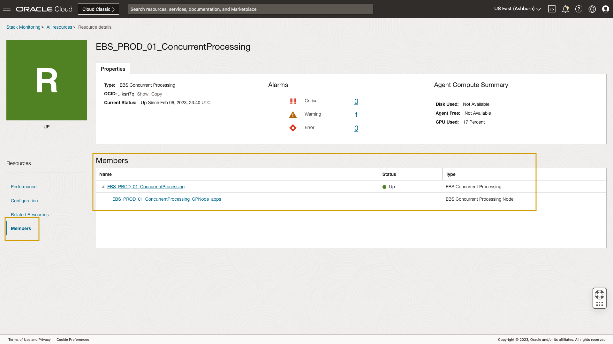

# Stack Monitoring's Resource Homepages

## Introduction

In this lab, you will become familiar with a resource's homepage. 

Estimated time: 15 minutes

### Objectives

* Become familiar with the layout of a resource homepage
* Review Performance menu including, alarms, charts, tables, and Stack View
* Review configuration details of the resource
* Identifying relationships between resources.
* Putting it all together
* Review a composite homepage
* Review Stack View

### Prerequisites

* Completion of the first lab

## Task 1: Become familiar with the layout of a resource homepage

1. Open the navigation menu in the Oracle Cloud console, select **Observability & Management** > **Stack Monitoring** under **Application Performance Monitoring**.

	

2. Navigate to a **Concurrent Manager** resource.

	The Enterprise Summary page opens. In the last lesson we discussed when you are troubleshooting, the Enterprise Summary provides quick insight into the performance of your resources at a glance. Located on the E-Business Suite (EBS) tier, the **Concurrent Manager requests** chart provides visibility into all concurrent managers in your enterprise. Should a concurrent manager need to be investigated further, such as the percentage of completed concurrent requests are low, navigating to that resource's homepage is easy. Let's click the dot within the **Concurrent Manager requests** chart to investigate. 

	

3. Resource homepages

	With the Concurrent Manager homepage loaded, we can easily review the health and performance of this resource. Stack Monitoring homepages have a consistent look and feel across all resource types. Each resource homepage is provided out-of-the-box immediately upon discovery of the resource. At the top of the page, Stack Monitoring reports the current status, (Up, Down, Not Reporting, Not Applicable). The color and shape of the status indicator will update depending on the resource status and type. Should you find a resource in a down state, the homepage will display a large **red** box with the status of **Down**. Stack Monitoring also provides a **Current Status** date and time. This allows you to quickly see at one time the resource went down.

	We can see a count of open alarms by severity, clicking an alarm count will open the Alarms tab below. We'll cover alarms when we discuss the **Alarms** tab in more detail later. Stack Monitoring also includes performance metrics of the agent monitoring the resource. Should a resource be monitored by a remote agent, agent compute performance can help identify metric reporting issues.

	

## Task 2: Performance Menu

1. Review performance charts

	When you navigate to a resource from the Enterprise Summary charts and tables, the homepage loads the **Charts** tab by default. A concurrent manager homepage provides a list of charts specially curated to the concurrent manger. These metrics are collected out-of-the-box and immediately begin collecting after the resource is discovered. By default the **Last 60 Minutes** is displayed. When investigating issues it may be good to see the performance change over a larger time period. To extend the time-frame click the drop-down and choose **Last 24 Hours**. All charts will now display data from the last 24 hours. Let's imagine we identify an area of concern within the **Concurrent Requests by Status**, hovering over a point-in-time within that chart will display the metric, dimension, timestamp, and value. Stack Monitoring will also show metric details of every other chart on the page during that timestamp. Should you identify an area of concern, highlighting the metric gives insight to the value of all other metrics on the page at the same time, in an effort to correlate the issue with other metrics. Charts provide the five highest or most utilized dimensions of a metric. Placing a large number of dimensions on a single chart can get too busy. To address this Stack Monitoring provides all dimensions of a metric in **Tables**. Let's navigate to tables to see all of the data points.

	

2. Review metric tables

	Select the **Tables** tab. Tables provide the latest collection value of every metric across all dimensions. Let's review **Concurrent Requests By Status**. Click the **triangle** to expand the table. Here we can see the metric value for every dimension of the metric **Concurrent Requests By Status** (i.e. Scheduled, Running, PendingStandBy, PendingNormal, InactiveOnHold, and InactiveNoManager). 

	

3. Review open alarms

	Select the **Alarms** tab. From the **Alarms** menu we can see a detailed list of open alarms that includes the alarm Name, Severity, and Last Triggered date/time. Clicking an alarm **Name** will open a new tab in your browser to investigate and work the alarm within Oracle Cloud Infrastructure's monitoring service. We'll review this workflow later in this lesson. For now, let's review configuration details of a resource.

	

## Task 3: Easily review a resource's implementation details using **Configuration**

1. Locate **Configuration** in the left menu of the homepage.

	Configuration provides quick access to both general OCI properties and resource-specific properties. Examples of resource properties include database service_name, the application schema name, as well as the installation location. Now let's learn about relationships within Stack Monitoring.

## Task 4: Identifying a resource's relationships

1. Locate **Members** under the Resources menu on the left side of the homepage.

	**Members** are resources that **Contain** another resource. A Concurrent Processor **contains** a concurrent processing node. We can see that relationship here. When reviewing the performance charts, should a performance issue be identified, using a relationship link, such as Concurrent Processing Node, allows easy access up and down the application stack. We'll cover this a more detail later. Now lets review all relationships with this concurrent manager.

	

2. Locate **Related Resources** under the Resources menu on the left side of the homepage.

	Locate **Related Resources** in the left menu. Clicking **Related Resource** provides quick access to all relationships between resources with a direct relationship. We can easily identify which management agent monitors this concurrent manager. We again can see the concurrent manager processing node that runs within this concurrent manager. Finally we can easily identify the EBS Application this concurrent manager belongs to. Now let's put it all together.

## Task 5: Putting it all together

1. Identify an alarm
	Let's begin by clicking the count of open alarms in a **Warning** state at the top of the homepage. With the alarms tab opened, we can see an open alarm **Concurrent Manager Completed Request Count Low**. Clicking the alarm name opens a new tab in the OCI notification service. From this page we see this alarm is not flapping and has been active for quite some time. Let's close the tab and return to Stack Monitoring.

	Let's review the chart associated to this alarm by clicking the **Charts** tab. Once the page loads, find the chart **Completed Concurrent Requests**. Now let's expand the charts to show the **Last 14 Days**. We can see the percentage of requests that **Errored** has remained relatively stable. Now let's continue the investigation by reviewing the overall health and performance of the entire EBS application stack.

	To navigate to the EBS application, click **Related Resources**. Once the page loads, locate the resource **EBS_PROD_01** with the type **EBS**. Click the name of the resource **EBS_PROD_01** to navigate to the application's homepage.

3. Reviewing an EBS composite homepage

	Once the EBS homepage loads, we can see that an EBS homepage is very similar to a standard resource homepage with a few exceptions. Properties again show the type of resource and the OCID. Since EBS itself does not have a status, we do not see a **Current Status** date and time. Instead of reporting the agent's performance, here we see an overall availability of resources related to this EBS application. Stack Monitoring again provides a summary of alarms by severity. 

	

	In the previous task we reviewed the **Alarms** tab. The alarms shown in the EBS homepage includes both the open alarms for the EBS application itself, but also includes open alarms for its' members. The EBS homepage you can see a roll-up of all alarms for EBS and it's members, without navigating to multiple homepages. Here we can see the same alarm we  investigated within the Concurrent Manager homepage. 

	

	Clicking **Charts** loads a unique set of metrics related specifically to monitoring an EBS application. We can continue our previous investigation by expanding the chart time displayed by again expanding from **Last 60 Minutes** to **Last 14 Days**. From this page nothing appears to standout as a cause for high number of jobs that have errored. Since we have already covered tables, let's move on to Stack View.

	

4.	Selecting the **Stack View** tab loads a unique feature to Stack Monitoring, the **Stack View**.

	Locate the tab **Stack View** from the available menu items. **Stack View** combines resource specific charts all in one place and is provided to you out-of-the-box. Let's begin by expanding the time frame from **Last 60 Minutes** to **Last 14 Days**. With the time frame expanded, let's expand each tier. I have found if you expand **Host** first and work your way up the page, this will remove the need to scroll. With each tier expanded, you can now get a holistic view of the performance of your EBS application.  

	Beginning with the **EBS Instance**, we can review and identify the amount of time various programs took to complete. Looking back we can identify if a particular program or several programs took longer to complete. Reviewing the **Concurrent Manager** tier, we again see same chart we reviewed within the concurrent manager's homepage, **Completed Concurrent Requests**. Since EBS is a java application, Stack Monitoring provides details into the performance of the WebLogic (WLS)cluster, specifically OACORE, the heart of EBS. Using our alarm example of **Concurrent Manager Completed Request Count Low**, we can use the WebLogic tier to determine if WLS is contributing the errored program runs. From within this tier we can see that JVM Memory, both heap and non-heap, utilization is not at 100%. The number of active thread pool threads that are hogging are low. And finally, there does not seem to be any waiting JDBC Connections. Based on this information WLS does not appear to have contributed to the errored programs.

	Reviewing the **EBS Database** tier, we can review the number of transactions committed and rolled back. The count of rolled back sessions is quite low. Additionally, transaction wait times across dimensions remains low as well. As a result, the database does not appear to be spending much time waiting.

	Finally, we can review the health of the EBS hosts. Both the hosts CPU and memory are well below their maximum, thus ruling out host as a contributing factor. Based on the review of the EBS application stack using Stack View, we can rule out the application and infrastructure components as the cause of the errored programs.

	

In this lab we learned about a resource's homepage. While homepages have a consistent look and feel, an application homepage has a couple unique features. To learn about these unique traits **proceed to the next lab on Stack View**.

## Acknowledgements

* **Author** - Aaron Rimel, Principal Product Manager, Enterprise and Cloud Manageability
- **Contributors** - Ana McCollum, Senior Director of Product Management, Enterprise and Cloud Manageability
* **Last Updated By/Date** - Aaron Rimel, February 2023
