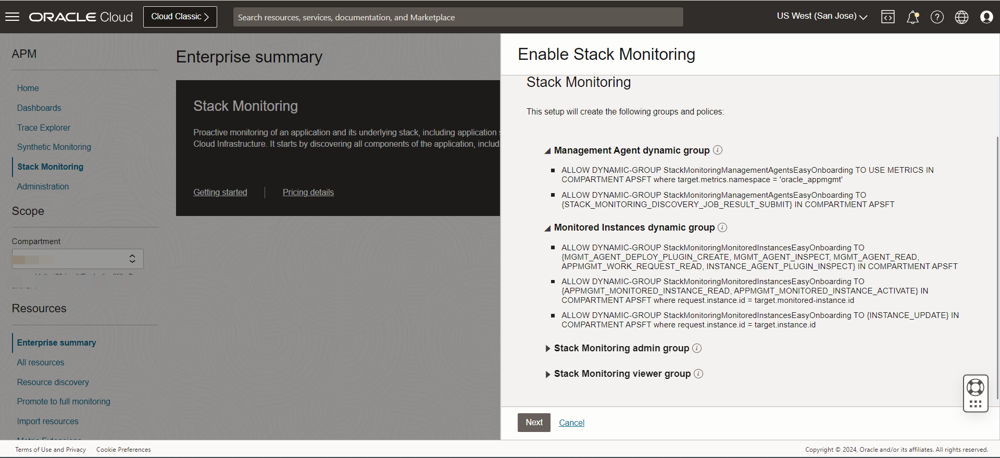
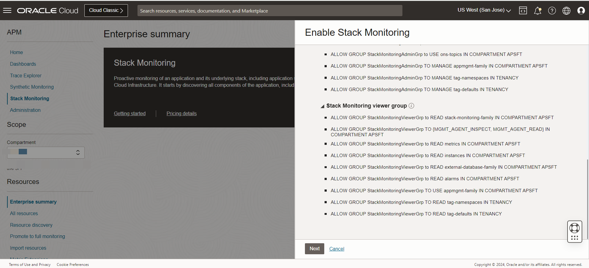
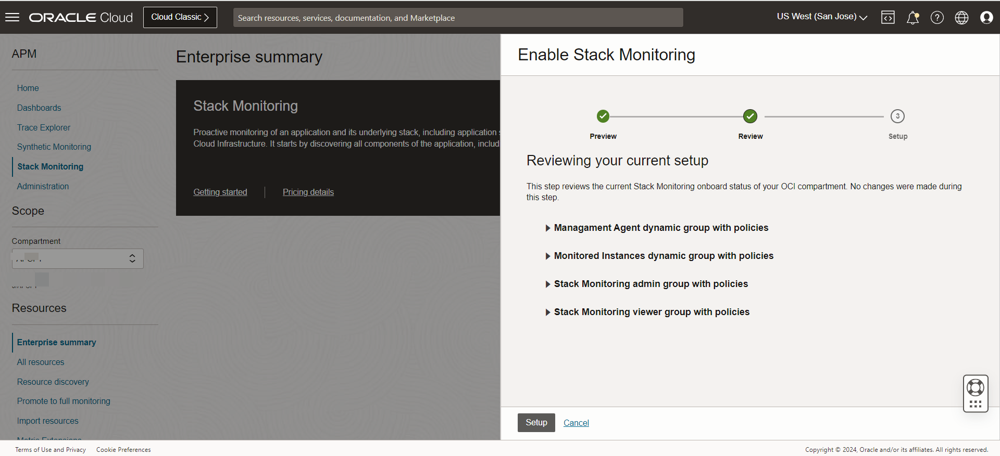
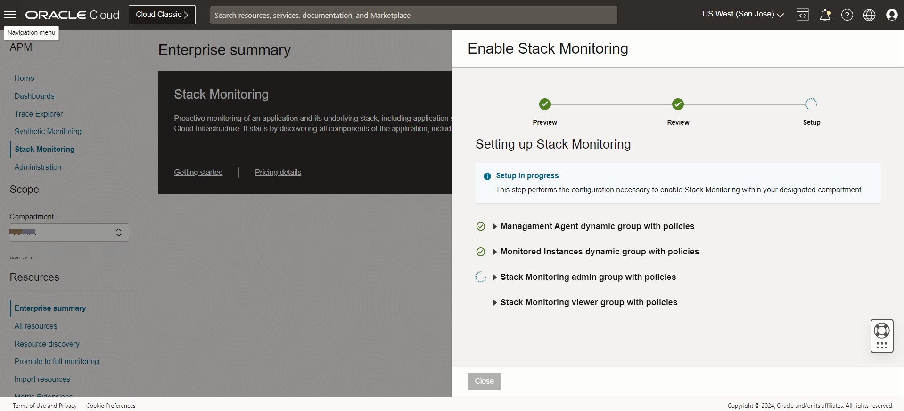
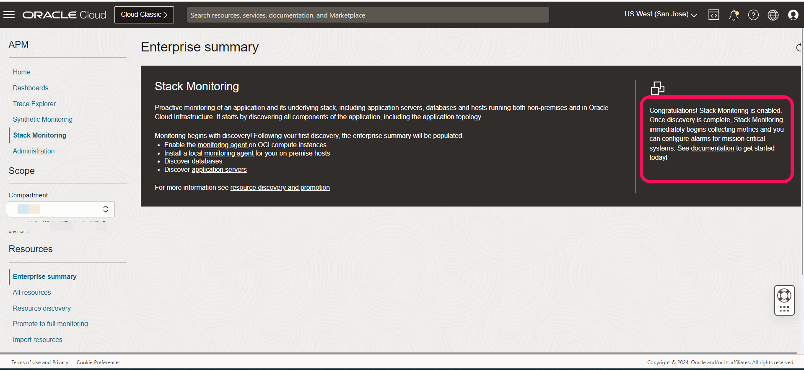

# Easy On-Boarding

## Introduction

In this lab, we would be using the easy on-boarding process in Stack Monitoring to create all the required OCI resources. This is a quick setup process which will create the standard users, groups, policies, dynamic groups.

**Important** : If you are following this lab and creating all the required services using the stack monitoring UI, you may skip the lab 2. The Lab 2 is based on the manual process of creating the resources.

Estimated Time: 10 minutes

### Objectives

To set up the required profile on the OCI tenancy, you will use the Easy On-boarding option within Stack Monitoring.

### Prerequisites

* A user with administrator access to auto create profiles, policies, groups & dynamic groups.

## Task 1: Setup Easy On-boarding

1.  Log into your OCI tenancy by clicking the OCI URL. Using San Jose as an example,
 go to https://console.us-sanjose-1.oraclecloud.com.

2.  On the Oracle Cloud Infrastructure Console Home page, click the Navigation Menu in the upper-left corner, select Observability & Management, and then click on Stack Monitoring.

  

3.  On the Stack Monitoring user page, make sure to select the specific compartment where the service needs to be enabled and select Enable Stack Monitoring option on the screen.

    
    

    

4.	To understand more on the resources being created, expand the preview section to see the list of groups & policies being created

    
    
    

    click next to proceed.

5.  During this review process, stack monitoring will evaluate the current onboarding status of your environment. If any of the users or groups already exist, Stack Monitoring will inform if the requirement already exists and will be skipped. Select Setup to complete the on-board process.

    

   Resource creation is started and it hardly takes a few seconds.

    

   Resource creation completed.

    

   click close.

   On successful resource creation, a confirmation screen appears.

    

## Summary

  In this lab, we used the easy on-boarding feature in stack monitoring to create all the required resources.

You may now **proceed to the next lab.**

## Acknowledgements

* **Authors** - Deepak Kumar M, Principal Cloud Architect
* **Contributors** -

    * Aaron Rimel, Principal Product Manager
    * Devashish Bhargava, Principal Cloud Architect
* **Last Updated By/Date** - Deepak Kumar M, Principal Cloud Architect, February 2024

