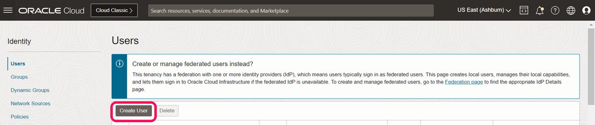
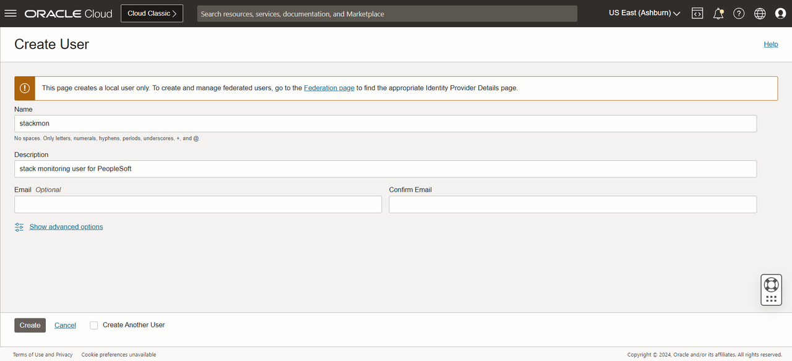
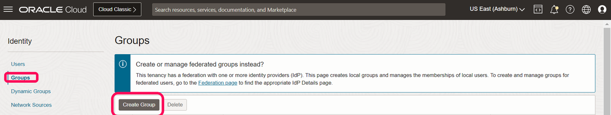
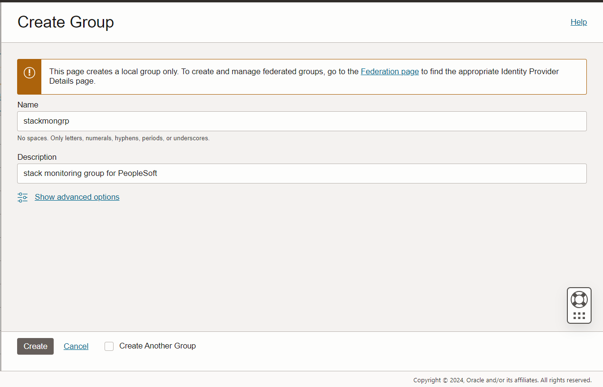
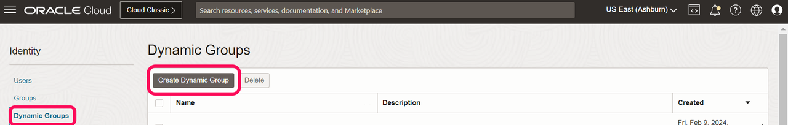
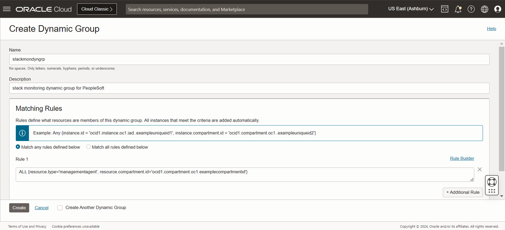
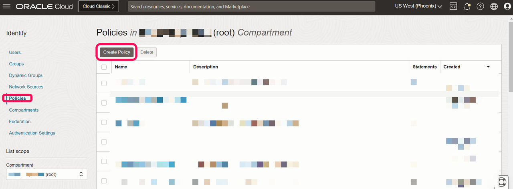
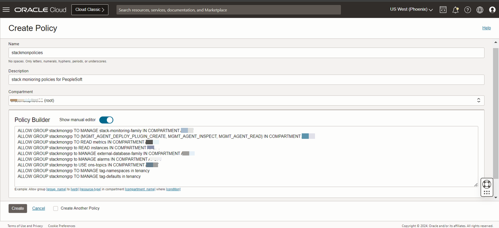

# Set Up OCI User, Policies, Groups 

## Introduction

This process is followed when customers want to setup their own group,policy,dynamic group.

In this lab, we'll provision the required OCI service requirements as part of resource discovery and monitoring. We will create a user, groups, policies and also add dynamic groups.


Estimated Time: 20 minutes


### Objectives

To set up the required profile on the OCI tenancy, you will:

*  Create a local user account
*  Create a group
*  Create policies
*  Create dynamic groups


### Prerequisites

* A user with administrator access to create, add new user profiles and assign the required policies, groups.


## Task 1: Create a local user account & group

In this part of the lab, we begin with creating a local user account

When your tenancy is provisioned, a root compartment is created for you. Your root compartment holds ***all*** of your cloud resources

1.  If you haven't already, log into your OCI tenancy by clicking the button below. Using Phoenix as an example, go to https://console.us-phoenix-1.oraclecloud.com.

2.  On the Oracle Cloud Infrastructure Console Home page, click the Navigation Menu in the upper-left corner, select Identity & Security, and then select Users.

  

3.  On the OCI Users page,  click on the create user button

    
    


4.	Give a name for the user and also add description about the user.

  
  


5.  On the same Identity page, click on groups and then click create groups.

  

6.  Give a name for the group and also add description about the group.

  


## Task 2:  Create a dynamic user group & policies

In this part of the lab, we will add a dynamic group and create policies which will be assigned to both dynamic group and group created as part of the Task1.

1.  On the same Identity page, click on dynamic group and then click create dynamic group.

  

    Give a name and description for the dynamic group and a matching rule is required to be added to the dynamic group.The rule is added as per the screenshot. The compartment id needs to be specified, where we are actually going to enable the stack monitoring.


  
    
    Code snippet of the matching rule:
    
      ```
      <copy>
      ALL {resource.type='managementagent', resource.compartment.id='ocid1.compartment.oc1.examplecompartmentid'}
      </copy>
      ```

2.  On the same Identity page, click on Policies, select the root compartment and click create policy button

   

    Give a name and description for the Policy, select the root compartment and select show manual editor and paste the policies and hit create button.
  
  
    
    Complete list of policies added including dynamic group policies

      ```
      <copy>
      ALLOW GROUP stackmongrp TO MANAGE stack-monitoring-family IN COMPARTMENT 'compartment-name'
      ALLOW GROUP stackmongrp TO MANAGE stack-monitoring-family IN COMPARTMENT 'compartment-name'
      ALLOW GROUP stackmongrp TO {MGMT_AGENT_DEPLOY_PLUGIN_CREATE, MGMT_AGENT_INSPECT, MGMT_AGENT_READ} IN COMPARTMENT 'compartment-name'
      ALLOW GROUP stackmongrp TO READ metrics IN COMPARTMENT 'compartment-name'
      ALLOW GROUP stackmongrp to READ instances IN COMPARTMENT 'compartment-name'
      ALLOW GROUP stackmongrp to MANAGE external-database-family IN COMPARTMENT 'compartment-name'
      ALLOW GROUP stackmongrp to MANAGE alarms IN COMPARTMENT 'compartment-name'
      ALLOW GROUP stackmongrp TO READ ALARMS IN COMPARTMENT 'compartment-name'
      ALLOW GROUP stackmongrp TO READ USERS IN COMPARTMENT 'compartment-name'
      ALLOW GROUP stackmongrp to USE ons-topics IN COMPARTMENT 'compartment-name'
      ALLOW GROUP stackmongrp TO MANAGE tag-namespaces in tenancy
      ALLOW GROUP stackmongrp TO MANAGE tag-defaults in tenancy
      ALLOW GROUP stackmongrp TO {STACK_MONITORING_DISCOVERY_JOB_CREATE, STACK_MONITORING_DISCOVERY_JOB_READ,STACK_MONITORING_DISCOVERY_JOB_DELETE, STACK_MONITORING_DISCOVERY_JOB_INSPECT, STACK_MONITORING_DISCOVERY_JOB_RESULT_SUBMIT} IN COMPARTMENT 'compartment-name'
      ALLOW GROUP stackmongrp  TO READ instance-agent-plugins IN COMPARTMENT 'compartment-name'
      ALLOW GROUP stackmongrp TO MANAGE appmgmt-family IN TENANCY
      ALLOW DYNAMIC-GROUP stackmondyngrp TO USE METRICS IN COMPARTMENT 'compartment-name' where target.metrics.namespace = 'oracle_appmgmt'
      ALLOW DYNAMIC-GROUP stackmondyngrp TO {STACK_MONITORING_DISCOVERY_JOB_RESULT_SUBMIT} IN COMPARTMENT 'compartment-name'
      ALLOW DYNAMIC-GROUP stackmondyngrp TO USE METRICS IN COMPARTMENT 'compartment-name' where target.metrics.namespace = 'oci_oracle_database_cluster'
      ALLOW DYNAMIC-GROUP stackmondyngrp TO {STACK_MONITORING_DISCOVERY_JOB_CREATE,STACK_MONITORING_DISCOVERY_JOB_READ,STACK_MONITORING_DISCOVERY_JOB_DELETE,STACK_MONITORING_DISCOVERY_JOB_INSPECT,STACK_MONITORING_DISCOVERY_JOB_RESULT_SUBMIT} IN COMPARTMENT 'compartment-name'
      ALLOW DYNAMIC-GROUP stackmondyngrp TO MANAGE management-agents IN COMPARTMENT 'compartment-name'
      ALLOW DYNAMIC-GROUP stackmondyngrp TO USE METRICS IN COMPARTMENT 'compartment-name'
      ALLOW DYNAMIC-GROUP stackmondyngrp TO MANAGE stack-monitoring-family IN COMPARTMENT 'compartment-name'
      ALLOW DYNAMIC-GROUP stackmondyngrp TO MANAGE appmgmt-family IN COMPARTMENT 'compartment-name'
      ALLOW DYNAMIC-GROUP stackmondyngrp TO MANAGE management-dashboard-family IN COMPARTMENT 'compartment-name'
      ALLOW DYNAMIC-GROUP stackmondyngrp TO READ all-resources in COMPARTMENT 'compartment-name'
      ALLOW DYNAMIC-GROUP stackmondyngrp TO MANAGE object-family in COMPARTMENT 'compartment-name'
      ALLOW DYNAMIC-GROUP stackmondyngrp TO MANAGE buckets IN COMPARTMENT 'compartment-name' where request.principal.type ='managementagent'
      ALLOW DYNAMIC-GROUP stackmondyngrp TO MANAGE appmgmt-family in TENANCY
      </copy>
      ```


  **Important:** For this workshop, for the sake of simplicity, we have created a single user,group, dynamic group and  policies. For actual Production implementation, customers can segregrate into multiple groups assgined for different set of users managaing the infrastructue. Refer to link [here]( https://docs.oracle.com/en-us/iaas/stack-monitoring/doc/service-requirements.html) for more details.
  
  

    
     


## Summary

  In this lab, profile creation of OCI user along with polices, groups and dynamic groups were created and configured.

You may now **proceed to the next lab.**

## Acknowledgements

* **Authors** - Deepak Kumar M, Principal Cloud Architect
* **Contributors** -

    * Aaron Rimel, Principal Product Manager
    * Devashish Bhargava, Principal Cloud Architect
* **Last Updated By/Date** - Deepak Kumar M, Principal Cloud Architect, February 2024


