# Prerequisites to Configure PeopleSoft Application

## Introduction

You will configure PeopleSoft application for easy discovery using Stack Monitoring.

Estimated Time: 1 hour

### Objectives

To configure PeopleSoft with Stack Monitoring, you will:

* DB Grant Privileges for PeopleSoft Monitoring
* Configure Application Server
* Configure Process Scheduler Server
* Configure WebServer


### Prerequisites

*  PeopleSoft admin user to configure application server &  process scheduler server.
*  PeopleSoft database monitoring user with read only access to PeopleSoft schema tables.
*  PeopleSoft Weblogic monitor user profile enabled for PIA weblogic configuration.
.


## Task 1:  DB Grant Privileges for PeopleSoft Monitoring

As part of this workshop, we will be using the standard DBSNMP user profile within Oracle Database for monitoring of the PeopleSoft application. Customers can choose to create a new monitoring user profile and assign necessary privileges.

*Important*: To verify the monitoring user has the necessary grants, and apply any missing grants, execute the following PeopleSoft Scripts [here](https://www.oracle.com/webfolder/technetwork/manageability/stackmon/Stack_Monitoring_PeopleSoft_Scripts.zip). This approach is recommended as it checks for permissions and missing grants.

In case, customers want to manually apply all the grants, they can follow the below process, copy the scripts and execute.

1. Login to PeopleSoft server and connect to the Oracle Database, we need to connect to either the PDB or the CDB where the the application schema resides and provide the necessary privileges to the DBSNP user.
Using SYS user, execute the below sql commands to grant necessary priviliges to the DBSNP user.


      ```
      <copy>
        
      GRANT SELECT ON SYSADM.PSSTATUS TO dbsnmp;
      GRANT SELECT ON SYSADM.PSRELEASE TO dbsnmp;
      GRANT SELECT ON SYSADM.PSPMAGENT TO dbsnmp;
      GRANT SELECT ON SYSADM.PS_PTPMJMXUSER TO dbsnmp;
      GRANT SELECT ON SYSADM.PSIBWSDLDFN TO dbsnmp;
      GRANT SELECT ON SYSADM.PSIBSVCSETUP TO dbsnmp;
      GRANT SELECT ON SYSADM.PS_PTSF_SRCH_ENGN TO dbsnmp;
      GRANT SELECT ON SYSADM.PSPRCSRQST TO dbsnmp; 
      GRANT SELECT ON SYSADM.PSXLATITEM TO dbsnmp; 
      CREATE OR REPLACE SYNONYM dbsnmp.PSSTATUS FOR SYSADM.PSSTATUS;
      CREATE OR REPLACE SYNONYM dbsnmp.PSRELEASE FOR SYSADM.PSRELEASE;
      CREATE OR REPLACE SYNONYM dbsnmp.PSPMAGENT FOR SYSADM.PSPMAGENT;
      CREATE OR REPLACE SYNONYM dbsnmp.PS_PTPMJMXUSER FOR SYSADM.PS_PTPMJMXUSER;
      CREATE OR REPLACE SYNONYM dbsnmp.PSIBWSDLDFN FOR SYSADM.PSIBWSDLDFN;
      CREATE OR REPLACE SYNONYM dbsnmp.PSIBSVCSETUP FOR SYSADM.PSIBSVCSETUP;
      CREATE OR REPLACE SYNONYM dbsnmp.PS_PTSF_SRCH_ENGN FOR SYSADM.PS_PTSF_SRCH_ENGN;
      CREATE OR REPLACE SYNONYM dbsnmp.PSPRCSRQST FOR SYSADM.PSPRCSRQST; 
      CREATE OR REPLACE SYNONYM dbsnmp.PSXLATITEM FOR SYSADM.PSXLATITEM;
      
      </copy>
      ```


## Task 2: Configure Application Server

1. Login to PeopleSoft server as psadm2 or application domain user and edit the psappsrv.cfg configuration file. or type psadmin and follow the below process to edit the psappsrv.cfg file and change the necessary parameters.

  Type psadmin and follow the screen prompt.

  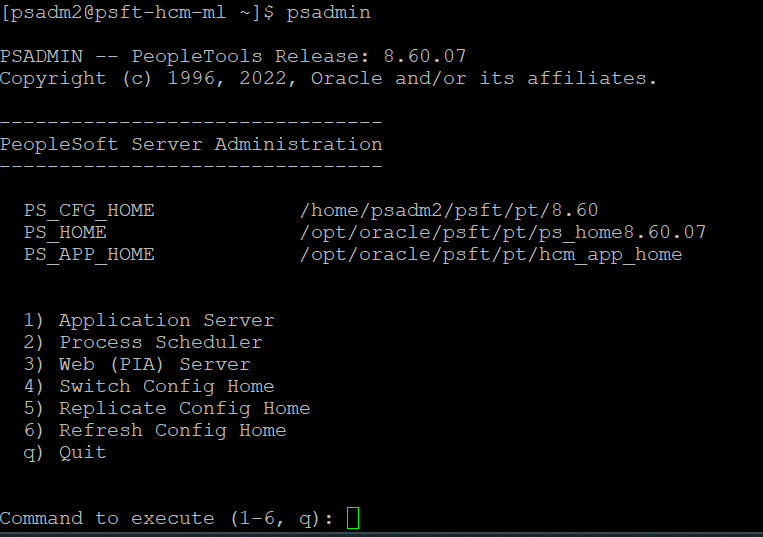


  Type 1 and select Application server

    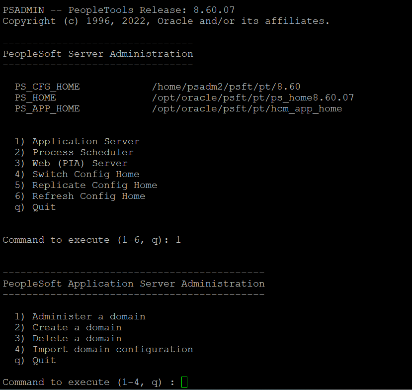

  Type 1 again and select Administer a domain

    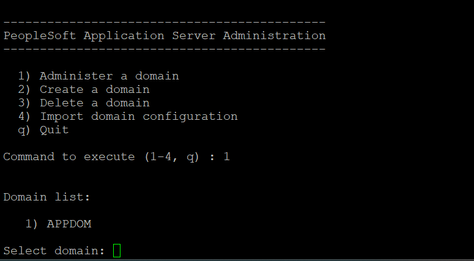

  Select the application server domain for which  configuration has to be done, in this case we are selecting APPDOM.

    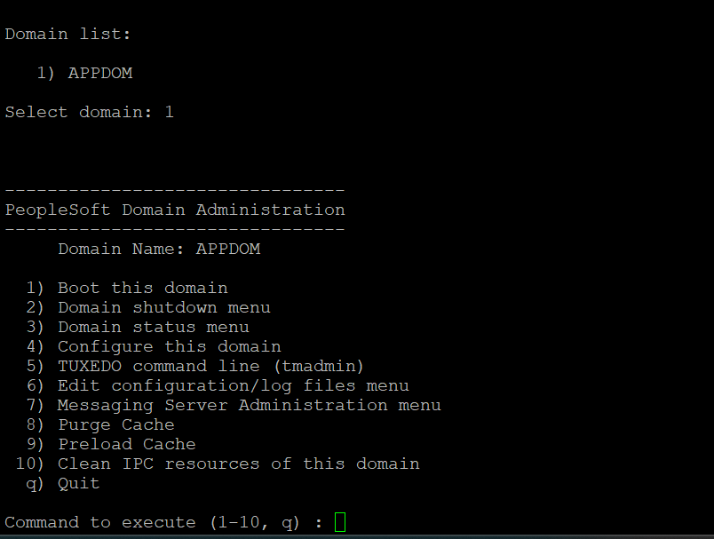


  Type 4 - Configure this domain and select  Y for  domain shutdown. This will shutdown the Application server domain.

    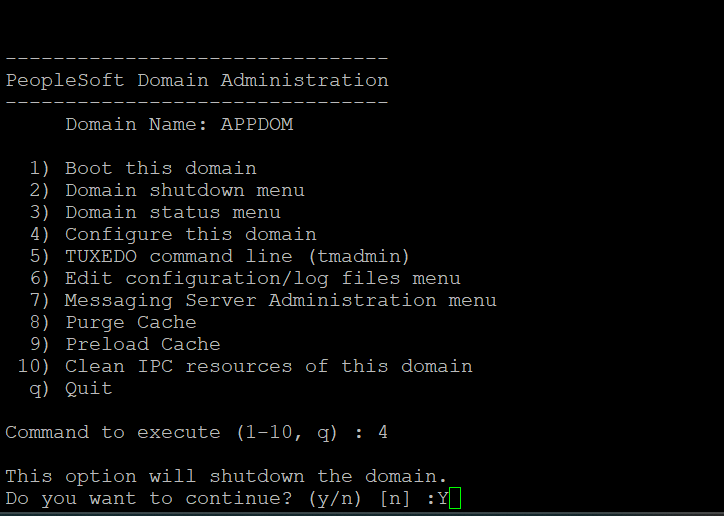


  Once the application server is down and the quick configuration menu shows up, 
  
  Type 10 to enable the Performance Collator Property and then select option 15 - Custom configuration and hit enter

  This option will shutdown Application server.Do you want to continue, hit Y

    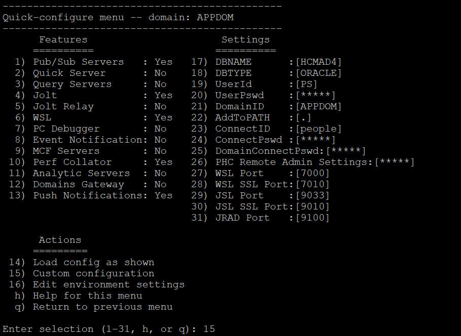

  
  Keep hitting enter  button and look for the section   **Values for config section - PSTOOLS**

  Select y and modify the current configuration and update the below values

      ```
      <copy>

      Enable Remote Administration=1
      Remote Administration Port=10100
      Remote Administration RMI Server Port=10101  
      Remote Administration UserId=<username>
      Remote Administration Password=<password>
      EnablePPM Agent=1

      ```
      </copy>

      Remote Administration RMI Server Port=10101  (**Available from PSFT version 8.60+)

  Make sure to provide a username and password as the current configuration already has a default username/password set. Keep in mind to update the same user credentials on all the application server domains configured for the environment.RMI port & RMI Server port are to be unique across the domains for the environment.

  Once the changes are done, keep hitting enter  button and this will bring back to the domain administration page, now type 1 and start the application server domain.


    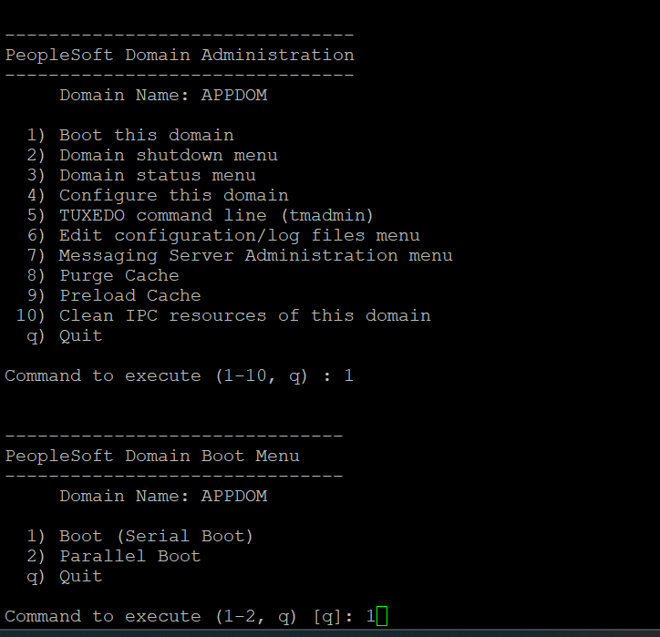


## Task 3: Configure Process Scheduler Server

1. Login to PeopleSoft server as psadm2 or application domain user and edit the psprcs.cfg configuration file. or type psadmin and follow the below process to edit the psprcs.cfg file and change the necessary parameters.

  Type psadmin and follow the screen prompt.

  


  Type 2 and select  Process Scheduler

    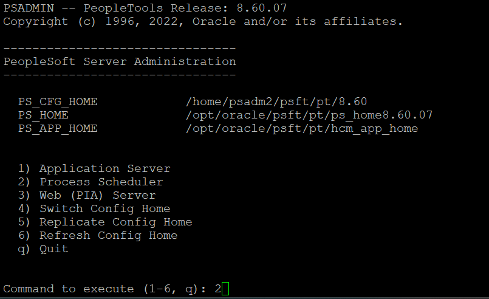

  Type 1 again and select Administer a domain

    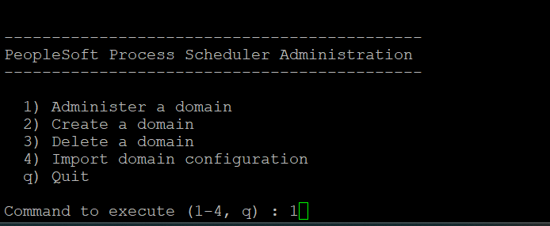

  Select the process scheduler server domain for which configuration has to be done, in this case we are selecting PRCSDOM.

    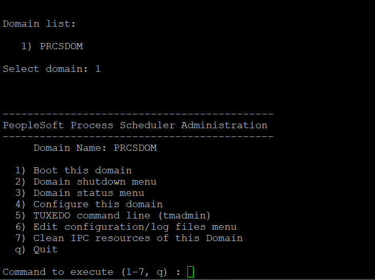


  Type 4 - Configure this domain and select  Y for  domain shutdown. This will shutdown the process scheduler server domain.

    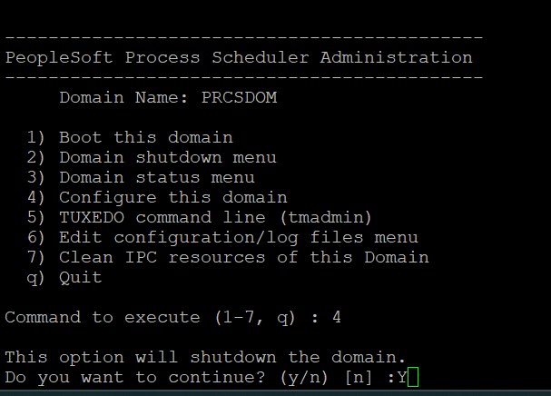


  Once the process scheduler server is down and the quick configuration menu shows up, 
  
  Type 3 to enable the Performance Collator Property and then select option 8 - Custom configuration and hit enter.
  This option will shutdown Process Scheduler.Do you want to continue, hit Y

    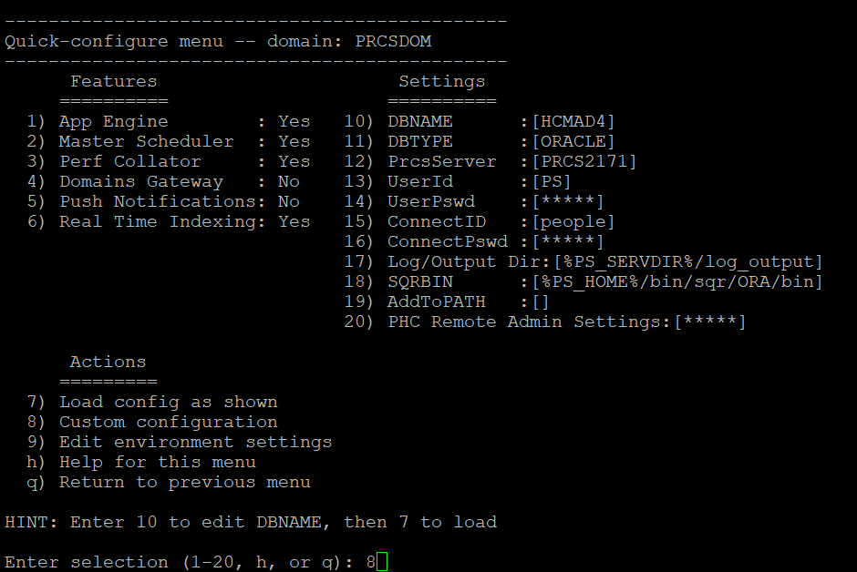

  
  Keep hitting enter  button and look for the section   **Values for config section - PSTOOLS**

  Select y and modify the current configuration and update the below values

      ```
      <copy>

      Enable Remote Administration=1
      Remote Administration Port=10200
      Remote Administration RMI Server Port=10201  
      Remote Administration UserId=<username>
      Remote Administration Password=<password>
      EnablePPM Agent=1

      ```
      </copy>

      Remote Administration RMI Server Port=10201  (**Available from PSFT version 8.60+)

  Make sure to provide a username and password as the current configuration already has a default username/password set. Keep in mind to update the same user credentials on all the process scheduler server domains configured for the environment. RMI port & RMI Server port are to be unique across the domains for the environment.

  Once the changes are done, keep hitting enter  button and this will bring back to the domain administration page, now type 1 and start the process scheduler server domain.


    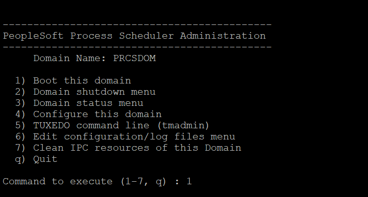


## Task 4: Configure WebServer


1. Enable PeopleSoft Performance Monitor for PIA by navigating to the following PIA link

 Navigate to PeopleTools > Web Profile > Web Profile Configuration > Open the default WebProfile. Under General Tab make sure Enable PPM Agent check box is selected. Restart all the PIA domains.


2. Enable Tunneling from Oracle Weblogic console

  Using PeopleSoft system weblogic user or admin user, login and navifate to the following weblogic console link

 Login with admin user, expand Environment > Servers > Click PIA(admin), Go to Protocol tab > HTTP > enable the Enable Tunneling checkbox and save.


## Summary

In this lab, you have configured PeopleSoft server domains for discovery within Stack Monitoring.

You may now **proceed to the next lab.**


## Acknowledgements

* **Authors** - Deepak Kumar M, Principal Cloud Architect
* **Contributors** -

    * Aaron Rimel, Principal Product Manager
    * Devashish Bhargava, Principal Cloud Architect
* **Last Updated By/Date** - Deepak Kumar M, Principal Cloud Architect, February 2024


