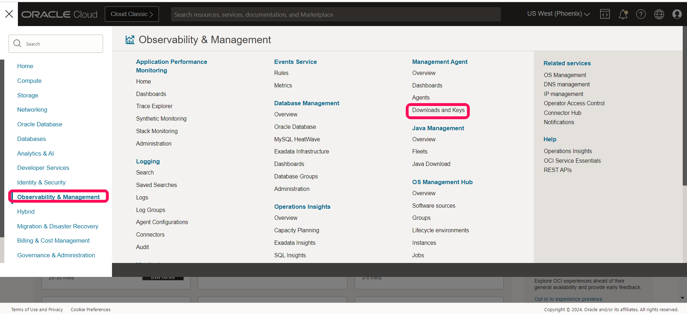
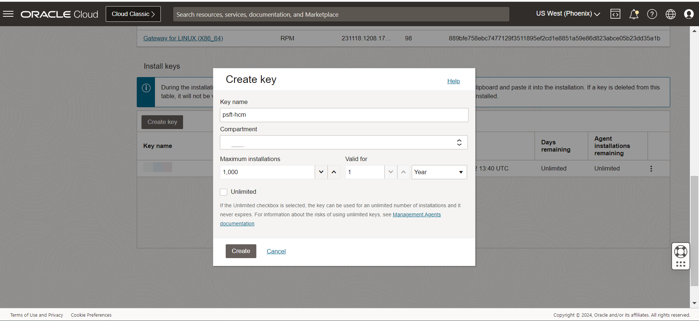
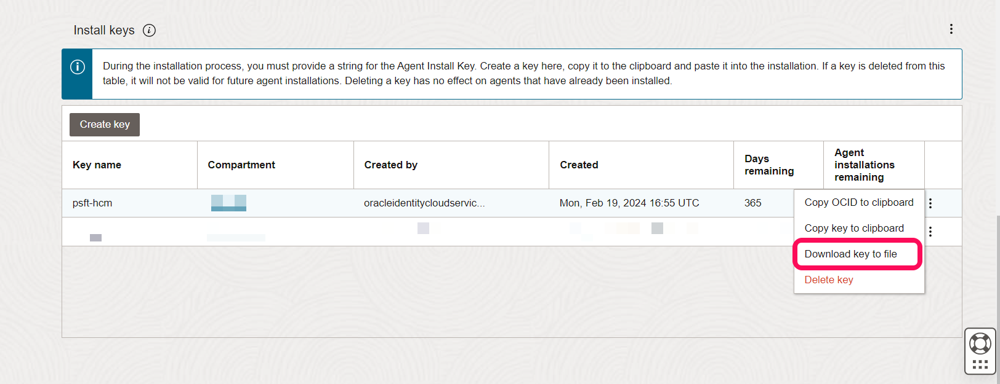
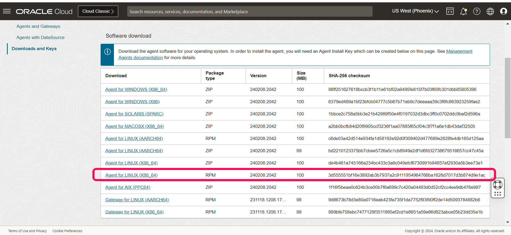

# Agent setup & deployment

## Introduction

In this lab, we will setup and configure agent deployment for both on-premises and OCI compute VMs. Oracle Management agent is used for agent deployment on on-premises compute systems.


Estimated Time: 20 minutes


### Objectives

*  Setup and configure agent for OCI compute VMs.
*  Setup and configure agent for on-premises compute systems.


### Prerequisites

*  A user with access to OCI tenancy to download management agent.
*  A user with access to OCI compute VMs.


## Task 1: Setup and configure agent for OCI compute VMs

1.  As part of the OCI compute VMs, we could either setup/configure oracle cloud agent or oracle management agent to enable discovery of the compute VM. For OCI compute VM, we would be using oracle cloud agent to discover the VM.

  On the Oracle Cloud Infrastructure Console Home page, click the Navigation Menu in the upper-left corner, select Compute, and then instances.

  

   Under the instances, click on the compute, where the PeopleSoft application systems are hosted and click on Oracle Cloud Agent tab.
  
   

   Enable the management agent option by moving button over right

   The management agent is enabled for the compute.

   


   **Important:** Similarly, all the OCI compute VMs, where the application middle tier is hosted, needs to have the agent enabled for successful discovery.


## Task 2: Setup and configure agent for on-premises compute systems

1. On the Oracle Cloud Infrastructure Console Home page, click the Navigation Menu in the upper-left corner, select Observability & Management, and then click Downloads and Keys under Management Agent.

   

   Click create key and provide a name for the key and then click create.

   

   Once the key is created, click on the three dot at the right side and download the key file.

   

   
   Update the key file with the password for **CredentialWalletPassword**.


2. On the same page, download the management agent to the target on-premises compute systems which has PeopleSoft application installed. In this case, we are on linux system with 64bit, so downloading  Agent for Linux (X86_64) as RPM file to all the PeopleSoft systems, which are to be discovered.


   


    Before installing the agent RPM, we also need to download the jdk 1.8.361 + release for  successful agent installation

    Downloading and installing JDK as root or sudo

      ```
      <copy>
    sudo rpm -ivh jdk-8u361-linux-x64.rpm
      </copy>
      ```

    Installing the Management agent

      ```
      <copy>
      export JAVA_HOME=/usr/java/jdk1.8.0_361-amd64

      cd /home/opc
      sudo rpm -ivh oracle.mgmt_agent.230207.1529.Linux-x86_64.rpm

      </copy>
      ```
    
    
    Configure the management agent by running the setup.sh script using a response file created using the key file

      ```
      <copy>
      sudo /opt/oracle/mgmt_agent/agent_inst/bin/setup.sh opts=/tmp/psft_agent.rsp
      </copy>
      ```

  The agent is started automatically, once the configuration is completed.

 For any additional queries on management agent, refer to link [here](https://docs.oracle.com/en-us/iaas/management-agents/index.html).

## Summary

In this lab, you have setup and configured agent for both on-premises and cloud deployment of the PeopleSoft application.

You may now **proceed to the next lab.**


## Acknowledgements

* **Authors** - Deepak Kumar M, Principal Cloud Architect
* **Contributors** -

    * Aaron Rimel, Principal Product Manager
    * Devashish Bhargava, Principal Cloud Architect
* **Last Updated By/Date** - Deepak Kumar M, Principal Cloud Architect, February 2024


