# Resource discovery using Stack Monitoring

## Introduction

In this lab, we will discover all the PeopleSoft resources configured earlier as part of the previous labs.

Estimated Time: 45 minutes

### Objectives

* Configuration options for distributed PSFT systems
* License Options within Stack Monitoring
* Resource discovery of PSFT components

### Prerequisites

*  Access to OCI Stack Monitoring page for the user.

## Task 1: Configuration options for distributed PSFT systems

 This workshop is based on discovering a PeopleSoft application with database, hosted on a single compute VM on OCI. So the application RMI ports, process scheduler RMI ports, webserver ports, database ports have not be opened through a firewall. The agent is also installed on the same compute VM.

 One of the many scenarios has been listed here, customers need to be aware of what ports need to be opened, when the application tiers (Application server, webserver, process scheduler server, database and elastic servers) are installed and configured in a distributed system.

 **Scenario 1**

 Monitoring agent is located on one of the PeopleSoft hosts itself and application tier spread across different VMs.
   
    

 **Scenario 2**

 Monitoring agent is located on different host and application tier spread across different VMs

    

## Task 2: License Options within Stack Monitoring

 OCI Stack Monitoring includes 2 types of licensing - Standard & Enterprise Licensing.
  By Default, when we discover the application, enterprise license option is selected. Enterprise option comes with a lot of added features but if customer wants to disable it, they can follow the below configuration.

 **Configure Licensing for Resource-Specific Features:**

 Resource license assignment can done at the individual resource level during discovery or after discovery within the Licensing UI.

 Note: License changes applied to a composite will apply to all children (e.g. When applying Enterprise Edition License to a WebLogic Domain, all WebLogic Servers associated to the domain will also receive the Enterprise Edition)

 **Configure Licensing for Resource-Specific Features during Discovery**

 During discovery, you may assign a license to the resource by selecting the corresponding radio button.

    

 **Configure Licensing for Resource-Specific Features after Discovery:**

 A resource license can also be modified after a resource has been discovered using the License UI. For example, to upgrade a Standard Edition resource to Enterprise Edition, navigate to the License UI and click the edit button within the Standard Edition box. The page will filter to only show resources with a Standard Edition license. Click the action button of the resource to upgrade and select Enterprise from the drop down. Continue this process for the remaining resources to upgrade from Standard to Enterprise Edition, finally select apply changes. When applying license changes, remain on the page until all updates have been applied.

    

## Task 3: Resource discovery of PSFT components

1. On the Oracle Cloud Infrastructure Console Home page, click the Navigation Menu in the upper-left corner, select Observability & Management, and then click on Stack Monitoring.

   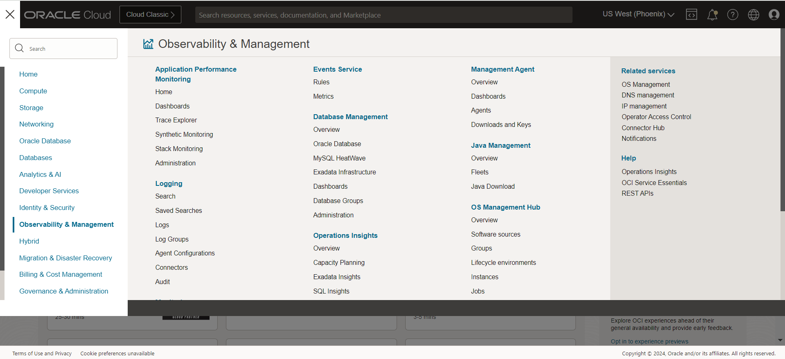

 On the OCI Stack Monitoring page, click on Resource discovery.

   

 On the resource discovery page, click on discover new resource.

   

 As part of the discovery, we will first discover the Oracle database and then followed by the PeopleSoft application. Within Oracle database, we will first discover CDB database (if there is a multi-tenant architecture) and then followed by the PDB database.

2. Select Oracle Database from the resource type and provide the required information for discovery of the CDB database.

   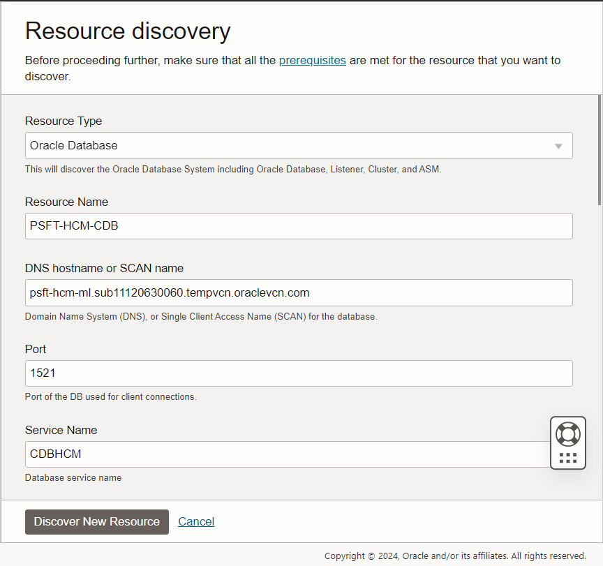

   We need to select the management agent from the dropdown list.

   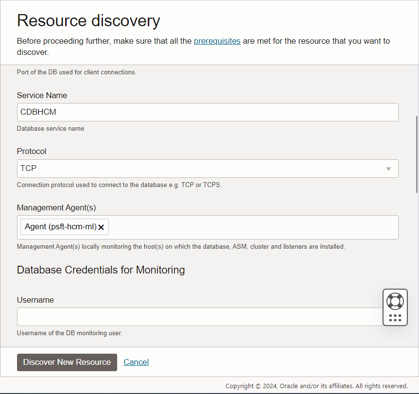

   Enter the database credentials for monitoring

   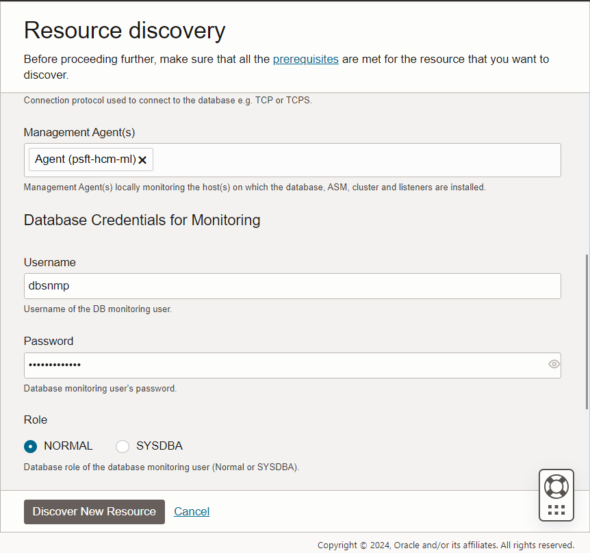

   For this workshop, we are not using ASM and disable the option. For discovery, we are selecting Stack Monitoring only, License option as Standard and click on discover new resource.

   

    The CDB resource discovery is started.

   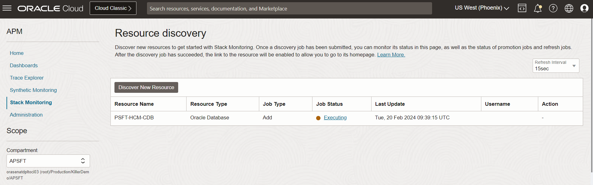

    The CDB resource discovery is completed.

   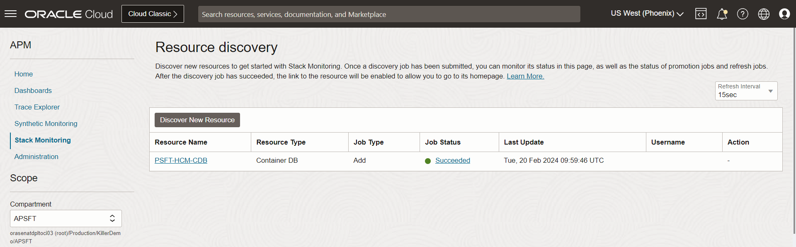

3. Select Oracle PDB Database from the resource type and provide the required information for discovery of the PDB database.

   Give a name for the PDB and the CDB information is retrieved from the earlier discovery
   
   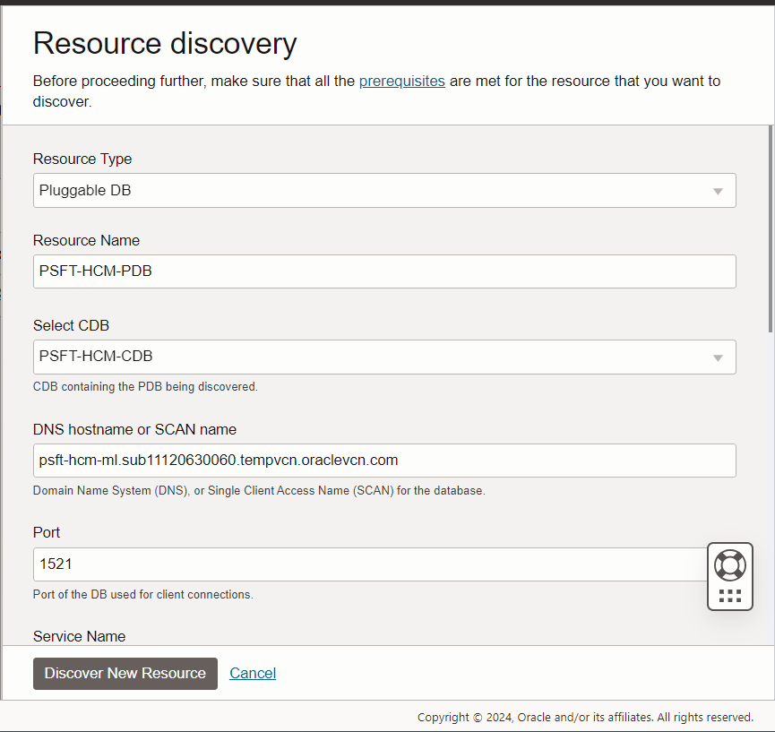

   We need to select the management agent from the dropdown list.

   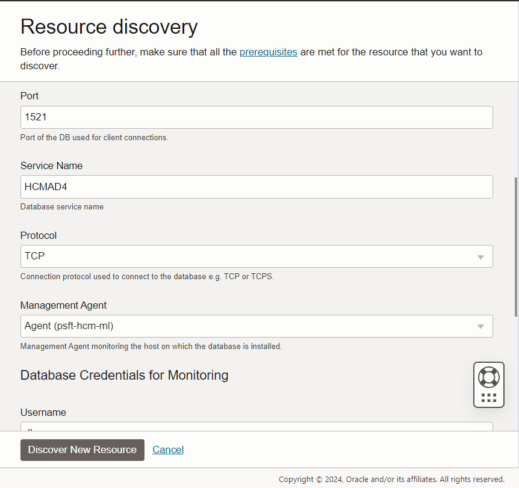

   Enter the database credentials for monitoring

   

   For discovery, we are selecting Stack Monitoring only, License option as Standard and click on discover new resource.

    The PDB resource discovery is started.

   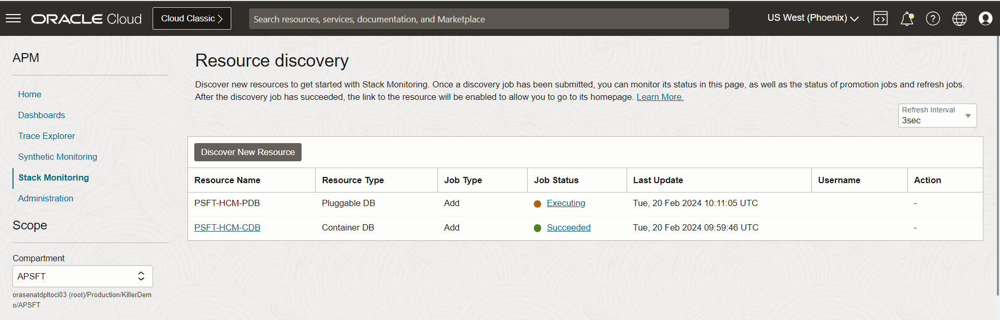

    The PDB resource discovery is completed.

   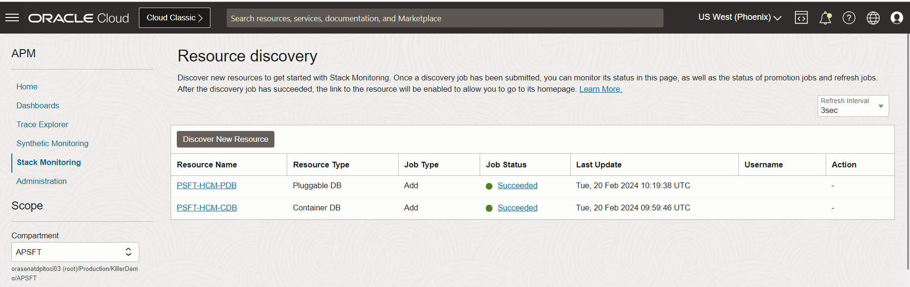

4. Select PSFT Application from the resource type and provide the required information for discovery of the PeopleSoft application.

   We need to select the management agent from the dropdown list. Discover Process Monitor and select Yes as part of the discovery

   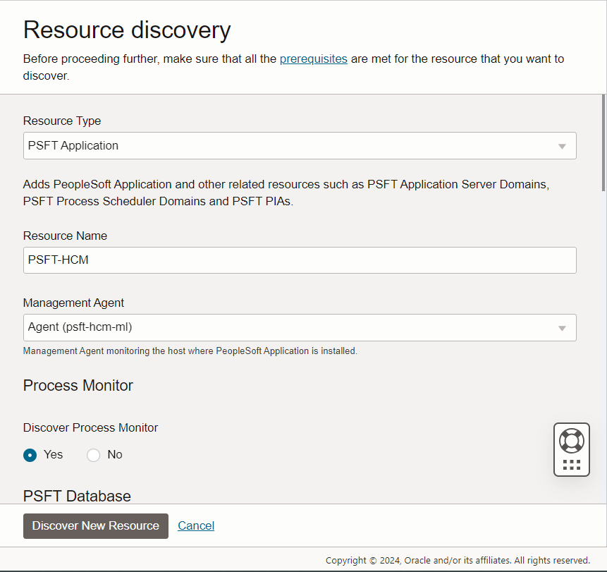

   Enter the Database host, service name, port and protocol
   
   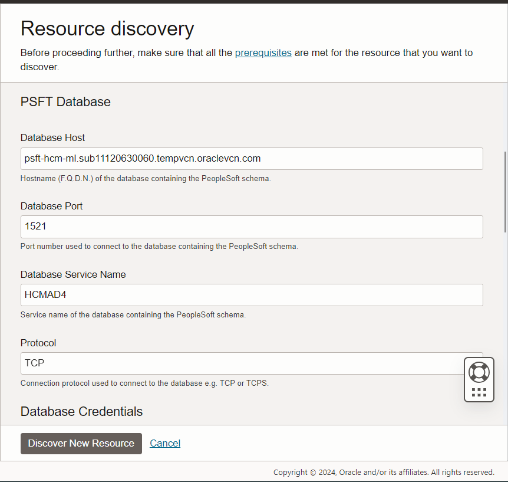

   Enter the database credentials for monitoring

   

   Provide the Application server, Process scheduler and webserver user credentials configured as part of previous lab (Lab 2)

   
   
   For discovery, we are selecting Stack Monitoring only, License option as Standard and click on discover new resource.

   

    The PSFT Application resource discovery is started.

   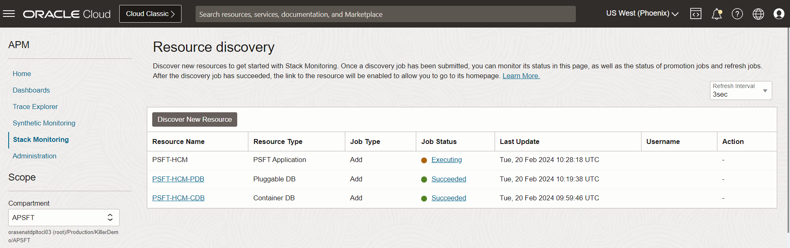

    The PSFT Application resource discovery is completed.

   

## Summary

In this lab, we discovered the PeopleSoft application components using stack monitoring.

You may now **proceed to the next lab.**

## Acknowledgements

* **Authors** - Deepak Kumar M, Principal Cloud Architect
* **Contributors** -

    * Aaron Rimel, Principal Product Manager
    * Devashish Bhargava, Principal Cloud Architect
* **Last Updated By/Date** - Deepak Kumar M, Principal Cloud Architect, February 2024

