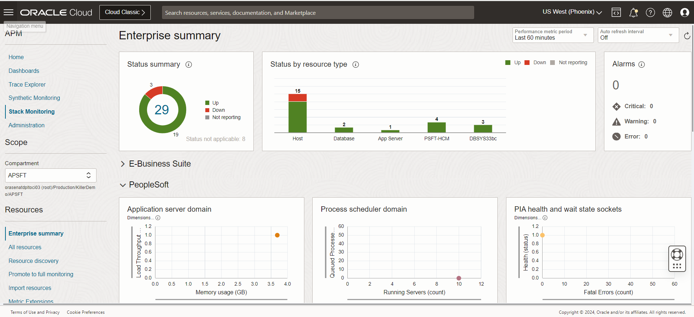

# Monitor the PeopleSoft Application resources

## Introduction

In this lab, you will monitor the PeopleSoft application resources  from the Enterprise UI summary page.

Estimated Time: 15 minutes

### Objectives

* Monitor the PeopleSoft Application resources

### Prerequisites

*  Access to OCI Stack Monitoring page for the user.

## Task 1: Monitor the PeopleSoft Application resources

1. On the Oracle Cloud Infrastructure Console Home page, click the Navigation Menu in the upper-left corner, select Observability & Management, and then click on Stack Monitoring.

   

   The Stack Monitoring Enterprise Summary page provides an overall health and performance of your entire enterprise.

   

   The newly discovered PeopleSoft application resources show up on the dashboard, let's dive into each application resources

## Summary

In this lab, you monitored the PeopleSoft application using Enterprise Summary & the Out of Box dashboards.

## Acknowledgements

* **Authors** - Deepak Kumar M, Principal Cloud Architect
* **Contributors** -

    * Aaron Rimel, Principal Product Manager
    * Devashish Bhargava, Principal Cloud Architect
* **Last Updated By/Date** - Deepak Kumar M, Principal Cloud Architect, February 2024

