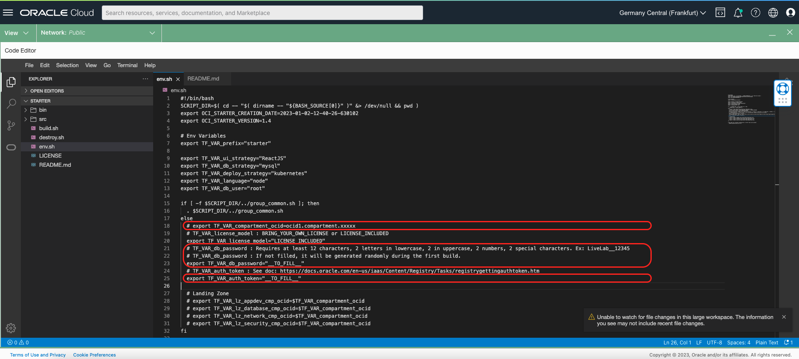

# Create Cloud Native Applications on Container Instance

## Introduction

Estimated time: 10 min

### Objectives


In this sample, using terraform, we will create a Container Instance (with a Java program, NGINX, HTML pages) and an Autonomous Database. 

The steps are identical for all other user interfaces, backends or database.

(!!!!) Beta: it works only from a Oracle Linux machine withe OCI CLI installed (!!!!!)

### Prerequisites

Please read the chapter: Introduction and Get Started.

## Task 1: Create the Application

Using your browser:
- Go to https://www.ocistarter.com/
- Choose 
  - Compute
  - Angular
  - .NET
  - Autonomous database
- Click *Cloud Shell*
  - You will see the commands to use.


In OCI,
- Login to your OCI account
  - Click *Code Editor*
  - Click *New Terminal*
  - Copy paste the command below. And check the README.md

```
<copy>
curl "https://www.ocistarter.com/app/zip?prefix=starter&deploy=container_instance&ui=angular&language=dotnet&database=atp" --output starter.zip
unzip starter.zip
cd starter
cat README.md
</copy>
```


## Task 2: Main files

In the code editor:
- Click *File* / *Open*
- Choose the directory *starter*
- Click *Open*


The main files are:

#### Commands
- build.sh      : Build the whole program: Run Terraform, Configure the DB, Build the App, Build the UI
- destroy.sh    : Destroy the objects created by Terraform
- env.sh        : Contains the settings of your project

#### Directories
- src           : Sources files
    - app         : Source of the Backend Application (Command: build_app.sh)
    - ui          : Source of the User Interface (Command: build_ui.sh)
    - db          : SQL files of the database
    - terraform   : Terraform scripts (Command: plan.sh / apply.sh)
    - compute     : Contains the deployment files to Compute
- bin           : with some helper commands
    - bin/ssh\_compute.sh (to ssh to the Compute)
    - bin/ssh\_bastion.sh (to ssh to the Bastion)



Edit the env.sh file:
- Choose the env.sh file.
- Look for \_\_TO_FILL\_\_ in the file
- You may leave it like this.
    - If not filled, the "db password" will be randomly generated
- Ideally, you can also use an existing compartment if you have one. 
    - If not, the script will create a "oci-starter" compartment

## Task 3: Build.sh

During the build, Terraform will create:
- Network resources: VCN, Subnet
- A database
- A container instance to run a docker container with Angular + another Docker container with the .NET App
- A bastion used mostly to populate the database with the table

In the code editor, 
- in the menu *Terminal / New Terminal*. 
- then run:
```
./build.sh
```

It will build all and at the end you will see:
```
- User Interface : http://123.123.123.123/
- Rest DB API : http://123.123.123.123/app/dept
- Rest Info API : http://123.123.123.123/app/info
```

Click on the URL or go to the link to check that it works.
- All running in a Container instance 
- You have Angular pages doing REST calls 
- To a .NET container image
- That backend gets data from the Autonomous database. 


## Task 4: More info

### Customize

Please also check the  "Lab 5 - How to Customize" to see how to customize this sample to your needs

### Cleanup

To clean up, run 
```
<copy>
./destroy.sh
</copy>
```

```
<copy>
cd ..
rm -R starter
</copy>
```

## Acknowledgements

- **Author**
    - Marc Gueury
    - Ewan Slater

- **History** - Creation - 30 Nov 2022

