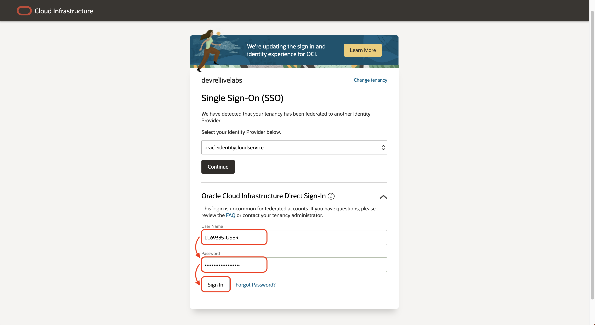

# LiveLabs Reservation

## Introduction

Estimated time: 10 min

### Objectives

Login to your LiveLabs reservation.  

### Prerequisites

You should have an active LiveLabs Reservation.

## Task 1: View Login Info

Let's log in your LiveLabs reservation

1. In your browser, click on View Login Info
2. Take note of the Username ##USERNAME## 
2. Click *Copy Password* 
3. Click *Launch OCI*

## Task 2: Login to OCI

1. Login 
    - Paste the password 
    - Click *Sign In*
    
2. Change Password 
    - Paste the password again in the *Current Password*
    - Type a new password twice (Ex: LiveLab__1234)
    - Click *Save New Password*
    

## Task 3: Change the compartment

1. Go to Compute
    - Click on *Instances Compute*
    
2. Change the compartment
    - Open the tree
    - Click on the one that has the same name than your ##Username## (see above / Reservation Info)
    

Congratulation. You are ready to start your next lab.

## Acknowledgements

* Author - Marc Gueury
* Contributors - Ewan Slater 
* Last Updated - Nov, 2th 2023

