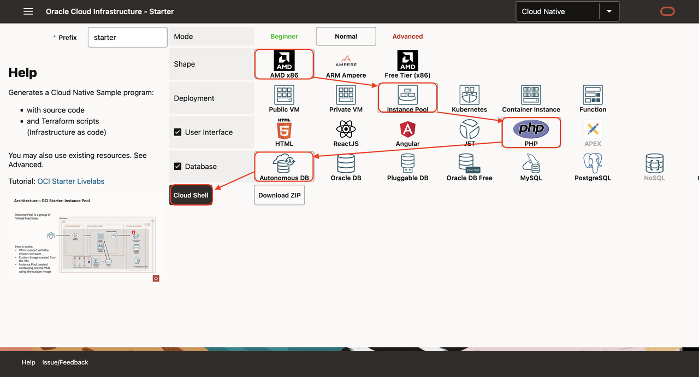

# Create Cloud Native Applications on Compute

## Introduction

Estimated time: 10 min

### Objectives


In this sample, using terraform, we will create:
- an instance pool with 2 Virtual Machines and a load balancer in front of it
- a PHP program running on each of the machine
- and an Autonomous Database. 

During the build, the program will 
- first create a compute
- install the PHP program on oit
- then create a *custom image* of that compute
- create an instance pool of 2 Virtual Machines using the *custom image*
- and a load-balancer in front of the 2 Virtual Machines.

The steps are identical for all other user interfaces, backends or database.

### Prerequisites

Please read the chapter: Introduction and Get Started.

## Task 1: Create the Application

1. Using your browser, go to https://www.ocistarter.com/
2. Choose 
    - AMD (x86)
    - Instance Pool
    - HTML
    - PHP
    - Autonomous database
3. Click *Cloud Shell*
    - You will see the commands to use.
  
4. Login to your OCI account
    - Click *Code Editor*
    - Click *New Terminal*
    - Copy paste the command below. And check the README.md
    ```
    <copy>
    curl -k "https://www.ocistarter.com/app/zip?prefix=starter&deploy=instance_pool&ui=php&language=php&database=atp" --output starter.zip
    unzip starter.zip
    cd starter
    cat README.md
    </copy>
    ```
    

## Task 2: Main files

1. In the code editor:
    - Click *File* / *Open*
    - Choose the directory *starter*
    - Click *Open*
    
2. The main files are:

   |             |            |           | Description |
   | ----------- | ---------- | --------- | ---|
   | Commands    |            |           |  |
   |             | starter.sh |           | Build or destroy a project. Show a menu with commands if not argument is given | 
   |             | env.sh     |           | Settings of your project | 
   | Directories |            |           | Commands used by starter.sh | 
   |             | bin/       |           | Commands used by starter.sh | 
   |             | src/       |           | Sources files | 
   |             |            | app       | Backend Application (Command: build_app.sh) | 
   |             |            | ui        | User Interface (Command: build_ui.sh) | 
   |             |            | db        | Database initialisation files (SQL, ...) | 
   |             |            | terraform | Terraform scripts  | 
   |             |            | compute   | Deployment to Compute | 
   |             | target/    |           | Output directory  | 

3. Edit the env.sh file:
    - Choose the env.sh file.
    - Look for \_\_TO_FILL\_\_ in the file
    - You may leave it like this.
        - If not filled, the "db password" will be randomly generated
    - Ideally, you can also use an existing compartment if you have one. 
        - If not, the script will create a "oci-starter" compartment
    

## Task 3: Starter.sh

During the build, Terraform will create:
1. Network resources: VCN, Subnet
2. A database
3. A compute instance to run NGINX + the PHP App
4. A bastion used mostly to populate the database with the table
5. A custom image of the compute instance (3)
6. A Instance Pool with 2 VMs using the custom image (5)
7. A load-balancer in front of the instance pool

1. In the code editor, 
    - in the menu *Terminal / New Terminal*. 
    - then run:
    ```
    <copy>
    ./starter.sh
    </copy>
    ```
    - Choose **Build**
                 
    - It will build all and at the end you will see:
    ```
    <copy>
    - User Interface : http://123.123.123.123/
    - Rest DB API : http://123.123.123.123/app/dept
    - Rest Info API : http://123.123.123.123/app/info
    </copy>
    ```
2. Click on the URL or go to the link to check that it works:
    - All running in an Instance Pool with 2 VMs
    - On each VM, you have PHP pages 
    - That backend gets data from the Autonomous database. 
    

## Task 4: More info

### Customize

Instance Pool is working in the same way than the "Compute". See the "Compute" lab for more info.

You can see the IP of the 2 VMs of the Instance Pool and of the Loab-Balancer at the end of the build:

````
<copy>
pooled_instances_hostname_labels = [
  [
    "starter-pool2",
    "starter-pool1",
  ],
]
pooled_instances_private_ips = [
  [
    "10.0.1.4",
    "10.0.1.116",
  ],
]
pooled_instances_public_ips = [
  [
    "141.147.42.166",
    "152.70.169.28",
  ],
]
ui_url = "http://141.147.42.164"
</copy>
````

Please also check the  "Lab 7 - How to Customize" to see how to customize this sample to your needs

### Cleanup

1. To clean up, run 
    ```
    <copy>
    ./starter.sh destroy
    </copy>
    ```

    ```
    <copy>
    cd ..
    rm -R starter
    </copy>
    ```

## Acknowledgements

* Author - Marc Gueury
* Contributors - Ewan Slater 
* Last Updated - Jan, 20th 2025

