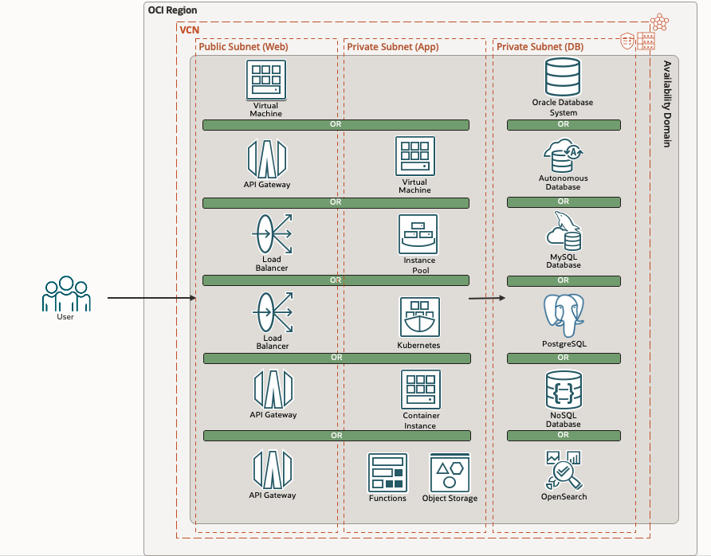

# Introduction

Estimated time: 30 minutes

## Goal: OCI Starter: Create a Cloud Native Sample in 5 mins


In this tutorial, we will create custom Cloud Native applications using:

- Terraform scripts (or Resource Manager)
- Shape (CPU/Memory): x86, ARM or Free Tier(x86)
- Deployment: Virtual Machine, Instance Pool, Kubernetes, Container Instance, Serverless Function
- User Interface: HTML or ReactJS, Angular, JET, JSP, PHP, APEX
- Backend REST service: Java or Node, Python, .NET, Go, ORDS
    - For Java: 
        - Framework: SpringBoot or Helidon, Tomcat, Micronaut
        - JavaVM: JDK or GraalVM JIT, GraalVM Native
- Database: Oracle Autonomous Database or Oracle Database System, Pluggable Database, Oracle Database Free, MySQL, PostgreSQL
- Using new or existing infrastructure resources

*See "Labs" below for a link to the documentation of each of these technologies*

We will use OCI Starter. It is an open source project that allow to start from 
a working sample for most combinations of the above choices.

## Architecture



## How

It works like this:
- We will go to the Website https://www.ocistarter.com/ to get a zip file with all the code that we need
- Check what it contains: readme.md, LICENCE (Apache 2 License), source files
- Run ./starter.sh

## Labs

If you have no idea on which type of infrastructure to deploy your program, please use: 
- Lab 1 - Public Virtual Machine (Compute)
- Then check the "Lab 7 - How to Customize" to see how to customize this sample to your needs

If you have other requirements, please do other choice of labs based on requirements and the list of components. (See below)

### Components

Whatever choices that you do, you will get a working sample with terraform to create the program of your choice. You have the choice of the following components:

1. Shape 
    - AMD x86 - [x86 Shape](https://docs.oracle.com/en-us/iaas/Content/Compute/References/computeshapes.htm)
    - ARM Ampere - [ARM Shape](https://docs.oracle.com/en-us/iaas/Content/Compute/References/arm.htm)
    - Free Tier x86 - [Free Tier](https://www.oracle.com/be/cloud/free/)
2. Infrastructure
    - Lab 1 - Public Virtual Machine (Default) - [Virtual Machine](https://docs.oracle.com/en-us/iaas/Content/Compute/home.htm)
    - Lab 2 - Private Virtual Machine - [Virtual Machine](https://docs.oracle.com/en-us/iaas/Content/Compute/home.htm)
    - Lab 3 - Instance Pool - [Instance Pools](https://docs.oracle.com/en-us/iaas/Content/Compute/Concepts/instancemanagement.htm)
    - Lab 4 - Kubernetes - [OCI Container Engine for Kubernetes](https://docs.oracle.com/en-us/iaas/Content/ContEng/home.htm)
    - Lab 5 - Container Instance - [Container Instance](https://docs.oracle.com/en-us/iaas/Content/container-instances/home.htm)
    - Lab 7 - Function - [Functions](https://docs.oracle.com/en-us/iaas/Content/Functions/home.htm)
3. User Interface 
    - HTML 5 - [HTML](https://html.spec.whatwg.org/multipage/)
    - ReactJS - [React](https://react.dev/)
    - Angular - [Angular](https://angular.io/)
    - JET - [JET](https://www.oracle.com/webfolder/technetwork/jet/index.html)
    - PHP - [PHP](https://www.php.net/)
    - APEX - [APEX](https://apex.oracle.com)
4. Backend
    - Java (Default) - [Java](https://dev.java/)
    - NodeJS - [NodeJS](https://nodejs.org/)
    - Python - [Python](https://www.python.org/)
    - .NET - [.NET](https://dotnet.microsoft.com/)
    - Go - [Go](https://go.dev/)
    - ORDS - [Oracle REST Data Services](https://docs.oracle.com/en/database/oracle/oracle-rest-data-services/index.html)
5. For Java, several Java frameworks
    - SpringBoot  - [SpringBoot](https://spring.io/projects/spring-boot)
    - Helidon - [Helidon](https://helidon.io/)
    - Tomcat Servlet/JSP - [Tomcat](https://tomcat.apache.org/)
    - Micronaut - [Micronaut](https://micronaut.io/)
6. For the database
    - Oracle Autonomous Database - [Autonomous Database](https://docs.oracle.com/en/database/autonomous-database-cloud-services.html)
    - Oracle Database - [Base Database Service](https://docs.oracle.com/en/cloud/paas/base-database/index.html)
    - Pluggable Database - [PDB on top of an existing Oracle Database](https://docs.oracle.com/en-us/iaas/dbcs/doc/pluggable-databases.html)
    - Oracle DB 23ai Free (running on a Compute) - [Database Free](https://www.oracle.com/be/database/free/)
    - MySQL - [MySQL](https://docs.oracle.com/en-us/iaas/mysql-database/index.html)
    - PostgreSQL - [PostgreSQL](https://docs.oracle.com/en-us/iaas/Content/postgresql/home.htm)
    - OpenSearch - [OpenSearch](https://docs.oracle.com/en-us/iaas/Content/search-opensearch/home.htm)

For Advanced Features, check the Lab - Advanced. For things like Resource Manager, GraalVM Native and so on... 

## Prerequisites - Cloud Shell with Public Network

If you start Cloud Shell and that you see **Network: Public** on the top or that you may change to **Public Network**, there is nothing to do.
For ex, OCI Administrator has that right. Or your administrator has added the right already.

### Solution 1 - Add Policy

If this is not the case, please ask your Administrator to follow this document.

https://docs.oracle.com/en-us/iaas/Content/API/Concepts/cloudshellintro_topic-Cloud_Shell_Networking.htm#cloudshellintro_topic-Cloud_Shell_Public_Network

He/She just need to add a Policy to your tenancy :

```
<copy>
allow group GROUP-NAME to use cloud-shell-public-network in tenancy
</copy>
```

### Solution 2 - Use a compute to run the build

If for some reasons, Cloud Shell access can be be granted. The another way is to have a Virtual Machine to run the build (via Internet or NAT Gateway).
Internet access is needed for example to download libraries with Java/Maven, requirements.txt in Python and so on.

In short, 
- Create a VCN 
    - Go to Menu / Networking / Virtual Cloud Network
    - Click **Start VCN Wizard**
    - Choose **Create VCN with Internet Connectivity**
    - Follow the wizard
- Create a VM
    - Go to Menu / Compute / Instance
    - Click **Create Instance**
    - Name: dev
    - Choose the shape. The shape can be an ARM or X86 based on what you want to build.
    - Keep "Oracle Linux 8" 
    - Use the VCN created above
    - Follow the wizard
- Log on the VM
    - ssh opc@YOUR_DEVVM
    - Follow https://docs.oracle.com/en-us/iaas/Content/API/SDKDocs/cliinstall.htm#configfile
        - oci setup config
    - Download this script to install the needed tools and check what it does:
        ```
        <copy>
        wget https://raw.githubusercontent.com/oracle-devrel/oci-starter/main/test_suite/install_dev.sh
        </copy>
        ```
    - Run it:
        ```
        <copy>
        bash install_dev.sh
        </copy>
        ```
        [Script: https://raw.githubusercontent.com/oracle-devrel/oci-starter/main/test_suite/install_dev.sh][https://raw.githubusercontent.com/oracle-devrel/oci-starter/main/test_suite/install_dev.sh]
- Run the lab

## Acknowledgements 

* Author - Marc Gueury
* Contributors - Ewan Slater 
* Last Updated - Jan, 20th 2025


