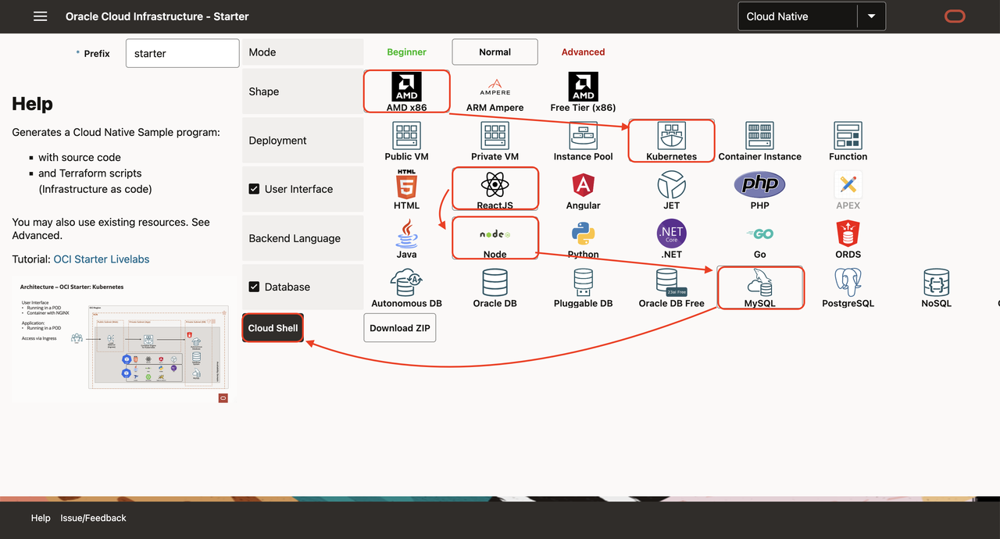
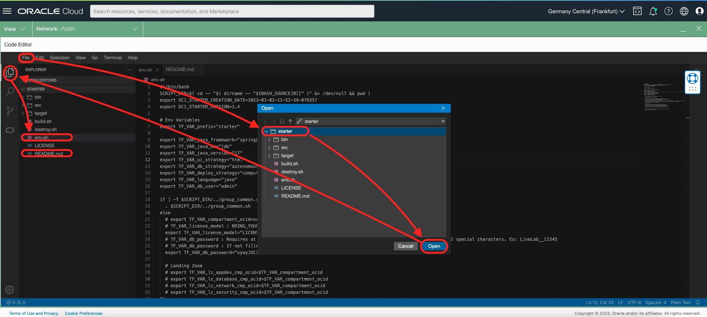
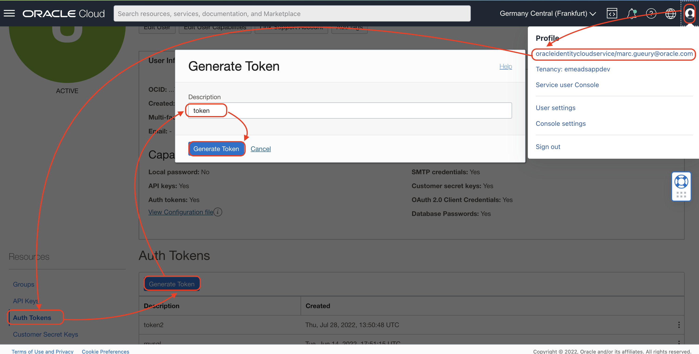
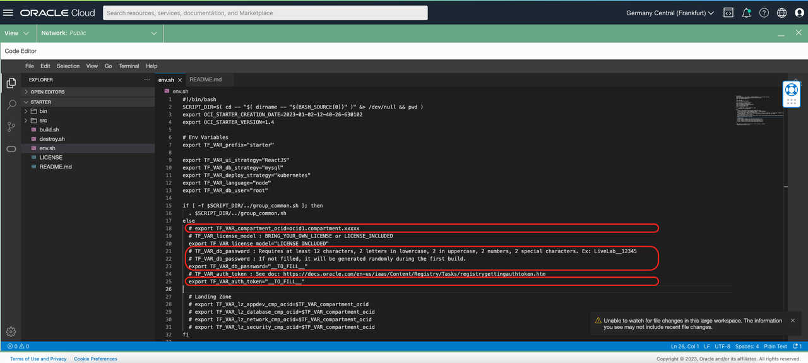

# Create Cloud Native Containers using Kubernetes (OKE) 

## Introduction

Estimated time: 10 min

### Objectives


In this sample, using terraform, we will create:
- a Kubernetes cluster with 2 pods
- one pod for NGINX and ReactJS
- one with NodeJS
- and a MySQL Database. 

The steps are identical for all other user interfaces, backends or database.

### Prerequisites

Please read the chapter: Introduction and Get Started.

## Task 1: Create the Application

1. Using your browser, go to https://www.ocistarter.com/
2. Choose 
    - AMD (x86)
    - Kubernetes
    - ReactJS
    - Node
    - MySQL
3. Click *Cloud Shell*
    - You will see the commands to use.
    
4. Login to your OCI account
    - Click *Code Editor*
    - Click *New Terminal*
    - Copy paste the command below. And check the README.md
    ```
    <copy>
    curl "https://www.ocistarter.com/app/zip?prefix=starter&deploy=kubernetes&ui=reactjs&language=node&database=mysql" --output starter.zip
    unzip starter.zip
    cd starter
    cat README.md
    </copy>
    ```
    

## Task 2: Main files

1. In the code editor:
    - Click *File* /  *Open*
    - Choose the directory *starter*
    - Click *Open*
    
2. The main files are:
    - Commands
        - build.sh      : Build the whole program: Run Terraform, Configure the DB, Build the App, Build the UI
        - destroy.sh    : Destroy the objects created by Terraform
        - env.sh        : Contains the settings of your project
    - Directories
        - src           : Sources files
            - app         : Source of the Backend Application (Command: build_app.sh)
            - ui          : Source of the User Interface (Command: build_ui.sh)
            - db          : SQL files of the database
            - terraform   : Terraform scripts (Command: plan.sh / apply.sh)
            - oke         : Contains the deployment files to Kubernetes
        - bin            : with some helper commands
            - bin/ssh\_bastion.sh (to ssh to the Bastion)
3. We will need an AUTH Token to login to the Docker Container Registry. Let's create one:
    - Click on the top left icon
    - Click your username
    - In the menu on the right, choose Auth Tokens
    - Click *Generate Token*
    - Give a name 
    - Click *Generate Token*
    - Then copy the value ##AUTH-TOKEN##
    
4. Edit the env.sh file:
    - Choose the env.sh file.
    - Look for \_\_TO_FILL\_\_ in the file
    - For TF\_VAR\_auth\_token, use the ##AUTH-TOKEN## value that you just above. 
    - For TF\_VAR\_database\_password, You may leave it like this.
        - If not filled, the "db password" will be randomly generated
    - Ideally, you can also use an existing compartment if you have one. 
        - If not, the script will create a "oci-starter" compartment
    

## Task 3: Build.sh

Before to run the build. Notice that the build will create:
- Network resources: VCN, Subnet
- A MySQL database
- An Oracle Container Engine for Kubernetes (OKE) with 2 nodes.
- A bastion used mostly to populate the database with the table

1. In the code editor, 
    - in the menu *Terminal / New Terminal*. 
    - then run:
    ```
    <copy>
    ./build.sh
    </copy>
    ```

    It will build all and at the end you will see:
    ```
    <copy>
    - User Interface : http://123.123.123.123/
    - Rest DB API : http://123.123.123.123/app/dept
    - Rest Info API : http://123.123.123.123/app/info
    </copy>
    ```
2. Click on the URL or go to the link to check that it works:
    - All running in a Kubernetes 
    - You have ReactJS pages doing REST calls 
    - To a NodeJS - Express backend
    - That backend gets data from MySQL database
    

## Task 4: More info

### Customize

Please also check the  "Lab 6 - How to Customize" to see how to customize this sample to your needs

### Kubernetes

During the build, it will generate an Kubernetes cluster, do this to access it:

```
<copy>
. ./env.sh
kubectl get pods
</copy>
```

```
<copy>
NAME                                     READY   STATUS    RESTARTS   AGE
starter-app                              1/1     Running   0          86s
starter-ui                               1/1     Running   0          83s
</copy>
```
```
<copy>
kubectl get service
kubectl get ingress
</copy>
```

By default, the pods for the User Interface and Application are generated in the default namespace.

### Cleanup

1. To clean up, run 
    ```
    <copy>
    ./destroy.sh
    </copy>
    ```

    ```
    <copy>
    cd ..
    rm -R starter
    </copy>
    ```

## Acknowledgements

* Author - Marc Gueury
* Contributors - Ewan Slater 
* Last Updated - Nov, 2th 2023
