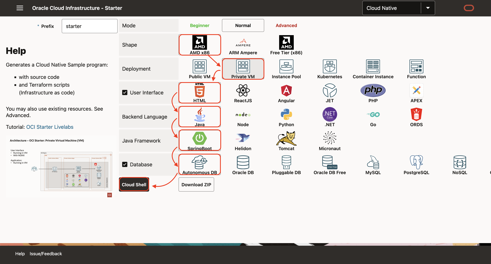

# Create Cloud Native Applications on Private Virtual Machine

## Introduction

Estimated time: 10 min

### Objectives


In this sample, using terraform, we will create:
- an API Gateway, with a public IP
- a Virtual Machine (compute) with a private IP with
    - with a Java program, 
    - HTML pages (on NGINX)
- and an Autonomous Database. 

To access the Virtual Machine (compute), a Bastion is also created.

The steps are identical for all other user interfaces, backends or database.

### Prerequisites

Please read the chapter: Introduction and Get Started.

## Task 1: Create the Application

1. Using your browser, go to https://www.ocistarter.com/
2. Choose 
    - AMD (x86)
    - Private VM
    - HTML
    - Java
    - SpringBoot
    - Autonomous database
3. Click *Cloud Shell*
    - You will see the commands to use.
  
4. Login to your OCI account
    - Click *Code Editor*
    - Click *New Terminal*
    - Copy paste the command below. And check the README.md
    ```
    <copy>
    curl "https://www.ocistarter.com/app/zip?prefix=starter&deploy=private_compute&ui=html&language=java&database=atp" --output starter.zip
    unzip starter.zip
    cd starter
    cat README.md
    </copy>
    ```
    

## Task 2: Main files

1. In the code editor:
    - Click *File* / *Open*
    - Choose the directory *starter*
    - Click *Open*
    
2. The main files are:

   |             |            |           | Description |
   | ----------- | ---------- | --------- | ---|
   | Commands    |            |           |  |
   |             | starter.sh |           | Build or destroy a project. Show a menu with commands if not argument is given | 
   |             | env.sh     |           | Settings of your project | 
   | Directories |            |           | Commands used by starter.sh | 
   |             | bin/       |           | Commands used by starter.sh | 
   |             | src/       |           | Sources files | 
   |             |            | app       | Backend Application (Command: build_app.sh) | 
   |             |            | ui        | User Interface (Command: build_ui.sh) | 
   |             |            | db        | Database initialisation files (SQL, ...) | 
   |             |            | terraform | Terraform scripts  | 
   |             |            | compute   | Deployment to Compute | 
   |             | target/    |           | Output directory  | 

3. Edit the env.sh file:
    - Choose the env.sh file.
    - Look for \_\_TO_FILL\_\_ in the file
    - You may leave it like this.
        - If not filled, the "db password" will be randomly generated
    - Ideally, you can also use an existing compartment if you have one. 
        - If not, the script will create a "oci-starter" compartment
    

## Task 3: Starter.sh

During the build, Terraform will create:
- Network resources: VCN, Subnet
- A database
- A compute instance to run NGINX + the Java App
- A bastion used mostly to populate the database with the table

1. In the code editor, 
    - in the menu *Terminal / New Terminal*. 
    - then run:
    ```
    <copy>
    ./starter.sh
    </copy>
    ```
    - Choose **Build**
          
    - It will build all and at the end you will see:
    ```
    <copy>
    - User Interface: https://xxxxx.apigateway.eu-frankfurt-1.oci.customer-oci.com/starter/
    - Rest DB API: https://xxxxx.apigateway.eu-frankfurt-1.oci.customer-oci.com/starter/app/dept
    - Rest Info API: https://xxxxx.apigateway.eu-frankfurt-1.oci.customer-oci.com/starter/app/info    
    </copy>
    ```
2. Click on the URL or go to the link to check that it works:
    - All running in a Compute 
    - You have HTML pages in NGINX doing REST calls 
    - To a Java SpringBoot backend
    - That backend gets data from the Autonomous database. 
    

## Task 4: More info

### Customize

Please also check the  "Lab 7 - How to Customize" to see how to customize this sample to your needs

### SSH

During the build, it has generated 2 files:
- ssh\_key\_starter : a ssh private key to login to the compute and bastion
- ssh\_key\_starter.pub : the public ssh private key installed in the compute and bastion

You can login to the compute by
- running:
    ```
    <copy>
    ./starter.sh 
    </copy>
    ```
- Choose **Advanced**
- Then **SSH / Compute**

It is identical to run this command:
```
<copy>
./starter.sh ssh compute
</copy>
```

The interesting directories are:
- $HOME/app with the application
- /usr/share/nginx/html/ with the HTML pages

### Cleanup

1. To clean up, run 
    ```
    <copy>
    ./starter.sh destroy
    </copy>
    ```

    ```
    <copy>
    cd ..
    rm -R starter
    </copy>
    ```

## Acknowledgements

* Author - Marc Gueury
* Contributors - Ewan Slater 
* Last Updated - Jan, 20th 2025

