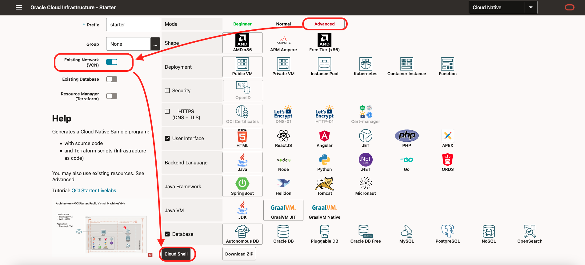
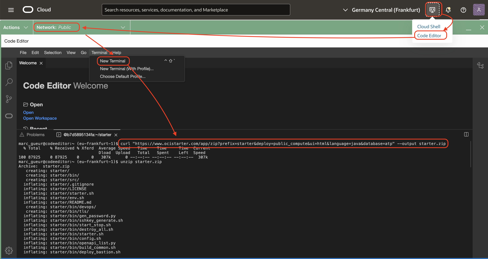

# Create Cloud Native Applications on Public Virtual Machine

## Introduction

Estimated time: 10 min

### Objectives


In this sample, using terraform, we will create:
- a Virtual Machine (compute) with a public IP with:
    - a Java program, 
    - HTML pages (on NGINX)
- and an Autonomous Database. 

The steps are identical for all other user interfaces, backends or database.

### Prerequisites

Please read the chapter: Introduction and Get Started.

You are in the Green Button version of the lab. The lab is limited only to Compute and Autonomous Database due the limits of the green button 
cloud account. 

  

If later, you want to try the full version of the lab for ex with Kubernetes or Container engine, you will need your own tenancy.

## Task 1: Create the Application

We will use to Advanced tab to work with the limits of the LiveLab sandbox. (Existing network, ...)

1. In your browser, go to https://www.ocistarter.com/
2. Choose:
    - Advanced
    - Existing VCN 
    - Keep:
        - Compute
        - HTML
        - Java
        - SpringBoot
        - GraalVM
        - Autonomous database
3. Click *Cloud Shell*
    - You will see the commands to use.
  
4. Login to your OCI account
    - Click *Code Editor*
    - Click *New Terminal*
    - Copy paste the command below. And check the README.md
    ```
    <copy>
    curl -k "https://www.ocistarter.com/app/zip?prefix=starter&deploy=public_compute&ui=html&language=java&database=atp&vcn_strategy=existing" --output starter.zip
    unzip starter.zip
    cd starter
    cat README.md
    </copy>
    ```
    

## Task 2: Main files

1. In the code editor:
    - Click *File* / *Open*
    - Choose the directory *starter*
    - Click *Open*
    
2. The main files are:

   |             |            |           | Description |
   | ----------- | ---------- | --------- | ---|
   | Commands    |            |           |  |
   |             | starter.sh |           | Build or destroy a project. Show a menu with commands if not argument is given | 
   |             | env.sh     |           | Settings of your project | 
   | Directories |            |           | Commands used by starter.sh | 
   |             | bin/       |           | Commands used by starter.sh | 
   |             | src/       |           | Sources files | 
   |             |            | app       | Backend Application (Command: build_app.sh) | 
   |             |            | ui        | User Interface (Command: build_ui.sh) | 
   |             |            | db        | Database initialisation files (SQL, ...) | 
   |             |            | terraform | Terraform scripts  | 
   |             |            | compute   | Deployment to Compute | 
   |             | target/    |           | Output directory  | 

3. Check the env.sh file:
    - Choose the env.sh file.
    - Since we are in a LiveLabs installation, all the settings will be found automatically.
          - TF_VAR\_compartment\_ocid, TF\_VAR\_vcn\_ocid / TF\_VAR\_public\_subnet\_ocid, TF\_VAR\_private\_subnet\_ocid will be found automatically.
          - The database password, if not filled, will be randomly generated.
    

## Task 3: Starter.sh

During the build, Terraform will reuse the 
- Network resources: VCN, Subnet
Then create: 
- A database
- A compute instance to run NGINX + the Java App
- A bastion used mostly to populate the database with the table

1. In the code editor, 
    - in the menu *Terminal / New Terminal*. 
    - run 
    <copy>
    ./starter.sh
    </copy>
    - choose Build
            
    - It will build all and at the end you will see:
    ```
    <copy>
    - User Interface : http://123.123.123.123/
    - Rest DB API : http://123.123.123.123/app/dept
    - Rest Info API : http://123.123.123.123/app/info
    </copy>
    ```
2. Click on the URL or go to the link to check that it works:
    - All running in a Compute 
    - You have HTML pages in NGINX doing REST calls 
    - To a Java SpringBoot backend
    - That backend gets data from the Autonomous database. 
    

## Task 4: More info

This livelab is limited to Compute. If you use your own tenancy, there are a lot more options like Kubernetes or Container Instances.

You can also check how it works and how to customize what you built.

### Customize

Please also check the  "Lab 3 - How to Customize" to see how to customize this sample to your needs

### SSH

During the build, it has generated 2 files:
- ssh\_key\_starter : a ssh private key to login to the compute and bastion
- ssh\_key\_starter.pub : the public ssh private key installed in the compute and bastion

You can login to the compute by running:
```
<copy>
./starter.sh ssh compute
</copy>
```

When you are on the compute, the interesting directories are:
- $HOME/app with the compiled application
- /usr/share/nginx/html/ with the HTML pages

### Cleanup

1. To clean up, run 
    ```
    <copy>
    ./starter.sh destroy
    </copy>
    ```

    ```
    <copy>
    cd ..
    rm -R starter
    </copy>
    ```

## Acknowledgements

* Author - Marc Gueury
* Contributors - Ewan Slater 
* Last Updated - June, 2nd 2025

