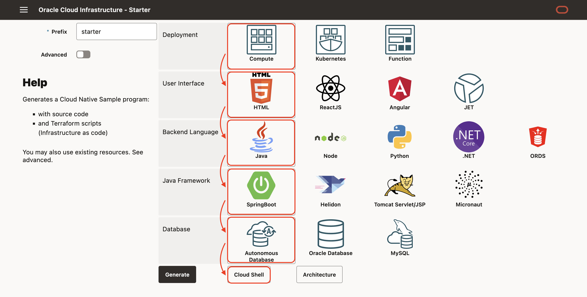
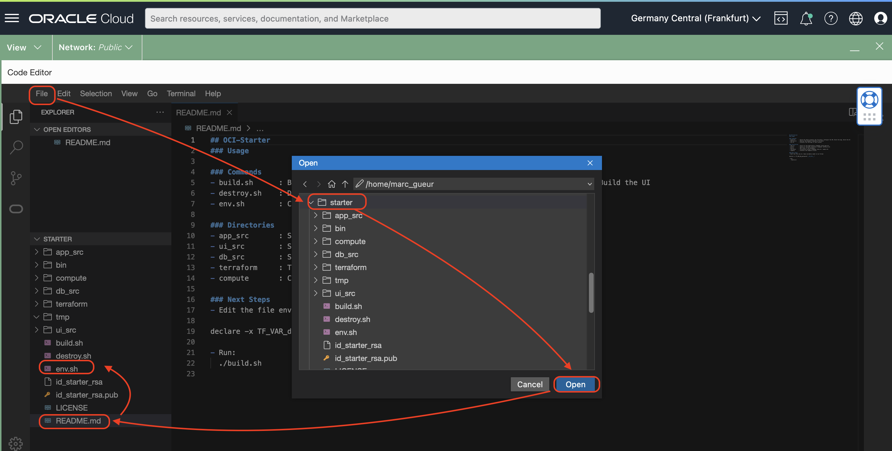
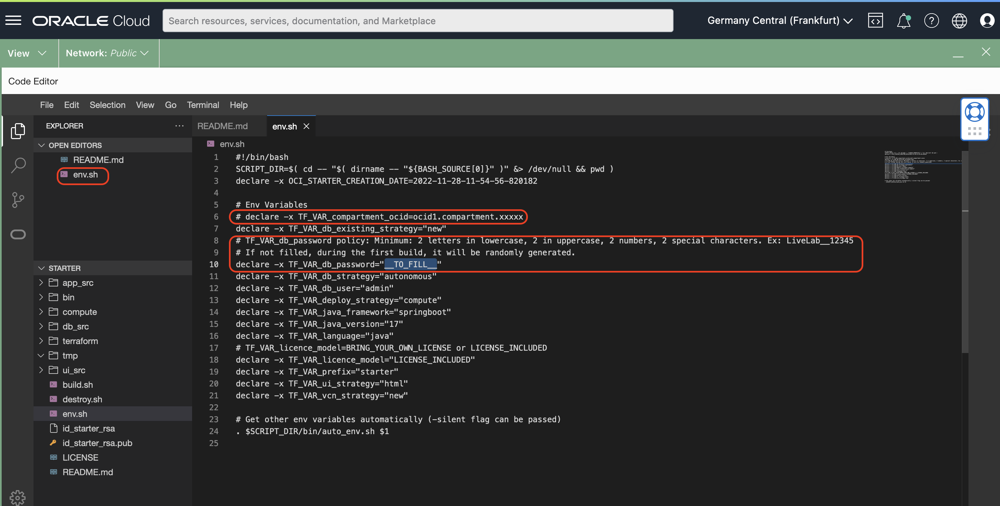

# Create a Compute with a Cloud Native

## Introduction

Estimated time: 10 min

### Objectives


In this sample, using terraform, we will create a compute (with a Java program, NGINX, HTML pages) and an Autonomous Database. 

The steps are identical for all other user interfaces, backends or database.

### Prerequisites

## Task 1: Create the Application

In the OCI Starter website: 
- Go to https://starter.wedoteam.io/
- Choose 
  - Compute
  - HTML
  - Java
  - SpringBoot
  - Autonomous database
- Click *Cloud Shell*
  - You will see the commands to use.


In OCI,
- Login to your OCI account
  - Click *Code Editor*
  - Click *New Terminal*
  - Copy paste the command below. And check the README.md

```
<copy>
curl "https://starter.wedoteam.io/app/zip?prefix=starter&deploy=compute&ui=html&language=java&database=atp" --output starter.zip
unzip starter.zip
cd starter
cat README.md
</copy>
```


## Task 2: Main files

In the code editor:
- Click *File* /  *Open*
- Choose the directory *starter*
- Click *Open*



The main files are:

#### Commands
- build.sh      : Build the whole program: Run Terraform, Configure the DB, Build the App, Build the UI
- destroy.sh    : Destroy the objects created by Terraform
- env.sh        : Contains the settings of your project

#### Directories
- app\_src       : Source of the Application (Command: build_app.sh)
- ui\_src        : Source of the User Interface (Command: build_ui.sh)
- db\_src        : SQL files of the database
- terraform     : Terraforms scripts (Command: plan.sh / apply.sh)
- compute       : Contains the Compute scripts
- bin           : with some helper commands
    - bin/ssh\_compute.sh (to ssh to the Compute)
    - bin/ssh\_bastion.sh (to ssh to the Bastion)



Edit the env.sh file:
- Choose the env.sh file.
- Look for \_\_TO_FILL\_\_ in the file
- You may leave it like this.
    - If not filled, the "db password" will be randomly generated
- Ideally, you can also use an existing compartment if you have one. 
    - If not, the script will create a "oci-starter" compartment

## Task 3: Build.sh

Before to run the build. Notice that the build will create:
- Network resources: VCN, Subnet
- A database
- A compute instance to run NGINX + the Java App
- A bastion used mostly to populate the database with the table

In the code editor, 
- in the menu *Terminal / New Terminal*. 
- then run:
```
./build.sh
```

It will build all and at the end you will see:
```
- User Interface : http://123.123.123.123/
- Rest DB API : http://123.123.123.123/app/dept
- Rest Info API : http://123.123.123.123/app/info
```

Click on the URL or go to the link to check that it works.

## Task 4: More info

During the build, it will generate 2 files:
- id\_starter\_rsa : a ssh private key to login to the compute and bastion
- id\_starter\_rsa.pub : the public ssh private key installed in the compute and bastion

You can check the compute by running:
```
bin/ssh_compute.sh
```

The interesting directories are:
- $HOME/app with the compiled application
- /usr/share/nginx/html/ with the HTML pages

To clean up, run 
```
<copy>
./destroy.sh
</copy>
```

```
<copy>
cd ..
rm -R starter
</copy>
```

## Acknowledgements

- **Author**
    - Marc Gueury
    - Ewan Slater

- **History** - Creation - 30 Nov 2022

