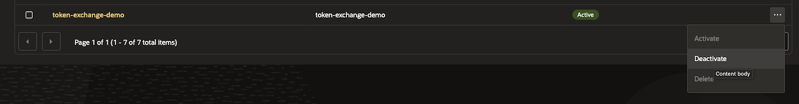

# Cleanup

## Introduction

At this point you may remove the resources from your tenancy (Integrated App, Service User, Group, POlicy). 

Estimated Time: 10 minutes

### **Objectives**

- Delete your the Github repo.
- Destroy the OCI resources

### **Prerequisites**

This lab assumes you have:

* An Oracle Cloud account.
* A Github account
* Administrator privileges or sufficient access rights to create and manage Integrated App, Service User, Group, IAM Policies in your tenancy.
* Github command line installed
* OCI CLI installed and configured
* Github CLI installed and authenticated with your Github account

## Task 1: Delete the Github repo

1. Delete the Github repo that you created on Lab **Provision of the Github repo**
    - from within folder *oci-token-exchange-ghaction-test* run:
     ```
     <copy>
     gh delete repo
     </copy>
     ```
    - you will be asked to confirm by typing your_gh_owner/oci-token-exchange-ghaction-test :
     ```text
     ? Type franciscvass/test_sessiontoken2 to confirm deletion: franciscvass/oci-token-exchange-ghaction-test
     ✓ Deleted repository franciscvass/oci-token-exchange-ghaction-test
     ```

## Task 2: Destroy the OCI resources

1. Destroy the OCI resources create on Lab **Provision of the necessary resources**
    - there is a known issue which prevents you to terminate an Integrated App from Terraform if the App is active. For that reason you must set the App as inactive first
    - login into UI in your Tenancy. Go to Domains/Integrated Application
    - locate the app created on Lab **Provision of the necessary resources**. This shoul be _TokenExDemoApp_ if you did not changed the name
    - on the right three dots choose "Deactivate" like in image below

    
    - from within folder _oci-token-exchange-resources_ from where you run the Terraform to deploy the OCI resources run: 
     ```
     <copy>
     terraforn destroy
     </copy>
     ```

    - confirm the destroy with _yes_
     ```text
     Do you really want to destroy all resources?
       Terraform will destroy all your managed infrastructure, as shown above.
       There is no undo. Only 'yes' will be accepted to confirm.
     
       Enter a value: yes
     
     oci_identity_policy.this: Destroying... [id=ocid1.policy.oc1..aaaaaaaasak3eu45isoo5mrzt3mqauidhn2zvi3hdvl4so5zfq4homgav6bq]
     oci_identity_domains_identity_propagation_trust.this: Destroying... [id=a51b871c8539416daaec0f39b6214f3a]
     oci_identity_domains_identity_propagation_trust.this: Destruction complete after 1s
     oci_identity_domains_user.this: Destroying... [id=3e896259a47c4e2f9c77d9e62805ce57]
     oci_identity_domains_app.this: Destroying... [id=ee510c8e68b74947b320985e8dce0b4a]
     oci_identity_policy.this: Destruction complete after 1s
     oci_identity_domains_group.this: Destroying... [id=6300871ff7444d339d8672943b8e123e]
     oci_identity_domains_user.this: Destruction complete after 0s
     oci_identity_domains_app.this: Destruction complete after 1s
     oci_identity_domains_group.this: Destruction complete after 1s
     ```
    - at this point all the resources were removed

End of LiveLab – You have successfully used Token exchange authentication from Github Action!

## Acknowledgements

**Authors**

* **Francisc Vass**, Principal Cloud Architect, NACIE
* Last Updated - Francisc Vass, February 2026
