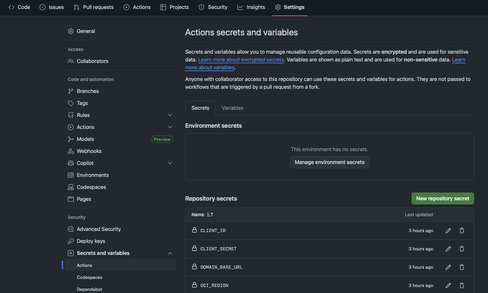

# Provision of the Github repo

## Introduction

In this lab, you will clone an existent Github repo and you will create one private repo of your own.
After that you will set the Secrets and Variables that will be used to exchange token
Estimated Time: 30 minutes

### **Objectives**

* Create a private Github repo.    
* Set the Variables and Secrtes for Github Action.

### **Prerequisites**

This lab assumes you have:

* An Oracle Cloud account.
* A Github account
* Administrator privileges or sufficient access rights to create and manage Integrated App, Service User, Group, IAM Policies in your tenancy.
* git installed
* OCI CLI installed and configured
* Github CLI installed and authenticated with your Github account

## Task 1: Create your private Github repo

1. using *git* you will clone the repository that contains the code for demonstrate the use of token in Github Action

- Run the command below to clone the repo

```
<copy>
git clone git@github.com:franciscvass/oci-token-exchange-ghaction.git
</copy>
```

- The above command should download the repo in _oci-token-exchange-ghaction_ folder

2. Create your Github repository

- change directory to _oci-token-exchange-ghaction_ and run the command to remove the origin of cloned repo

```
<copy>
git remote remove origin
</copy>
```

- check if your Github CLI is authenticated with your repo

```
<copy>
gh auth status
</copy>
```

- it shoud returns something like :
```text
  github.com
  ✓ Logged in to github.com account .... (keyring)
  - Active account: true
  - Git operations protocol: https
  - Token: pix_************************************
  - Token scopes: 'gist', 'read:org', 'repo'
```

3. Create your own private Github repo

- the command will create a repo named **oci-token-exchange-ghaction-test**
- if you want a different name replace _oci-token-exchange-ghaction-test_ with other name

```
<copy>
gh repo create oci-token-exchange-ghaction-test --private --source=. --push
</copy>
```

- You should see something like 

```text
✓ Created repository franciscvass/oci-token-exchange-ghaction-test on github.com
  https://github.com/franciscvass/oci-token-exchange-ghaction-test
✓ Added remote https://github.com/franciscvass/oci-token-exchange-ghaction-test.git
Enumerating objects: 17, done.
Counting objects: 100% (17/17), done.
Delta compression using up to 12 threads
Compressing objects: 100% (12/12), done.
Writing objects: 100% (17/17), 9.97 KiB | 9.97 MiB/s, done.
Total 17 (delta 0), reused 17 (delta 0), pack-reused 0 (from 0)
To https://github.com/franciscvass/oci-token-exchange-ghaction-test.git
 * [new branch]      HEAD -> main
branch 'main' set up to track 'origin/main'.
✓ Pushed commits to https://github.com/franciscvass/oci-token-exchange-ghaction-test.git
```

4. Check if in your Github account you have the repo you just created (i.e. oci-token-exchange-ghaction-test)

## Task 2: Create and update the Github Secrets and Variables

1. Make sure you have the Output from the previous Lab (Provision of the necessary resources) from Task 1: Provision OCI resources, step 4)

2. in the repo folder (i.e. _oci-token-exchange-ghaction_) go to _scripts_ folder

- you need to run _github_set_var_secrets.sh_ script and pass arguments to it like in example below

```text
./github_set_var_secrets.sh \
--region eu-frankfurt-1 \
--githubrepo franciscvass/oci-token-exchange-ghaction-test \
--tf_action apply \
--tf_var_bucket tf_bucket \
--tf_var_compartment_id ocid1.compartment..... \
--tf_var_key demo_token_exchange.tfstate \
--tf_var_namespace fgr7.... \
--client_id 776.... \
--client_secret idcs..... \
--domain_base_url "https://idcs-......xx.identity.oraclecloud.com" \
--oci_tenancy ocid1.tenancy.oc1..... \
--user_ocid ocid1.user.oc1......
```

- the arguments are described here
```text
- region 

The region where you deploy the resources

- githubrepo

This is of form "your github account"/"your github repository name"

- tf_action

Usually this is **apply**. Use **destroy** to destroy the resources

- tf_var_bucket

the name of an existing bucket where will store the terraform statefile

- tf_var_compartment_id

The ocid of comp where Github Action will create a simple VCN

- tf_var_key

the name of the terraform state file

- tf_var_namespace

the Namespace of your Tenant

- client_id 

The Client ID. You get this from the output generated in previous Task

- client_secret

The Client secret. You get this from the output generated in previous Task

- domain_base_url

This is the Domain URL from your Domain but remove the **:443** at the end
You get this from the output generated in previous Task

- oci_tenancy

Your tenancy ocid

- user_ocid

the Service user ocid. You get this from the output generated in previous Task
```

- after succesfully run the above command you should see something like:

```text
export VARS
TF_VAR_KEY=demo_token_exchange4.tfstate
TF_VAR_BUCKET=tfstate_bucket
TF_VAR_REGION=eu-frankfurt-1
TF_ACTION=apply
TF_VAR_NAMESPACE=idj....
TF_VAR_COMPARTMENT_OCID=ocid1.compartment.......
Set GH secrets
✓ Set Actions secret CLIENT_ID for franciscvass/oci-token-exchange-ghaction-test
✓ Set Actions secret CLIENT_SECRET for franciscvass/oci-token-exchange-ghaction-test
✓ Set Actions secret DOMAIN_BASE_URL for franciscvass/oci-token-exchange-ghaction-test
✓ Set Actions secret OCI_REGION for franciscvass/oci-token-exchange-ghaction-test
✓ Set Actions secret OCI_TENANCY for franciscvass/oci-token-exchange-ghaction-test
✓ Set Actions secret USER_OCID for franciscvass/oci-token-exchange-ghaction-test
set GH VARS
✓ Created variable TF_VAR_KEY for franciscvass/oci-token-exchange-ghaction-test
✓ Created variable TF_VAR_BUCKET for franciscvass/oci-token-exchange-ghaction-test
✓ Created variable TF_VAR_COMPARTMENT_OCID for franciscvass/oci-token-exchange-ghaction-test
✓ Created variable TF_VAR_NAMESPACE for franciscvass/oci-token-exchange-ghaction-test
✓ Created variable TF_VAR_REGION for franciscvass/oci-token-exchange-ghaction-test
✓ Created variable TF_ACTION for franciscvass/oci-token-exchange-ghaction-test
NAME                     VALUE                                               UPDATED
TF_ACTION                apply                                               less than a minute ago
TF_VAR_BUCKET            tfstate_bucket                                      less than a minute ago
TF_VAR_COMPARTMENT_OCID  ocid1.compartment.oc1..aaaaaaaars7ft6qwfjeft6c2...  less than a minute ago
TF_VAR_KEY               demo_token_exchange4.tfstate                        less than a minute ago
TF_VAR_NAMESPACE         idxua........                                       less than a minute ago
TF_VAR_REGION            eu-frankfurt-1                                      less than a minute ago
```

3. Check into your Github repo these Variables and Secrets

- Log into Github
- go to the repo you just created 
- Under Settings/Secrets and Variables/Acions you should see your Secrets and Variables 



You may now **proceed to the next lab**.

## Acknowledgements

**Authors**

* **Francisc Vass**, Principal Cloud Architect, NACIE
* Last Updated - Francisc Vass, January 2026
