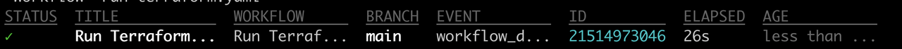
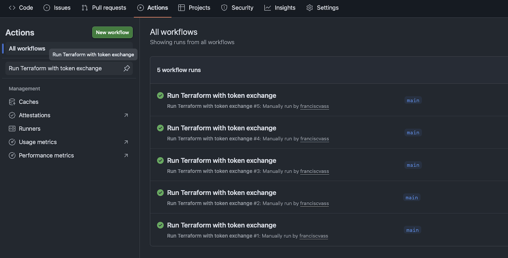

# Run the Github Action workflow 

## Introduction

In this chapter you will run the Github Action workflow. As a result a simple VCN will be created in your Tenancy

Estimated Time: 10 minutes

### **Objectives**

Hands-on experience with:

- Set a Github Variable  
- Run a Github Action with gh client
- Review the Github Action logs

### **Prerequisites**

* Completion of previous Labs.
* Github CLI installed and authenticated with your Github account

## Task 1 — Run the Github Action workflow

1. in a terminal , from within the repo folder run the command below

```
oci-token-exchange-ghaction/scripts % gh workflow list
```

- you will see something like below. Note the _ID_
```
NAME                               STATE   ID
Run Terraform with token exchange  active  228733475
```

2. Launch the workflow from command line

- run the command but replace the ID with your own:
```
oci-token-exchange-ghaction/scripts % gh workflow run 228733475
```

- the output should be like :

```
✓ Created workflow_dispatch event for run-terraform.yaml at main
To see runs for this workflow, try: gh run list --workflow="run-terraform.yaml"
```
- run the command to see the progrress

```
gh run list --workflow="run-terraform.yaml
```

- when it will finishes you should see:



- at this point you have the simple VCN created by the workflow in your tenancy.
- this can be seen in the workflow log

3. Review the workflow logs in Github UI

- Open the Github , go to your repo
- Under Actions Menu you should find all the runs
- Click on whatever run you want to see details 



4. Update the TF_ACTION Variables to _destroy_ and run the workflow again

- this action will destroy the created VCN
- run the command below to update the variable

 ```
 gh variable set TF_ACTION --body "destroy"
✓ Updated variable TF_ACTION for franciscvass/oci-token-exchange-ghaction-test
```

- run again the steps 1) and 2) to launch the same workflow
- When it finished the VCN is destroyed

You may now **proceed to the next lab**.

## Acknowledgements

**Authors**

* **Francisc Vass**, Principal Cloud Architect, NACIE
* Last Updated - Francisc Vass, Jan 2026
