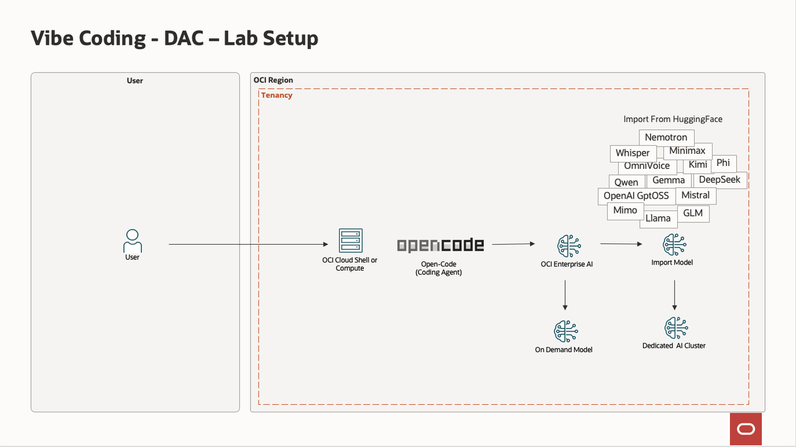
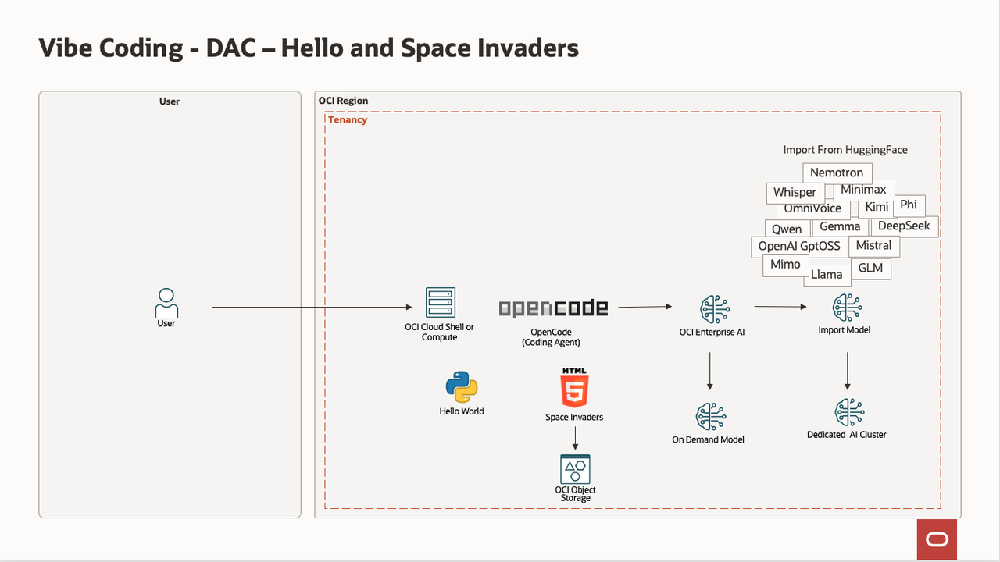

# Introduction

### Objectives

This lab introduces a modern, AI development workflow referred to as *Vibe Coding*—a practical approach that blends developer intuition with powerful AI tools to accelerate software delivery, improve code quality, and streamline operations.

Rather than focusing purely on theory, these labs are hands-on and iterative. You will progressively build programs using:
- a Large Language Model;
- an OpenAI-compatible API key;
- an on-demand model;
- or a Dedicated AI Cluster (DAC) to import open-weight models from Hugging Face.
    - See https://docs.oracle.com/en-us/iaas/Content/generative-ai/imported-models.htm.
    - For example, models include Alibaba Qwen, DeepSeek, Google Gemma, Meta Llama, Microsoft Phi, MiniMax, Mistral, Moonshot AI Kimi, NVIDIA Nemotron, OpenAI Whisper, OpenAI GptOss, and Z.ai GLM.
- a coding agent: OpenCode.

Estimated Workshop Time: 60 minutes

### What You Will Learn

In these labs, you will get an introduction to how to:
- Set up and configure a Vibe Coding environment on OCI.
- Deploy a Dedicated AI Cluster.
- Generate and execute code using natural-language prompts (Hello World and Space Invaders).

### Lab 1: Installation

You will then configure OCI to use Generative AI.
- Create a compartment.
- Configure a policy.
- Create OpenAI-compatible API keys.
- Optionally, explore setting up a DAC (Dedicated AI Cluster) using imported models such as Nemotron, Qwen, and Gemma.

### Lab 2: Vibe Coding 

You will start by setting up your development environment, installing and integrating OpenCode, and generating your first “Hello World” application.

## About This Workshop

You will have built several programs using Vibe Coding and deployed one in the cloud.

**Please proceed to the [next lab](#next).**

## Acknowledgements

- **Author**
    - Marc Gueury, AI Agents Black Belt
