# Hello World, Game and Mobile App

## Introduction
In this lab, you will install OpenCode for Vibe Coding and generate:
- a small Hello World application,
- a Space Invaders game,
- a Mobile Application to order food in a restaurant.

Estimated time: 30 min

### Objectives

- Install OpenCode in Cloud Shell.
- Vibe-code two applications.

### Prerequisites

Complete the previous lab.

## Task 1: Install OpenCode in Cloud Shell

To avoid installing OpenCode on your laptop, although you can also use OpenCode or OpenCode Desktop on it, we will use OCI Cloud Shell.

For more information: https://opencode.ai/

1. Start Cloud Shell.

2. Install OpenCode.

    ````
    <copy>    
    cd $HOME
    wget https://livelabs.oracle.com/cdn/oci/oci-vibe-dac-lab/2-hello-game/files/oci-vibe-dac.zip
    unzip oci-vibe-dac.zip
    cd oci-vibe-dac
    cat install_opencode.sh
    ./install_opencode.sh
    </copy>    
    ````

    If you have issue with the above link, you can also clone from the original git repo.
    ````
    <copy>    
    cd $HOME
    git clone https://github.com/mgueury/oci-vibe-dac.git
    ...
    </copy>    
    ````

    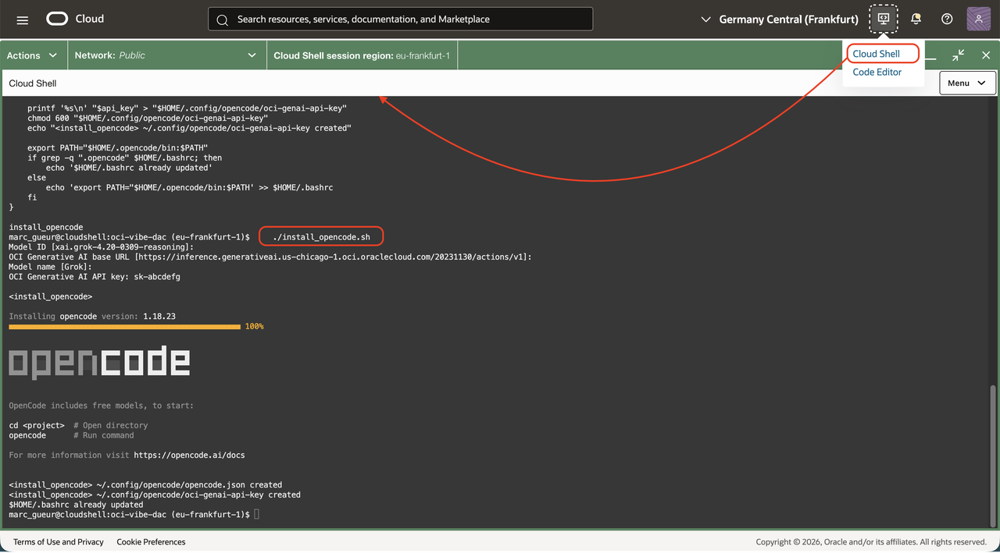    

    You will be asked some questions. The answers depend on whether you use a Dedicated AI Cluster.
    - Without a DAC:
        - If you have access to the Chicago region, use the proposed default value.
        - Or look up the model and region here: https://docs.oracle.com/en-us/iaas/Content/generative-ai/model-endpoint-regions.htm. Find the base URL here: https://docs.oracle.com/en-us/iaas/api/#/en/generative-ai-inference/20231130/
        - Here is an example:    
            - Model ID: ex: *xai.grok-4.20-0309-reasoning*
            - OCI Generative AI base URL: *https://inference.generativeai.us-chicago-1.oci.oraclecloud.com/20231130/actions/v1*
            - Model name: *Grok*
            - API Key: *sk-xxx* (see your notes in previous lab)
    - With Dedicated AI Cluster (DAC): 
        - Model ID: ex: *ocid1.generativeaiendpoint.oc1.xxxxxx.amaaaaaaxxxx*
        - API Key: *sk-xxx* (see your notes in previous lab)

3. Create an Object Storage bucket.

    Run the script:
    ````
    <copy>    
    cd $HOME/oci-vibe-dac
    ./bucket_create.sh
    -> Enter the Compartment OCID. See your notes in previous lab.
    </copy>    
    ````
    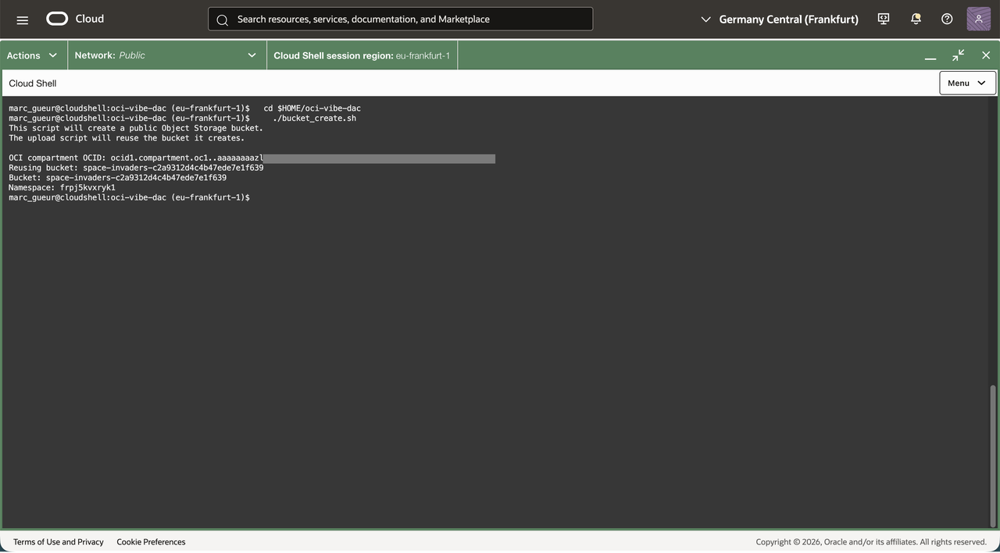    

## Task 2: Hello World

1. Start OpenCode in the hello directory:

    ````
    <copy>    
    cd $HOME/oci-vibe-dac/hello
    opencode
    </copy>    
    ````

2. Type: **Who are you?**

    Notice that you receive the name of the coding agent rather than the AI model.

3. Type: **What AI model do you use?**

    Now, you should get the AI model name.

    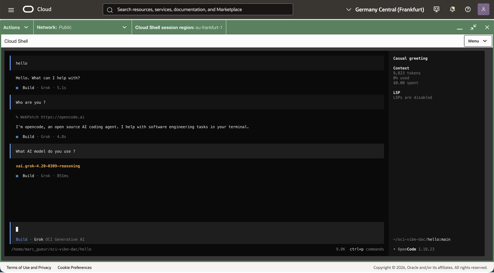

4. Type: *Create a file with hello world in Python.*

5. Type: *Execute it. Show the output.*

    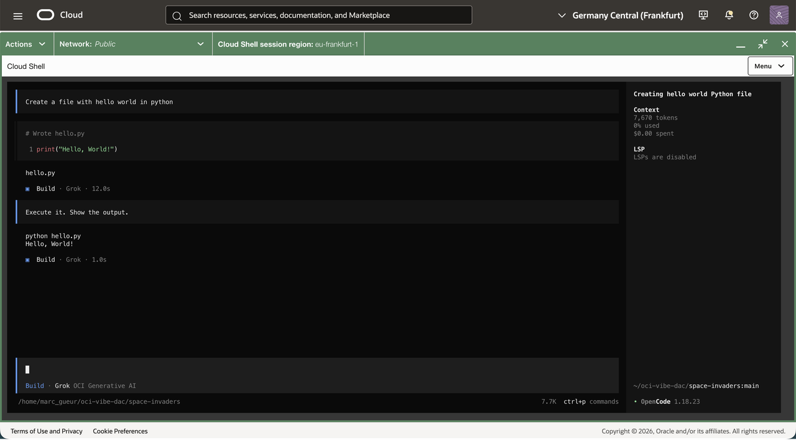

6. Optionally, ask the same in Java, Node.js, Go, or another language.

7. Exit (press CTRL+C).

## Task 3: Space Invaders

1. Start OpenCode in the space-invaders directory.

    ````
    <copy>    
    cd $HOME/oci-vibe-dac/space-invaders
    opencode
    </copy>    
    ````

2. In the OpenCode prompt, type: *Write a Space Invaders game in HTML, JavaScript, and CSS.*

    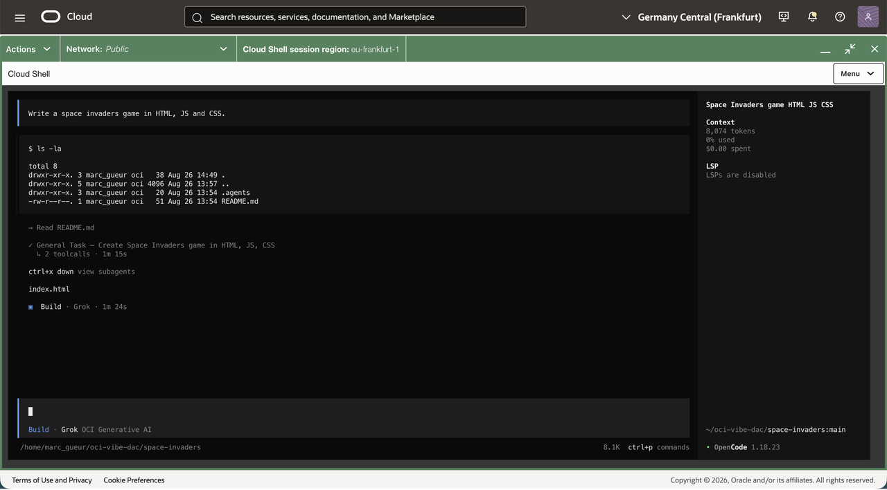

3. Type: *Deploy it.*

   This uses a skill explained later in Task 5.

    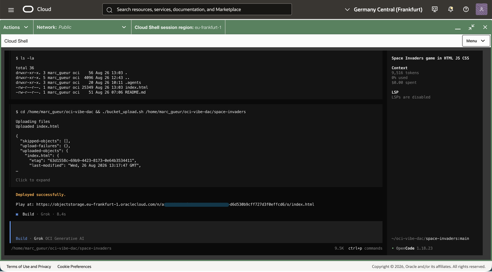

    You will receive a URL, for example: https://objectstorage.eu-frankfurt-1.oraclecloud.com/n/xxxx/b/space-invaders-xxxxx/o/index.html

    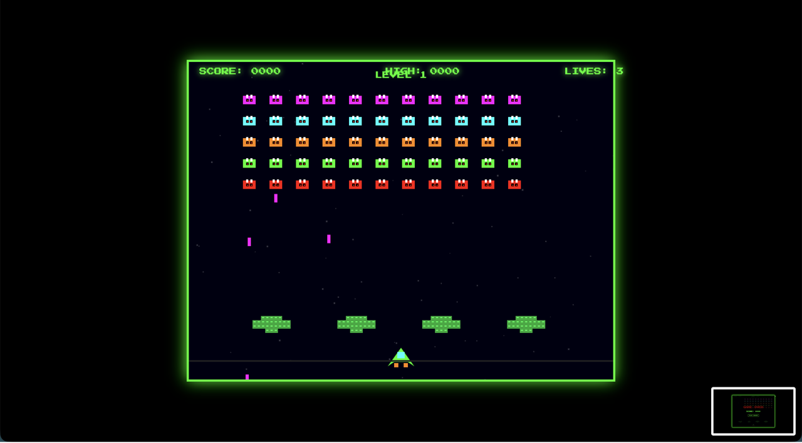

## Task 4: Space Invaders: plan + build

1. Return to OpenCode.
2. In the OpenCode prompt, press Tab. The agent will switch to Plan mode.

    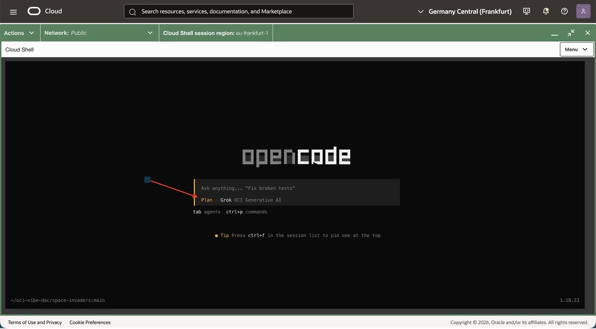

3. Type: *Add a bonus flying saucer at the top of the screen. The speed is too slow.*

    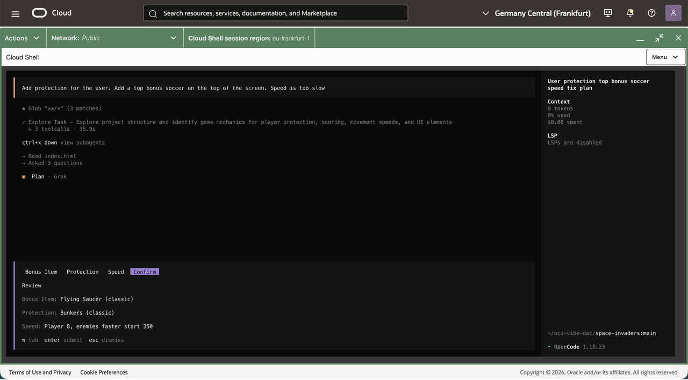

4. OpenCode will ask some questions. Answer them, and then OpenCode will generate a plan.

    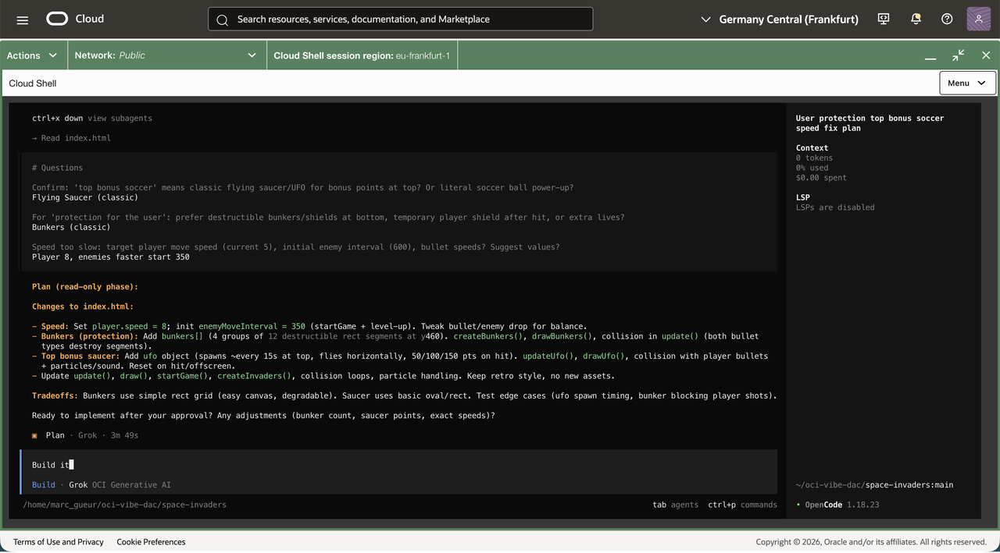

5. When ready, press Tab again to switch to Build mode. Then type: *Build it.*

    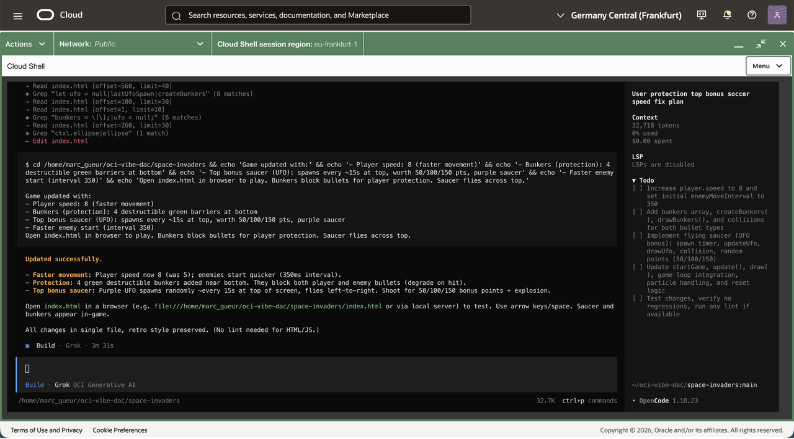

6. Check whether the flying saucer is there.

    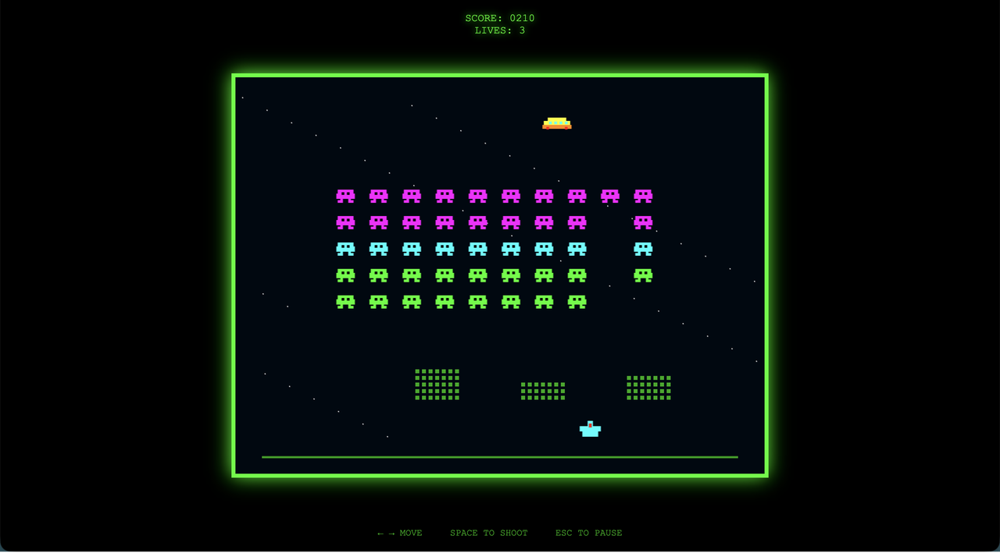

7. Exit (press CTRL+C).

## Task 5: Mobile : plan + build

1. Start OpenCode in the space-invaders directory.

    ````
    <copy>    
    cd $HOME/oci-vibe-dac/mobile
    opencode
    </copy>    
    ````

2. In the OpenCode prompt, press Tab. The agent will switch to Plan mode.

    

3. Type: *Write an HTML mobile application to order food in a restaurant.*

4. OpenCode will ask some questions. Answer them, and then OpenCode will generate a plan.

5. When ready, press Tab again to switch to Build mode. Then type: *Build it.*

6. Ask to deploy it: *Deploy*. Click on the HTML link.

    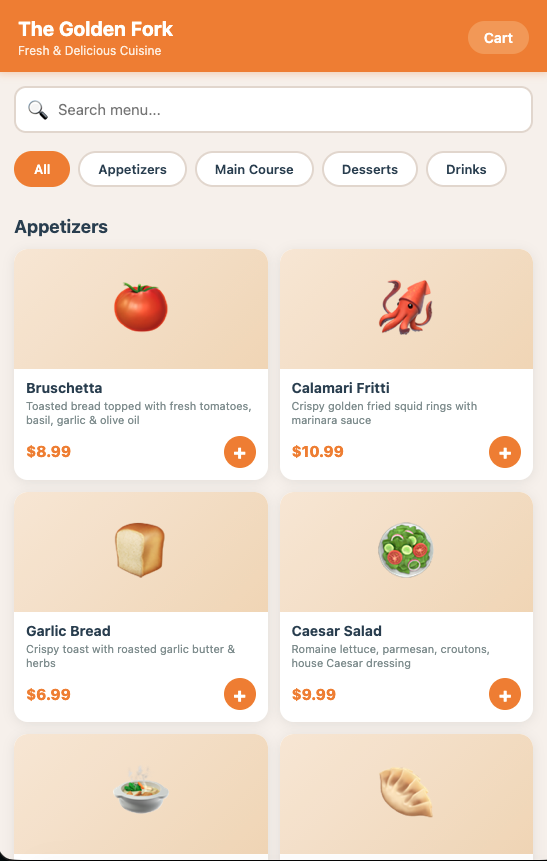
    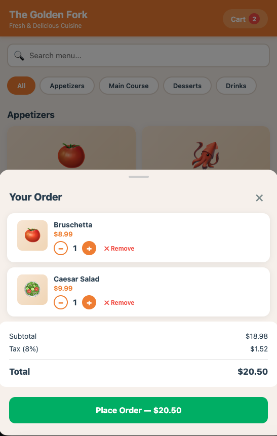
    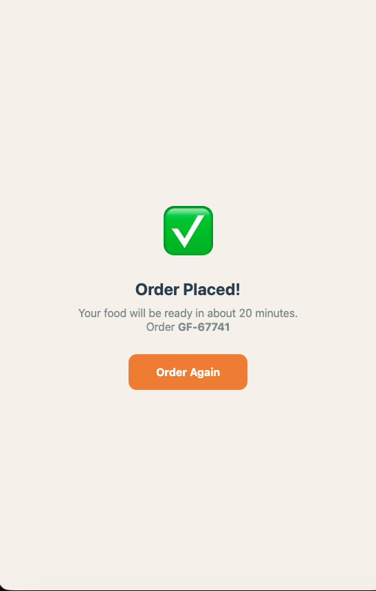

## Task 6: Skills

During the two previous tasks, you used the deploy skill several times. It is a kind of prompt that defines a workflow or process. Let’s look at it.

```
<copy>    
cd $HOME/oci-vibe-dac/space-invaders/.agents/skills/deploy/
cat SKILL.md
</copy>  
```

```
<copy>  
---
name: deploy
description: Deploy the files in the current project directory to its existing OCI Object Storage bucket. Use when asked to upload, publish, or deploy the project from the current working directory after the bucket has been created.
---

# Deploy the Current Project

1. Treat the current working directory as the project to upload; do not change directories before running:

'''bash
project_directory=$(pwd -P)
repository_root=$(git rev-parse --show-toplevel)
'''

2. Verify that `$repository_root/.bucket-name` exists and is nonempty. If it is missing, stop and tell the user to run `bucket_create.sh` first; do not create a bucket.
3. Upload the recorded project directory with the repository uploader:

'''bash
"$repository_root/bucket_upload.sh" "$project_directory"
'''

4. Show the end user the public HTML URL(s) given at the end of the script.
</copy>  
```

When we asked for deployments during the chat with the coding agent, it used the SKILL.md file as the process for completing the request.

For more information: https://agentskills.io/home

" At its core, a skill is a folder containing a SKILL.md file. This file includes metadata (name and description, at minimum) and instructions that tell an agent how to perform a specific task. Skills can also bundle scripts, reference materials, templates, and other resources. "

## Task 7: More models

Try other models and repeat the exercises. New models are available regularly, and they are improving rapidly in performance and quality.

## END

Congratulations! You have finished the lab!!
We hope you have learned something useful.

## Acknowledgements

- **Author**
    - Marc Gueury, AI Agents Black Belt
    - Ilayda Temir, Generative AI Black Belt
