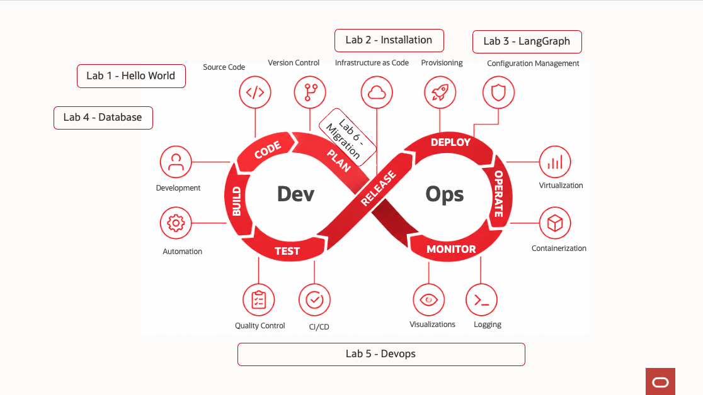
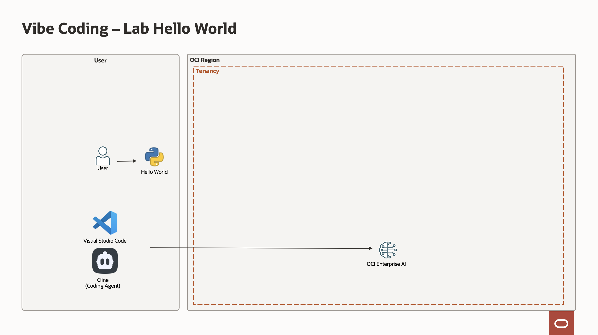
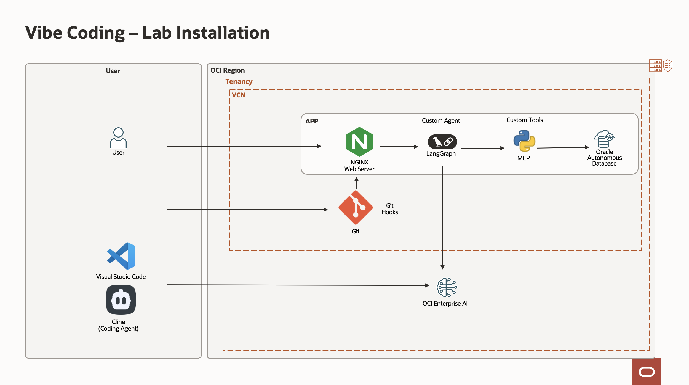
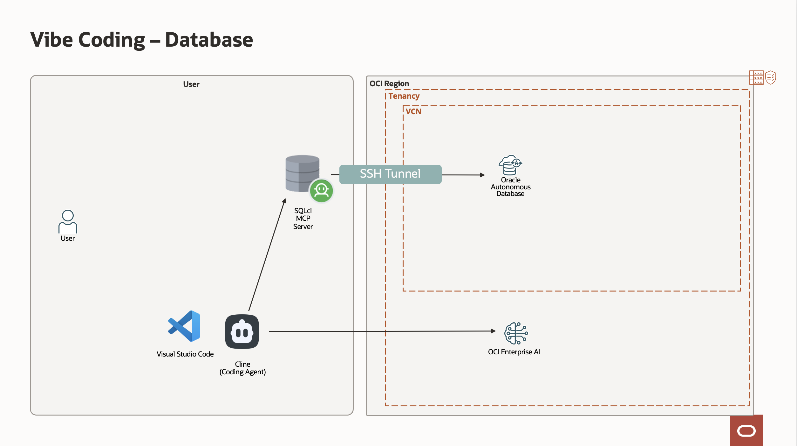
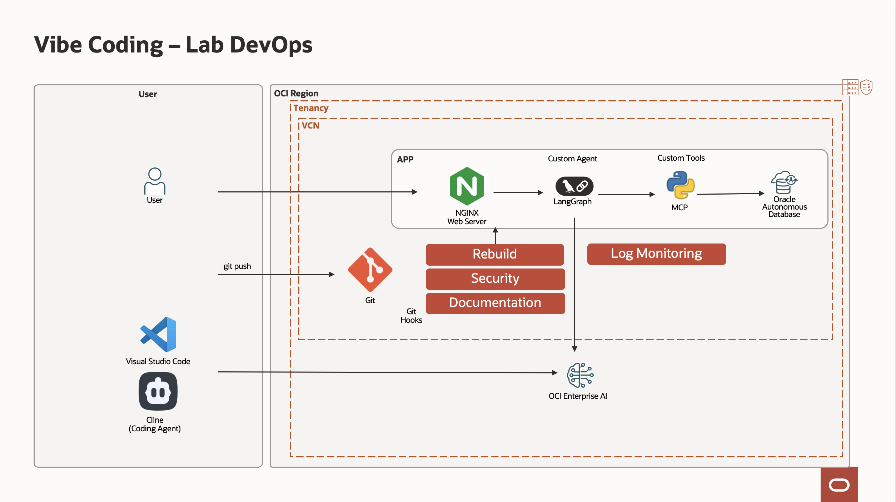
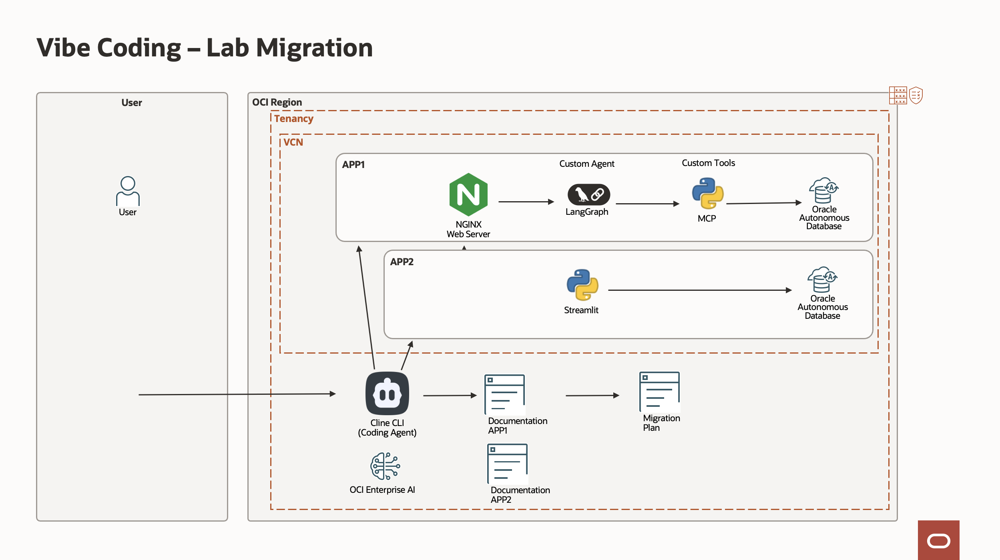

# Introduction

## Lab Overview

This lab introduces a modern, AI development workflow referred to as *Vibe Coding*—a practical approach that blends developer intuition with powerful AI tools to accelerate software delivery, improve code quality, and streamline operations.

Rather than focusing purely on theory, these labs are hands-on and iterative. You will progressively build, connect, and evolve a full-stack environment using tools like:
- Cline (Open Source Coding Agent)
- Visual Studio Code 
- LangGraph
- MCP servers 
- and OCI Enterprise AI Large Language Models

Each lab builds on the previous one, guiding you from initial setup to production-level practices including database integration, orchestration, migration strategies, and operational monitoring.

Estimated Workshop Time: 120 minutes

### What You Will Learn

In these labs, you will get an introduction how to:
- Set up and configure Vibe Coding environment on your laptop  
- Generate and execute code using natural language prompts  
- Deploy and extend AI orchestration frameworks using LangGraph and MCP  
- Automate documentation and security check  
- Discover tables and generate SQL, PL/SQL with databases  
- DevOps: Documentation, Security, Monitoring
- Design migration strategies between projects  

### Lab 1: Vibe Coding Fundamentals

You will start by setting up your development environment. This includes configuring API keys, installing and integrating Cline with Visual Studio Code, and generating your first “Hello World” application. You will also explore setting up a DAC (Dedicated AI Cluster) using Imported Models such as Nemotron, Qwen, Gemma, ...

### Lab 2: Installation

You will then install a Virtual Machine that contains a program using LangGraph + MCP and a database. We will use them in the rest of the lab.

### Lab 3: LangGraph + MCP Server

You will generate documentation of the program above for technical and end-user. Modify the existing program by adding a new tables and tools to the LangGraph Agent.

### Lab 4: Database Integration

This lab focuses on connecting with databases. You will configure SQLcl with MCP, establish secure connections, and use AI to automatically generate database documentation as well as SQL and PL/SQL statements.

### Lab 5: DevOps and production monitoring

We will introduce operational best practices using DevOps and AI. By adding GIT hooks, including documentation hooks, security and redeployment at the time of "git push". We will also monitor logs using AI.

### Lab 6: Migration Strategy

In this final lab, you will design and automate project migration workflows. Using chained Cline CLI commands, you will compare two projects and generate a structured migration plan.

## About This Workshop

You will have built a complete AI development pipeline, from first prompt to production monitoring, while learning how to integrate tools, enforce security, and automate complex engineering tasks with confidence.

**Please proceed to the [next lab](#next).**

## Acknowledgements

- **Author**
    - Marc Gueury, AI Agents Black Belt
    - Ilayda Temir, Generative AI Black Belt
