# Setup and Hello World

## Introduction
In this lab, you will set up your laptop for Vibe Coding and generate a small Hello World application.

Estimated time: 45 min

### Objectives

- Configure OCI Generative AI access, Visual Studio Code, and Cline, then generate a Hello World app.

### Prerequisites

- An OCI Account with sufficient credits where you will perform the lab. (Some of the services used in this lab are not part of the *Always Free* program.)
- Check that your tenancy has access to a Generative AI region, such as **Frankfurt, London, or Chicago**. See the full list here: https://docs.oracle.com/en-us/iaas/Content/generative-ai/regions.htm
    - For Paid Tenancy
        - Click on region on top of the screen
        - Check that the Frankfurt or London or Chicago Region is there
        - If not, Click on Manage Regions to add it to your regions list. You need tenancy admin rights for this.
        - For example, click on the US Midwest (Chicago).
        - Click Subscribe

    

    - For Free Trial, the home region should be one where Generative AI On Demand is available.
- The lab is using Cloud Shell with Public Network.

    The lab assumes that you have access to OCI Cloud Shell with Public Network access.
    To check if you have it, start Cloud Shell and you should see **Network: Public** on the top. If not, try to change to **Public Network**. If it works, there is nothing to do.
    

    OCI Administrators have that right automatically. Or your administrator may have already added the required policy.
    - **Solution:**

        If not, please ask your Administrator to follow this document:
        
        https://docs.oracle.com/en-us/iaas/Content/API/Concepts/cloudshellintro_topic-Cloud_Shell_Networking.htm#cloudshellintro_topic-Cloud_Shell_Public_Network

        He/She just needs to add a policy to your tenancy:

        ```
        <copy>
        allow group <GROUP-NAME> to use cloud-shell-public-network in tenancy
        </copy>        
        ```

## Task 1: Prepare to save configuration settings

1. Open a text editor and copy & paste this text into a text file on your local computer. These will be the variables that will be used during the lab.

    ```
    <copy>
    List of ##VARIABLES##
    =====================
    YOUR_IP_FILTER=(SAMPLE) xx.xx.xx.xx/32
    REGION=(SAMPLE) eu-frankfurt-1
    COMPARTMENT_OCID=(SAMPLE) ocid1.compartment.oc1.xxxxxxx
    api-key1=(SAMPLE) sk-xxxxxxxxxxxxxx
    api-key2=(SAMPLE) sk-xxxxxxxxxxxxxx
    Optional
    ========
    hugging-face-token=(SAMPLE) hf_xxxxxxxxxxxxxxxxxxxx
    DAC endpoint OCID=(SAMPLE) ocid1.generativeaiendpoint.oc1.xxxxxxxxxx
    BASE_URL=(sample) https://inference.generativeai.eu-frankfurt-1.oci.oraclecloud.com/openai/v1/chat/completions

    Terraform Output
    ================
    
    -----------------------------------------------------------------------
    Build done
    URLs
    - User Interface: http://123.123.123.123/
    - REST: http://123.123.123.123/app/threads

    -----------------------------------------------------------------------
    DB connection:

    DB_USER=admin
    DB_PASSWORD=xxxxxxx
    DB_URL=(description=(retry_count=20)(retry_delay=3)(address=(protocol=tcps)(port=1521)(host=xxxxxxxx.adb.us-chicago-1.oraclecloud.com))(connect_data=(service_name=yyyyyyyyyy_medium.adb.oraclecloud.com))(security=(ssl_server_dn_match=no)))

    In terminal 1, open the ssh tunnel
      ssh -L1521:xxxxxxx.adb.us-chicago-1.oraclecloud.com:1521 opc@123.123.123.123
    In terminal 2, save the connection to the database.
      $HOME/oracle/sqlcl/bin/sql /nolog
      conn -savepwd -save adb admin@(description=(retry_count=20)(retry_delay=3)(address=(protocol=tcps)(port=1521)(host=localhost))(connect_dat. a=(service_name=yyyyyyyyyy_medium.adb.oraclecloud.com))(security=(ssl_server_dn_match=no)))
      xxxxxxx
      select * from dept;
      exit    

    -----------------------------------------------------------------------
    Vibe Coding (Build done in Bastion):

    1. Check that you can login from your laptop to the bastion using the private key associated with your_public_ssh_key in terraform.tfvars
    > ssh opc@123.123.123.123
    2. Clone the git repo of the starter app in your laptop
    > git clone opc@123.123.123.123:~/app.git app
    > cd app
    3. Do some changes with your favorite editor.
    4. Check what git_push.sh does and run it.
    > ./git_push.sh
    The build will start automatically in the bastion and redeploy the app.

    5. If you want to see the log. ssh opc@123.123.123.123
    > cat compute/rebuild.log
    > cd app/xxxx
    > cat xxxx.log
    -----------------------------------------------------------------------
    </copy>
    ```  

## Task 2: Create a Compartment

The compartment will be used to contain all the components of the lab.

You can
- Use an existing compartment to run the lab 
- Or create a new one (recommended)

1. Login to your OCI account/tenancy
2. Double-check that you are in a region with GenAI available.
3. Go to the 3-bar/hamburger menu of the console, then Identity & Security > Compartments.
    
4. Click ***Create Compartment***
    - Give a name: ex: ***VIBE-AI***
    - Then again: ***Create Compartment***
    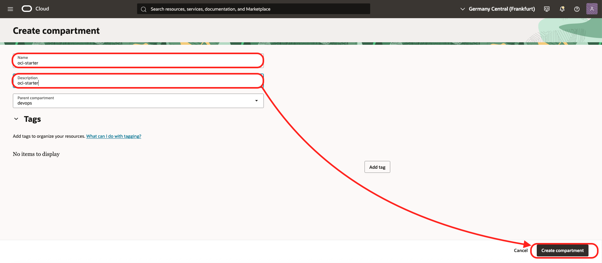
5. When the compartment is created copy the compartment ocid ##COMPARTMENT_OCID## and put it in your notes

## Task 3: Create an API Key 

First, create an OpenAI-compatible API key.
1. Login to the OCI Console. Put the region name in your notes. ##REGION##. You should be in a region with Generative AI. See the full list here: https://docs.oracle.com/en-us/iaas/Content/generative-ai/regions.htm
2. Click the hamburger menu / AI & Analytics / Generative AI.

    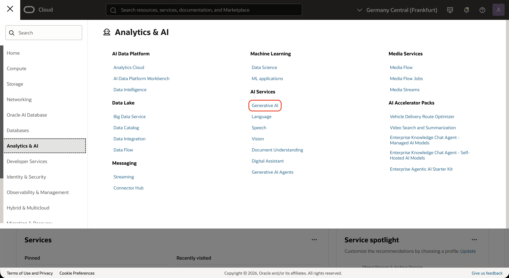

3. Go to the API Key on the right side.
4. Click **Create API key**.

    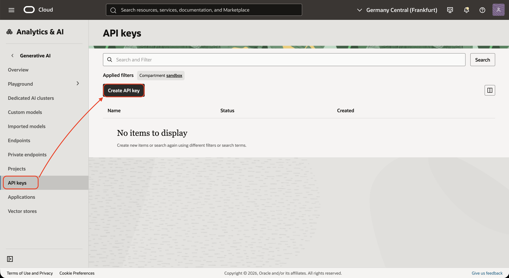

5. Fill:
    - Name: **api-key**
    - Key one name: **api-key1**
    - Key one expiration date: **7/20/2030** (date far in the future)
    - Key two name: **api-key2**
    - Key two expiration date: **7/20/2030** (date far in the future)
    - Click *Create*.

    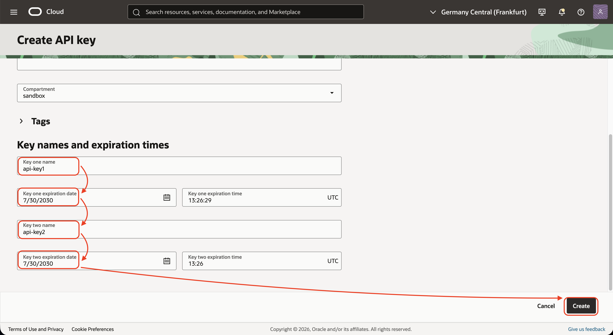

6. Copy the values of the two keys in your notes (##api-key1##, ##api-key2##).
    - api-key1=sk-xxxxxxxxx
    - api-key2=sk-xxxxxxxxx
    - Click **Close**.
While you can choose any model of any provider to continue this lab, we will go through several models available in OCI.

## Task 4: Create a Policy

- Go to the OCI Console menu, and choose *Identity & Security* / *Policies*
    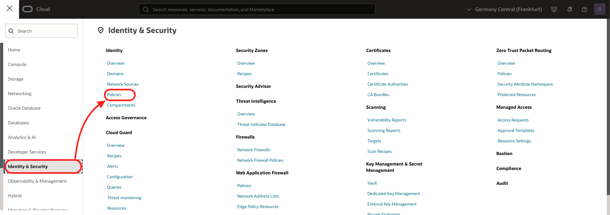
- Click *Create Policy*
- Name: *policy-vibe*
- Description: *policy-vibe*
- Click *Show Manual editor*
- Copy this with your value of ##COMPARTMENT\_OCID##
    ```
    allow any-user to manage generative-ai-response in compartment id ##COMPARTMENT\_OCID## where request.principal.type = 'generativeaiapikey'
    ```
- Click *Create*
    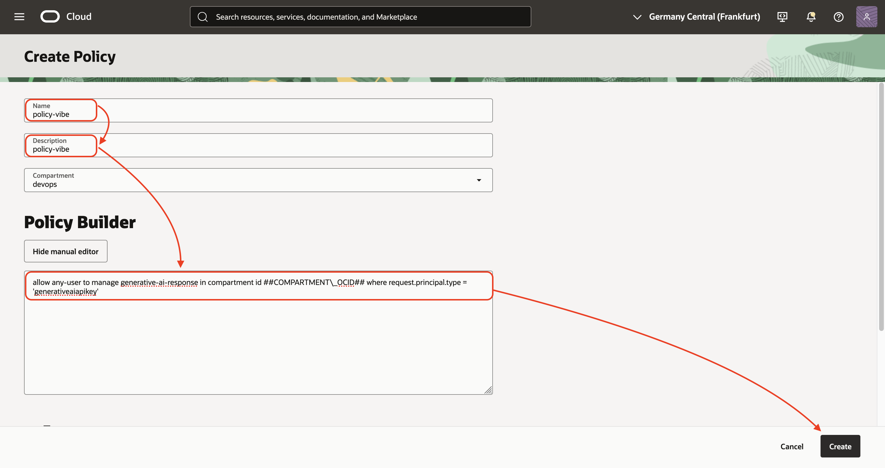

## Task 5: Install Visual Studio Code + Cline

1. Download and install VS Code. See [Download Visual Studio Code](https://code.visualstudio.com/download)
2. Install the Cline extension.
    - Open VS Code, and click Extensions on the sidebar.
    - Enter *cline* in the search field. When it appears, click *Install*, then click *Trust Publisher and Install* to proceed.
    - The extension is installed and appears on the sidebar.

While you can choose any model of any provider to continue this lab, we will go through several models available in OCI.

## Task 6: Configure your AI Model

1. Back to Visual Studio Code
2. Go to the Cline model configuration
    - Click on Cline (on the sidebar)
    - Click on the settings icon

    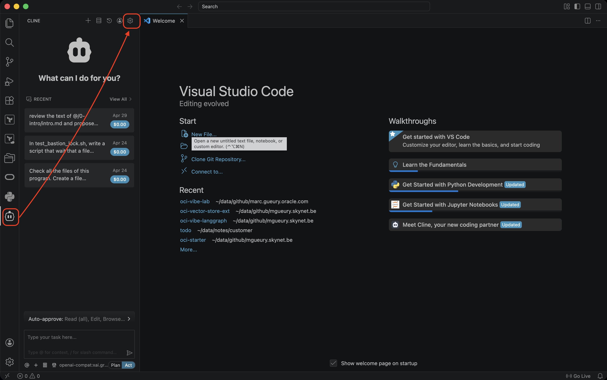

3. Go to the Cline model configuration
    - API Provider: **OpenAI Compatible**
    - Base URL: ex: 
        - Choose your region: https://docs.oracle.com/en-us/iaas/api/#/en/generative-ai-inference/20231130/
        - Ex: https://inference.generativeai.us-chicago-1.oci.oraclecloud.com/20231130/actions/v1
    - OpenAI Compatible API Key
        - Choose a model: https://docs.oracle.com/en-us/iaas/Content/generative-ai/model-endpoint-regions.htm#top
        - Ex: *xai.grok-4.3*
    - Click **Done**

    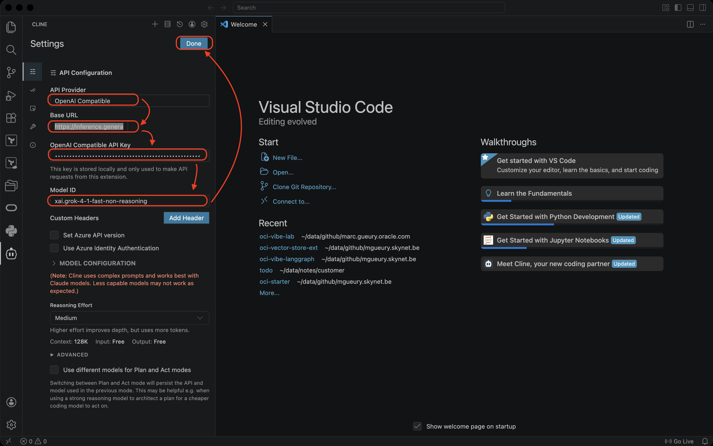

4. Test whether Cline answers.
    - Who are you?
    
    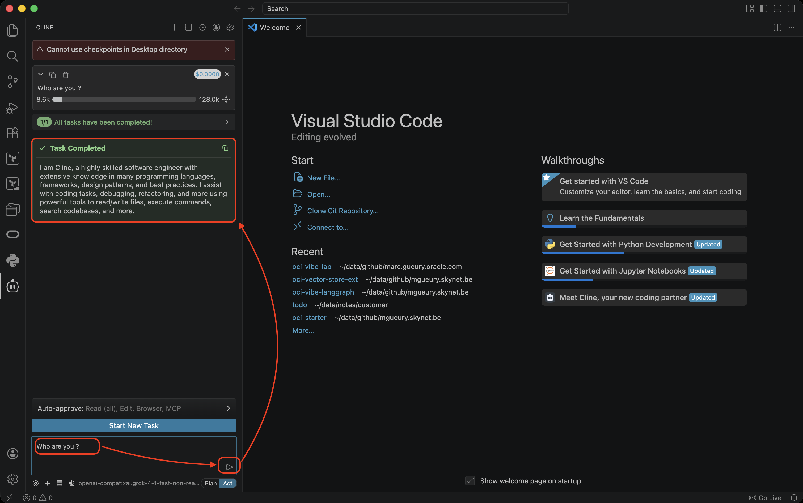

    - Choose the OpenAI Compatible mode 

## Task 7: Hello World

Back in Cline. Try the simple example possible.

1. In your operating system, create a directory **vibe**
2. In that vibe directory, create a directory **hello_world**
3. In Visual Studio, open menu *File / Open Folder...*. Choose the **hello_world** directory. It is empty.
4. Start Cline. In the Cline prompt, type: **Write hello world in python**

    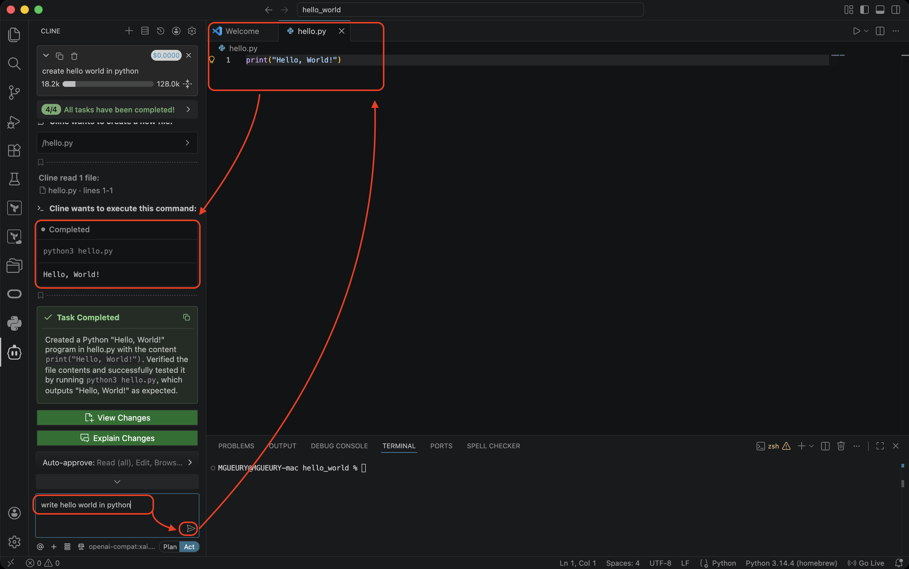

5. Check the result. It will ask to run the command. 

6. If it does not work because for example, python is not installed on your system, install it.
    By example on MacOS: 
    - Install Brew: https://brew.sh/
    - Run in a terminal: **brew install python**
    - Restart the hello\_world.py: python3 hello\_world.py

## Task 8: (Optional) Install a Dedicated AI Cluster (DAC)

⚠️ This optional task starts a GPU for at least one hour, so it may cost several euros per hour. Confirm with your OCI Cloud Administrator first, and stop the DAC after testing.

We will follow this process: https://docs.oracle.com/en-us/iaas/Content/generative-ai/imported-models.htm

DAC-hosted models run on dedicated infrastructure in your tenancy. Use a DAC-hosted model when you need production-grade control over model hosting and inference. DACs provide several advantages:

- **Flexibility:** Import supported Hugging Face-format models from Hugging Face or Object Storage, test imported models with shorter commitments, choose fine-tuned or quantized versions, and right-size based on visible hardware specifications.
- **Isolation:** Run workloads on dedicated GPU resources inside your tenancy, which helps protect sensitive data, avoids shared-resource contention, and supports regulated workloads.
- **Predictable latency:** Dedicated infrastructure can provide more stable time-to-first-token and inference response times than shared model endpoints, especially for scaling production applications.
- **Fine-tuning support:** Host fine-tuned models alongside base models, run multiple fine-tuned models on a single cluster, and control model lifecycle and upgrade cadence.
- **Cost efficiency at scale:** For inference-heavy workloads, DACs can reduce effective price per token by keeping dedicated resources highly utilized and hosting multiple models on one cluster.
- **Deployment near data:** Deploy in supported OCI regions, including regulated regions where available, to support data residency, lower latency, and simpler security reviews.
- **Simplified management:** OCI manages the infrastructure while you manage model deployment, scaling, fine-tuning, and application integration.

Documentation: https://docs.oracle.com/en-us/iaas/Content/generative-ai/import-model-from-hugging-face.htm#top

1. Create a Hugging Face token.
    - Open https://huggingface.co/ in your browser
    - Login or Sign Up.
    - Go to Hugging Face / Settings / Access Tokens
    - Click  **Create new token**
        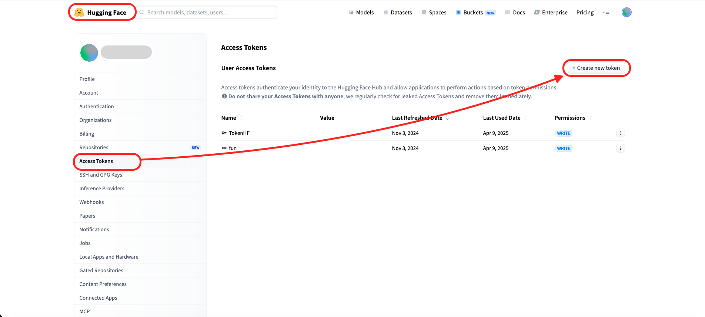    
    - Use either a read token (easier) or, preferably for production, a fine-grained token scoped to the model repository.
    - Copy the token in your notes ##hugging-face-token##
        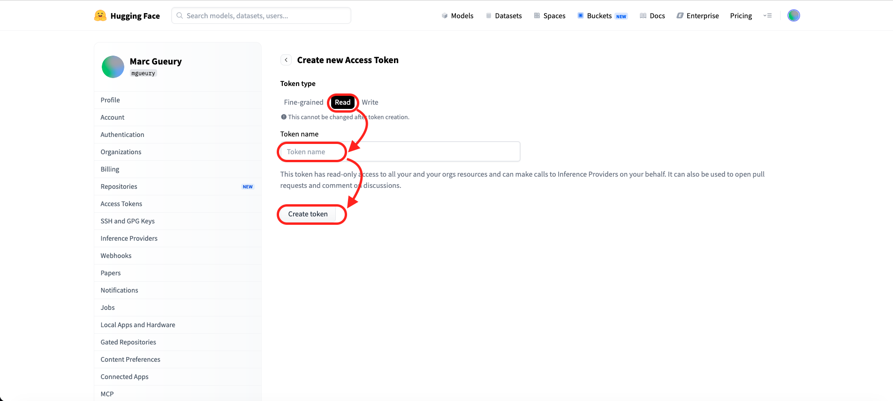    
2. In OCI Console, go to Analytics & AI / Generative AI / Imported models.
3. Click **Create Imported model**.
    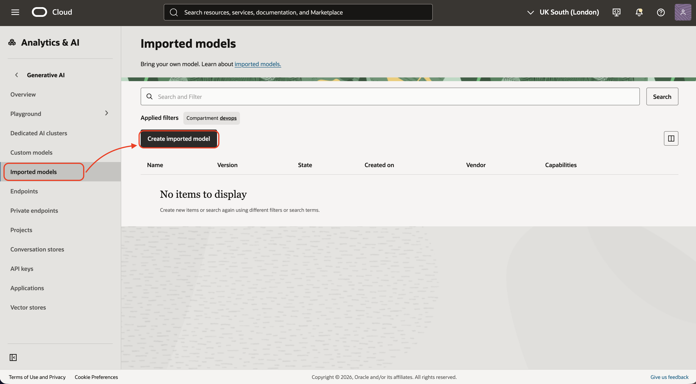 
4. Enter model metadata:
    - When you read this lab, the new model are added so fast that the list will be different.  Choose the best for you. Here, we use this model from NVIDIA. https://docs.oracle.com/en-us/iaas/Content/generative-ai/imported-nvidia-models.htm
    - Name: **NVIDIA-Nemotron-3-Nano-30B-A3B-FP8**
    - Description (optional): **Imported directly from Hugging Face**
    - Vendor (optional): **NVIDIA**
    - Version (optional): **1.0**
5. In Import configuration:
    - Data source type: **HuggingFace**
    - Model ID: **nvidia/NVIDIA-Nemotron-3-Nano-30B-A3B-FP8**
    - HuggingFace Token: paste the copied token ##hugging-face-token##
        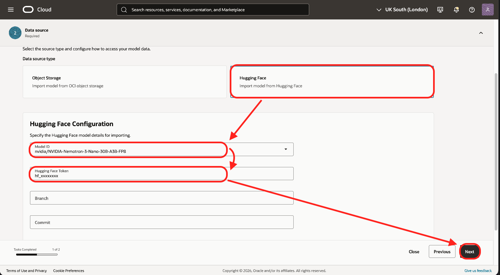  
6. Click **Next**. Then **Save** and wait until Imported Model is Active. It takes for this model about 3 mins.
7. On the menu on the left, go to Dedicated AI clusters.
8. Click **Create dedicated AI cluster**
    - Name: **dac-vibe***
    - Base model: **nvidia/NVIDIA-Nemotron-3-Nano-30B-A3B-FP8**
    - Unit shape: **H100 X4** (or **H100 X2** if you accept that it will be slower)
    - Model replica: **1**
    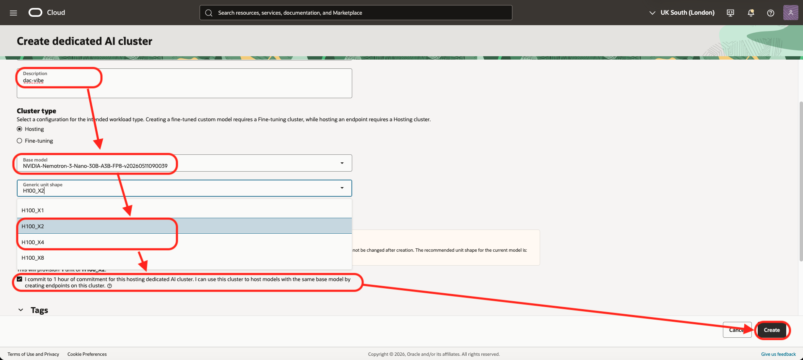     
9. Wait until DAC is Active. 
10. Go to Endpoints.
    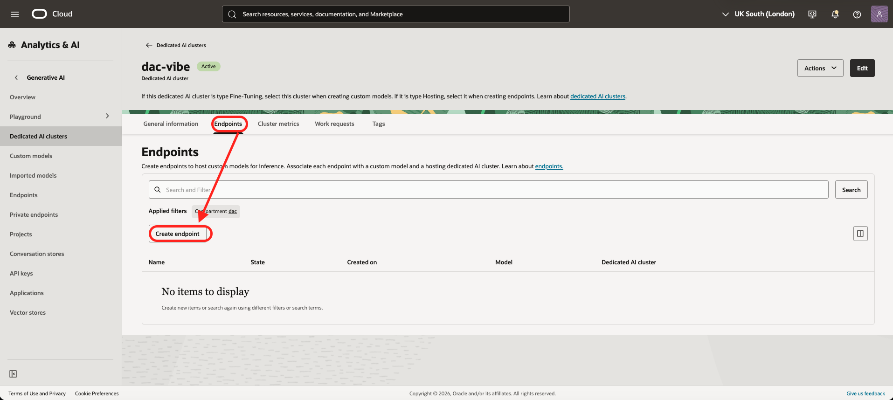 
11. Click **Create endpoint**
    - Name: **dac-endpoint***
    - Model: **NVIDIA-Nemotron-3-Nano-30B-A3B-FP8**
    - Click **Create**
    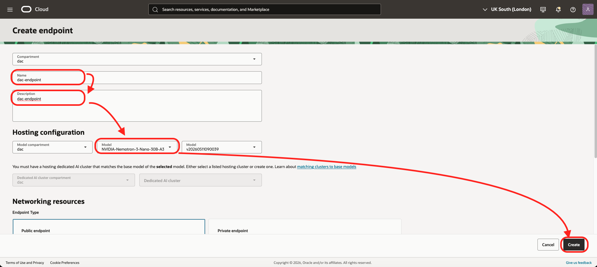     
12. When the Endpoint is Active (it can take 15 mins or more depending of model size). Try it in the **View in Playground** on the top left. Try "tell me a joke" or "who are you" ?
    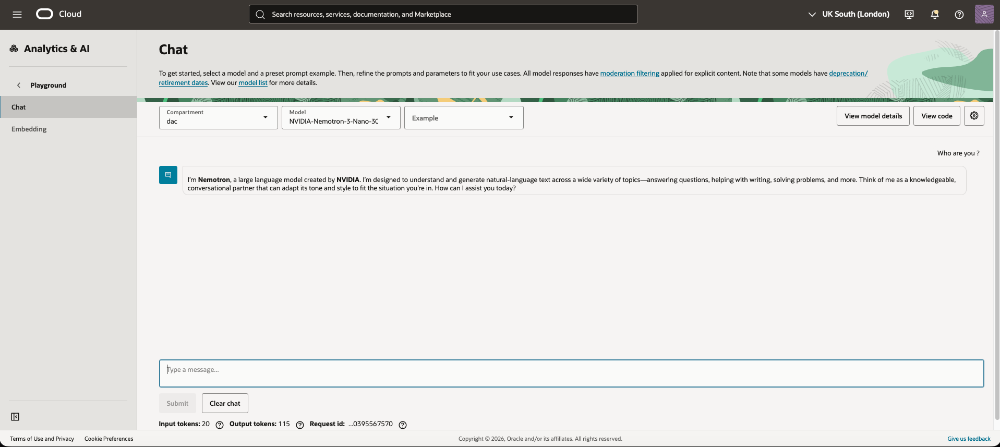     

## Task 9: (Optional) Configure Cline for a DAC-hosted model

Use the active DAC endpoint you created in Task 8. Keep note of these values:
1. Take notes of these values
    - DAC endpoint OCID ##DAC endpoint OCID##.

        In the Dedicate AI Cluster, go to the General tab and copy the DAC Endpoint OCID:
        ```
        ocid1.generativeaiendpoint.<region>..<unique_id>
        ```
    - Base URL 
        It looks like this:
        ```
        https://inference.generativeai.<region>.oci.oraclecloud.com/openai/v1/chat/completions
        ```

        Example, replace by your regions prefix, for UK South London (uk-london-1):

        ```
        https://inference.generativeai.uk-london-1.oci.oraclecloud.com/openai/v1/chat/completions
        ```
    - We will use OCI Generative AI API key you created earlier in this lab.
2. Configure Cline:
    - Open Visual Studio Code
    - Open the Cline panel
    - Click the Settings icon
    - Under API Provider, select **OpenAI Compatible**
    - Set Base URL to the full Chat Completions URL
    - Paste your OCI Generative AI API key into the API Key field
    - Set Model ID to your DAC endpoint OCID
    - Click **Done**
        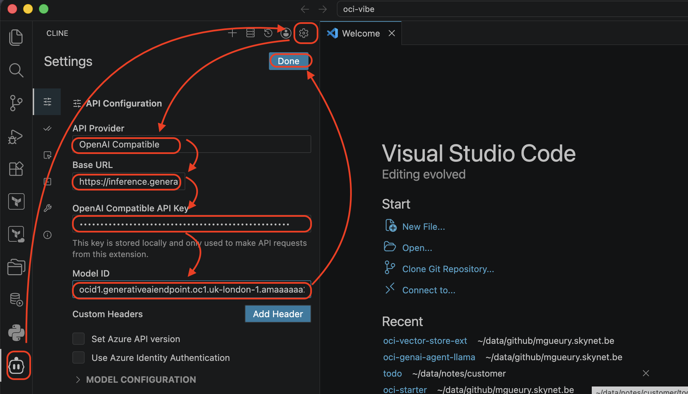  
    - Back in Cline  Retry the 2 samples above 
        - who are you ? 
        - create a hello world in python 

## Known Issue

1. Error when running cline in command line:

    Error when running cline in cli mode.
    ```
    ... session.hook requires a valid hook event payload
    ```

    Solution:
    - check the /home/opc/.cline/data/settings/providers.json 
    - it should look like this:
        ```
        {
            "version": 1,
            "lastUsedProvider": "openai-compatible",
            "providers": {
                "openai-compatible": {
                "settings": {
                    "provider": "openai-compatible",
                    "apiKey": "sk-xxxxxxxxxxxxxxxxxxxxxx",
                    "model": "openai.gpt-oss-120b",
                    "baseUrl": "https://inference.generativeai.us-chicago-1.oci.oraclecloud.com",
                    "reasoning": {
                    "enabled": false
                    }
                },
                "updatedAt": "2026-05-15T08:31:37.766Z",
                "tokenSource": "manual"
                }
            }
        }
        ```
    - See https://github.com/cline/cline/issues/10750
        ```
        jq 'del(.providers.openai)' ~/.cline/data/settings/providers.json > ~/.cline/data/settings/providers.json.tmp && mv ~/.cline/data/settings/providers.json.tmp ~/.cline/data/settings/providers.json
        cline hub stop
        cline "who are you"
        ```

## Acknowledgements

- **Author**
    - Marc Gueury, AI Agents Black Belt
    - Ilayda Temir, Generative AI Black Belt
