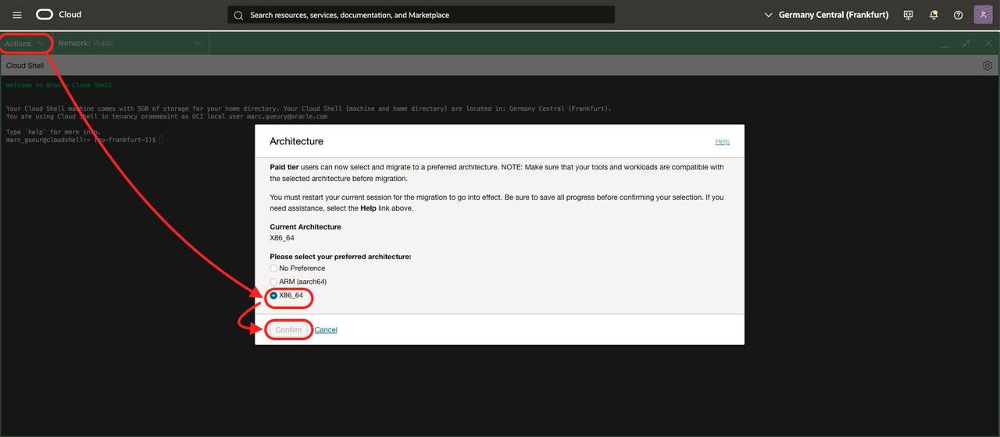
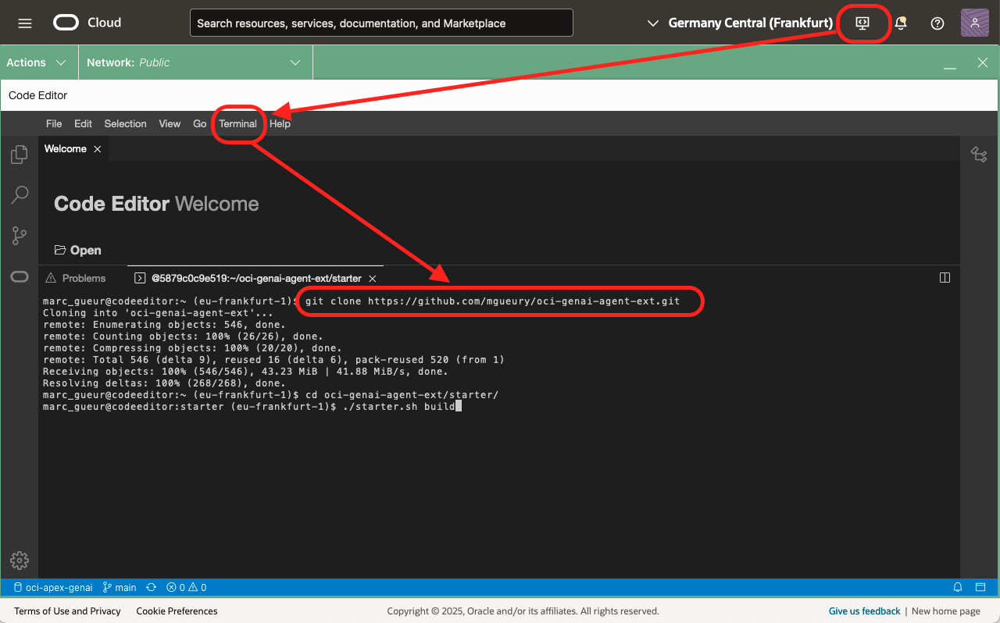

# Install the Components

## Introduction
In this lab, you will install all the components needed for the rest of this workshop. 

Estimated time: 15 min

### Objectives

- After Lab 1 is complete, provision all the cloud components shown in this architecture:

    

## Task 1: Run a Terraform script to create the components

1. Go to the OCI console homepage.
2. Click the *Developer Tools* icon in the upper right of the page and select *Code Editor*. Wait for it to load.
3. Check that the Network used is Public. (see requirements)
4. Check that the Code Editor architecture is x86_64.
    - Go to Actions / Architecture.
    - Check that the current architecture is x86_64.
    - If not, change it to x86_64 and confirm. It will restart.

        

5. In the code editor menu, click *Terminal* then *New Terminal*.
6. Run the command below in the terminal.
    
    ```
    <copy>
    git clone https://github.com/mgueury/oci-vibe-terraform.git
    </copy>
    ```
7. Run each of the two commands below in the Terminal. This will run Terraform to create the rest of the components.
    ```
    <copy>
    cd oci-vibe/starter/
    ./starter.sh build
    </copy>
    ```

    Answer the questions about 
    - Prefix (ex: vibe)
    - Compartment OCID (See your notes)
    - Public IP Filter: The setup will have an Internet gateway with port 80/443 open to the internet. What is the IP Range of the machine who can access these ports:
        1. All the machines on the internet -> 0.0.0.0/0
        2. Just my laptop (recommended). To get your laptop IP, use, by example, https://whatismyipaddress.com or https://ifconfig.me
        3. Other (your own IP range)
    - Your Public SSH Key:
        - If you already have an SSH key set up on your laptop, this allows your laptop to log in to the VM that Terraform creates.
        - Such Public SSK Key looks this, "ssh-rsa ABBCDEFGHIJL....."
        - If not, the setup will create an SSH key (in target/ssh\_key\_starter) that you will later configure on your laptop. 

    The answer of the questions will be stored in the terraform configuration file: oci-vibe/starter/terraform.tfvars

8. **Please proceed to the [next lab](#next) while Terraform is running.** 
9. When Terraform finishes, you will see settings that you need in the next lab. Save these to your text file. It will look something like:

    ```
    <copy>    
    -----------------------------------------------------------------------
    URL:
    - User Interface: http://123.123.123.123/
    - REST: http://123.123.123.123/app/threads

    -----------------------------------------------------------------------
    Vibe Coding:

    1. Check that you can login from your laptop to the bastion using the private key associated with your_public_ssh_key in terraform.tfvars
    > ssh opc@123.123.123.123
    2. Clone the git repo of the starter app in your laptop
    > git clone opc@123.123.123.123:~/app.git app
    > cd app
    3. Do some changes with your favorite editor.
    4. Check what git_push.sh does and run it.
    > ./git_push.sh
    The build will start automatically in the bastion and redeploy the app.

    5. If you want to see the log. ssh opc@123.123.123.123
    > cat compute/rebuild.log
    > cd app/xxxx
    > cat xxxx.log
    
    -----------------------------------------------------------------------
    Database:

    DB_USER=admin
    DB_PASSWORD=xxxxxxx
    DB_URL=(description=(retry_count=20)(retry_delay=3)(address=(protocol=tcps)(port=1521)(host=xxxxxxxx.adb.us-chicago-1.oraclecloud.com))(connect_data=(service_name=yyyyyyyyyy_medium.adb.oraclecloud.com))(security=(ssl_server_dn_match=no)))

    In terminal 1, open the ssh tunnel
      ssh -L1521:xxxxxxx.adb.us-chicago-1.oraclecloud.com:1521 opc@123.123.123.123
    In terminal 2, save the connection to the database.
      $HOME/oracle/sqlcl/bin/sql /nolog
      conn -savepwd -save adb admin@(description=(retry_count=20)(retry_delay=3)(address=(protocol=tcps)(port=1521)(host=localhost))(connect_dat. a=(service_name=yyyyyyyyyy_medium.adb.oraclecloud.com))(security=(ssl_server_dn_match=no)))
      xxxxxxx
      select * from dept;
      exit  
    -----------------------------------------------------------------------
    </copy>    
    ```
**You may now proceed to the [next lab](#next)**

## Task 2: Set up an SSH connection 

You need to set up an SSH connection to the created VM. There are several ways to do this.
The goal is that this command works from your laptop. Replace with the right IP given by terraform.
```
<copy>    
ssh opc@123.123.123.123
</copy>    
```

1. (Easier) If you have added "your\_public\_ssh\_key" in paragraph above. It should work already.
2. If not, do this:

    In the cloud shell, where terraform ran.
    ```
    <copy>    
    cat target/ssh_key_starter
    </copy>    
    ```

    In your laptop, 
    - go to $HOME/.ssh
    - create file: *ssh\_key\_vibe*
    - Copy/paste the content of the target/ssh\_key\_starter above. Save
    - edit the file .ssh/config
    - add something like
    ```
    Host 123.123.123.123
        IdentityFile ssh_key_vibe
        HostName 123.123.123.123
        User opc
    ```
   - retry to ssh to the Virtual Machine   

## Known issues

1. During the terraform run, there might be an error resulting from the compute shapes supported by your tenancy:

    ```
    <copy>    
    oci_core_instance.starter_instance: Creating..
    - Error: 500-InternalError, Out of host capacity.
    Suggestion: The service for this resource encountered an error. Please contact support for help with service: Core Instance
    </copy>
    ```

    Solution: edit the file *starter/src/terraform/variable.tf* and replace the *availability domain* with one that has capacity.
    ```
    <copy>    
    OLD: variable availability_domain_number { default = 1 }
    NEW: variable availability_domain_number { default = 2 }
    </copy>    
    ```

    Then rerun the following command in the code editor.

    ```
    <copy>
    ./starter.sh build
    </copy>
    ```

    If it still does not work, try to create a compute instance manually with the OCI console to find an availability domain or shape with available capacity.

2. During the terraform run, there might be an error resulting from the compute shapes supported by your tenancy:

    ```
    <copy>    
    - Error: 404-NotAuthorizedOrNotFound, shape VM.Standard.x86.Generic not found
    </copy>    
    ```

    Solution: edit the file *starter/src/terraform/variable.tf* and replace the *instance_shape* with one that has capacity in your tenancy/region.
    ```
    <copy>    
    OLD: variable instance_shape { default = "VM.Standard.x86.Generic" }
    NEW: variable instance_shape { default = "VM.Standard.E4.Flex" }
    </copy>    
    ```

    Then rerun the following command in the code editor.

    ```
    <copy>
    ./starter.sh build
    </copy>
    ```

    If it still does not work, try to create a compute instance manually with the OCI console to find an availability domain or shape with available capacity.    

3. It happened on new tenancy that the terraform script failed with this error:

    ```
    <copy>    
    Error: 403-Forbidden, Permission denied: Cluster creation failed. Ensure required policies are created for your tenancy. If the error persists, contact support.
    Suggestion: Please retry or contact support for help with service: xxxx
    </copy>    
    ```

    In such case, just rerunning ./starter.sh build fixed the issue.

4. 409 - XXXXXAlreadyExists
    ```
    <copy>    
    Error: 409-PolicyAlreadyExists, Policy 'agent-fn-policy' already exists
    or
    Error: 409-BucketAlreadyExists, Either the bucket "agext-upload-bucket' in namespace "xxxxxx" already exists or you are not authorized to create it
    </copy>    
    ```

    Several persons are probably trying to install this tutorial on the same tenancy.
    Solution:  edit the file *terraform.tfvars* and use a unique *prefix*
    ```
    <copy>    
    OLD: prefix="vibe"
    NEW: prefix="vibe2"
    </copy>    
    ```

## Acknowledgements

- **Author**
    - Marc Gueury, AI Agents Black Belt
    - Ilayda Temir, Generative AI Black Belt
