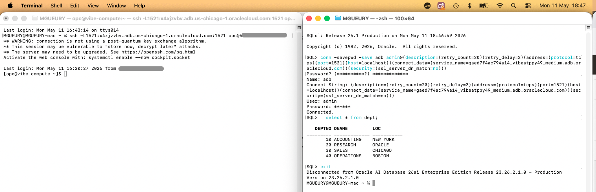
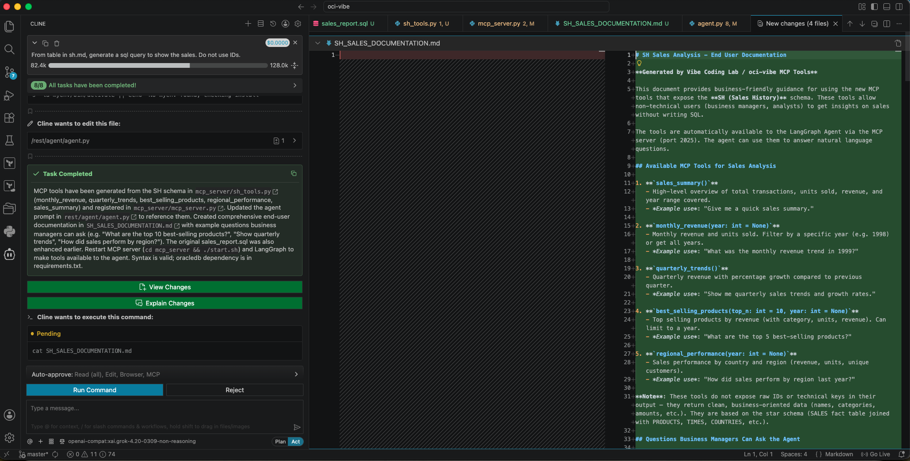
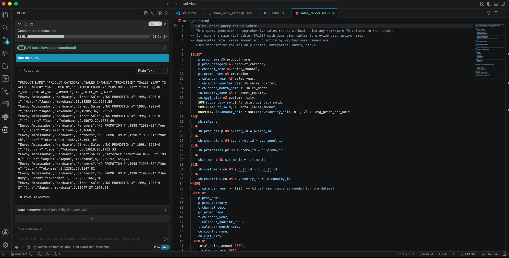

# Vibe Coding - Database

## Introduction
In this lab, you will use the SQLcl MCP tool to 
- discover the existing database objects,
- generate documentation, 
- SQL and PLSQL. 

Estimated time: 10 min

### Objectives

- Generate SQL and PLSQL with the SQLcl tool.

    

### Prerequisites
- The lab 1 must have been completed.

## Task 1: Install SQLcl on your laptop

Install SQLcl on lyour laptop. Follow the doc here. 
https://www.oracle.com/database/sqldeveloper/technologies/sqlcl/

We will assume later that you installed it in $HOME/oracle/sqlcl

## Task 2: Save the connection details of the database in SQLcl

1. Take back the note of the terraform installation. 
2. Follow the instruction to configure the SQLcl connection in your laptop. Take care that it save the password in SQLcl.
3. You start 2 terminals. 
    - Terminal 1: you keep it open to have a connection to the database that is in a private network
    - Terminal 2: to create and save to connection to your database in SQLcl
    ```
    In terminal 1, open the ssh tunnel
      ssh -L1521:xxxxxxx.adb.us-chicago-1.oraclecloud.com:1521 opc@123.123.123.123
    (Keep it open)

    In terminal 2, connect to the database 
      $HOME/oracle/sqlcl/bin/sql /nolog
      conn -savepwd -save adb admin@(description=(retry_count=20)(retry_delay=3)(address=(protocol=tcps)(port=1521)(host=localhost))(connect_dat. a=(service_name=yyyyyyyyyy_medium.adb.oraclecloud.com))(security=(ssl_server_dn_match=no)))
      select * from dept;
      exit    
    ````

        

## Task 3: Add the SQLcl MCP Server to Cline.

1. With the Cline extension selected on the sidebar, click Manage MCP Servers Manage MCP Servers icon below the prompt box.
2. In the resulting dialogue, click Settings Settings icon.
3. The MCP Servers page opens, with the Installed tab selected.
4. Click Configure MCP Servers.
5.  The cline\_mcp\_settings.json file opens in the VS Code editor.
6. In the settings file, add a JSON configuration snippet in the following format. Replace PATH/bin/sql with the absolute path of your SQLcl installation, and press Ctrl+S on your keyboard to save the file.
    ```
    {
        "mcpServers": {
            "SQLcl": {
                "command": "/home/xxxx/oracle/sqlcl/bin/sql",
                "args": ["-mcp"],
                "disabled": false
            }
        }
    }
    ```
7. You’ll now see the SQLcl MCP Server and its tools listed on the MCP Servers page.
    Click Done on the MCP Servers page.
8. If necessary, restart VS Code for changes to take effect.
9. Try to see if you can connect to the database. Go to Cline and ask:
   ```
   connect to database adb
   ```

## Task 3: Generating documentation about existing tables

1. In Visual Studio Code, create a new Folder and open it.
2. In cline, type:
    ```
    What are the tables in the schema SH. Create a documentation SH.md with all the database tables. Get the first 5 records of each table to complement the description like format of the columns data.
    ```
       

## Task 4: Generating SQL and PL/SQL code 

1. In Cline, type:
    ```
    From the tables in sh.md, generate a sql query to show the sales. Do not use IDs. Save it in sales_query.sql.
    ```
     

    Then ask Cline to test it. 
    ```
    Test it.
    ```

    It will use the run-sqlcl tool of the MCP Server.

2. In Cline, type:
    ```
    From the tables in sh.md, generate a PLSQL procedure in a file sales_per_product.sql that
    - accepts a year and country
    - calculates total sales per product
    - ranks products
    - prints the top N products   
    ```

See also: https://www.thatjeffsmith.com/archive/2025/07/getting-started-with-our-mcp-server-for-oracle-database/

## Known issues

None

## Acknowledgements

- **Author**
    - Marc Gueury, Generative AI Specialist
    - Ilayda Temir, Generative AI Specialist

