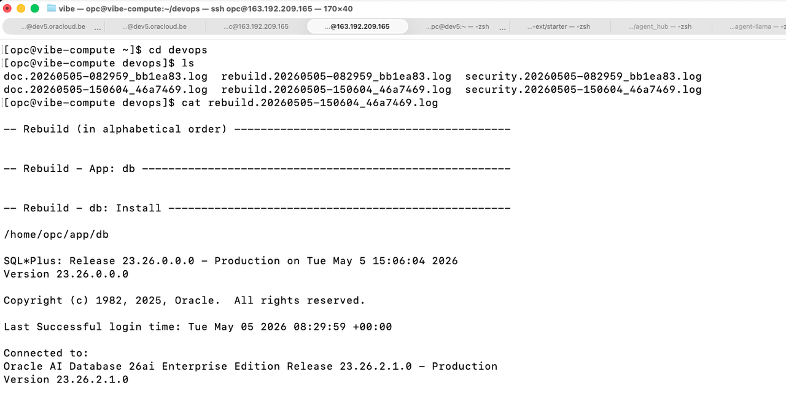

# Vibe Coding - DevOps

## Introduction
In this lab, we will run tools that will trigger when the code is pushed to the Git server.


Estimated time: 10 min

### Objectives

Use a Git trigger to automate AI tasks when new changes are pushed to the server repository.

### Prerequisites
- Labs 1 through 3 are complete.

### Git Hooks

This lab is based on Git hooks: 
- https://git-scm.com/book/en/v2/Customizing-Git-Git-Hooks

When some actions are done with the Git server, **Hooks** can start commands.

In this lab, 
1. We will show three Git hooks:
    - Rebuild
    - Documentation using AI for each commit
    - Security checks for each commit using AI. 
2. Then we do monitoring via Cline on the VM directly.

## Task 1: Documentation and Security

You already triggered this workflow with each git push request to the Git server.
At the end of each git push, you see output like this:

    ```
    ...
    remote: Already up to date.
    remote: Rebuild: See /home/opc/devops/20260518-182544_78ccb0d/rebuild.log
    remote: doc: See /home/opc/devops/20260518-182544_78ccb0d/doc.md
    remote: security: See /home/opc/devops/20260518-182544_78ccb0d/security.md
    bb1ea83..46a7469  master -> master
    ```

The log names use the format **doc.<date>\_<git commit id>.log**.

1. Log in to the server.

    ```
    ssh opc@123.123.123.123
    cd devops
    ls
    cd 20260518-182544_78ccb0d
    cat rebuild.log
    cat doc.md
    cat security.md
    ```

2. In the rebuild log, you will see the log of the redeployment (and rebuild).
          
 
    The security.md looks like this:

    ```
    cat security.md 

    Task started: 1777998257937
    The PR adds a classic Oracle EMP sample table and a matching read-only MCP tool following the exact pattern of the existing get_dept implementation. No secrets, injection risks, unsafe dependencies, or permission escalations were introduced. The only notable item is the MCP server binding to 0.0.0.0:2025, which may be intentional for the bastion but should be confirmed. Overall the change is safe, consistent, and follows good engineering practices for this codebase.
    ```

    The doc.log looks like this:

    ```
    cat doc.md

    # Bastion Build 20260505-182121: Add EMP Table and `get_emp` MCP Tool

    ## Summary
    This change adds a classic Oracle `EMP` (employee) table to the sample database schema and implements a new `@mcp.tool()` in the MCP server to query and return all employee records. It mirrors the existing `get_dept()` functionality, enabling MCP clients to retrieve structured employee data alongside department data. The update is part of a periodic "Bastion Build" (dated 2026-05-05).

    ## Details
    - **What changed**:
    - `db/oracle.sql`: Added `CREATE TABLE EMP` (with primary key, foreign key to `DEPT`, and standard columns: `EMPNO`, `ENAME`, `JOB`, `MGR`, `HIREDATE`, `SAL`, `COMM`, `DEPTNO`). Included 14 sample `INSERT` statements with classic Scott/Tiger demo data. A commented `-- DROP TABLE EMP;` was also added.
    - `mcp_server/mcp_server.py`: Added `get_emp()` function decorated with `@mcp.tool()`. It connects to Oracle using environment variables (`DB_USER`, `DB_PASSWORD`, `DB_URL`), executes a `SELECT` ordered by `EMPNO`, and returns a list of dictionaries with typed fields. Includes logging, error checking for missing env vars, and proper connection cleanup.

    - **Why it changed**: To expand the sample dataset and MCP server capabilities with employee data, consistent with the existing department support. (Needs confirmation on exact project context or linked requirements.)

    - **How it works**: The SQL runs during database setup to populate the schema and data. The Python tool uses `oracledb` to query the table and serializes rows into JSON-friendly dicts for MCP transport (HTTP on port 2025).

    ## Usage / Migration
    - **Setup**: Re-run the updated `db/oracle.sql` against your Oracle instance (or apply the new `CREATE TABLE` + `INSERT`s manually). Ensure the `DEPT` table exists first due to the foreign key.
    - **Usage** (MCP clients):
    
    python
    # Example call (via MCP client library)
    employees = await client.call_tool("get_emp", {})
    # Returns: list of dicts, e.g. [{"empno": 7369, "ename": "SMITH", ...}, ...]
    
    - No breaking migration for existing `get_dept()` users. New env var validation is strict (raises `ValueError` if any are missing).

    ## Risks / Notes
    - **Risks**: Running the SQL on a production DB could overwrite data if `EMP` already exists (the `DROP` is commented). Foreign key assumes `DEPT` data is present. Date handling in Python dicts may require client-side formatting.
    - **Limitations / Edge cases**: No pagination, filtering, or parameters supported in `get_emp()`. Hard-coded query; assumes Oracle connectivity and correct env vars. (Needs confirmation on whether connection pooling, error handling for DB exceptions, or security considerations like input sanitization were intentionally omitted.)
    - **User-facing impact**: New MCP tool available; clients can now query employees. 
    - **Before**: Only `get_dept()` tool available.
    - **After**: `get_emp()` tool also available, returning 14 sample employee records.

    ## Follow-up checklist
    - [ ] Verify SQL runs cleanly on target Oracle version (test FK, dates, NULLs).
    - [ ] Test `get_emp()` tool via MCP client (HTTP transport on port 2025); confirm output format and error cases.
    - [ ] Update any existing MCP client examples or docs to demonstrate the new tool.
    - [ ] Confirm if additional indexes, constraints, or related tools (e.g., `get_emp_by_dept`) are planned.
    - [ ] Review logging and env var handling for production readiness.
    - [ ] Run full Bastion build/test suite.
    ```

## Task 2: Check how it works

If you look in $HOME/compute/git/post\_receive\_doc.sh, you will see this:

```
cline "
You are a technical writer. Generate clear, accurate documentation from the following git push request.

Input:
- Commit message / PR title:
- PR description:
- Changed files:
- Diff or patch:
- Related issue(s):
- Any notes from the author:

Task:
1. Read the request and infer the purpose of the change.
2. Write documentation that explains:
   - what changed
   - why it changed
   - how it works
   - any setup, config, or migration steps
   - any user-facing impact
   - risks, limitations, or edge cases
3. Keep the documentation concise, structured, and easy to scan.
4. Use headings, bullets, and examples where helpful.
5. Do not invent details that are not supported by the input. Mark unclear points as "Needs confirmation" rather than guessing.
6. If the change affects an API, CLI, UI, or operational behavior, include a short "Before / After" section.
7. End with a short checklist of follow-up items for reviewers or maintainers.

Output format:
- Title
- Summary
- Details
- Usage / Migration
- Risks / Notes
- Follow-up checklist
"
```

For the security check, in $HOME/compute/git/post\_receive\_security.sh, you will see this:

```
cline "
You are a senior security reviewer and engineering best-practice auditor. Review the following git push request for security issues, unsafe patterns, and general code quality concerns.

Input:
- Commit message / PR title:
- PR description:
- Changed files:
- Diff or patch:
- Related issue(s):
- Any notes from the author:

Task:
1. Review the change for security risks, vulnerable patterns, secrets exposure, permission issues, injection risks, unsafe dependencies, and data-handling problems.
2. Check for good engineering practice, including readability, maintainability, error handling, validation, logging, testing, and backward compatibility.
3. Identify anything that looks suspicious, incomplete, inconsistent, or likely to cause production issues.
4. For each finding, include:
   - severity
   - why it matters
   - exact file or area affected
   - recommended fix
5. Do not invent issues that are not supported by the input. Mark uncertain items as "Needs confirmation."
6. If no issues are found, say so explicitly and mention the main reasons the change looks safe.
7. End with a clear action recommendation.

Output format:
- Overall assessment
- Security findings
- Best-practice findings
- Suggested fixes
- Final recommendation

Action to take: none -> urgent
"
```

## Task 3: (Optional) Monitoring

The demo contains also a sample that monitors the logs via a LLM and learn with the time the log line that are normal or that contains an error.
To run the demo
- log on the VM
  ```
  ssh opc@123.123.123.123
  ```
- start the monitoring
  ```
  cd monitoring/bin
  ./install.sh
  ```
- Check the monitoring.log

  ```
  tail -f monitoring.log
  ```
  You will see that after some time, the system will create regular expression to distinguish between error and normal lines.

  ```
    Log lines:
    LINE 1:  with transport 'http' on 
    ---
    LINE 2:  http://0.0.0.0:2025/mcp 
    ---
    LINE 3: INFO: Started server process [177376] 
    ---
    LINE 4: INFO: Waiting for application startup. 
    ---
    LINE 5: INFO: Application startup complete. 
    ---
    LINE 6: INFO: Uvicorn running on http://0.0.0.0:2025 (Press CTRL+C to quit) 
    ---
    LINE 7: INFO: 127.0.0.1:38536 - "POST /mcp HTTP/1.1" 200 OK 
    ---
    LINE 8: INFO: 127.0.0.1:38550 - "POST /mcp HTTP/1.1" 202 Accepted 
    ---
    LINE 9: INFO: 127.0.0.1:38566 - "GET /mcp HTTP/1.1" 200 OK 
    ---
    LINE 10: INFO: 127.0.0.1:38574 - "POST /mcp HTTP/1.1" 200 OK 

    Output: (Only a JSON output with the format above!!)
    2026-05-11 21:02:09,399 INFO monitoring <call_cline> out=[
    {
        "severity": "normal",
        "reason": "transport information",
        "suggested_regex": null,
        "confidence": 1.0
    },
    {
        "severity": "normal",
        "reason": "server URL",
        "suggested_regex": null,
        "confidence": 1.0
    },
    {
        "severity": "normal",
        "reason": "server process started",
        "suggested_regex": null,
        "confidence": 1.0
    },
    {
        "severity": "normal",
        "reason": "waiting for application startup",
        "suggested_regex": null,
        "confidence": 1.0
    },
    {
        "severity": "normal",
        "reason": "application startup complete",
        "suggested_regex": null,
        "confidence": 1.0
    },
    {
        "severity": "normal",
        "reason": "Uvicorn running message",
        "suggested_regex": null,
        "confidence": 1.0
    },
    {
        "severity": "normal",
        "reason": "HTTP request log (200 OK)",
        "suggested_regex": "^INFO: \\d+\\.\\d+\\.\\d+\\.\\d+:\\d+ - \".*\" 200 OK$",
        "confidence": 0.9
    },
    {
        "severity": "normal",
        "reason": "HTTP request log (202 Accepted)",
        "suggested_regex": "^INFO: \\d+\\.\\d+\\.\\d+\\.\\d+:\\d+ - \".*\" 202 Accepted$",
        "confidence": 0.9
    },
    {
        "severity": "normal",
        "reason": "HTTP GET request log (200 OK)",
        "suggested_regex": "^INFO: \\d+\\.\\d+\\.\\d+\\.\\d+:\\d+ - \".*\" 200 OK$",
        "confidence": 0.9
    },
    {
        "severity": "normal",
        "reason": "HTTP POST request log (200 OK)",
        "suggested_regex": "^INFO: \\d+\\.\\d+\\.\\d+\\.\\d+:\\d+ - \".*\" 200 OK$",
        "confidence": 0.9
    }
    ]
  ```

In this example, with the time, the LLM is less and less called. And normal message or error are detected more and more via regular expression.
This is just an example of using a LLM for monitoring. For production case, consider tool like OCI Log Analytics: https://www.oracle.com/manageability/log-analytics/

- Stop the monitoring. Else the LLM will continue to be called each 1 mins, for new type of lines.
  ```
  ./stop.sh
  ```

## Known Issues

1. Too many consecutive mistakes (3). The model may not be capable enough for this task. Consider using a more capable model.
    - Cause:
        You get this error, this is very probably due to the maximum number of tokens reached. 

        ```
        Error: [YOLO MODE] Task failed: Too many consecutive mistakes (3). The model may not be capable enough for this task. Consider using a more capable model.
        ```
    - Solution:
        1. Wait one or two minutes. If the number of tokens sent to the model decreases, it will work again.
        2. Ask to your OCI Admin to increase the maximum number of tokens for the model that you are using in Governance / Limits / Generative AI.
        3. Use a Dedicated AI Cluster that has no limit of tokens.

## Acknowledgements

- **Author**
    - Marc Gueury, AI Agents Black Belt
    - Maurits Dijkens, AI Agents Black Belt


