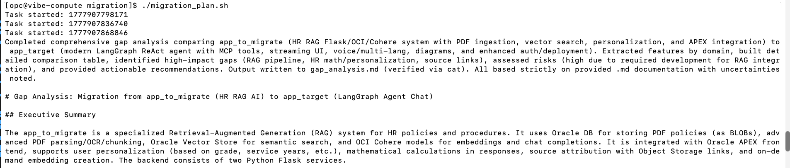
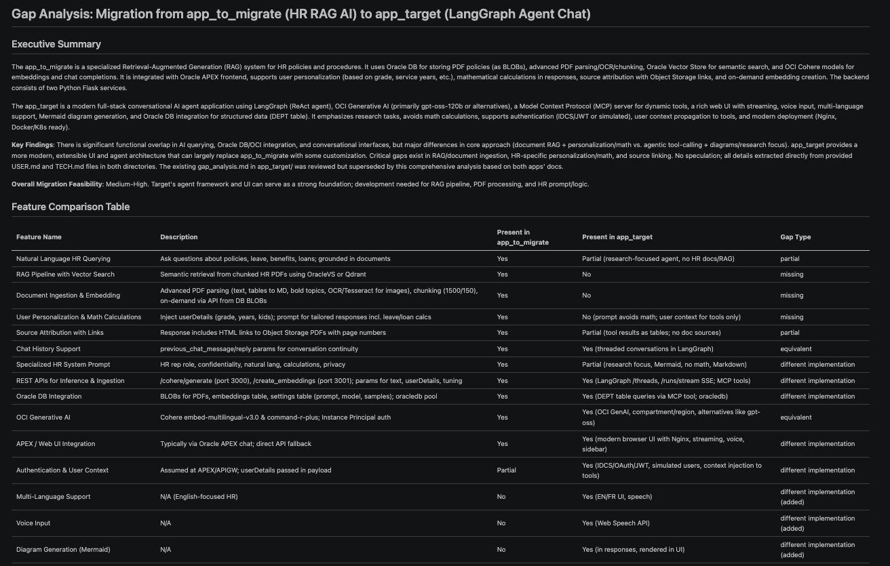

# Command Line Mode - Workflow

## Introduction
In this lab, we will use the Cline CLI directly. In a script, you can call Cline several times in a workflow to automate a complex task.

Estimated time: 10 min

### Objectives

- Create a migration plan from *app\_to\_migrate* to *app\_target* using several coding agent calls.

### Prerequisites
- Labs 1 and 2 are complete.

    

## Task 1: Log in to the compute

Log in to the compute created in Lab 2.
- Go to the installation directory.

    ```
    <copy>
    cd oci-vibe
    ./starter.sh ssh compute
    </copy>
    ```

- Or SSH to the machine directly if you set it up in Lab 3.

    ```
    <copy>
    ssh opc@123.123.123.123
    </copy>
    ```

## Task 2: Check the migration scripts

The migration script uses several Cline CLI commands in a chain. Look at the migration script:

```
<copy>
cd migration
cat migration_plan.sh
</copy>
```

You will find several commands like this:

```
<copy>
cline -y > /tmp/cline_cli.log << EOF
You are a senior software engineer and technical writer.

Goal:
Analyze the provided source code of an application and generate comprehensive, structured technical documentation suitable for engineers who need to understand, maintain, or migrate the system.

Input:
- Source code. Check the current directory.

Tasks:

1. System Overview
   - Describe the purpose of the application
   - Identify main use cases
   - High-level architecture (monolith, microservices, layers, etc.)

....

Output Files:
- User Manual: USER.md
- Technical Manual: TECH.md

Output format:
- Well-structured documentation with clear sections
- Use diagrams in text form where helpful (e.g., component interactions)
- Be precise and avoid guessing—flag uncertainties explicitly
EOF
</copy>
```

## Task 3: Run the migration script

Back in the terminal. 
1. Run the script
    ```
    <copy>
    ./migration_plan.sh
    </copy>
    ```
      
2. It will take time ( 10 - 15 mins ). The LLM will 
    - Check all files of both programs 
    - Build a summary for both programs 
    - Before to compare them
    - When done, please check the output
    ```
    <copy>
    cat gap_analysis.md
    </copy>
    ```
3. If you copy the generated Markdown in your favorite Markdown viewer, the result will look like this:
      

Congratulations on finishing all the labs. We hope you learned something useful!

## Acknowledgements

- **Author**
    - Marc Gueury, AI Agents Black Belt
    - Ilayda Temir, Generative AI Black Belt
