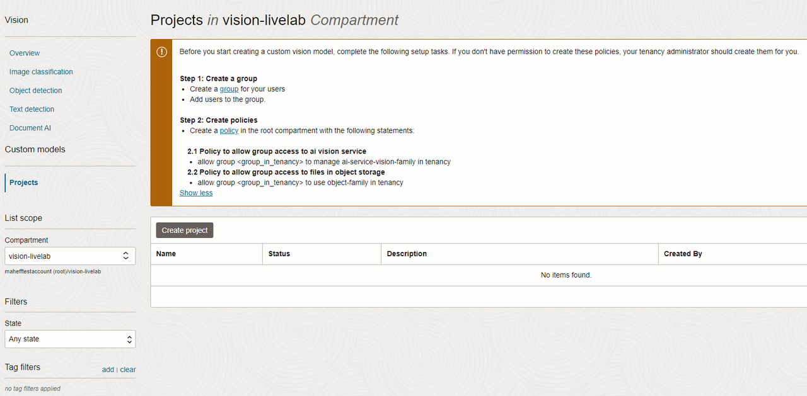
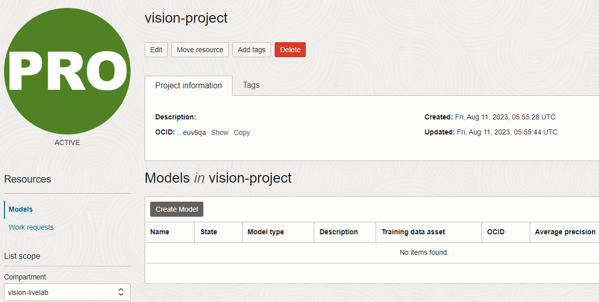
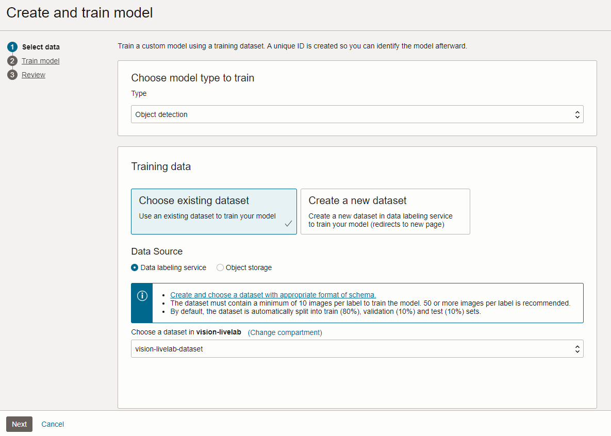
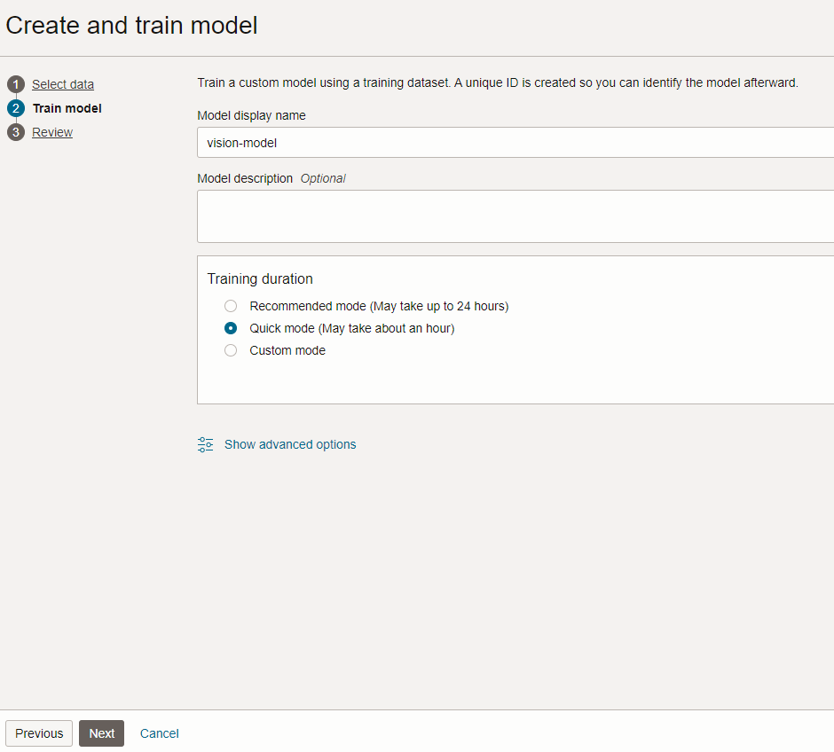

# Create the OCI Vision custom model

## Introduction

In this lab, you will create an OCI Vision project and an OCI Vision custom model. A custom model can be created with a minimum of 10 images, which we have provided. For production models, we recommend using a larger number of images for training.

An OCI Vision custom model can be created using the quick mode (up to 1 hour), recommended mode (up to 24 hours), or custom mode training duration. In the lab steps, we will use the quick mode training duration. For production models, we suggest using recommended mode.

Estimated Time: 30 minutes

### Objectives

- Create an OCI Vision custom object detection model

## Task 1: Create an OCI Vision project

1. In the Oracle Cloud Console, click the main menu icon to open the side menu.
2. Click **Analytics & AI** and then click **Vision**.
3. On the left side of the screen, click **Projects**, under Custom Models.

   

4. Click **Create project**. Provide *vision-project* as name, select *vision-livelab* as compartment, and click **Create project**.

## Task 2: Create the OCI Vision rust detection model

1. Once the project status is *Active*, select *vision-project*.
2. Click **Create Model**.
   
2. Select *Object Detection* in model type.
3. Select *Choose existing dataset*, *Data labeling service*, and select the *vision-livelab-dataset* bucket.
   
4. Click **Next**.
5. Name the model *vision-model*.
6. Choose *Quick training* and click **Next**.
   
7. Click **Create and train**. For this model, training will take about 20 minutes.
8. Once the model is trained, you may **proceed to the next lab**.

## Acknowledgements

* **Authors** - Mark Heffernan and Jason Monden
* **Last Updated By/Date** - Mark Heffernan, August 2023
