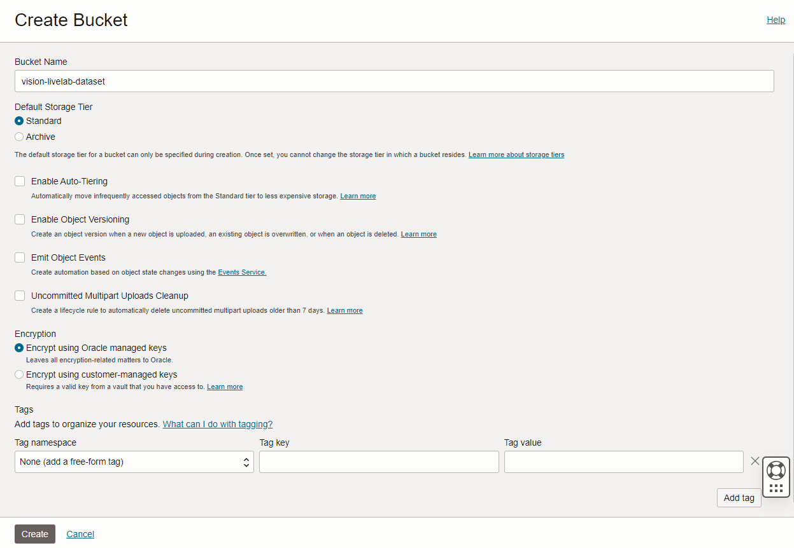
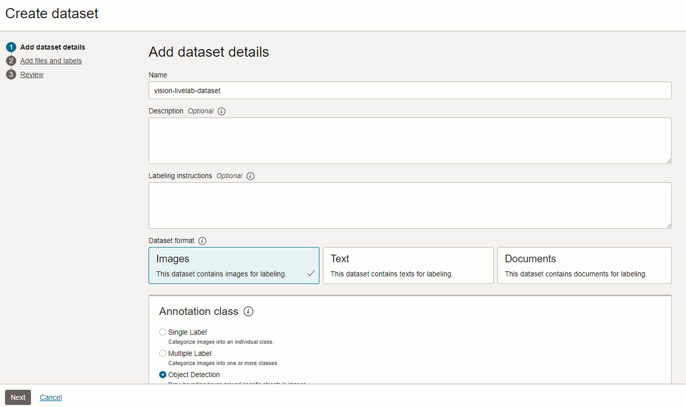
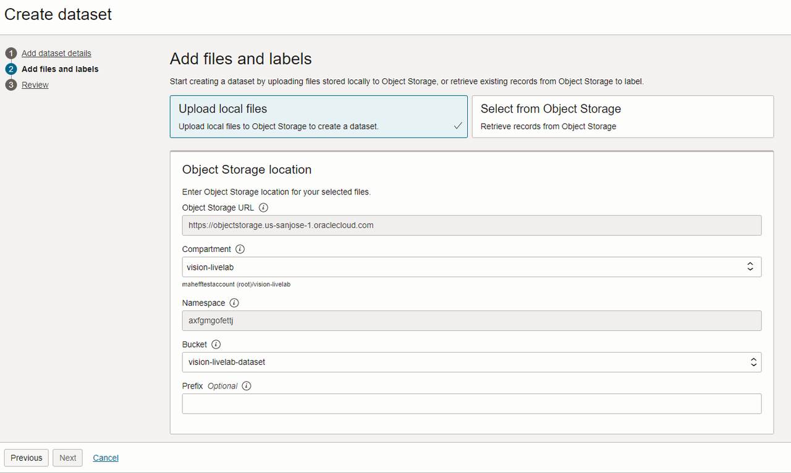
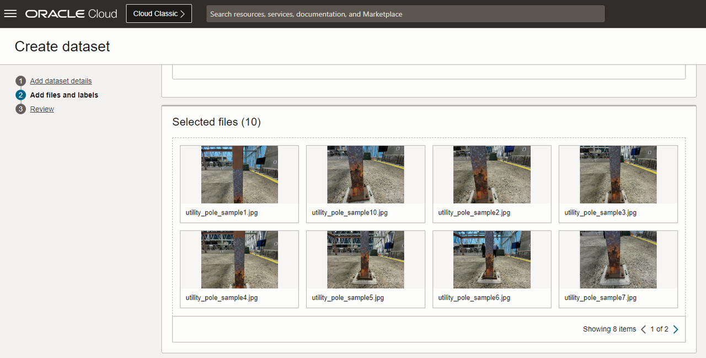
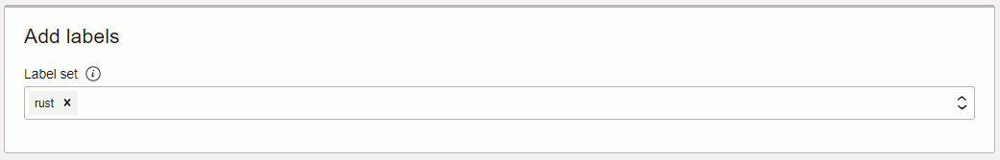
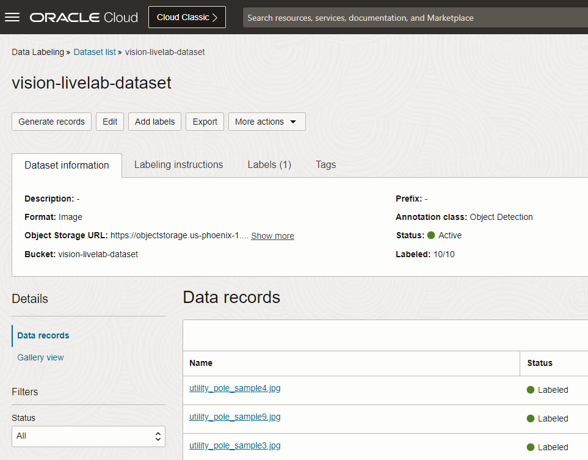
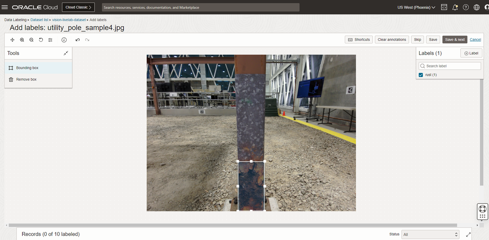

# OCI Data Labeling

## Introduction

In this lab, you will focus on labeling images of utility poles with rust using OCI Data Labeling. The OCI Vision service will later use these images to train an OCI Vision custom model.

Estimated Time: 20 minutes

### Objectives

- Get acquainted with the OCI Data Labeling service
- Successfully label the training images

## Task 1: Download the model training images

1. Click [here](https://github.com/oracle-livelabs/oci/raw/main/oci-vision-defect-detection/images/model/utility_pole_samples.zip) to download the ZIP file containing the sample pictures. 
2. Extract the contents of the file to a location of your choice.

## Task 2: Object Storage bucket creation

1. In the Oracle Cloud Console, click the main menu icon to open the side menu.
2. Click **Storage** and then click **Buckets**. 
3. Set the **Compartment** to *vision-livelab*.
4. Click **Create Bucket**.
5. Provide *vision-livelab-dataset* as bucket name. Leave the remaining values as they are and click **Create**.

   

## Task 3: Dataset creation 

1. In the Oracle Cloud Console, click the main menu icon to open the side menu.
2. Click **Analytics & AI** and then click **Data Labeling**. Click **Datasets**.
4. Click **Create dataset**.
5. Provide *vision-livelab-dataset* as **Name**. Set **Dataset format** to *Images*. Select **Object Detection** in the Annotation class section. Click **Next**.

   

6. Select *Upload local files* at the top. Select bucket *vision-livelab-dataset*. Drag the images you downloaded to **Selected files** on the screen.

   
   
   

7. Add a new label called 'rust' by typing it in the label box, and click **Next**.

   

8. Click **Create**. It will take a few minutes to generate the records.

## Task 4: Label data

1. In the **Data records** page, you will see a table view of the uploaded images. Select an image to start labeling.

   

2. Draw a square bounding box around the rust then select **Save & next** until all the images are labeled.

   

3. Once all the images are labeled, you may **proceed to the next lab**.

## Acknowledgements

* **Authors** - Mark Heffernan and Jason Monden
* **Last Updated By/Date** - Mark Heffernan, August 2023