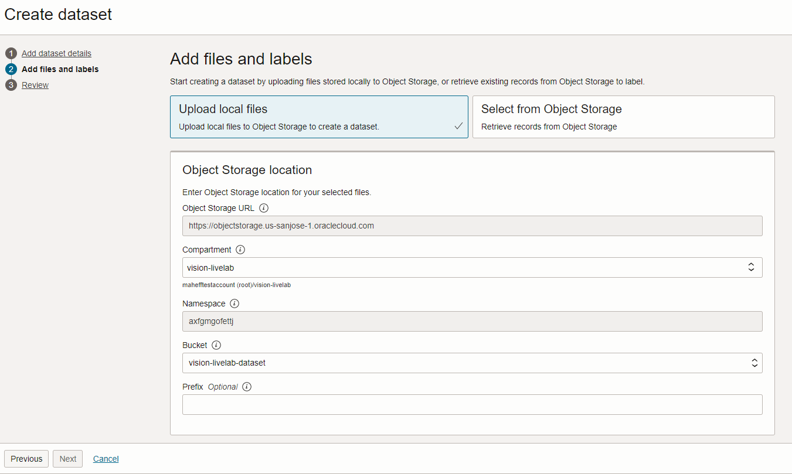
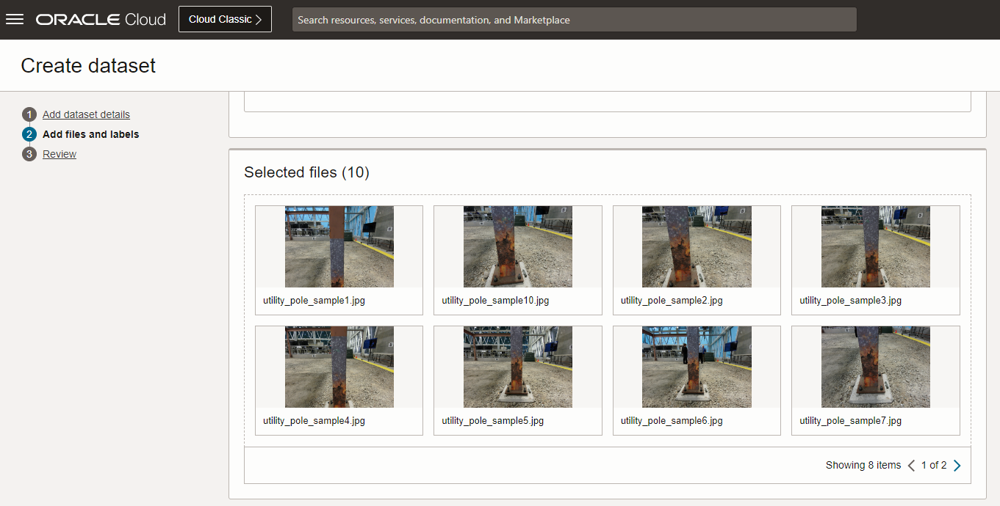

# OCI Data Labeling

## Introduction

In this lab, you will focus on labeling pictures of utility poles with rust using OCI Data Labeling. The OCI Vision service will later use these images to train a custom OCI Vision model.

Estimated Time: 20 minutes

Watch the video below for a quick walk-through of the lab.
[OCI Data Labeling](videohub:1_z2fhbhgk)

### Objectives

- Get acquainted with the OCI Data Labeling service
- Successfully label the model training images

## Task 1: Download the model training images

1. Click [here](https://github.com/oracle-livelabs/oci/raw/main/oci-vision-defect-detection/images/model/utility_poles.zip) to download the ZIP file containing the sample pictures. 
2. Extract the contents of the file to a location of your choice.

## Task 2: Object Storage bucket creation

1. In the Oracle Cloud Console, click the main menu icon to open the side menu.
2. Click **Storage** and then click **Buckets**. 
3. Set the **Compartment** to *vision-livelab*.
4. Click **Create Bucket**.
5. Provide *vision-livelab-dataset* as bucket name. Leave the remaining values as they are and click **Create**.

   

## Task 3: Dataset creation 

1. In the Oracle Cloud Console, click the main menu icon to open the side menu.
2. Click **Analytics & AI** and then click **Data Labeling**. Click **Datasets**.
4. Click **Create dataset**.
5. Provide *vision-livelab-dataset* as **Name**. Set **Dataset format** to *Images*. Select *Object Detection* in the Annotation mode section. Click **Next**.

   

6. Select *Upload local files* at the top. Select bucket *vision-livelab-dataset*. Drag your images to **Selected files** on the screen. 

   
   
   

7. Add a new label called 'rust' by typing it in the label box, and click **Next**.

   

8. Click **Create**. It will take a few minutes to generate the records.

## Task 4: Labeling data

1. In your dataset details page, you will see a table view of the uploaded images. Click each image to proceed to its labeling.

   

2. In the single image view, zoom in if necessary. Using the cursor, draw square bounding boxes around the circles. Do the same for the ones that only appear partially.

   
   
3. Once all the images are labeled, you may **proceed to the next lab**.

## Acknowledgements

* **Authors** - Mark Heffernan and Jason Monden
* **Last Updated By/Date** - Mark Heffernan, May 2023