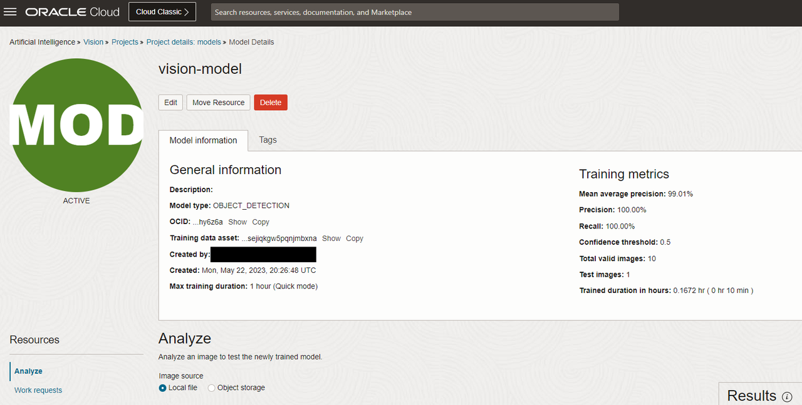
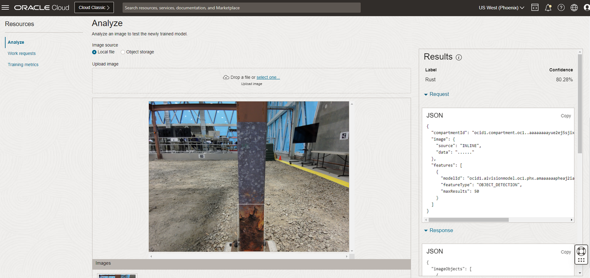

# Test the model via Oracle Cloud Console

## Introduction

In this lab, you will test the OCI Vision custom model using the test interface in the OCI Console.

Estimated Time: 10 minutes

### Objectives

- Test the OCI Vision custom model by uploading a test image to the OCI Console

## Task 1: Test the model via Oracle Cloud Console

1. Click [here](https://github.com/oracle-livelabs/oci/raw/main/oci-vision-inventory/images/model/test.jpg) to download the sample test image. 

2. In the Oracle Cloud Console, click the main menu icon to open the side menu.
2. Click **Analytics & AI** and then click **Vision**.
3. On the left side of the screen, click **Projects**, under Custom Models.
4. Click **vision-project**, and then **vision-model**.
5. In the OCI Vision model details page, upload the test image *test.jpg* by dragging it to the screen.

   

3. You can view the JSON response on the right side of the screen. The JSON response includes the confidence values for each instance of rust that was identified.

      > **Note:** You may see in your test results that some objects were incorrectly labeled or some instances of rust were not labeled. This is because the dataset used to train the model in this lab is very small. The intent of this lab is to provide you with the knowledge of how to build a custom model with the OCI Vision service, not to build a production ready model. To build a production ready model, we recommend using a much larger dataset to train the model.

      

## Acknowledgements

* **Authors** - Mark Heffernan and Jason Monden
* **Last Updated By/Date** - Mark Heffernan, August 2023
