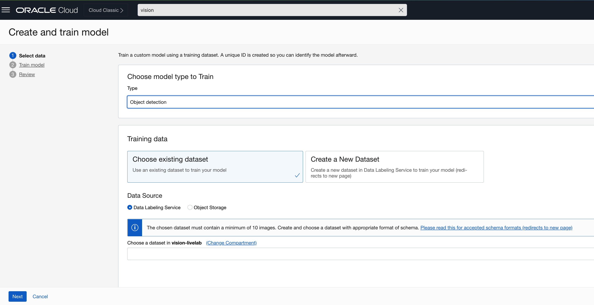

## Introduction

### Objectives

## Task 1: Create an OCI Vision project

1. Click the main menu icon to open the side menu.
2. Click **Analytics & AI** and then click **Vision**.
3. On the left side of the screen, click **Projects**, under Custom Models.

   

4. Click **Create project**. Provide *vision-project* as name, select *vision-livelab* as compartment, and click **Create project**

## Task 2: Create the OCI Vision pipe detection model

   
   
   