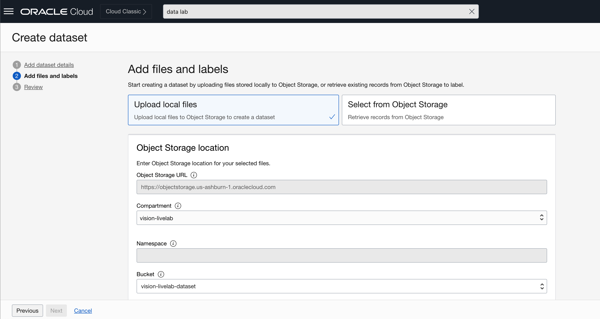

# OCI Data Labeling

## Introduction

In this lab, you will focus on labeling pictures of stacked pipes using OCI Data Labeling, so that your own custom OCI Vision model can be later created and trained.

Estimated Time: 20 minutes

### Objectives

- Get acquainted with the OCI Data Labeling service
- Successfully label the model training images

## Task 1: Download the model training images

1. Click [here](https://github.com/oracle-livelabs/oci/raw/main/oci-vision-inventory/images/model/pipes_samples.zip) to download the ZIP file containing the sample pictures. 
2. Extract the contents of the file to a location of your choice.

## Task 2: Object Storage bucket creation 

1. In the Oracle Cloud Console, click the main menu icon to open the side menu.
2. Click **Storage** and then click **Buckets**. 
3. Set the **Compartment** to *vision-livelab*.
4. Click **Create Bucket**.
5. Provide *vision-livelab-dataset* as bucket name. Leave the remaining values as they are and click **Create**.

   

## Task 3: Dataset creation 

1. In the Oracle Cloud Console, click the main menu icon to open the side menu.
2. Click **Analytics & AI** and then click **Data Labeling**. Click **Datasets**.
3. Click **show more information**. Note that additional policies are required if you are not logged in as an Administrator.

   

4. Click **Create dataset**.
5. Provide *vision-livelab-dataset* as Name. Select *Object Detection* in the Annotation mode section. Click **Next**.

   

6. Select *Upload local files* at the top. Select bucket *vision-livelab-dataset*. Drag your images to the respective place in the screen. 

   

7. Add a new label called 'pipe' by typing it in the label box, and click **Next**.

   

8. Click **Create**. It will take a few minutes to generate the records.

## Task 4: Labeling data

1. In your dataset details page, you will see a table view of the uploaded images. Click each image to proceed to its labeling.

   

2. In the single image view, zoom in if necessary. Using the cursor, draw square bounding boxes around the circles. Do the same for the ones that only appear partially.

   

## Acknowledgements

* **Authors** - Nuno Gonçalves, Jason Monden, Mark Heffernan
* **Last Updated By/Date** - Nuno Gonçalves, September 2022
