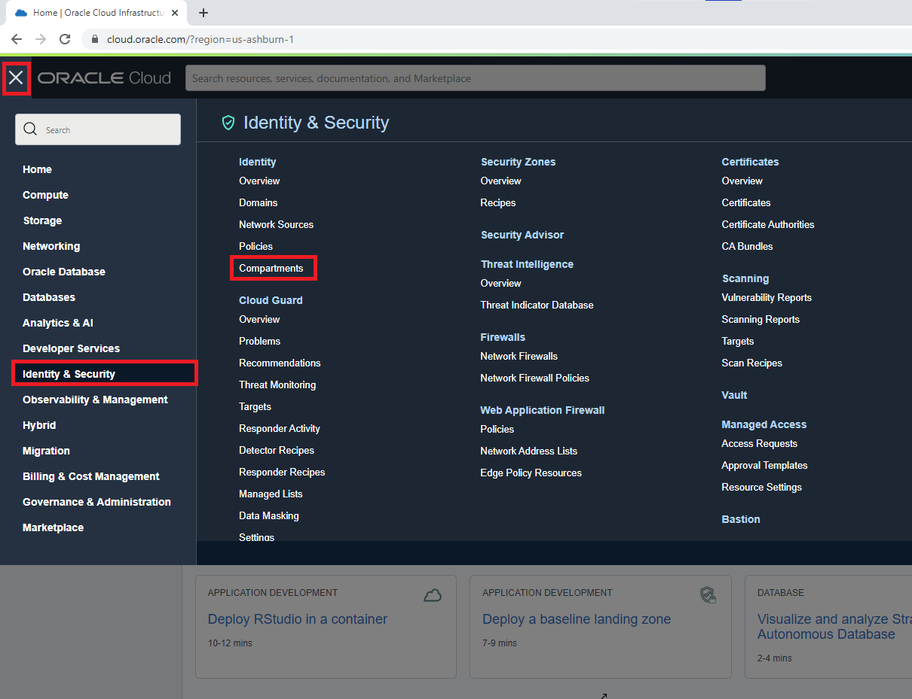
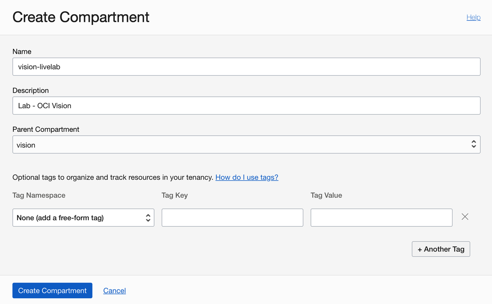
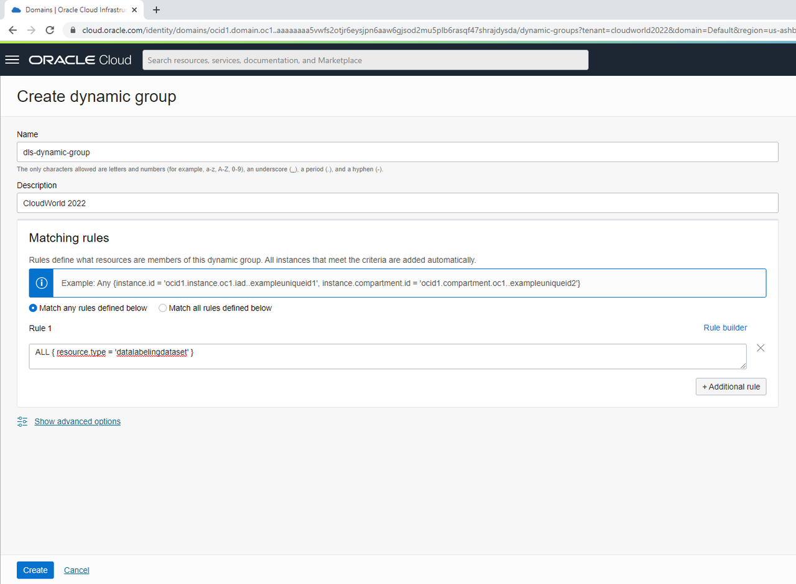
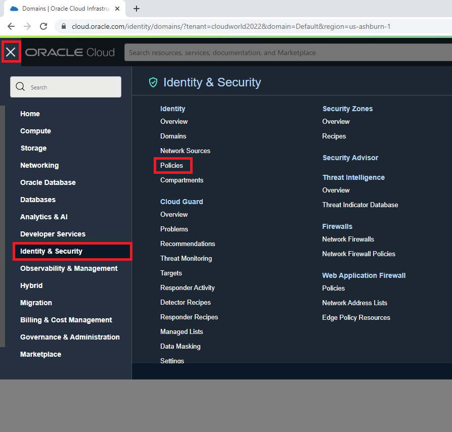
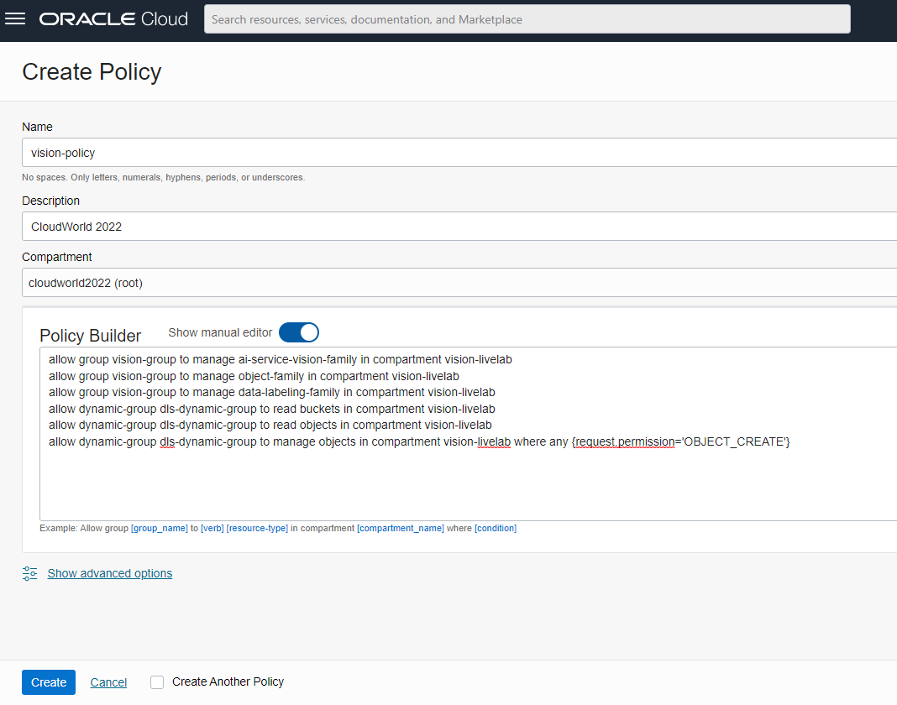
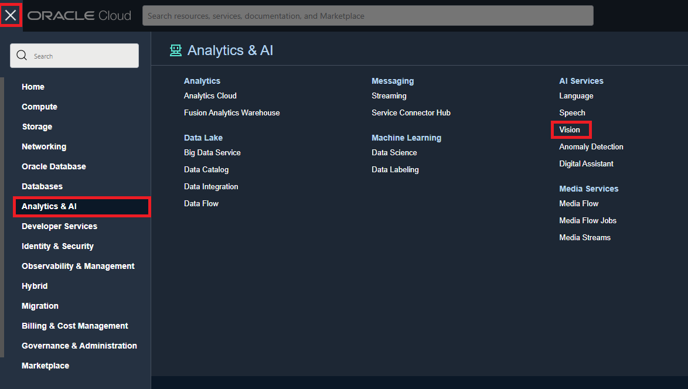
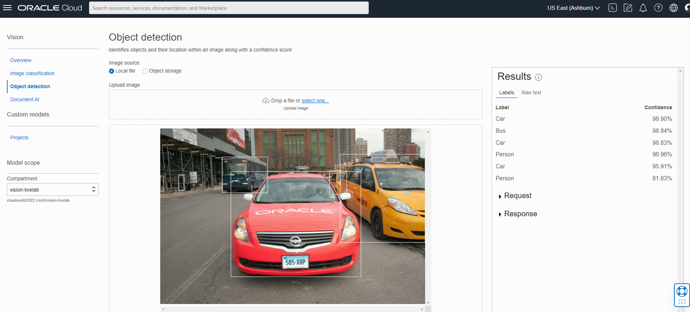

# Prerequisites

## Introduction

In this lab, you will set up your tenancy for the subsequent creation and operation of the OCI Vision model.

Estimated Time: 20 minutes

Watch the video below for a quick walk-through of the lab.
[Prerequisites](videohub:1_slj4drbo)

### Objectives

In this lab, you will:
- Create a Compartment
- Create a Group
- Create Dynamic Group
- Create a Policy
- Confirm access to the Vision service

## Task 1: Create compartment

In this task, you will create a dedicated compartment for this live lab.

1. In the Oracle Cloud Console, click the main menu icon to open the side menu.
2. Click **Identity & Security** and select **Compartments**.

   

4. Click **Create Compartment**.
5. Provide *vision-livelab* as **Name**, a **Description** of your choice, and leave the root level as Parent.
6. Click **Create Compartment**.

   

## Task 2: Create group

1. In the Oracle Cloud Console, click the main menu icon to open the side menu.
2. Click **Identity & Security** and select **Domains**.
   
   > **Note:** If you do not see **Domains** it means that your region has not been updated to support identity domains. If that's the case, select **Groups** and move to step 5 below.

   
   
3. Select the domain listed as *Current domain*.
4. On the left menu, select **Groups**.
5. Select **Create group**.
6. Provide *vision-group* as **Name**, add a **Description** of your choice, and select your User to add your account to the Group.
7. Click **Create**.

## Task 3: Create dynamic group

1. In the Oracle Cloud Console, click the main menu icon to open the side menu.
2. Click **Identity & Security** and select **Domains**. 

   > **Note:** If you do not see **Domains** it means that your region has not been updated to support identity domains. If that's the case, select **Dynamic Groups** and move to step 5 below.

   

3. Select the domain listed as *Current domain*.
4. On the left menu, select **Dynamic groups**.
5. Select **Create dynamic group**.
6. Provide *dls-dynamic-group* as **Name**, add a **Description** of your choice, and add the following matching rule:

   ```html
   <copy>ALL { resource.type = 'datalabelingdataset' }
   ```
   
   
   
7. Click **Create**.

## Task 4: Policy setup

In this task, you will create the required OCI IAM policy.

1. In the Oracle Cloud Console, click the main menu icon to open the side menu.
2. Click **Identity & Security** and select **Policies**. 

   
   
3. Click **Create Policy**.
4. Provide *vision-policy* as **Name** and add a **Description** of your choice.
5. Set the **Compartment** to the root compartment.
6. Click **Show manual editor** and paste the content below in the editor.

   ```html
   <copy>allow group vision-group to manage ai-service-vision-family in compartment vision-livelab
   allow group vision-group to manage object-family in compartment vision-livelab
   allow group vision-group to manage data-labeling-family in compartment vision-livelab
   allow dynamic-group dls-dynamic-group to read buckets in compartment vision-livelab
   allow dynamic-group dls-dynamic-group to read objects in compartment vision-livelab
   allow dynamic-group dls-dynamic-group to manage objects in compartment vision-livelab where any {request.permission='OBJECT_CREATE'}
   ```

6. Click **Create**.
   

## Task 5: Confirm access to the Vision service

1. In the Oracle Cloud Console, click the main menu icon to open the side menu.
2. Click **Analytics & AI** and select **Vision**. 

   
   
3. Select **Object detection**.
4. Select **Compartment** *vision-livelab*. You should now see labels on the right side of the screen for the sample image.

   

## Acknowledgements

* **Authors** - Nuno Gonçalves, Jason Monden, Mark Heffernan
* **Last Updated By/Date** - Nuno Gonçalves, September 2022
