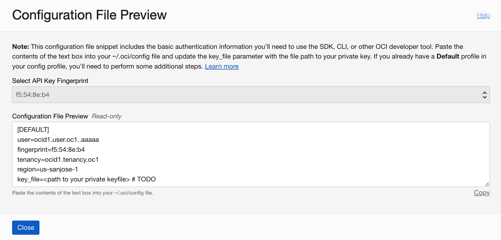

# Pre-requisites

## Introduction

In this lab, you will focus on understanding the pre-requisites and setting up your tenancy for the subsequent creation and operation of the OCI Vision model.

Estimated Time: 15 minutes

### Objectives

In this lab, you will:
- Create a Compartment
- Create a User Group
- Create a Policy

## Task 1: Compartment creation

In this task, you will create a dedicated compartment for this live lab, if you haven't done so beforehand.

1. In the Oracle Cloud Console, click the main menu icon to open the side menu.
2. Click **Identity & Security** and select **Compartments**.
3. Click **Create Compartment**.
4. Provide *vision-livelab* as **Name**, a **Description** of your choice, and leave the root level as Parent.
5. Click **Create Compartment**.

   

## Task 2: User creation

1. In the Oracle Cloud Console, click the main menu icon to open the side menu.
2. Click **Identity & Security** and select **Users**. Click **Create User**.
3. Select **IAM User**. Provide *vision-user* as **Name**, a **Description** of your choice, and click **Create**.

   

   After creating the user, you will be redirected to the user details page. Click **Create/Reset password** to create a password for the user.

4. While in the user details page, click **API Keys** in the in the **Resources** section, and then click **Add API Key**. Download the private key, saving it as *oci\_api\_key.pem*.  
5. After the creation, when back to the API Keys screen, look for additional options in the table row that displays your recently created key fingerprint. Click **View configuration file**.

   

   You will then see a screen such as the below. Copy the content, create a new file named *config*, paste the content inside it. Add *~/.oci/oci\_api\_key.pem* as key path.  
   Save the file. It will be necessary later.

   

## Task 3: Policy setup

In this task, you will create the required OCI IAM policy.

1. In the Oracle Cloud Console, click the main menu icon to open the side menu.
2. Click **Identity & Security** and select **Policies**.
3. Click **Create Policy**.
4. Provide *vision-policy* as **Name**, a **Description** of your choice, and choose *vision-livelab* as compartment.
5. Click **Show manual editor** and paste the content below in the editor.

   ```html
   <copy>Allow group vision-group to manage vision-family in compartment vision-livelab
   Allow service vision to manage vcns in compartment vision-livelab
   Allow service vision to manage vnics in compartment vision-livelab
   Allow service vision to use subnets in compartment vision-livelab
   Allow service vision to use network-security-groups in compartment vision-livelab</copy>
   ```

6. Click **Create**.
   

## Acknowledgements

* **Authors** - Nuno Gonçalves, Jason Monden, Mark Heffernan
* **Last Updated By/Date** - Nuno Gonçalves, September 2022
