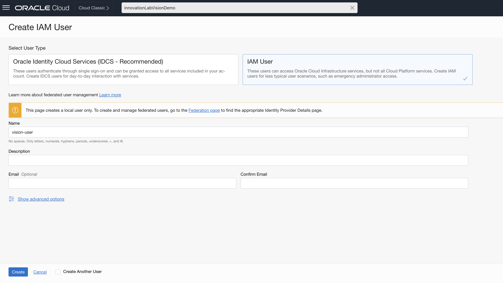
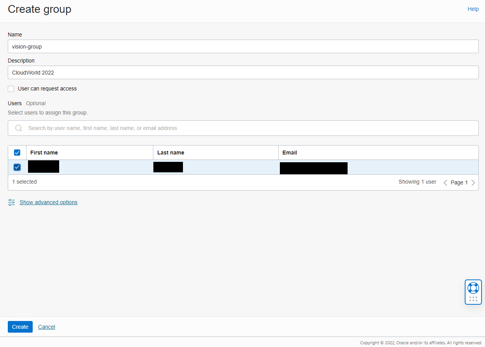

## Introduction

In this lab, you will focus on understanding the pre-requisites and setting up your tenancy for the subsequent creation and operation of the OCI Vision model.

Estimated Time: 30 minutes

### Objectives

In this lab, you will:
- Create a Compartment
- Create a user and its respective OCI config file
- Create a user group
- Create a Policy
- Create a VCN with internet connectivity and add Security List rules
- Create an OCI Compute instance in order to later access the OCI Vision model API

## Task 1: Compartment creation

In this task, you will create a dedicated compartment for this live lab, if you haven't done so beforehand.

1. Click the main menu icon to open the side menu.
2. Click **Identity** and select **Compartments**.
3. Provide *vision-livelab* as **Name**, a **Description** of your choice, and leave the root level as Parent.
4. Click **Create Compartment**.

   

## Task 2: User creation

1. Click the main menu icon to open the side menu.
2. Click **Identity** and select **Users**. Click **Create User**.
3. Select **IAM User**. Provide *vision-user* as **Name**, a **Description** of your choice, and click **Create**.

   

   After creating the user, you will be redirected to the user details page. Click **Create/Reset password** to create a password for the user.

4. While in the user details page, click **API Keys** in the in the **Resources** section, and then click **Add API Key**. Download the private key.  
5. After the creation, when back to the API Keys screen, look for additional options in the table row that displays your recently created key fingerprint. Click **View configuration file**.

   

   You will then see a screen such as the below. Copy the content and take note of it. It will be necessary later.

   

## Task 3: User group creation

In this task, you will create a dedicated user group.

1. Click the main menu icon to open the side menu.
2. Click **Identity** and select **Groups**.
3. Provide *vision-group* as **Name**, a **Description** of your choice.
4. Click **Create**.
5. Open the group you've created and click **Add User to Group**.
6. Select *vision-user* and click **Add**.

   

## Task 4: Policy setup

In this task, you will create the required OCI IAM policy.

1. Click the main menu icon to open the side menu.
2. Click **Identity** and select **Policies**.
3. Provide *vision-policy* as **Name**, a **Description** of your choice, and choose *vision-livelab* as compartment.
4. Click **Show manual editor** and paste the content below in the editor.

   ```html
   <copy>Allow group vision-group to manage vision-family in compartment vision-livelab
   Allow service vision to manage vcns in compartment vision-livelab
   Allow service vision to manage vnics in compartment vision-livelab
   Allow service vision to use subnets in compartment vision-livelab
   Allow service vision to use network-security-groups in compartment vision-livelab</copy>
   ```

   

## Task 5: Networking setup

In this task, you will create a VCN with a public subnet and a private subnet.

1. Open the Oracle Cloud Console navigation menu.
2. Click **Networking**. and then click **Virtual Cloud Networks**.
3. Click **Start VCN Wizard**, and then click **Create VCN with Internet Connectivity**.  
4. Provide *vision-vcn* as VCN Name and select *vision-livelab* as compartment.
5. Leave the default values in the remaining fields, click **Next**, and then click **Create** 

## Task 6: Compute instance setup

In this task, you will create an OCI Compute instance in the public subnet of the previously created VCN, in order to access the Vision API.

1. Open the Oracle Cloud Console navigation menu.
2. Click **Compute**, and then click **Instances**.
3. Click **Create instance**.
4. Provide *vision-instance* as **Name**, and select *vision-livelab* as compartment.
5. In the **Image and shape** area, use the default values.
6. In the **Networking** area, select *vision-vcn* and *Public Subnet-vision-vcn*, for VCN and Subnet, respectively.
7. In the **Add SSH keys area**, decide whether you want to use an existing SSH key, or generate a new SSH key. If you choose to generate a new SSH key, remember to download the private key. 
8. Leave the remaining options with the default values and click **Create**.

> **Note:** Remember to run the following command or an equivalent one, to give proper permissions to your key.
```bash
<copy>chmod 400 <your_key></copy>
```

## Acknowledgements

* **Author** - Nuno Gonçalves
* **Last Updated By/Date** - Nuno Gonçalves, August 2022