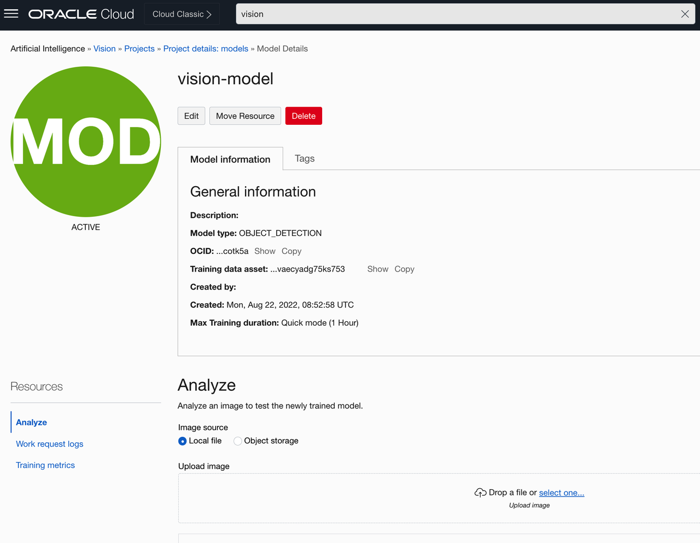
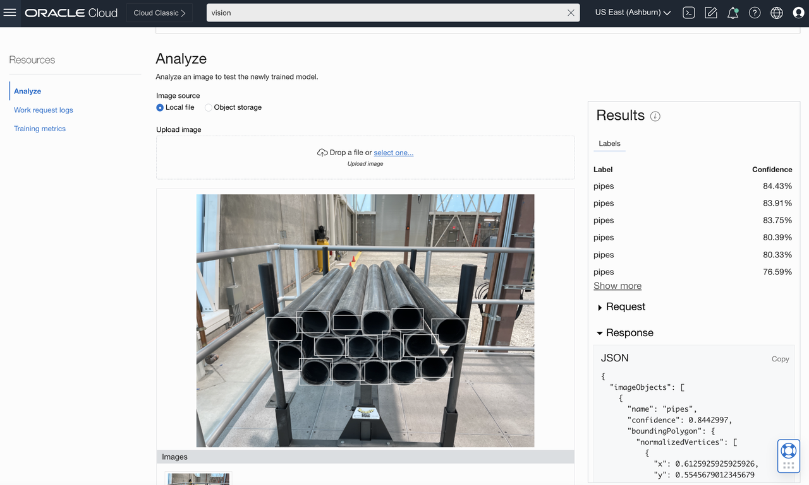

# Test the model via Oracle Cloud Console

## Introduction

In this lab, you will test the recently created OCI Vision model to recognize stacked pipes in a test picture. You will do so by accessing the existing user interface for model testing in the Oracle Cloud Console.

Estimated Time: 10 minutes

### Objectives

- Test the model by uploading a test image in the Oracle Cloud Console UI

## Task 1: Test the model via Oracle Cloud Console

1. Click [here](https://github.com/oracle-livelabs/oci/raw/main/oci-vision-inventory/images/model/test.jpg) to download the sample test image. 

2. In the Oracle Cloud Console, click the main menu icon to open the side menu.
2. Click **Analytics & AI** and then click **Vision**.
3. On the left side of the screen, click **Projects**, under Custom Models.
4. Click **vision-project**, and then **vision-model**.
5. In the OCI Vision model details page, upload the test image *test.jpg* by dragging it to the screen.

   

3. Note the JSON response on the right side of the screen, where you can find confidence values for each pipe that was identified.

   

## Acknowledgements

* **Author** - Nuno Gonçalves, Jason Monden, Mark Heffernan
* **Last Updated By/Date** - Nuno Gonçalves, September 2022
