# OCI Network Visualizer and Path Analyzer

## Introduction

Estimated Time: 10 minutes

### About Virtual Cloud Networks and Subnets

Virtual Cloud Networks (VCNs) provide customizable and private cloud networks in Oracle Cloud Infrastructure (OCI). Just like a traditional data center network, the VCN provides customers with complete control over their cloud networking environment. This includes assigning private IP address spaces, creating subnets and route tables. [Visit our documentation](https://docs.oracle.com/en-us/iaas/Content/Network/Tasks/Overview_of_VCNs_and_Subnets.htm) for more information on Virtual Cloud Networks.

A Subnet is a subdivision of a VCN. Each subnet in a VCN consists of a contiguous range of IPv4 addresses and optionally IPv6 addresses that do not overlap with other subnets in the VCN.

A DRG acts as a virtual router, providing a path for traffic between your on-premises networks and VCNs, and can also be used to route traffic between VCNs. Using different types of attachments, custom network topologies can be constructed using components in different regions and tenancies.

### Objectives

In this lab, you will:

* Create the Dynamic Routing Gateway, DRG, for establishing connectivity between VCNs
* Build a Virtual Cloud Network (VCN) to provide the foundation for the network access
* Create two VCN and public subnets to accommodate the client/server communication

When you complete the exercise, the network topology will look like the following, one VCN and two subnets.

## Task 1: Select a Home Region

Let's begin.

1. To begin the lab exercise, ensure you are logged into the Oracle Cloud console and select the desired **Home Region** region. The region can be accessed on the menu bar located at top right of the screen.

    * Click **"US East (Ashburn)"**

        

        **Note**: This lab can be completed in any OCI region you have access to with the required resources. Based on your account, select the desired region to complete the exercise. For the purpose of this lab we will use the **"US East (Ashburn)"** region.

## Task 2: Create DRG

The Dynamic Routing Gateway, DRG as it is often referred as, will provide layer 3 routing between VCNs. In later exercises as the VCN's are created, they will be attached to the DRG for connectivity.

Let's begin.

1. On the Oracle Cloud Infrastructure Console Home page, using the Navigation menu (on top left) click **Networking** and click on **Dynamic routing gateway** under Customer connectivity.

    * Click the Navigation Menu (top left corner)
    * Click **"Networking"**
    * Click **"Dynamic routing gateway"**

        

2. In the Dynamic routing gateways table, Click **Create dynamic routing gateway** to create the DRG. As mentioned, The DRG will provide connectivity between the VCN's that will be created.

    * Click **"Create dynamic routing gateway"**
    * Name: **"hol-drg"**
    * Click **"Create dynamic routing gateway"**

        

## Task 3: Create VCN (Virtual Cloud Network) #1

We will start with a basic VCN deployment. One of the goals of this **livelab** is also to provide an understanding of OCI constructs needed for deploying the compute instances and troubleshooting using Network Visualizer and Path Analyzer. For this reason, we will not use the VCN Wizard which deploys all OCI Gateways and creates basic routing rules. Instead, we will manually create each artifact as needed.

We will now create the VCN to host the connectivity for the client compute host (to be created in the next lab).

Let's begin.

1. On the Oracle Cloud Infrastructure Console Home page, using the Navigation menu (on top left) click **Networking** and click on **Virtual cloud networks**.

    * Click the Navigation Menu (top left corner)
    * Click **"Networking"**
    * Click **"Virtual cloud networks"**

        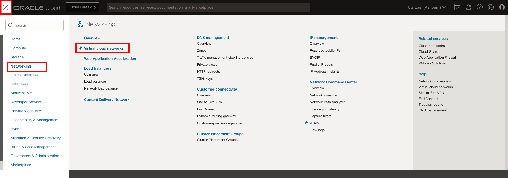

2. Make sure you have the correct Compartment selected and click **Create VCN** in the **Virtual Cloud Networks** table. The VCN will provide the network foundation for all the components related to the compute instances and required network monitoring.

    * Click **"Create VCN"**
    * Name: **"hol-vcn1"**
    * IPv4 CIDR: **"10.1.0.0/16"** (Press enter)
    * Click **"Create VCN"**

        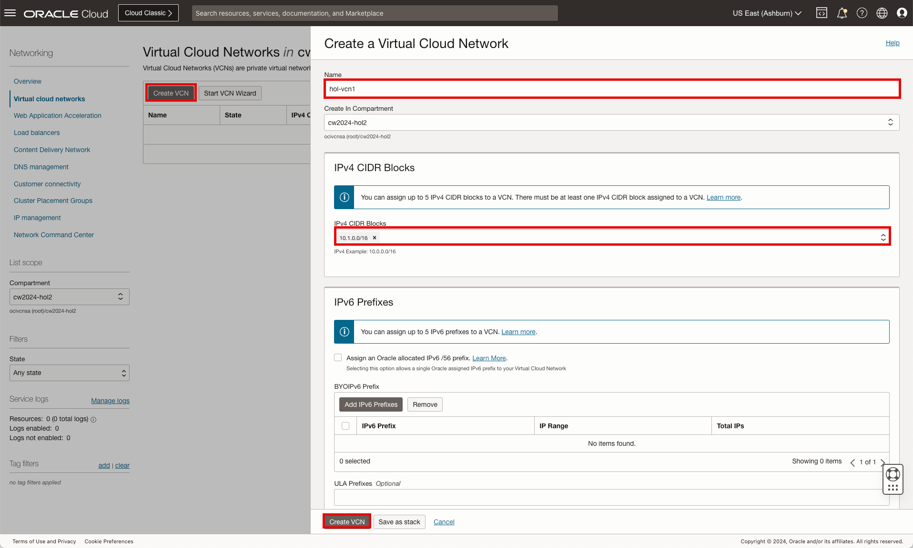

        **Note**: If not directed to update/change a field, leave as default.

3. In the Subnets table, Click **Create Subnet** to create the subnet. The subnet will provide network access for the compute instance representing the client.

    * Click **"Create Subnet"**
    * Name: **"hol-vcn1-snet"**
    * IP Type: **"IPv4 CIDR Block"**
    * IPv4 CIDR: **"10.1.1.0/24"**
    * Click **"Create Subnet"**

        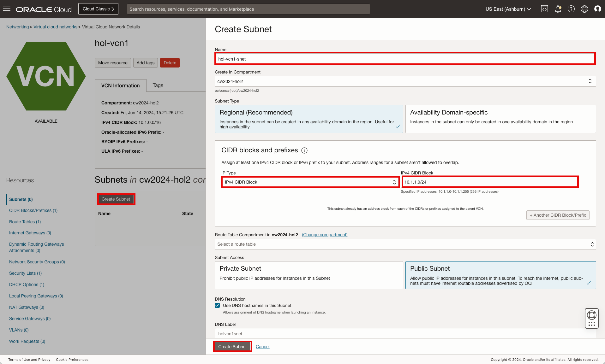

4. On the VCN page under **Resources**, click **Dynamic Routing Gateways Attachments**. Attaching the VCN to the DRG will allow for the defined subnets to be routed accordingly.

    * Click **Dynamic Routing Gateways Attachments**

        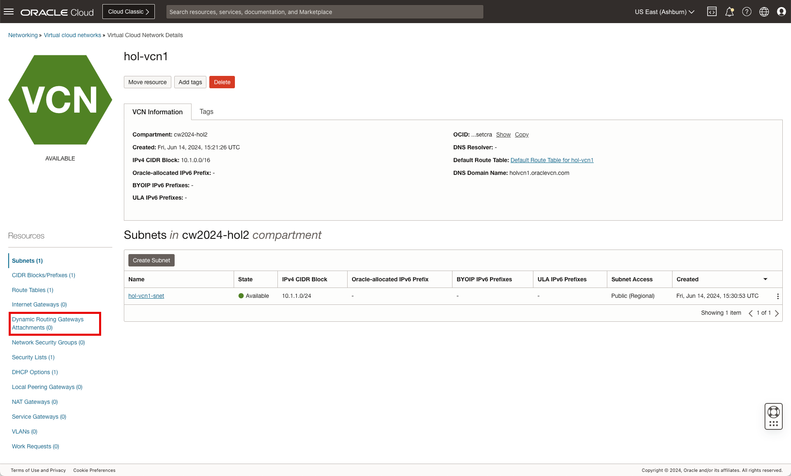

5. In the Dynamic Routing Gateways Attachments list, click **Create DRG Attachment**.

    * Click **"Create DRG Attachment"**
    * Name: **"hol-vcn-drgattch"**
    * Select **"hol-drg"**
    * Click **"Create DRG Attachment"**

        

6. On the VCN page under **Resources**, click **Security Lists**. The security list will need to be updated to allow for connectivity between the client and the server (compute instances to be created in the next lab).

    * Click **"Security Lists"**

        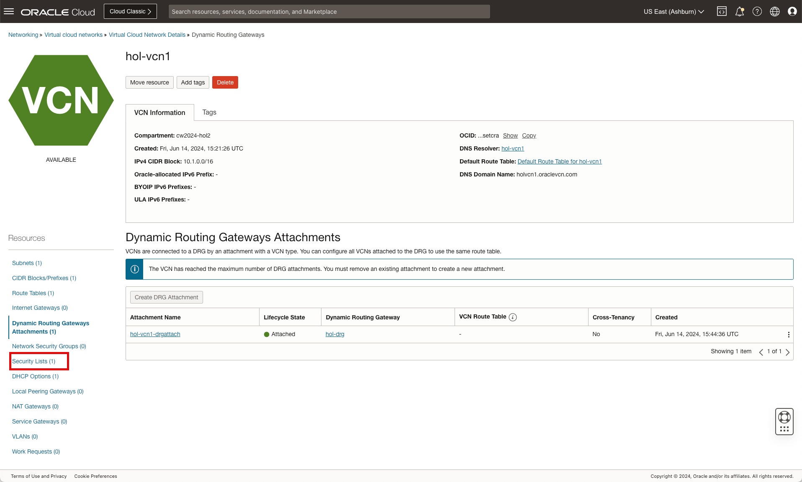

7. In the Security Lists list, click **Default Security List for hol-vnc1**.

    * Click **"Default Security List for hol-vnc1"**

        

8. In the Ingress Rules list, click **Add Ingress Rules** and proceed to create a rule for port 80.

    * Click **"Add Ingress Rules"**
    * Source CIDR: **"0.0.0.0/0"**
    * Destination Port Range: **"80"**
    * Click **"Add Ingress Rules"**

        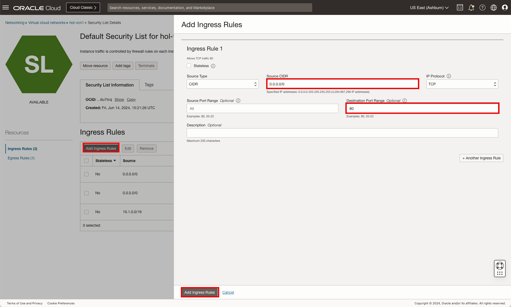

        **Note**: The use of 0.0.0.0/0 allows for all source ip's to access the desired hosts.

## Task 4: Create VCN (Virtual Cloud Network) #2

We will now create the VCN to host the connectivity for the server compute host (to be created in the next lab).

Let's begin.

1. In the Navigation Path, click **Virtual cloud networks**.

    * Click **"Virtual cloud networks"**

        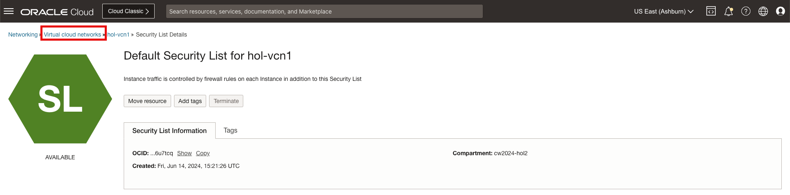

2. In the Virtual Cloud Networks list, click **Create VCN** in the **Virtual Cloud Networks** table.

    * Click **"Create VCN"**
    * Name: **"hol-vcn2"**
    * IPv4 CIDR: **"10.2.0.0/16"** (Press enter)
    * Click **"Create VCN"**

        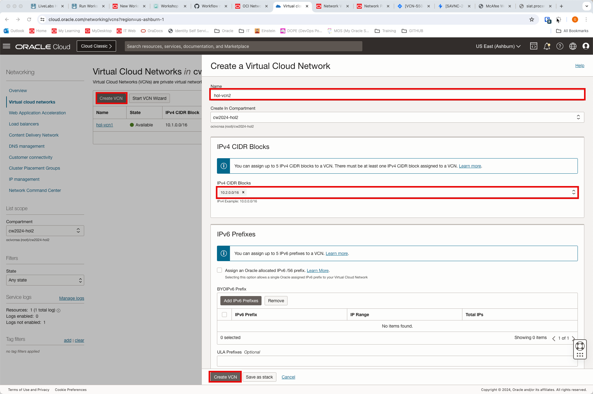

        **Note**: If not directed to update/change a field, leave everything else as default.

3. In the Subnets table, Click **Create Subnet** to create the  subnet. The  subnet will provide network access for the compute instance representing the server.

    * Click **"Create Subnet"**
    * Name: **"hol-vcn2-snet"**
    * IP Type: **"IPv4 CIDR Block"**
    * IPv4 CIDR: **"10.2.1.0/24"**
    * Click **"Create Subnet"**

        

4. On the VCN page under **Resources**, click **Dynamic Routing Gateways Attachments**.

    * Click **"Dynamic Routing Gateways Attachments"**

        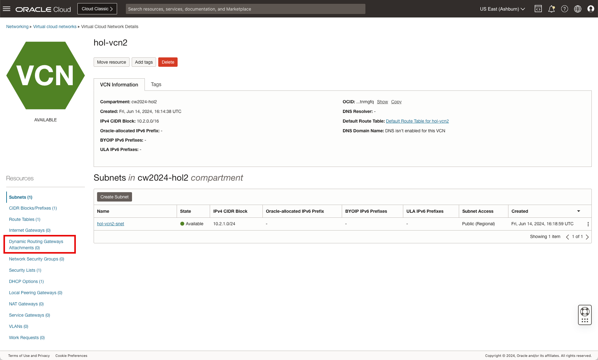

5. In the Dynamic Routing Gateways Attachments list, click **Create DRG Attachment**.

    * Click **"Create DRG Attachment"**
    * Name: **"hol-vcn2-drgattch"**
    * Select **"hol-drg"**
    * Click **"Create DRG Attachment"**

        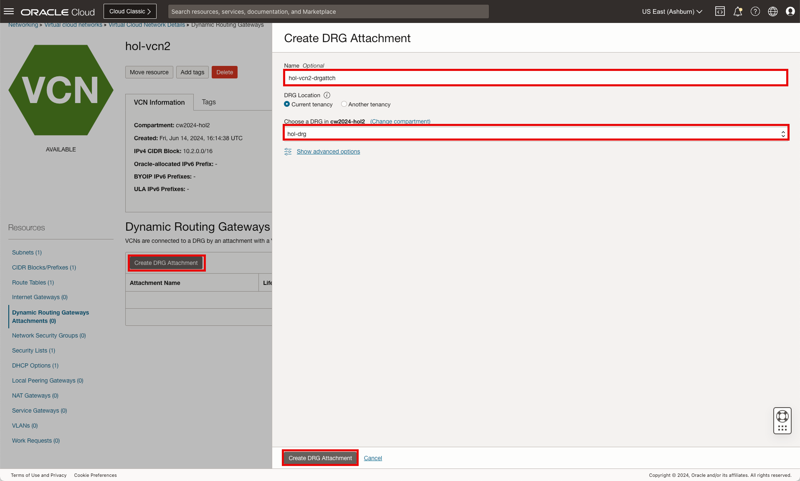

## Task 5: Update VCN Route Tables

With the VCN's and the associated subnets created, we will not proceed to add routes for each of the configured networks. This is accomplished by adding route rules for the desired traffic.

Let's begin.

1. On the VCN page under **Resources**, click **Route Tables** to access the VCN route table for VCN2.

    * Click **"Route Tables"**

        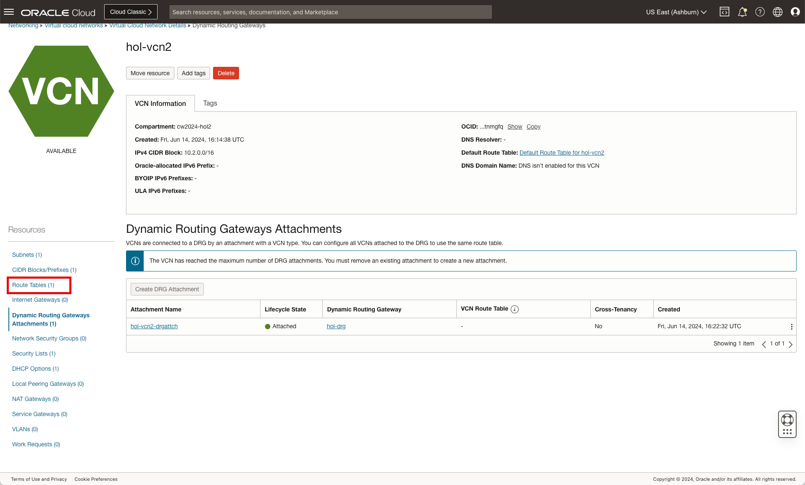

2. In the Route Tables list, click **Default Route Table for hol-vnc2**.

    * Click **Default Route Table for hol-vnc2**

        

3. In the Route Rules list, click **Add Route Rules**.

    * Click **"Add Route Rules"**
    * Target Type: Select **"Dynamic Route Gateway"**
    * Destination CIDR Block: **"10.1.1.0/24"**
    * Click **"Add Route Rules"**

        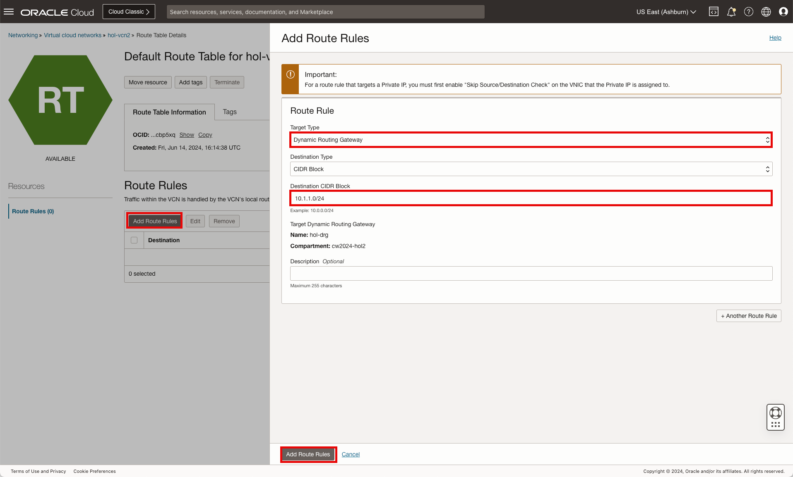

4. In the Navigation Path, click **Virtual cloud networks**.

    * Click **"Virtual cloud networks"**

        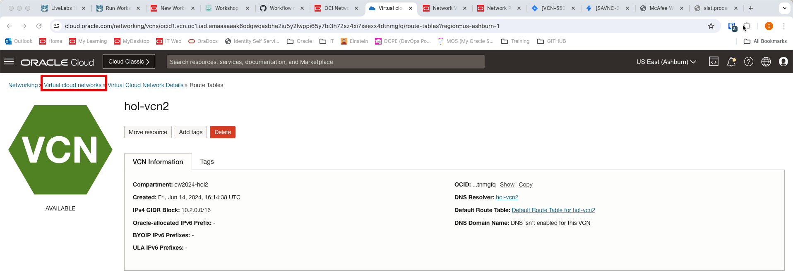

5. In the Virtual Cloud Networks list, click **hol-vcn1**.

    * Click **"hol-vcn1"**

        

6. On the VCN page under **Resources**, click **Route Tables** to access the VCN route table for VCN1.

    * Click **"Route Tables"**

        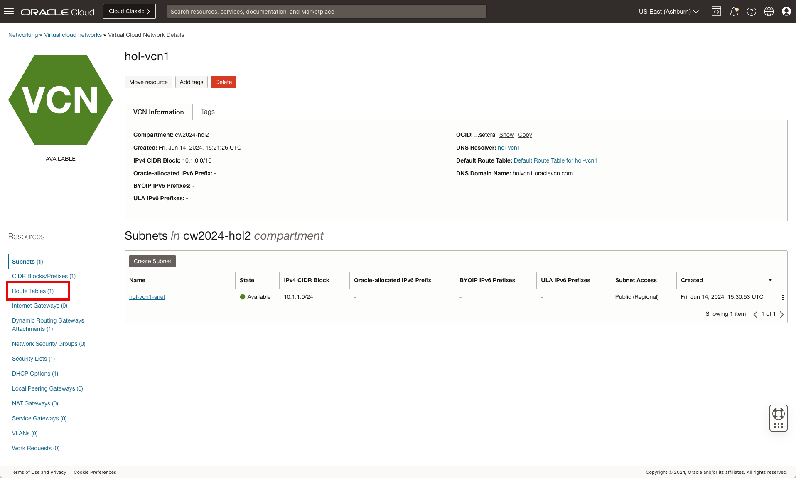

7. In the Route Tables list, click **Default Route Table for hol-vnc1**.

    * Click **"Default Route Table for hol-vnc1"**

        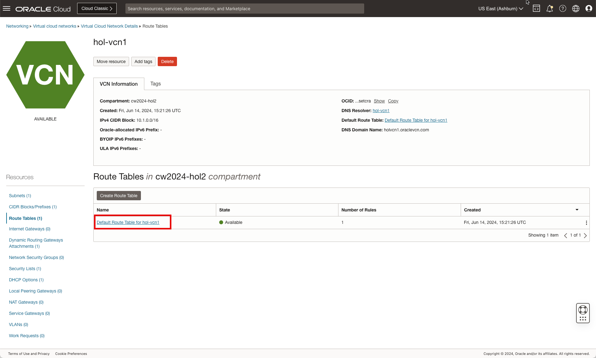

8. In the Route Rules list, click **Add Route Rules**.

    * Click **"Add Route Rules"**
    * Target Type: Select **"Dynamic Route Gateway"**
    * Destination CIDR Block: **"10.2.1.0/24"**
    * Click **"Add Route Rules"**

        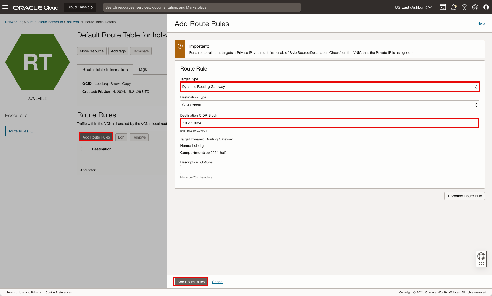

9. Click **Oracle Cloud** in the top left of the menu bar to return to the home page.

    * Click **"Oracle CLoud"**

        

**Congratulations!** You have successfully created the VCNs, Subnets and the DRG. You may now **proceed to the next lab**.

## Acknowledgements

* **Author** - Gabriel Fontenot, Principal Cloud Architect, OCI Networking
* **Last Updated By/Date** - Gabriel Fontenot, June 2024