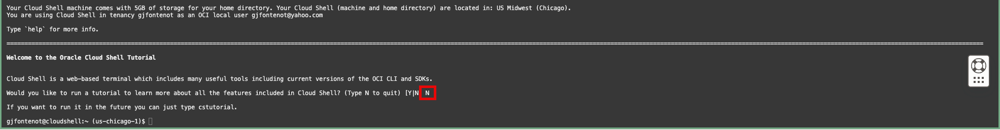
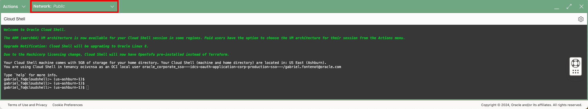
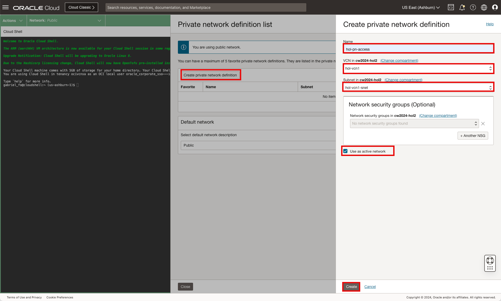
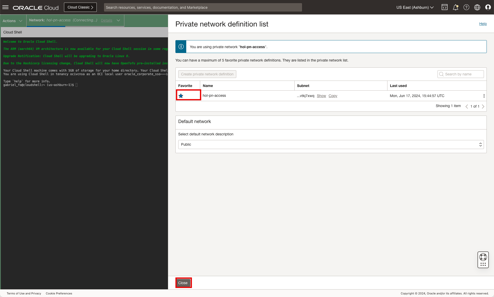
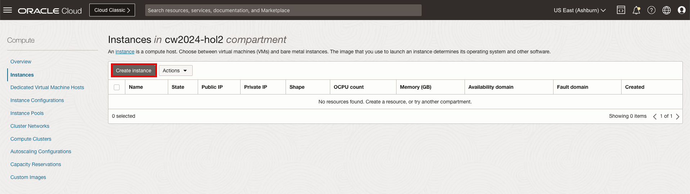
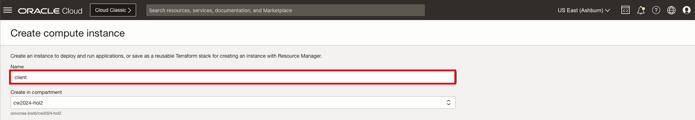
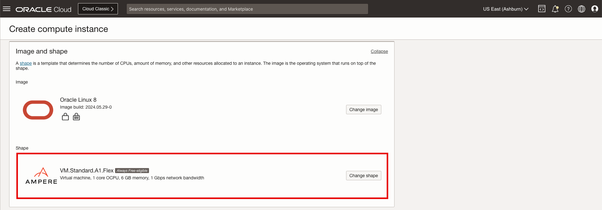
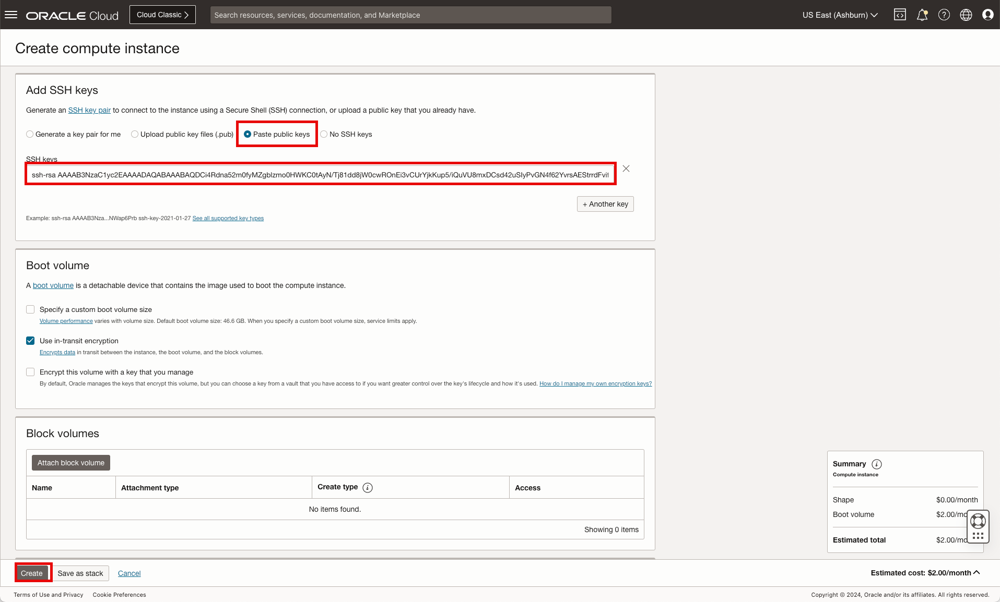
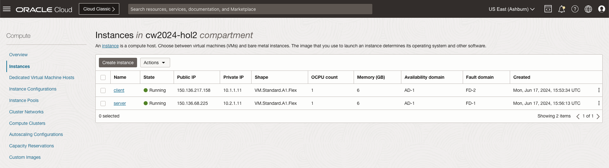

# OCI Network Visualizer and Path Analyzer

## Introduction

Estimated Time: 15 minutes

### About Compute

Oracle Cloud Infrastructure Compute lets you provision and manage compute hosts, known as instances. You can create instances as needed to meet your compute and application requirements. After you create an instance, you can access it securely from your computer or from within the Oracle Cloud Shell, restart it, attach and detach volumes, and terminate it when you're done with it. Any changes made to the instance's local drives are lost when you terminate it. Any saved changes to volumes attached to the instance are retained.

Oracle Cloud Infrastructure (OCI) Cloud Shell is a web browser-based terminal accessible from the Oracle Cloud Console. Cloud Shell provides an ephemeral machine to use as a host for a Linux shell, pre-configured with the latest version of the OCI Command Line Interface (CLI) and a number of useful tools. [Visit our documentation](https://docs.oracle.com/en-us/iaas/Content/API/Concepts/cloudshellintro.htm) for more information on the Cloud Shell.

### Objectives

In this lab, you will:

* Create a Cloud Shell instance for accessing compute nodes
* Create two compute instances, one for a client and a second for the server.

    

## Task 1: Launch the Cloud Shell and Generate SSH Keys

  In this lab and subsequent ones, we will utilize the cloud shell to access the various compute instances to establish communication between the client and server and monitor the VTAP flows. While this can be accomplished in multiple ways, one of the easiest is to use the **Cloud Shell** embedded in the OCI Console. This functionality is only available in the **HOME** region of your account.

1. To begin the lab exercise, ensure you are logged into the Oracle Cloud console and select the desired **Home Region** region. The region can be accessed on the menu bar located at top right of the screen. Once the home region is confirmed, we will then access the **Developer tools** as described below.

    * Click **"Developer Tools"**
    * Start **"Cloud Shell"**

        

        **Note**: Give the shell a moment to start.

2. If prompted with a message about "ARM Instances are now available" click **Close**.

    * Click **"Close"**

        

3. If prompted in the cloud shell to "Run the tutorial" type **"N"** and press **return** on the keyboard.

    * Command: **"N"**
    * Press **"Return"**

    

4. If you have never used Cloud Shell before, Oracle will start the Instance with a Public network.

    * Default access

        

        **Note**: This tutorial works on the assumption that you don't have a custom setup for your Cloud Shell deployment. If you do, adjust the guide below to not interfere with your existing setup.

5. On the Cloud Shell deployment, click on the down arrow next to **Network:Public** and click **Private network definition list**.

    * Click **"Network: Public"**
    * Click **"Private network definition list"**

        

6. In the menu that opens, click Create private network definition and, in the next menu, give it a name and select the existing VCN and subnet1.

    * Click **"Create private network definition list"**
    * Name: **"hol-pn-access"**
    * Select VCN: **"hol-vcn1"**
    * Select Subnet: **"hol-vcn1-snet1"**
    * Select **"Use as active network"**
    * Select **"Create"**

        

7. Next, select the private network definition list as the default favorite within the network for Cloud Shell.

    * Click star in the **"Favorite"** column for hol-pn-access
    * Name: **"Close"**

        

8. With the Cloud Shell instance deployed, we will now need to generate **SSH keys** that we will use to connect to compute Instances.  In the shell window issue the **"ssh-keygen"** command and press **Enter**. Leave the directory for creating the key at the default and do not see a passphrase by pressing **Enter** until the keys are generated.  Next, view the public key that was generated by using the command **"cat ~/.ssh/id_rsa.pub"**. Copy the public key to your clipboard as We will use that **Public Key** on each private Compute instance that we will deploy.

    * Command: **ssh-keygen**
    * Command: **cat ~/.ssh/id_rsa.pub**

        

        **Note:** Even if you close Cloud Shell and log out of the OCI Console, the files on the Instance (like the SSH keys) are kept and will be available next time you start Cloud Shell.

9. Copy the **ssh key** output from above to a notebook. The **ssh key** above will be used in the next section.

    * Copy the output to the command: **cat ~/.ssh/id_rsa.pub**

    **Note**: Remember you can close and reopen/restart the cloud shell instance at any time.

10. The **Cloud Shell** is available, you can now move forward to the **Next Task**.

## Task 2: Create Compute Instances

  In this lab we will create three compute instances needed for generating traffic and viewing the output for the VTAP. We will use the **Free Tier** shape that is available as part of the always free-eligible category. Each instance will be deployed into a separate subnet within the single VCN.

1. On the Oracle Cloud Infrastructure Console Home page, using the Navigation menu (on top left) click **Compute** and under Compute select **Instances**.

    * Click the Navigation Menu (top left corner)
    * Click **"Compute"**
    * Click **"Instances"**

        

2. In the compute instance table, press **Create Instance** to open the configuration menu for creating the compute instance.

    * Click **"Create Instance"**

        

3. In the Create compute instance configuration window that opens, update the compute instance a **Name**, scroll down to the **Primary NIC Information** section and update the **Subnet**, scroll down to **Primary VNIC IP Address** section select **Manually assign IPv4 address** and enter IP address, scroll down to the **Add SSH Key** section and select **Paste public keys** to paste add the SSH Key copied from the previous section and click **Create**.

    Name:
    * Name: **client**

        

    Shape:
    * Shape: **VM.Standard.A1.Flex (Always Free-Tier)** or desired shape

        

    Primary VNIC Information:
    * VCN: **hol-vcn1**
    * Subnet: **hol-vcn1-snet1**

        

    Primary VNIC IP address:
    * Private IPv4 Address: **Manually assign private IPv4 address**
    * IPv4 address: **10.1.1.11**

        

    Add SSH keys:
    * Select **Paste public keys**
    * SSH Keys: **[paste key copied from cloud shell]**
    * Click **"Create"**

        

        **Note:** The initial state for the compute instance will be noted as **PROVISIONING** and will transition to **ACTIVE** when it is ready for use.

4. While the compute instances is being deployed we will repeat the step above to create an additional compute instance by clicking **Instances** in the path and clicking **Create Instance** in the Instance table. After clicking **Create Instance**, update the compute instance a **Name**, for the first instance update the server, scroll down to the **Primary Nic Information** section and update the **Subnet**, scroll down to **Primary VNIC IP Address** section select *Manually assign IPv4 address" and enter IP address, scroll down to the **Add SSH Key** section and select *Paste public keys** to paste add the SSH Key copied from the previous section and click **Create**.

    * Click **"Instances"** in the path to see the full list of compute instances created

        

    * Click **"Create Instance"**
    * Name: **server**
    * Shape: **VM.Standard.A1.Flex (Always Free-Tier)** or desired shape
    * VCN: **hol-vcn2**
    * Subnet: **hol-vcn-snet2**
    * Private IPv4 Address: **Manually assign private IPv4 address**
    * IPv4 address: **10.2.1.11**
    * Select **Paste public keys**
    * SSH Keys: **[paste key copied from cloud shell]**
    * Click **"Create"**

        **Note:** The initial state for the compute instance will be noted as **PROVISIONING** and will transition to **ACTIVE** when it is ready for use.

5. View the complete list of compute instances, client and server.

    * Click **"Instances"** in the path to see the full list of compute instances created

        

    * Compute instance List:

        

6. Click **Oracle Cloud** in the top left of the menu bar to return to the home page.

    * Click "Oracle CLoud"

        

**Congratulations!** You have successfully deployed the compute instances. You may now **proceed to the next lab**.

## Acknowledgements

* **Author** - Gabriel Fontenot, Principal Cloud Architect, OCI Networking
* **Last Updated By/Date** - Gabriel Fontenot, June 2024