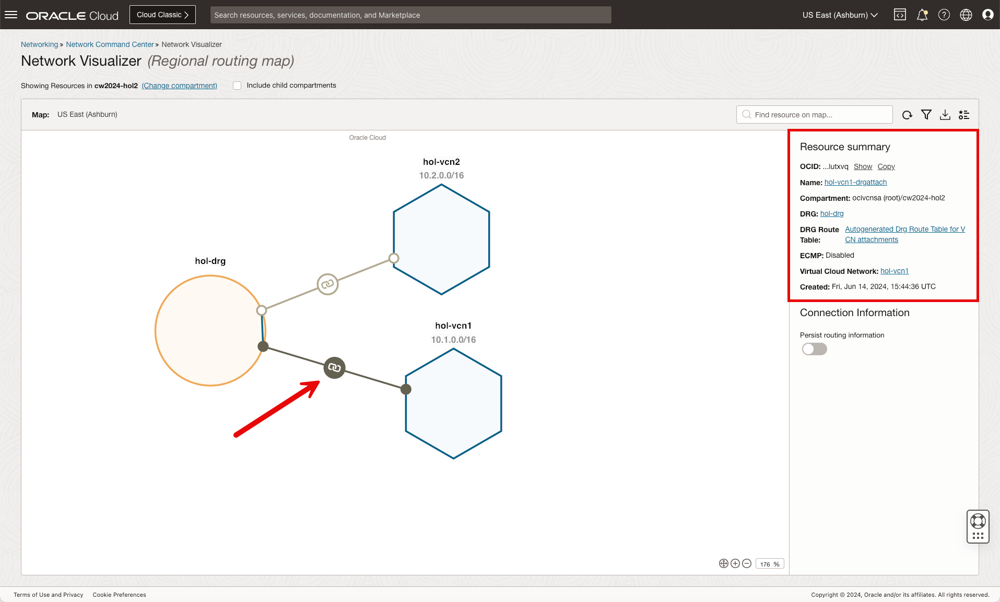
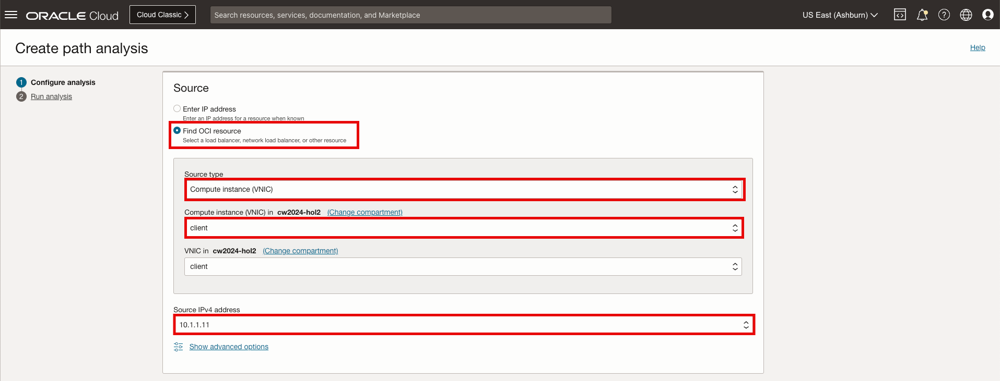
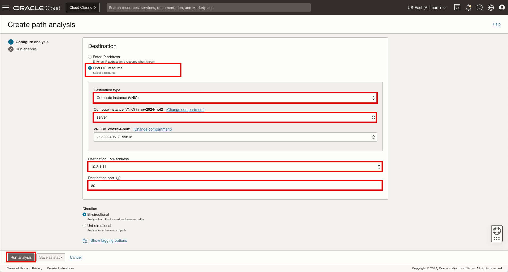

# OCI Network Visualizer and Path Analyzer

## Introduction

Estimated Time: 20 minutes

### About Network Visualizer and Path Analyzer

An Oracle virtual network is composed of virtual cloud networks (VCNs), subnets, gateways, and other resources. These entities are related and connected through routing that's often complex. These resources can also have complex relationships with other Oracle Cloud Infrastructure (OCI) services. The ability to have a concise picture of these entities and their relationships is essential for understanding the design and operation of a virtual network. The Network Visualizer provides a diagram of the implemented topology of all VCNs in a selected region and tenancy.

Network Path Analyzer (NPA) provides a unified and intuitive capability you can use to identify virtual network configuration issues that impact connectivity. NPA collects and analyzes the network configuration to determine how the paths between the source and the destination function or fail. No actual traffic is sent, instead the configuration is examined and used to confirm reachability.

NPA carefully examines routing and security configurations and identifies the potential network path your defined traffic traverses, along with information about virtual networking entities in the path. In addition to the path information, output of these checks includes how routing rules and network access lists (security lists, NSGs, and so on) allow or deny traffic. The sources and destinations could be within OCI, or across OCI and on-premises, or OCI and internet. NPA analyzes all the standard OCI networking elements with their associated configuration

### Objectives

In this lab, you will:

* Evaluate Network Visualizer to visualize your OCI network
* Evaluate Network Path Analyzer to validate the path between your client and server

  

## Task 1: Network Visualizer

  We are now ready to use the **Network Visualizer** to further understand our network and the associated components.

1. On the Oracle Cloud Infrastructure Console Home page, using the Navigation menu (on top left) click **Networking** and under Load Balancers select **Network Command Center**, then **Network visualizer**.

    * Click the Navigation Menu (top left corner)
    * Click **"Networking"**
    * Click **"Network Visualizer"**

      

2. On the visual canvas, users can easily customize the desired view. Click on the **details** icon to view the legend.

    * Click **"details"**

      

3. As denoted below, Click on the DRG to see the associated status and additional details.

    * Click **"hol-drg"**

      

    * Click **"View additional resource details"**
    * Click **"Close"**

      

4. As denoted below, Click on the DRG VCN Attachment

    * Click **"hol-vcn1-drgattach"**

      

5. As denoted below, Click on the DRG VCN Attachment

    * Click **"hol-vcn1-drgattach"**

      

6. The **Network Visualizer** is complete, you can now move forward to the **Next Task**

## Task 2: Network Path Analyzer

  Now that we have the network and compute deployed, let's proceed with the **Network Visualizer**..

1. On the Oracle Cloud Infrastructure Console Home page, using the Navigation menu (on top left) click **Networking** and under Load Balancers select **Network Command Center**, then **Network Path Analyzer**.

    * Click the Navigation Menu (top left corner)
    * Click **"Networking"**
    * Click **"Network Path Analyzer"**

      

2. To begin, click **"Create path analysis"**.

    * Click **"Create path analysis"**

      

    In the configuration window provide a name for the path analyzer along with the source and destination.

    Name

    * Name: **"hol-npa"**

      

    Source

    * Source: **"Find OCI resource"**
    * Source type: **"Compute instyance (VNIC)"**
    * Compute Instance (VNIC): **"client"**
    * Source IPv4 address: **"10.1.1.11"**

      

    Destination

    * Source: **"Find OCI resource"**
    * Source type: **"Compute instyance (VNIC)"**
    * Compute Instance (VNIC): **"client"**
    * Source IPv4 address: **"10.1.1.11"**
    * Destination Port: **"80"**
    * Click **"Run analysis"**

      

        **Note:** Loading may take a minute to generate the results.

3. As noted in the output, the stats of the forward path is **Unreachable**.

    * Analysis Output

        

    * Click on the **red triangle with the exclamation point** to further understand the potential issue.

        

    From the analysis, we can see that the issue with connectivity is related to the security list entry for port 80 in server VCN, **hol-vcn2**.

4. Click **Default Security List for hol-vcn2** to view the security list and to update accordingly.

    * Click **"Default Security List for hol-vcn2"**

        

5. On the Security List page add the ingress route.

    * Click **"Add Ingress Rules"**
    * Source CIDR: **"0.0.0.0/0"**
    * Destination Port Range: **"80"**
    * Click **"Add Ingress Rules"**

        

    * Click **"Analyze"** (Scroll to the top of the previous page)

        

6. On the Security List page add the ingress route.

    

**Congratulations!** You have completed this lab.

## Acknowledgements

* **Author** - Gabriel Fontenot, Principal Cloud Architect, OCI Networking
* **Last Updated By/Date** - Gabriel Fontenot, June 2024